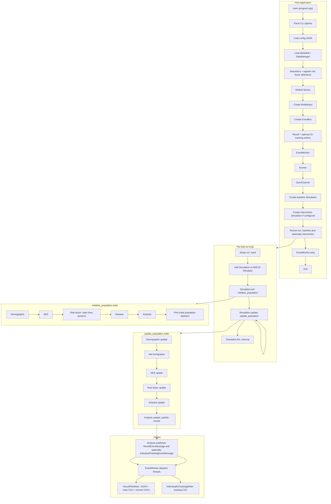
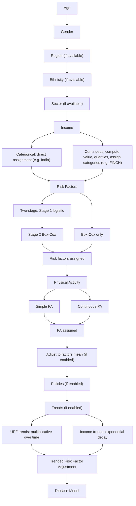

# HealthGPS Project Updates – Detailed Documentation

Author: Mahima Ghosh

Date started: 1st November 2025

Date last updated: 20th February 2026

## Objective

Produce one **detailed project report** (Markdown) that can be committed to the HealthGPS GitHub repo. It should serve as:

- **User-facing**: What changed and how the project works now (India, ABD, FINCH).
- **Developer-facing**: Where to look in code, config, and schema; how modules interact; what to verify or extend.

The document will be structured into clear sections, with minimal duplication of the existing [docs/architecture.md](docs/architecture.md) and [README.md](README.md), and will focus on **changes and integrated behaviour** described in your summary.

---

## Proposed Document Location and Name

- **Path**: `docs/PROJECT_UPDATES_AND_CHANGES.md` (or root `PROJECT_UPDATES_AND_CHANGES.md` if you prefer it next to README).
- **Format**: Markdown, with optional table of contents and cross-links to existing docs.

---

## Overall workflow diagram

It describes the **overall HealthGPS flow** (where the program starts, what it goes through, where it ends), not the per-person initialization (which stays in Section 12).

**Modules in HealthGPS (simplified pipeline):**

**Caption:** High-level workflow: host application entry, configuration and data loading, simulation composition, run loop (trials and time steps), module execution order, and output. Where to look: `program.cpp` (main), `runner.cpp` (run loop), `simulation.cpp` (init/update, initialise_population, update_population).

**Where to look for what (developer map):**

| Area                                           | Entry / main files                                                                                                                                                                                                                 |
| ---------------------------------------------- | ---------------------------------------------------------------------------------------------------------------------------------------------------------------------------------------------------------------------------------- |
| Program entry, config, data load               | [program.cpp](src/HealthGPS.Console/program.cpp)                                                                                                                                                                                   |
| Run loop, trials, ADEVS                        | [runner.cpp](src/HealthGPS/runner.cpp)                                                                                                                                                                                             |
| Simulation init/update, module order           | [simulation.cpp](src/HealthGPS/simulation.cpp)                                                                                                                                                                                     |
| Demographic (age, gender, region, ethnicity)   | [demographic.cpp](src/HealthGPS/demographic.cpp)                                                                                                                                                                                   |
| SES (income)                                   | SES module via factory (see [demographic](src/HealthGPS/demographic.cpp) / config)                                                                                                                                                 |
| Risk factors (static, dynamic e.g. Kevin Hall) | [static_linear_model.cpp](src/HealthGPS/static_linear_model.cpp), [kevin_hall_model.cpp](src/HealthGPS/kevin_hall_model.cpp), [riskfactor.cpp](src/HealthGPS/riskfactor.cpp)                                                       |
| Disease, PIF                                   | [default_disease_model.cpp](src/HealthGPS/default_disease_model.cpp), disease host module                                                                                                                                          |
| Analysis, results aggregation                  | [analysis_module.cpp](src/HealthGPS/analysis_module.cpp)                                                                                                                                                                           |
| Result and ID-tracking output                  | [result_file_writer.cpp](src/HealthGPS.Console/result_file_writer.cpp), [individual_id_tracking_writer.cpp](src/HealthGPS.Console/individual_id_tracking_writer.cpp), [event_monitor.cpp](src/HealthGPS.Console/event_monitor.cpp) |
| Config and schema                              | [configuration.cpp](src/HealthGPS.Input/configuration.cpp), [configuration_parsing.cpp](src/HealthGPS.Input/configuration_parsing.cpp), [schema.cpp](src/HealthGPS.Input/schema.cpp)                                               |

---

## Parallelization: where we parallelize and where we don’t

Add a **Parallelization** subsection to the final document (e.g. after the overall workflow / developer map, or as its own section) so developers and users know where concurrency is used and why some code stays sequential.

### Where we parallelize

| Location                                                                                                                                                                                         | What                                                                                                                                                                                                                                                      | Why                                                                                                                                                                         |
| ------------------------------------------------------------------------------------------------------------------------------------------------------------------------------------------------ | --------------------------------------------------------------------------------------------------------------------------------------------------------------------------------------------------------------------------------------------------------- | --------------------------------------------------------------------------------------------------------------------------------------------------------------------------- |
| **Runner** ([runner.cpp](src/HealthGPS/runner.cpp))                                                                                                                                              | Baseline and intervention run in **parallel** (two `std::jthread`s per trial when intervention is configured).                                                                                                                                            | Two independent simulations for the same run; no shared mutable state between them.                                                                                         |
| **Program** ([program.cpp](src/HealthGPS.Console/program.cpp))                                                                                                                                   | Config parsing and **async load** of datatable (`core::run_async(load_datatable_from_csv, ...)`). Thread count via `tbb::global_control::max_allowed_parallelism` (optional `-T`).                                                                        | Overlap I/O with other startup work; user can cap TBB parallelism.                                                                                                          |
| **Simulation** ([simulation.cpp](src/HealthGPS/simulation.cpp))                                                                                                                                  | `get_current_simulated_population`: `tbb::parallel_for_each` over population to count by age/gender; `get_current_expected_population` and `create_input_data_summary` launched with `core::run_async`.                                                   | Per-person independence when aggregating counts; overlap two heavy reads.                                                                                                   |
| **Demographic** ([demographic.cpp](src/HealthGPS/demographic.cpp))                                                                                                                               | `initialise_population` (e.g. region/ethnicity): `tbb::parallel_for_each` over population; residual mortality updated via `core::run_async`.                                                                                                              | Per-person assignment is independent; residual calculation can run alongside other work.                                                                                    |
| **Risk factor adjustable** ([risk_factor_adjustable_model.cpp](src/HealthGPS/risk_factor_adjustable_model.cpp))                                                                                  | Adjustment pass: `tbb::parallel_for_each` over population.                                                                                                                                                                                                | Each person’s adjustment is independent.                                                                                                                                    |
| **Disease** ([default_disease_model.cpp](src/HealthGPS/default_disease_model.cpp), [default_cancer_model.cpp](src/HealthGPS/default_cancer_model.cpp), [disease.cpp](src/HealthGPS/disease.cpp)) | Incidence/remission over population: `tbb::parallel_for_each`; disease host iterates sub-models in parallel. Per-disease aggregates use a mutex when reducing into shared counters.                                                                       | Per-person disease updates are independent; only the reduction step is shared.                                                                                              |
| **Analysis** ([analysis_module.cpp](src/HealthGPS/analysis_module.cpp))                                                                                                                          | Many loops over population use `core::parallel_for` (index-based) or similar; `calculate_historical_statistics` and `calculate_dalys` run concurrently via `core::run_async`. Aggregations use a mutex (`sum_mutex`) when writing to shared accumulators. | Large population; parallelize over individuals and overlap DALY vs other stats; protect shared sums.                                                                        |
| **Result writing** ([result_file_writer.cpp](src/HealthGPS.Console/result_file_writer.cpp))                                                                                                      | Income-category CSV writes: `tbb::parallel_for_each` over income categories; each stream has its own mutex.                                                                                                                                               | Different files; no shared stream.                                                                                                                                          |
| **Event bus** ([event_bus.cpp](src/HealthGPS/event_bus.cpp))                                                                                                                                     | `publish_async`: subscribers notified via `core::run_async`.                                                                                                                                                                                              | Non-blocking publish; subscribers run in worker threads.                                                                                                                    |
| **EventMonitor** ([event_monitor.cpp](src/HealthGPS.Console/event_monitor.cpp), [event_monitor.h](src/HealthGPS.Console/event_monitor.h))                                                        | Separate **queues and dispatch threads** for result vs individual-tracking messages (`tbb::concurrent_queue`, dedicated threads).                                                                                                                         | Main result writes and ID-tracking writes can proceed in parallel (see [parallelize_output_writes_and_is_active-plan.md](parallelize_output_writes_and_is_active-plan.md)). |

### Where we do *not* parallelize (and why)

| Location                                                                                                                             | What                                                                                                                              | Why                                                                                                                                                                             |
| ------------------------------------------------------------------------------------------------------------------------------------ | --------------------------------------------------------------------------------------------------------------------------------- | ------------------------------------------------------------------------------------------------------------------------------------------------------------------------------- |
| **Static linear model** ([static_linear_model.cpp](src/HealthGPS/static_linear_model.cpp))                                           | Initialisation and update loops over population are **sequential**.                                                               | Shared model state (e.g. linear model coefficients), possible ordering/reproducibility requirements, and dependency on demographic/SES already set per person in a fixed order. |
| **Kevin Hall (dynamic) model** ([kevin_hall_model.cpp](src/HealthGPS/kevin_hall_model.cpp))                                          | Per-person weight/dynamic updates are **sequential**.                                                                             | Model uses shared parameters and possibly person-to-person or temporal dependencies; parallelization would require careful design to avoid races or non-determinism.            |
| **Simulation module order** ([simulation.cpp](src/HealthGPS/simulation.cpp))                                                         | `initialise_population` and `update_population` call **Demographic → SES → Risk factor → Disease → Analysis** in strict sequence. | Data dependencies: each module expects the previous one to have run (e.g. risk factors need demographics and income).                                                           |
| **Repository / data loading** ([repository.cpp](src/HealthGPS/repository.cpp), [model_parser](src/HealthGPS.Input/model_parser.cpp)) | Loads and caches protected by a **single mutex**; no parallel iteration over load steps.                                          | Consistency of cached data and simple correctness; parallel loads would require finer-grained locking or lock-free structures.                                                  |
| **SyncChannel** (baseline ↔ intervention)                                                                                            | Sending net immigration (etc.) from baseline to intervention is **synchronous** (blocking send/receive).                          | Deterministic coupling between scenarios; parallelizing would complicate ordering and reproducibility.                                                                          |

### Concurrency primitives and thread control

- **TBB**: `tbb::parallel_for_each`, `tbb::global_control::max_allowed_parallelism`, `tbb::concurrent_queue`, `tbb::task_group` / `task_group_context` (EventMonitor).
- **Core helpers** ([thread_util.h](src/HealthGPS.Core/thread_util.h)): `core::parallel_for` (index-based, implemented via TBB), `core::run_async` (wraps `std::async(std::launch::async, ...)`).
- **Mutexes**: Used where parallel loops reduce into shared state (e.g. analysis `sum_mutex`, disease model counters, simulation `count_mutex`, demographic aggregation, result writer per-stream locks, repository cache lock, EventBus subscriber list).
- **Document in final report**: List the above tables (or a short summary) so readers know where to expect parallelism and where to preserve ordering or avoid introducing races.

---

## Document Structure and Content

### 1. Introduction and scope

- **Author**: The updates described in this document were made by **Mahima**; the report is written in first person where appropriate and is intended to be developer-friendly and in-depth.
- Brief purpose: integrated codebase that supports India, ABD, and FINCH with the listed features along with new features to make the codebase more user friendly.
- Note that the document describes updates relative to the main branch and is current as of the stated date (e.g. progress as of 20 Feb 2026). Will be pushed to MAIN branch on 20th Feb 2026 (tentative)
- Link to existing [Quick Start](docs/getstarted.md), [User Guide](docs/userguide.md), [Architecture](docs/architecture.md). Link to design docs: [individual_id_tracking_csv-plan.md](individual_id_tracking_csv-plan.md), [same_person_id_across_baseline_and_intervention-plan.md](same_person_id_across_baseline_and_intervention-plan.md).

### 2. Supported projects and compatibility

- **Projects**: India, ABD, FINCH – integrated codebase works for all.
- **Backward compatibility**: Old India config format still works; configs can be updated to the new format. Code supports both old and new/improved schemas.
- **Important note** (from your summary): When uploading JSON to healthgps-examples, keep existing KevinHall folders; add a new folder for new JSON files rather than replacing or deleting old ones.

### 3. Demographic module

- **Region**: Region model added; assignment via `region.csv` by age and gender using random probability. Key code: [demographic.cpp](src/HealthGPS/demographic.cpp) (e.g. `initialise_region`, repository `get_region_prevalence`), [repository.cpp](src/HealthGPS/repository.cpp).
- **Ethnicity**: Ethnicity model added; assignment via `ethnicity.csv` by age and gender using random probability. Key code: `initialise_ethnicity`, repository `get_ethnicity_prevalence`.
- **Gender**: Encoding clarified (1 = Female, 0 = Male).
- **Individual ID**: Individual ID tracking enabled; same ID for each person across baseline and intervention (with intervention ID offset rule documented in Section 8). **Design docs**: detailed plan for ID tracking CSV output is in [individual_id_tracking_csv-plan.md](individual_id_tracking_csv-plan.md); ID assignment for same person across baseline and intervention is in [same_person_id_across_baseline_and_intervention-plan.md](same_person_id_across_baseline_and_intervention-plan.md).

### 4. Socioeconomic module (income)

- **Income categorical (formerly “income”)**: Renamed to `income_categorical`; assignment via logits; flexible number of categories (user-defined in config).
- **Income (continuous) model**: New Income model that:
  - Assigns `income_continuous` using linear regression depending on age, gender, region, ethnicity, and random noise.
  - Optionally adjusts income to factors mean (configurable in `config.json`).
  - Sorts income values ascending and divides into quartiles or tertiles (user-configurable).
- **Config**: User specifies whether income is adjusted to factors mean in `config.json`. Income category count (e.g. 3 or 4) specified in config.

Reference: [demographic.cpp](src/HealthGPS/demographic.cpp), [configuration.cpp](src/HealthGPS.Input/configuration.cpp), [model_parser.cpp](src/HealthGPS.Input/model_parser.cpp) for loading and config.

### 5. Risk factors – static linear model

- **Physical activity naming**: `physical_activity` replaced by `simple_physical_activity` (random probability, constant mean, small std).
- **Physical activity model**: New model for continuous physical activity: regression on age, gender, region, ethnicity, `income_continuous`, and random noise; optional adjustment to factors mean (configurable in `config.json`).
- **Two-stage modelling** (e.g. zero vs non-zero then level):
  - **Initialisation**: Stage 1 – logistic regression for P(value=0); Stage 2 – for non-zero, Box-Cox + linear regression. **Update**: Stage 1 – probability of zero from logistic regression, then adjusted by previous year status (e.g. alcohol: if previous year zero, new P(0) = (P_stage1+1)/2; else (P_stage1+0)/2); Stage 2 – non-zero values via Box-Cox and linear regression. First stage (logistic) is optional; second stage (Box-Cox + linear) is compulsory. Two-stage factors are defined by adding coefficients to `logistic_regression.csv`.
- **Policy/CSV input**: When using CSV for policy models, “energy intake” is stored as **log** energy intake.
- **Static model config**: User can specify file names (and columns) for: region, ethnicity, income (continuous or categorical), physical activity (continuous or simple); and for risk factor models, logistic model, Box-Cox coefficients, and policy model. Changing behaviour requires updating both “name” and “columns” where applicable.

Reference: [static_linear_model.cpp](src/HealthGPS/static_linear_model.cpp), [risk_factor_adjustable_model.cpp](src/HealthGPS/risk_factor_adjustable_model.cpp).

### 6. Risk factors – Kevin Hall (dynamic) model

- **Weight – `get_expected`**: No longer uses hardcoded physical activity. It now reads PA values from the factors mean CSV and uses them to set `get_expected` for weight dynamically.
- **Dynamic model JSON**: Kevin Hall parameters are specified in the dynamic model JSON.

Reference: [kevin_hall_model.cpp](src/HealthGPS/kevin_hall_model.cpp), dynamic model config and factors mean data loading.

### 7. Analysis module and output

- **Simulated mean**: Contains only non-zero risk factors / factors that use Box-Cox and **not** only logistic regression (e.g. if a factor has both Box-Cox and logistic, include it; if only logistic, exclude from simulated mean). Implemented in [risk_factor_adjustable_model.cpp](src/HealthGPS/risk_factor_adjustable_model.cpp).
- **Income-based CSV**: Results by income category are written based on `income_category`; logic fixed accordingly.
- **Individual ID tracking**: All persons tracked by unique ID across years (same ID in baseline until death; after death a newborn can reuse that ID in baseline). In intervention, persons copied from baseline get new IDs = baseline ID + N (N = total population size). Example: baseline IDs 1..N, intervention IDs N+1..2N. See [individual_id_tracking_csv-plan.md](individual_id_tracking_csv-plan.md) for the CSV tracking feature and [same_person_id_across_baseline_and_intervention-plan.md](same_person_id_across_baseline_and_intervention-plan.md) for ID assignment rules.
- **Optional income-based files**: User can enable/disable output of results files categorised by income in config.
- **Output writes and is_active**: Parallelizing main result writes vs individual-tracking writes (two writer threads) and reducing redundant `is_active()` calls in analysis hot paths are described in [parallelize_output_writes_and_is_active-plan.md](parallelize_output_writes_and_is_active-plan.md).

Reference: [analysis_module.cpp](src/HealthGPS/analysis_module.cpp), [result_file_writer.cpp](src/HealthGPS.Console/result_file_writer.cpp), [individual_id_tracking_writer.cpp](src/HealthGPS.Console/individual_id_tracking_writer.cpp).

### 8. Disease module (incidence, remission, prevalence, YLD, YLL, DALY, mortality)

- **PIF (Population Impact Fraction)**: New option to compute disease probability as `incidence * (1 - PIF)`, with PIF depending on age, gender, years post intervention, and disease-specific PIF values. Can be switched on/off in config.
- Reference: PIF-related code and tests under [default_disease_model.cpp](src/HealthGPS/default_disease_model.cpp), [pif_data.cpp](src/HealthGPS.Input/pif_data.cpp), [RepositoryPIF.Test.cpp](src/HealthGPS.Tests/RepositoryPIF.Test.cpp), [PIFIntegration.Test.cpp](src/HealthGPS.Tests/PIFIntegration.Test.cpp), etc.

### 9. Policy

- **Policy start year**: Policy implementation can start from a user-specified year. For the ADB paper, implementation starts from the first year. Default in code is second year; config allows overriding.

Reference: Configuration and policy application in simulation flow (e.g. [configuration.cpp](src/HealthGPS.Input/configuration.cpp), [configuration_parsing.cpp](src/HealthGPS.Input/configuration_parsing.cpp)).

### 10. Configuration (JSON) and schema

- **Config**: Income category count for `income_categorical`; trend type (`null`, `UPF_trend`, `income_trend`); optional income-based result files; adjust-to-factors-mean (income, PA); trended adjustment to factors mean; year policy implementation starts; project-specific requirements (e.g. India: presence of region/ethnicity, income type, category count, adjustments, trended adjustments, trends).
- **Static model**: File names (and columns) for region, ethnicity, income model, physical activity, risk factor models, logistic regression, Box-Cox, policy model.
- **Dynamic model**: Kevin Hall parameters.
- **Two-stage risk factors**: Configured by adding coefficients to `logistic_regression.csv`.
- **Schemas**: Act as intermediary to CSV inputs in HealthGPS-examples; placeholders for file names only (no need to manually list all policy/risk factor/Box-Cox values). Old configs still valid; new format optional. Schema options: income categories (3 or 4), trend type, income-based output on/off, adjust to factors mean, trended adjustment, policy start year.

Reference: [configuration.cpp](src/HealthGPS.Input/configuration.cpp), [configuration_parsing.cpp](src/HealthGPS.Input/configuration_parsing.cpp), [schema.cpp](src/HealthGPS.Input/schema.cpp), [ConfigSchemaExpanded.Test.cpp](src/HealthGPS.Tests/ConfigSchemaExpanded.Test.cpp).

### 11. Data loading and model parser

- `**names`_vector**: Risk factor correlation and covariance matrix data keep a consistent order. `names`_ contains risk factor names (e.g. carb, sugar, protein) and **excludes** weight, height, BMI, income, physical activity, and energy intake – i.e. quantities used in [kevin_hall_model.cpp](src/HealthGPS/kevin_hall_model.cpp) and supplied via dynamic_model.json.

Reference: [model_parser.cpp](src/HealthGPS.Input/model_parser.cpp).

### 12. Order of person initialization

Include the exact sequence (as a numbered list or flowchart description):

**Written sequence:**

Age → Gender → Region (if available) → Ethnicity (if available) → Sector (if available) → Income → [Categorical: direct assignment (e.g. India) OR Continuous: compute value, quartiles, assign categories (e.g. FINCH)] → **Risk factors** → [If two-stage (logistic): Stage 1 logistic regression, then Stage 2 Box-Cox; else Box-Cox only] → **Physical activity** → [Simple: random probability, constant mean, small std OR Continuous: regression on age, gender, region, ethnicity, income_continuous, noise] → **Adjust to factors mean (user choice: enabled or not in config, same as other adjustments)** → Policies (if enabled) → Trends (if enabled) → [UPF trends: multiplicative over time; Income trends: exponential decay] → Trended Risk Factor Adjustment → Disease Model.

Flowchart (no internal function names):

### 13. Progress as of 20 February 2026

- State that the integrated codebase works for all projects (India, ABD, FINCH). The items previously listed under To-do (trended adjustment, schema validation, risk factors from config, dynamic age cap, dynamic schemas, income-based files, consistent data loading, age limits, log energy intake, FINCH age cap, trended factors mean) have been **completed**.
- **Remaining To-do** (not yet done):
  - **a)** Remove Food section (from config/schema or UI as applicable).
  - **b)** Remove DataFile.csv from config.
  - **c)** Remove SES model from config.
  - **d)** Remove Level from schemas.
- **Verify**: Note open question – “Is income adjusted to factors mean only for FINCH or also for India? Same for physical activity.” (No code changes in the doc; just flag for verification.)

### 14. Notes for developers and contributors

- **Author and voice**: The document should state that these changes were made by **Mahima** (first person: “I made these changes…” where appropriate), so developers know who to attribute and contact.
- **Where to find things**: In-depth pointers to key modules with one-line description and main file paths: demographic, socioeconomic, static/dynamic risk factor, analysis, disease, policy, config, schema. Include which source files to open for each area.
- **Tests updated and written**: List or describe the tests that were **updated** and **added** as part of these changes (e.g. Population.Test.cpp for ID assignment, ConfigSchemaExpanded.Test.cpp, PIF-related tests such as RepositoryPIF.Test.cpp, PIFIntegration.Test.cpp, PIFData.Test.cpp, DiseaseModelPIF.Test.cpp, DataManagerPIF.Test.cpp, ConfigurationPIF.Test.cpp, Simulation.Test.cpp if touched, and any new tests for demographic, analysis, or ID tracking). This gives developers a clear map of test coverage for the new behaviour.
- How to run examples (reference to getstarted and example configs).
- Reminder: preserve backward compatibility with old config/schema where stated.
- **Related design docs**: Link again to [individual_id_tracking_csv-plan.md](individual_id_tracking_csv-plan.md) and [same_person_id_across_baseline_and_intervention-plan.md](same_person_id_across_baseline_and_intervention-plan.md) for ID tracking design details.

### 15. Optional: short appendix

- **Appendix A**: List of config keys relevant to the new behaviour (income categories, trend_type, adjust_to_factors_mean, policy_start_year, etc.) with brief meaning.
- **Appendix B**: File naming conventions for input CSVs (region, ethnicity, income, PA, logistic_regression, Box-Cox, factors mean) if you want a single reference.

---

## Implementation notes for the writer

- **Developer**: **Mahima** (first person: “I added…”, “I changed…”) so the document is clearly attributed and developer-friendly. Prefer concrete “I did X” or “the code now does X” over passive or vague “we.”
- **Developer-friendly and in-depth**: Include enough detail for a new developer to find the right files, understand what was changed, and see which tests were updated or written (list test file names and, where useful, test case names).
- Use markdown headers (H2 for main sections, H3 for subsections), bullet lists, and optional tables for config options or file references.
- Keep mermaid minimal and robust (no spaces in node IDs, quoted edge labels if needed) per project guidelines.
- Do not duplicate long code blocks; reference file paths and function names. Short one-line snippets are acceptable.
- Cross-link to existing docs (architecture, userguide, getstarted) and to the two ID-tracking plan docs (individual_id_tracking_csv-plan.md, same_person_id_across_baseline_and_intervention-plan.md) so the new doc complements rather than replaces them.

---

## Deliverable

- **Single file**: `docs/PROJECT_UPDATES_AND_CHANGES.md` (or root, per your preference).
- **Length**: Proportional to the summary (roughly 3–6 pages when rendered, depending on appendices).
- **Outcome**: A document to upload to the GitHub repo and point to from README or docs index so users and developers have one place for “what changed and how it works now.”
