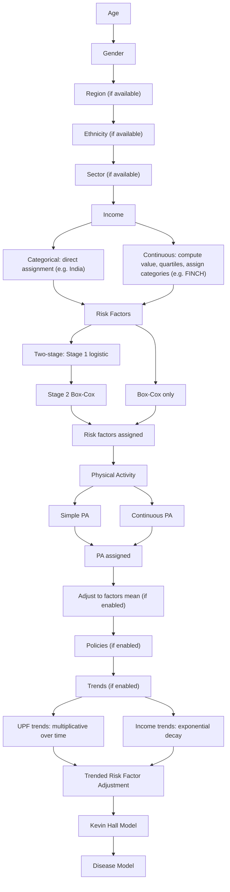

# Global Health Policy Simulation model (Health-GPS)

[](https://github.com/imperialCHEPI/healthgps/actions/workflows/ci.yml)
[](https://codecov.io/github/imperialCHEPI/healthgps)


| [Quick Start](#quick-start) | [February 2026 updates](#february-2026-updates) | [Development Tools](#development-tools) | [License](#license) | [Third-party Components](#third-party-components) |

Health-GPS microsimulation is part of the [STOP project](https://www.stopchildobesity.eu/), and support researchers and policy makers in the analysis of the health and economic impacts of alternative measures to tackle *chronic diseases* and *obesity in children*. The model reproduces the characteristics of a population and simulates key individual event histories associated with key components of relevant behaviours, such as physical activity, and diseases such as diabetes or cancer.

HealthGPS has now been adpated to run for projects such as [FINCH](https://www.imperial.ac.uk/business-school/faculty-research/research-centres/centre-health-economics-policy-innovation/research/finch/), [JACARDI](https://www.imperial.ac.uk/business-school/faculty-research/research-centres/centre-health-economics-policy-innovation/research/jacardi/) and [JA PreventNCD](https://www.imperial.ac.uk/business-school/faculty-research/research-centres/centre-health-economics-policy-innovation/research/ja-prevent-ncd/). It can run for multiple projects using the inputs available at [HealthGPS-examples](https://github.com/imperialCHEPI/healthgps-examples) for each of the projects. Example- to run for STOP, use the [HLM_France](https://github.com/imperialCHEPI/healthgps-examples/tree/main/HLM_France) folder, for India the [KevinHall_India](https://github.com/imperialCHEPI/healthgps-examples/tree/main/KevinHall_India) folder must be used and for FINCH the [KevinHall_FINCH](https://github.com/imperialCHEPI/healthgps-examples/tree/main/KevinHall_FINCH).

The *Health GPS microsimulation* is being developed in collaboration between the [Centre for Health Economics & Policy Innovation (CHEPI)](https://www.imperial.ac.uk/business-school/faculty-research/research-centres/centre-health-economics-policy-innovation/), Imperial College London; and [INRAE](https://www.inrae.fr), France; as part of the [STOP project](https://www.stopchildobesity.eu/). The software architecture uses a modular design approach to provide the building blocks of the *Health GPS application*, which is implemented using object-oriented principles in *Modern C++* programming language targeting the [C++20 standard](https://en.cppreference.com/w/cpp/20).

## February 2026 updates

The **[HealthGPS Update Report – 20th Feb 2026](https://github.com/imperialCHEPI/healthgps/blob/main/Technical%20Documentations/HealthGPS%20Update%20Report-%2020th%20Feb%202026.md)** summarises integrated changes (demographics, socioeconomic/income, static and dynamic risk factors, analysis/output, disease/PIF, policy, config/schema), parallelisation notes, and a developer file map. Snippets below are taken from that report.

**Supported use cases:** India, ABD, and FINCH on a shared codebase; backward compatibility with older India-style configs is retained alongside newer schema options.

**Module pipeline (simplified):**


**Host application, run loop, module order, and output:**


**Person initialisation sequence (overview):**



## Project Status and Recent Progress

**Last updated**
Significant progress has been made across the HealthGPS codebase. The following features and improvements are now **completed**:

- Trended adjustment framework
- Schema validation and dynamic schema handling
- Risk factor configuration via external config files
- Dynamic age caps and age limits
- Income-based input and output files
- Individual ID based tracking and output
- Consistent data loading across modules
- Log-transformed energy intake handling
- FINCH-specific age cap implementation
- Trended factor mean calculations

These updates improve robustness, extensibility, and consistency across both baseline and intervention workflows.

---

Detailed tables describing:

- **Where parallelisation is applied**
- **Population Impact Fraction (PIF) handling**
- **Income and individual ID tracking mechanisms**
are available in the full update report: [here](https://github.com/imperialCHEPI/healthgps/blob/main/Technical%20Documentations/HealthGPS%20Update%20Report-%2020th%20Feb%202026.md)

Relevant design documents:

- [individual ID tracking](https://github.com/imperialCHEPI/healthgps/blob/main/Technical%20Documentations/individual_id_tracking_csv-plan.md)
- [consistent person IDs across scenarios](https://github.com/imperialCHEPI/healthgps/blob/main/Technical%20Documentations/same_person_id_across_baseline_and_intervention-plan.md)

---

## Project Specific Requirements

Currently HealthGPS allows user flexibility in the following areas. View [Project Requirements](https://github.com/imperialCHEPI/healthgps/blob/main/Technical%20Documentations/PROJECT_REQUIREMENTS_PLAN.md) for more details.

---

## FINCH: Age/Gender/Income-Based Model Validation

As part of the **FINCH** project, a new validation feature is currently under development. This work adjusts model outputs to better reflect real-world population distributions using:

- Age
- Gender
- Income quintiles (or any number of income categories the user specifies)

This enables income-stratified calibration and improves external validity when comparing model outputs against observed data.

The design and implementation plan for this feature is available [here](https://github.com/imperialCHEPI/healthgps/blob/main/Technical%20Documentations/income_quintile_factor_means-plan.md)

## Quick Start

The **Health GPS** application provides a command line interface (CLI) and runs on *Windows 10 (and newer)* and *Linux* devices. All supported options are provided to the model via a *configuration file* (JSON format), including intervention scenarios and multiple runs. Users are encouraged to start exploring the model by changing the provided example configuration file and running the model again.

From a Git Bash-style shell, run the console app with a config file and optional thread count:

```bash
/c/healthgps/out/build/windows-release/src/HealthGPS.Console/HealthGPS.Console.exe \
  -c /c/healthgps-examples/KevinHall_India/config.json \
  -T 2
```

First argument path: built executable HealthGPS.Console.exe.
-c: path to your JSON configuration (input / scenario).
-T: number of threads TBB may use for parallel work (example: 2).
If you omit -T, the model uses the maximum parallelism available on your machine (effectively up to the number of logical CPUs), subject to TBB defaults.

NOTE: If you specify the number of threads, a minimum of 2 threads is required.

Adjust the two paths to match where you built Health-GPS and where your `config.json` lives (e.g. PowerShell):

```bash
C:\healthgps\...\HealthGPS.Console.exe -c C:\healthgps-examples\...
```

For more information, see the [quick start guide] in the documentation.

[quick start guide]: https://imperialchepi.github.io/healthgps/getstarted

## Development Tools

The *Health GPS* software is written in modern, standard ANSI C++, targeting the [C++20 version](https://en.cppreference.com/w/cpp/20) and using the C++ Standard Library. The project is fully managed by [CMake](https://cmake.org/) and [Microsoft Visual Studio](https://visualstudio.microsoft.com), the code base is portable but requires a C++20 compatible compiler to build. The development toolset users [Ninja](https://ninja-build.org/) for build, [vcpkg](https://github.com/microsoft/vcpkg) package manager for dependencies, [googletest](https://github.com/google/googletest) for unit testing and [GitHub Actions](https://docs.github.com/en/actions) for automated builds.

For more information, see the [developer guide].

[developer guide]: https://imperialchepi.github.io/healthgps/development

## License

The code in this repository is licensed under the [BSD 3-Clause](LICENSE.txt) license.

## Third-party components

### Libraries

| Name                                                          | License      |
|:--------------------------------------------------------------|:-------------|
| [Adevs](https://sourceforge.net/projects/adevs)               | BSD 3-Clause |
| [crossguid](https://github.com/graeme-hill/crossguid)         | MIT          |
| [cxxopts](https://github.com/jarro2783/cxxopts)               | MIT          |
| [eigen](https://eigen.tuxfamily.org)                          | MPL2         |
| [fmt](https://github.com/fmtlib/fmt)                          | MIT          |
| [nlohmann-json](https://github.com/nlohmann/json)             | MIT          |
| [jsoncons](https://github.com/danielaparker/jsoncons)         | Boost        |
| [rapidcsv](https://github.com/d99kris/rapidcsv)               | BSD 3-Clause |
| [oneAPI TBB](https://github.com/oneapi-src/oneTBB)            | Apache 2.0   |
| [libzippp](https://github.com/ctabin/libzippp)                | MIT          |
| [openssl](https://www.openssl.org)                            | Apache 2.0   |
| [PlatformFolders](https://github.com/sago007/PlatformFolders) | MIT          |
| [curlpp](http://www.curlpp.org)                               | MIT          |

### Tools and Frameworks

| Name                                               | License      |
|:---------------------------------------------------|:-------------|
| [vcpkg](https://github.com/microsoft/vcpkg)        | MIT          |
| [googletest](https://github.com/google/googletest) | BSD 3-Clause |
