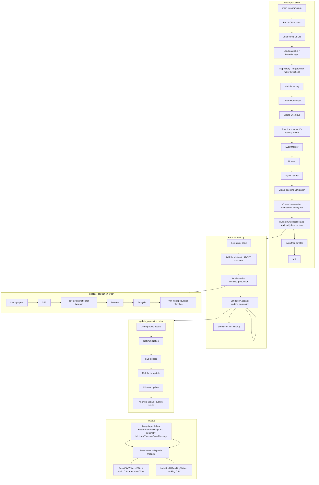
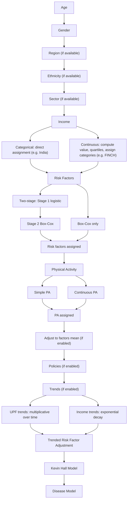

# Global Health Policy Simulation model (Health-GPS)

[](https://github.com/imperialCHEPI/healthgps/actions/workflows/ci.yml)
[](https://codecov.io/github/imperialCHEPI/healthgps)


| [Quick Start](#quick-start) | [Documentation](#documentation) | [February 2026 updates](#february-2026-updates) | [Development Tools](#development-tools) | [License](#license) | [Third-party Components](#third-party-components) |

Health-GPS microsimulation is part of the [STOP project](https://www.stopchildobesity.eu/), and supports researchers and policy makers in the analysis of the health and economic impacts of alternative measures to tackle *chronic diseases* and *obesity in children*. The model reproduces the characteristics of a population and simulates key individual event histories associated with key components of relevant behaviours, such as physical activity, and diseases such as diabetes or cancer.

Health-GPS has now been adapted to run for projects such as [FINCH](https://www.imperial.ac.uk/business-school/faculty-research/research-centres/centre-health-economics-policy-innovation/research/finch/), [JACARDI](https://www.imperial.ac.uk/business-school/faculty-research/research-centres/centre-health-economics-policy-innovation/research/jacardi/) and [JA PreventNCD](https://www.imperial.ac.uk/business-school/faculty-research/research-centres/centre-health-economics-policy-innovation/research/ja-prevent-ncd/). It can run for multiple projects using the inputs available at [HealthGPS-examples](https://github.com/imperialCHEPI/healthgps-examples) for each of the projects. Example: to run for STOP, use the [HLM_France](https://github.com/imperialCHEPI/healthgps-examples/tree/main/HLM_France) folder; for India the [KevinHall_India](https://github.com/imperialCHEPI/healthgps-examples/tree/main/KevinHall_India) folder; for FINCH the [KevinHall_FINCH](https://github.com/imperialCHEPI/healthgps-examples/tree/main/KevinHall_FINCH) folder.

The *Health GPS microsimulation* is being developed in collaboration between the [Centre for Health Economics & Policy Innovation (CHEPI)](https://www.imperial.ac.uk/business-school/faculty-research/research-centres/centre-health-economics-policy-innovation/), Imperial College London; and [INRAE](https://www.inrae.fr), France; as part of the [STOP project](https://www.stopchildobesity.eu/). The software architecture uses a modular design approach to provide the building blocks of the *Health GPS application*, which is implemented using object-oriented principles in *Modern C++* programming language targeting the [C++20 standard](https://en.cppreference.com/w/cpp/20).

## Documentation

Full docs live under `[documentation/](documentation/README.md)`. Start there for indexes by audience.

| Need                                            | Document                                                                                   |
| ----------------------------------------------- | ------------------------------------------------------------------------------------------ |
| Documentation home                              | [documentation/README.md](documentation/README.md)                                         |
| Site-style intro (diagrams)                     | [documentation/index.md](documentation/index.md)                                           |
| First run / binaries                            | [Quick Start](documentation/user/getstarted.md)                                            |
| Config, outputs, HPC                            | [User Guide](documentation/user/userguide.md)                                              |
| JSON schemas (diagrams)                         | [Configuration schemas](documentation/user/schemas.md)                                     |
| Models and module I/O                           | [Models overview](documentation/user/models-overview.md) · [Simulation models reference](documentation/technical/guides/simulation-models-reference.md) |
| Build from source / CMake                       | [Developer Guide](documentation/developer/development.md)                                  |
| Architecture                                    | [Software Architecture](documentation/developer/architecture.md)                           |
| Data model / Datastore                          | [Data Model](documentation/developer/datamodel.md)                                         |
| Windows MSVC / Ninja (`cstdint`, `MSVCRTD.lib`) | [MSVC troubleshooting](documentation/developer/msvc-windows-build-troubleshooting.md)      |
| GitHub Pages deploy failed                      | [Docs deploy troubleshooting](documentation/developer/docs-deploy-troubleshooting.md)    |
| FINCH / income / predictors                     | [FINCH guide](documentation/technical/guides/finch-linear-models-and-income-adjustment.md) |
| Feb 2026 integrated changes                     | [Update report](documentation/technical/guides/healthgps-update-report-2026-02-20.md)      |
| Threading / HPC sizing                          | [Performance guide](documentation/technical/guides/performance-optimizations.md)           |
| Feature plans                                   | [technical/README.md](documentation/technical/README.md)                                   |
| Doxygen API (GitHub Pages)                      | [API](https://imperialchepi.github.io/healthgps/api/)                                      |

Published website: [https://imperialchepi.github.io/healthgps/](https://imperialchepi.github.io/healthgps/). It is rebuilt from `documentation/` by the [docs workflow](.github/workflows/docs.yml) on **release** or **manual dispatch**, not on every push. Until that workflow runs against the current tree, the live site may lag the repo (older flat page layout).

## February 2026 updates

The **[HealthGPS Update Report – 20th Feb 2026](documentation/technical/guides/healthgps-update-report-2026-02-20.md)** summarises integrated changes (demographics, socioeconomic/income, static and dynamic risk factors, analysis/output, disease/PIF, policy, config/schema), parallelisation notes, and a developer file map. Snippets below are taken from that report.

**Supported use cases:** India, ADB, and FINCH on a shared codebase; backward compatibility with older India-style configs is retained alongside newer schema options.

**Module pipeline (simplified):**


```mermaid
flowchart LR
    DEMO[Demographic Module] --> SES[Socioeconomic Module]
    SES --> RF[Risk Factor Module]
    RF --> DIS[Disease Module]
    DIS --> IO[Read/write to files]
```

**Host application, run loop, module order, and output:**


```mermaid
flowchart TB
    subgraph host [Host Application]
        MAIN["main (program.cpp)"]
        CLI[Parse CLI options]
        CFG[Load config JSON]
        DATA[Load datatable / DataManager]
        REPO[Repository + register risk factor definitions]
        FACTORY[Module factory]
        MODEL_INPUT[Create ModelInput]
        BUS[Create EventBus]
        WRITERS[Result + optional ID-tracking writers]
        MONITOR[EventMonitor]
        RUNNER[Runner]
        CHAN[SyncChannel]
        CREATE_BASE[Create baseline Simulation]
        CREATE_POL[Create intervention Simulation if configured]
        RUN[Runner.run: baseline and optionally intervention]
        STOP[EventMonitor.stop]
        EXIT[Exit]
        MAIN --> CLI --> CFG --> DATA --> REPO --> FACTORY
        FACTORY --> MODEL_INPUT
        MODEL_INPUT --> BUS --> WRITERS --> MONITOR
        MONITOR --> RUNNER --> CHAN --> CREATE_BASE --> CREATE_POL --> RUN --> STOP --> EXIT
    end

    subgraph runLoop [Per-trial run loop]
        SETUP[Setup run: seed]
        SIM_ADD[Add Simulation to ADEVS Simulator]
        INIT[Simulation.init: initialise_population]
        TICK[Simulation.update: update_population]
        FINI[Simulation.fini: cleanup]
        SETUP --> SIM_ADD --> INIT --> TICK
        TICK --> TICK
        TICK --> FINI
    end

    subgraph initPop [initialise_population order]
        D_INIT[Demographic]
        SES_INIT[SES]
        RF_INIT[Risk factor: static then dynamic]
        DIS_INIT[Disease]
        A_INIT[Analysis]
        STATS[Print initial population statistics]
        D_INIT --> SES_INIT --> RF_INIT --> DIS_INIT --> A_INIT --> STATS
    end

    subgraph updatePop [update_population order]
        D_UPD[Demographic update]
        MIG[Net immigration]
        SES_UPD[SES update]
        RF_UPD[Risk factor update]
        DIS_UPD[Disease update]
        A_UPD[Analysis update: publish results]
        D_UPD --> MIG --> SES_UPD --> RF_UPD --> DIS_UPD --> A_UPD
    end

    subgraph output [Output]
        PUB[Analysis publishes ResultEventMessage and optionally IndividualTrackingEventMessage]
        DISPATCH[EventMonitor dispatch threads]
        JSON_CSV[ResultFileWriter: JSON + main CSV + income CSVs]
        TRACK[IndividualIDTrackingWriter: tracking CSV]
        PUB --> DISPATCH --> JSON_CSV
        PUB --> DISPATCH --> TRACK
    end

    RUN --> runLoop
    INIT --> initPop
    TICK --> updatePop
    A_UPD --> PUB
```

**Person initialisation sequence (overview):**


```mermaid
flowchart TB
    A[Age] --> B[Gender]
    B --> C["Region (if available)"]
    C --> D["Ethnicity (if available)"]
    D --> E["Sector (if available)"]
    E --> F[Income]
    F --> G["Categorical: direct assignment (e.g. India)"]
    F --> H["Continuous: compute value, quartiles, assign categories (e.g. FINCH)"]
    G --> I[Risk Factors]
    H --> I
    I --> I1["Two-stage: Stage 1 logistic"]
    I1 --> I1b["Stage 2 Box-Cox"]
    I --> I2["Box-Cox only"]
    I1b --> RFA
    I2 --> RFA
    RFA["Risk factors assigned"] --> J[Physical Activity]
    J --> J1[Simple PA]
    J --> J2[Continuous PA]
    J1 --> PAD
    J2 --> PAD
    PAD["PA assigned"] --> K["Adjust to factors mean (if enabled)"]
    K --> L["Policies (if enabled)"]
    L --> M["Trends (if enabled)"]
    M --> N["UPF trends: multiplicative over time"]
    M --> O["Income trends: exponential decay"]
    N --> P[Trended Risk Factor Adjustment]
    O --> P
    P --> Q[Kevin Hall Model]
    Q --> R[Disease Model]
```

## Project Status and Recent Progress

**Last updated**
Significant progress has been made across the HealthGPS codebase. The following features and improvements are now **completed**:

- Trended adjustment framework
- Schema validation and dynamic schema handling
- Risk factor configuration via external config files
- Dynamic age caps and age limits
- Income-based input and output files
- Individual ID based tracking and output
- Consistent data loading across modules
- Log-transformed energy intake handling
- FINCH-specific age cap implementation
- Trended factor mean calculations

These updates improve robustness, extensibility, and consistency across both baseline and intervention workflows.

---

Detailed tables describing:

- **Where parallelisation is applied**
- **Population Impact Fraction (PIF) handling**
- **Income and individual ID tracking mechanisms**

are in the full [update report](documentation/technical/guides/healthgps-update-report-2026-02-20.md).

Relevant design documents (under `documentation/technical/plans/`):

- [Individual ID tracking](documentation/technical/plans/individual-id-tracking-csv-plan.md)
- [Consistent person IDs across scenarios](documentation/technical/plans/same-person-id-baseline-intervention-plan.md)
- [Income quintile factor means](documentation/technical/plans/income-quintile-factor-means-plan.md)
- [Project requirements](documentation/technical/plans/project-requirements-plan.md)
- [Performance / parallelization notes](documentation/technical/guides/performance-optimizations.md)

---

## Project Specific Requirements

Health-GPS is driven by config flags (not hard-coded project names). Optional `project_requirements` in `config.json` controls demographics (region, ethnicity, `gender2`), income type and final category count (`3` / `4` / `5`), physical activity, trends, and two-stage logistic behaviour. See:

- [Project requirements plan](documentation/technical/plans/project-requirements-plan.md)
- [User Guide: project requirements](documentation/user/userguide.md#project-requirements)
- Schema: `schemas/v1/config/project_requirements.json`

---

## FINCH: Age/Gender/Income-Based Model Validation

As part of the **FINCH** project, income-stratum and quintile-based calibration adjust model outputs to better reflect observed distributions by:

- Age
- Gender
- Income quintiles (or any number of income categories the user specifies)

This enables income-stratified calibration and improves external validity when comparing model outputs against observed data.

See the modeller-facing [FINCH guide](documentation/technical/guides/finch-linear-models-and-income-adjustment.md) and the [income quintile factor means plan](documentation/technical/plans/income-quintile-factor-means-plan.md).

## Quick Start

The **Health GPS** application provides a command line interface (CLI) and runs on *Windows 10 (and newer)* and *Linux* devices. All supported options are provided to the model via a *configuration file* (JSON format), including intervention scenarios and multiple runs. Users are encouraged to start exploring the model by changing the provided example configuration file and running the model again.

Prefer `-c` / `--config` for the config path (file, folder, or zip URL). Put the backend datastore in `data.source` inside the config. Optional flags include `-T` / `--threads` (TBB cap) and `--dry-run`. Deprecated: `-f` / `--file` and `-s` / `--storage`.

From a Git Bash-style shell, run the console app with a config file and optional thread count:

```bash
/c/healthgps/out/build/windows-release/src/HealthGPS.Console/HealthGPS.Console.exe \
  -c /c/healthgps-examples/KevinHall_India/config.json \
  -T 2
```

First argument path: built executable HealthGPS.Console.exe.
-c: path to your JSON configuration (input / scenario).
-T: number of threads TBB may use for parallel work (example: 2).
If you omit -T, the model uses the maximum parallelism available on your machine (effectively up to the number of logical CPUs), subject to TBB defaults.

NOTE: If you specify the number of threads, a minimum of 2 threads is required.

Adjust the two paths to match where you built Health-GPS and where your `config.json` lives (e.g. PowerShell):

```bash
C:\healthgps\...\HealthGPS.Console.exe -c C:\healthgps-examples\...
```

For more information, see the [documentation home](documentation/README.md), [Quick Start](documentation/user/getstarted.md), and the [User Guide](documentation/user/userguide.md).

## Development Tools

The *Health GPS* software is written in modern, standard ANSI C++, targeting the [C++20 version]([https://en.cppreference.com/w/cpp/20](https://en.cppreference.com/w/cpp/20)) and using the C++Standard Library. The project is fully managed by [CMake](https://cmake.org/) and [Microsoft Visual Studio](https://visualstudio.microsoft.com), the code base is portable but requires a C++20 compatible compiler to build. The development toolset uses [Ninja](https://ninja-build.org/) for build, [vcpkg](https://github.com/microsoft/vcpkg) package manager for dependencies, [googletest](https://github.com/google/googletest) for unit testing and [GitHub Actions](https://docs.github.com/en/actions) for automated builds.

For more information, see the [Developer Guide](documentation/developer/development.md). On Windows, if CMake cannot find headers such as `cstdint` or linking fails on `MSVCRTD.lib`, see [MSVC / Ninja troubleshooting](documentation/developer/msvc-windows-build-troubleshooting.md).

## License

The code in this repository is licensed under the [BSD 3-Clause](LICENSE.txt) license.

---

## Third-party components

### Libraries

| Name                                                          | License      |
| ------------------------------------------------------------- | ------------ |
| [Adevs](https://sourceforge.net/projects/adevs)               | BSD 3-Clause |
| [crossguid](https://github.com/graeme-hill/crossguid)         | MIT          |
| [cxxopts](https://github.com/jarro2783/cxxopts)               | MIT          |
| [eigen](https://eigen.tuxfamily.org)                          | MPL2         |
| [fmt](https://github.com/fmtlib/fmt)                          | MIT          |
| [nlohmann-json](https://github.com/nlohmann/json)             | MIT          |
| [jsoncons](https://github.com/danielaparker/jsoncons)         | Boost        |
| [rapidcsv](https://github.com/d99kris/rapidcsv)               | BSD 3-Clause |
| [oneAPI TBB](https://github.com/oneapi-src/oneTBB)            | Apache 2.0   |
| [libzippp](https://github.com/ctabin/libzippp)                | MIT          |
| [openssl](https://www.openssl.org)                            | Apache 2.0   |
| [PlatformFolders](https://github.com/sago007/PlatformFolders) | MIT          |
| [curlpp](http://www.curlpp.org)                               | MIT          |

### Tools and Frameworks

| Name                                               | License      |
| -------------------------------------------------- | ------------ |
| [vcpkg](https://github.com/microsoft/vcpkg)        | MIT          |
| [googletest](https://github.com/google/googletest) | BSD 3-Clause |

---

**Author:** Mahima Ghosh
