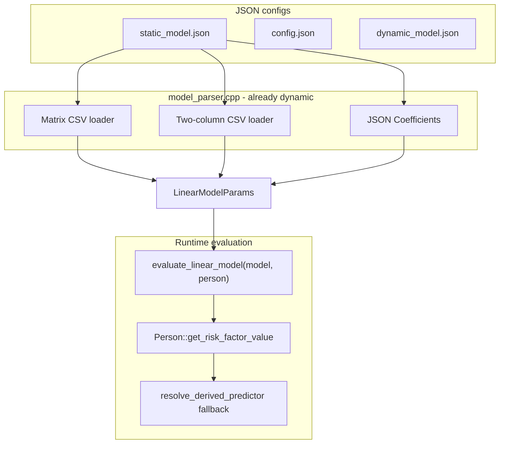

# Universal dynamic CSV predictors (all JSON-referenced regression models)

## Yes — this makes sense

You want: **whatever predictor names appear in any regression CSV (or JSON `Coefficients` block) are understood automatically**—users can add/remove `income`, `income2`, `log_income`, `log_income2`, or future terms without touching C++ again.

The work splits cleanly into:

1. **Loading** — already mostly dynamic (read all rows/columns into `LinearModelParams`).
2. **Evaluation** — today inconsistent; this is what we fix once, globally.

Correlation matrices, quantile tables, region/ethnicity **assignment** CSVs, factors-mean tables, and population data files are **not** linear predictors—they stay as they are.

---

## CSV inventory from JSON configs

### Regression models (in scope — must support arbitrary predictor names)

| Config file | JSON path | CSV filename placeholder | Layout |
|-------------|-----------|--------------------------|--------|
| [`static_model.json`](input-data/data/KevinHall_FINCH/static_model.json) | `RiskFactorModels.boxcox_coefficients.name` | e.g. `boxcox_coefficients.csv` | **Matrix**: rows = predictor names, columns = risk factor outcomes |
| `static_model.json` | `RiskFactorModels.logistic_regression.name` | e.g. `logistic_regression.csv` | **Matrix** (same) |
| `static_model.json` | `RiskFactorModels.policy_coefficients.name` | e.g. `policyeffect_model.csv` | **Matrix** (same) |
| `static_model.json` | `IncomeModels.continuous.csv_file` | e.g. `income_model.csv` | **Two-column**: factor \| coefficient |
| `static_model.json` | `PhysicalActivityModels.*.csv_file` | e.g. `physicalactivity_model.csv` | **Two-column** (same) |
| `static_model.json` | Legacy `RiskFactorModels.<factor>.Coefficients` (JSON inline) | — | Same evaluation path as matrix CSV |
| `static_model.json` | `IncomeModels.<category>.Coefficients` (categorical logits) | — | Same evaluation path |
| [`dynamic_model.json`](input-data/data/KevinHall_FINCH/dynamic_model.json) | `Equations.*.*[].coefficients` (ebhlm) | — | JSON map; uses `get_risk_factor_value` today |

**Your note on layouts is correct:**

- **Two-column files** (`income_model.csv`, `physicalactivity_model.csv`): first column = predictor name, second = coefficient. Metadata rows: `Intercept`, `stddev`, `min`, `max`.
- **Matrix files** (`boxcox_coefficients.csv`, `logistic_regression.csv`, `policyeffect_model.csv`): first column = predictor name (row), header row = outcome names (columns). Metadata rows: `lambda`, `stddev`, `min`, `max` (boxcox only).

### Not regression predictors (out of scope)

| File / JSON | Role |
|-------------|------|
| `Finch_residual_risk_factor_correlation.csv` | Residual correlation matrix (confirmed: no change) |
| `Finch_residual_policy_covariance.csv` | Policy residual covariance |
| `region.csv`, `ethnicity.csv` | Sampling assignment probabilities by age/gender |
| `config.json` → `Finch.DataFile.csv` | Population microdata |
| `config.json` → `FactorsMean.*.csv` | Expected means lookup tables |
| `dynamic_model.json` → weight / EPA quantile CSVs | Quantile sampling, not linear regression |

[`kevinhall`](input-data/data/KevinHall_FINCH/dynamic_model.json) dynamic model uses JSON for food/nutrient equations—no coefficient-name CSV; it still benefits from the shared resolver when equations reference person attributes via `get_risk_factor_value`.

---

## Predictor naming convention (single source of truth)

Document once in [`person.cpp`](src/HealthGPS/person.cpp) (or small `predictor_resolver.cpp` if preferred):

| Pattern | Examples | Value |
|---------|----------|-------|
| Intercept | `Intercept` | 1.0 (handled as model intercept, not summed as predictor) |
| Dummy indicator | `gender2`, `region3`, `ethnicity4` | 1.0 if person matches that category label, else 0.0 |
| Polynomial | `age1`, `age2`, `income2` | `base^N` where trailing digits = power (`age`/`age1` → power 1) |
| Log transform | `log_income`, `log_income2` | `log(base)` with floor `1e-10`; trailing digits after base = power on the **log** (`log_income2` = `(log(income))^2`) |
| Income base | used by `income`, `income2`, `log_*` | 1) `risk_factors["income"]` if set, 2) `income_continuous` if &gt; 0, 3) `income_to_value()` (categorical 1–4) |
| Person fields | `income_continuous`, `sector`, … | Direct member / existing dispatcher |
| Stored risk factor | `FoodFat`, `bmi`, … | `risk_factors` map |

**Important:** `income2` is **not** a dummy like `region2`—it squares the resolved income value.

**Circular dependency guard:** [`income_model.csv`](input-data/data/KevinHall_FINCH/income_model.csv) must not use `income` / `income2` / `log_income` as predictors (income is generated from that model). BoxCox, logistic, and PA run **after** income is assigned—safe.

---

## Architecture after change



Every regression path calls **`evaluate_linear_model`** (thin wrapper):

```cpp
double evaluate_linear_model(const Person& person, const LinearModelParams& model) {
    double linear = model.intercept;
    for (const auto& [name, coef] : model.coefficients) {
        if (is_metadata_predictor(name)) continue;  // stddev, min, max, lambda
        linear += coef * person.get_risk_factor_value(name);
    }
    for (const auto& [name, coef] : model.log_coefficients) {
        // Optional: keep for legacy JSON LogCoefficients;
        // log_* names in coefficients also work via resolver
        linear += coef * person.get_risk_factor_value(name);
    }
    return linear;
}
```

`is_metadata_predictor`: `stddev`, `min`, `max`, `lambda` (case-insensitive).

---

## Code changes

### 1. [`person.cpp`](src/HealthGPS/person.cpp) / [`person.h`](src/HealthGPS/person.h) — universal resolver

- Add `resolve_derived_predictor(const Person&, const std::string& key)`.
- Call from `get_risk_factor_value` after static `current_dispatcher` and `risk_factors`, before throw.
- Keeps existing dispatcher entries; fallback handles anything new from CSV/JSON.

**Consumers that automatically gain dynamic predictors** (already call `get_risk_factor_value`):

- [`compute_linear_models`](src/HealthGPS/static_linear_model.cpp) (boxcox, policy, trend, income trend)
- [`calculate_zero_probability`](src/HealthGPS/static_linear_model.cpp) (logistic)
- [`initialise_categorical_income`](src/HealthGPS/static_linear_model.cpp) (India logits)
- [`dynamic_hierarchical_linear_model.cpp`](src/HealthGPS/dynamic_hierarchical_linear_model.cpp) (ebhlm)
- [`static_hierarchical_linear_model.cpp`](src/HealthGPS/static_hierarchical_linear_model.cpp) (hlm)

### 2. [`static_linear_model.cpp`](src/HealthGPS/static_linear_model.cpp) + [`.h`](src/HealthGPS/static_linear_model.h)

- Add `evaluate_linear_model` (or free function in a small `linear_model_evaluator.h`).
- Replace duplicated ~300-line blocks in `calculate_continuous_income` and `initialise_continuous_physical_activity` with `evaluate_linear_model`.
- Simplify `compute_linear_models` inner loop to use the same helper (retain **age capping** via optional `max_age` parameter passed only where needed today).
- Simplify `calculate_zero_probability` to use the same helper.

### 3. [`model_parser.cpp`](src/HealthGPS.Input/model_parser.cpp) — loader polish (small)

- Extract shared **`load_two_column_regression_csv(path)`** used by income + physical activity loaders (DRY).
- **Fix header handling**: physical activity uses `row_idx = 0` (no header); continuous income uses `row_idx = 1` (assumes header). Your [`income_model.csv`](input-data/data/KevinHall_FINCH/income_model.csv) has **no header** (starts with `Intercept`)—align both loaders to start at row 0, or auto-detect (if row 0 col 0 is `Intercept`/`Factor`, treat as data).
- Matrix loaders (boxcox/logistic/policy): **no change**—already load every row name into coefficients per outcome.

No JSON schema changes required—filenames stay in `static_model.json` placeholders as today.

### 4. CSV data (user / data team)

Add fitted values wherever needed:

| File | How to add predictors |
|------|------------------------|
| `boxcox_coefficients.csv` | New **rows** (e.g. `income2`, `log_income`) |
| `logistic_regression.csv` | New **rows** |
| `policyeffect_model.csv` | New **rows** |
| `income_model.csv` | New **rows** (factor column) |
| `physicalactivity_model.csv` | New **rows** |

Example new rows: `income`, `income2`, `log_income`, `log_income2` with model-fitted coefficients.

### 5. Tests — [`HealthGPS.Tests`](src/HealthGPS.Tests)

- Resolver unit tests (income, income2, log_income, log_income2, region2, age2, unknown → throw).
- `evaluate_linear_model` smoke test with a tiny `LinearModelParams` built in code.
- Optional: load FINCH `static_model.json` and verify no `[MISSING_FACTOR]` when new rows present.

---

## What we are not changing

- Correlation / covariance CSV structure or dimensions.
- `region.csv` / `ethnicity.csv` assignment logic.
- `config.json` factors-mean or population data CSV parsing.
- `dynamic_model.json` quantile CSVs.
- Adding new **outcome columns** to the correlation matrix (separate feature if new risk factors are introduced).

---

## Risks / edge cases

| Topic | Note |
|-------|------|
| Categorical vs continuous income | India: `income2` squares category codes 1–4; FINCH: squares continuous dollars from `risk_factors["income"]` |
| Log of zero | Floor at `1e-10` |
| Age cap in boxcox | Keep existing `age_for_models` cap in `compute_linear_models` only (optional follow-up: pass cap into resolver for PA/income) |
| `log_coefficients` JSON field | Legacy path kept; `log_*` row names in CSV work via resolver without duplicating into `log_coefficients` |

---

## Implementation order

1. Implement `resolve_derived_predictor` + unit tests.
2. Add `evaluate_linear_model` + refactor all static-linear evaluation sites.
3. Unify/fix two-column CSV loader (income + PA).
4. User adds CSV rows/columns with fitted coefficients.
5. FINCH smoke run + existing test suite.

**Estimated touch:** `person.cpp`, `static_linear_model.cpp` (+ header), small `model_parser.cpp` loader fix, 1–2 test files. **No** per-CSV code paths after this.
