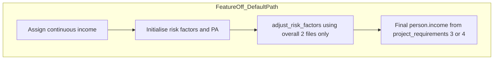

# Income-stratum factors-mean adjustment (optional feature)

## Optional and backward compatible

**Yes — this stays fully optional.** If the user does **not** turn on stratum-specific adjustment (or leaves the new `baseline_adjustments` fields absent / `enabled: false`), behaviour must match **today’s model**:

- Only the **two overall** factors-mean files (`factorsmean_male`, `factorsmean_female`) are used.
- **One** combined factors-mean adjustment path as now (subject to existing `project_requirements`: `adjust_to_factors_mean`, income/PA flags, etc.).
- **Final** `person.income` still comes from `project_requirements.income.categories` (`"3"` or `"4"`) and existing equal-rank logic in `[static_linear_model.cpp](c:/healthgps/src/HealthGPS/static_linear_model.cpp)`.

No extra stratum CSVs, no second “adjustment bucket count,” and no change to orchestration until the user explicitly opts in via config. **Regression requirement:** with the feature off, outputs should match the **pre-change** behaviour (within normal numerical tolerance).

---

## Problem statement (from product / economics)

- Raw simulation can misalign **physical activity** and risk factors with **income** in ways external data do not support (e.g. PAL vs income in reference data).
- **Approach:** Keep the current machinery, but allow **factors-mean adjustment** to use **income-stratum reference tables** (e.g. quintiles from data) for **risk factors and PA**, while **continuous income** is still first calibrated to **overall** marginal factors means (the existing two files).
- **Final reporting / Kevin Hall** may still use **fewer** categories (e.g. quartiles): so the model may need **two different notions of “income buckets”**—one for **which adjustment table** applies, and one for `**core::Income`** after all adjustments. This plan encodes that split in config (see below).

---

## Two config knobs for “how many income buckets?”

- **Final categories** — `project_requirements.income.categories` (`"3"` or `"4"`): `**person.income`** for output, Kevin Hall, reporting—**after** the full pipeline; unchanged semantic from today.
- **Adjustment strata** — `modelling.baseline_adjustments` (new): how many **rank buckets** from **continuous income** *before* stratum-specific factors-mean adjustment; must line up with loaded **stratum CSV pairs** (e.g. five quintiles ⇒ five pairs and five buckets; six strata with six table pairs ⇒ six buckets, then still final `"4"` for `person.income` if desired).

Example: `**"4"`** final categories but **six** adjustment strata → six rank buckets → six male/female table pairs for RF/PA calibration → then equal-split into **four** final `core::Income` groups using continuous income.

---

## Config and file layout

**Toggle and paths** live under `**modelling.baseline_adjustments`** (alongside existing `file_names`), **not** in `project_requirements`.

**Overall (always, today):**

- `factorsmean_male`, `factorsmean_female` — e.g. `Finch.FactorsMean.Male.csv`, `Finch.FactorsMean.Female.csv`.

**When stratum adjustment is enabled:** optional list of stratum pairs, e.g. `Finch.FactorsMean.Male.Quintile1.csv` / `Finch.FactorsMean.Female.Quintile1.csv`, … (`Quintile5` for five strata). Length is flexible (not hardcoded to five).

**Phase 1** adds schema + structs + parsing; **Phase 2** loads `RiskFactorSexAgeTable` (or equivalent) per overall + per stratum pair, with **fail fast** if loading fails.

---

## Diagram — default path vs optional stratum path

These are **continuous-income** flows at a high level (categorical-income projects follow existing India-style logic without this feature unless extended later).

When the feature is **off**, the simulator keeps the **existing** implementation order and logic (not this diagram’s abstraction alone); the diagram summarises “two files, one adjustment, then final categories.”

**Where it runs:** The **stratum** sequence must be mirrored **every simulation year** in both **generate** (`[initialise_risk_factors](c:/healthgps/src/HealthGPS/static_linear_model.cpp)`) and **update** (`[update_risk_factors](c:/healthgps/src/HealthGPS/static_linear_model.cpp)`), including newborns and ageing cohorts as in current code structure.

---

## Phase 1 — Schema and config only

**Scope:** [`schemas/v1/config/modelling.json`](c:/healthgps/schemas/v1/config/modelling.json), [`schemas/config/modelling.json`](c:/healthgps/schemas/config/modelling.json) if applicable, [`BaselineInfo`](c:/healthgps/src/HealthGPS.Input/poco.h), [`get_baseline_info`](c:/healthgps/src/HealthGPS.Input/configuration_parsing.cpp). **No simulation behaviour change** until Phase 2.

**Under `baseline_adjustments`, include:**

1. **Toggle** — stratum factors-mean adjustment enabled (default **false** / absent).
2. `**file_names`** — existing `factorsmean_male` / `factorsmean_female` (**required**).
3. **Stratum list** — array of `{ id, factorsmean_male, factorsmean_female }` (0..N entries when disabled; when enabled, length matches **N**).
4. **Adjustment bucket count** — integer **N** (≥ 2): how many equal-rank buckets from continuous income for **adjustment**. Must be **consistent** with `strata.length` (pick one authoritative rule in implementation and validate).

**Validation when enabled:** paths exist after rebase; **N** matches stratum file list length; optional consistency checks with `enabled` flag.

---

## Phase 2 — C++ (ordered)

Applies only when stratum adjustment is **enabled** and **continuous income** mode applies; otherwise execute **default path** only.

1. **Load** overall + each stratum table; **abort or error** clearly on failure.
2. **Assign N adjustment strata** — after **income-only** adjustment to the **overall** two files (when `project_requirements` say to adjust income), rank-split continuous income into **N** buckets (same *idea* as `[assign_income_categories_equal_split](c:/healthgps/src/HealthGPS/static_linear_model.cpp)`, extended to **N**). Persist stratum on `[Person](c:/healthgps/src/HealthGPS/person.h)` (or equivalent).
3. **Stratum adjustments** — adjust **risk factors** then **PA** using **per-stratum** expected tables; **income** is **not** re-adjusted against stratum tables in the default design (only overall two files for income).
4. **Final `person.income`** — **only** via `**project_requirements.income.categories`** (`"3"` / `"4"`), **after** the above, using continuous income (current equal-split style).

**Integration:** End-to-end consistency (N, files, buckets, final categories). **Baseline ↔ intervention:** extend sync payloads so stratified deltas (per stratum × sex × age × factor) replicate today’s baseline-driven calibration for dual-scenario runs (see earlier plan notes on message shape).

---

## Core implementation notes

### Simulated mean does not change its rules

`[calculate_simulated_mean](c:/healthgps/src/HealthGPS/risk_factor_adjustable_model.cpp)` keeps **logistic / two-stage** behaviour: factors at **0** excluded from the mean when the model says so. Stratum logic **adds a filter** (“person belongs to adjustment stratum *k*”) and **does not** duplicate a second mean formula that drops those rules.

### `get_expected` for linear models

Continues to use the **overall** `expected_` table for **initialisation** / blending in `[static_linear_model.cpp](c:/healthgps/src/HealthGPS/static_linear_model.cpp)` unless a future requirement says otherwise.

---

## Phase 3 — Testing

- Config errors (bad paths, **N** vs list mismatch).
- **Feature off:** regression vs pre-feature behaviour.
- **Feature on:** load success, ~equal stratum sizes, final categories respect `"3"`/`"4"`.
- **Generate** and **update** paths where practical.

---

## Files touched (by phase)

| Phase | Files                                                                                                                          |
| ----- | ------------------------------------------------------------------------------------------------------------------------------ |
| 1     | `modelling.json` schemas, `poco.h`, `configuration_parsing.cpp`, optional example JSON                                         |
| 2     | `model_parser.cpp`, `static_linear_model.cpp`, `risk_factor_adjustable_model.cpp` (or helpers), `person.h`, sync in simulation |
| 3     | Tests per repo layout                                                                                                          |

---

## Summary checklist

- Optional; **two files only** = current behaviour when feature **off**.
- Economics: overall income calibration; stratum tables for **RF + PA** misalignment fix.
- **baseline_adjustments** for toggle + paths + **N** adjustment buckets; **project_requirements** only for **final** `"3"`/`"4"`.
- **Flexible** number of strata (not only quintiles); FINCH naming as example.
- Phases: schema → C++ (load → strata → adjust → final categories) → tests.
- **Yearly** generate + update.
- Logistic simulated-mean exclusion **unchanged**; stratum = extra filter only.
- Baseline/intervention sync extended for stratified deltas.
- Diagrams: default path vs stratum path.
