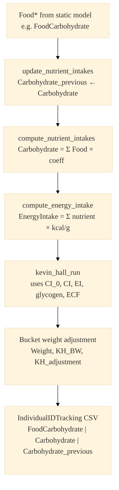

# Nutrient / energy equation pipeline

Team reference for how Kevin Hall config loads into each simulation year, and which config file feeds which runtime step.

**Shareable images:** `diagrams/nutrient-energy-pipeline-main.png`, `diagrams/nutrient-energy-pipeline-kh-detail.png` (SVG versions alongside for slides).

## Connection map (if arrows still overlap in your renderer)

| Config source (left) | Runtime step (right) | What is passed |
| --- | --- | --- |
| `dynamic_model.json` → **Nutrients** | `compute_nutrient_intakes` | Nutrient keys zeroed and rebuilt; `nutrient_ranges` loaded (not applied inside Kevin Hall) |
| `dynamic_model.json` → **Nutrients** | `compute_energy_intake` | `energy_equation_` kcal/g coefficients |
| `dynamic_model.json` → **Foods** | `compute_nutrient_intakes` | `nutrient_equations_` (food → nutrient coefficients) |
| `static_model.json` + CSVs | `StaticLinearModel` | BoxCox / policy / trends on `Food*` |
| Factors-mean CSVs | `adjust_risk_factors` | Sex×age (and stratum) targets |

## Main diagram (two columns — one arrow per config target)

Left column is config at load; right column is each simulation year. Cross-links are horizontal and labeled so each source box maps to a single destination.


```mermaid
%%{init: {
  "theme": "base",
  "themeVariables": {
    "fontSize": "18px",
    "fontFamily": "Segoe UI, Arial, sans-serif",
    "primaryColor": "#e8f4fc",
    "primaryBorderColor": "#2563eb",
    "lineColor": "#475569",
    "clusterBkg": "#f8fafc",
    "clusterBorder": "#64748b",
    "titleColor": "#0f172a"
  },
  "flowchart": { "htmlLabels": true, "curve": "basis", "nodeSpacing": 48, "rankSpacing": 56 }
}}%%
flowchart LR
  classDef cfgNut fill:#dbeafe,stroke:#1d4ed8,stroke-width:2px,color:#0f172a
  classDef cfgFood fill:#e0e7ff,stroke:#4338ca,stroke-width:2px,color:#0f172a
  classDef cfgStatic fill:#dcfce7,stroke:#15803d,stroke-width:2px,color:#0f172a
  classDef cfgMean fill:#ffedd5,stroke:#c2410c,stroke-width:2px,color:#0f172a
  classDef run fill:#f1f5f9,stroke:#475569,stroke-width:2px,color:#0f172a
  classDef kh fill:#fef3c7,stroke:#b45309,stroke-width:2px,color:#0f172a
  classDef out fill:#ede9fe,stroke:#6d28d9,stroke-width:2px,color:#0f172a

  subgraph CFG["Config at load"]
    direction TB
    DM["dynamic_model.json<br/><b>Nutrients</b><br/>energy_equation + nutrient_ranges"]
    DM2["dynamic_model.json<br/><b>Foods</b><br/>nutrient_equations + food trends"]
    SM["static_model.json + CSVs<br/>Food* linear / BoxCox / policy / trends"]
    FM["Factors-mean CSVs<br/>sex×age and stratum targets"]
  end

  subgraph YEAR["Each simulation year"]
    direction TB
    DEMO["Demographics / SES"]
    STATIC["StaticLinearModel<br/>update Food* on person.risk_factors"]
    ADJ["adjust_risk_factors<br/>factors-mean + trends + policy"]
    LAG["Kevin Hall lag<br/>Carbohydrate_previous ← Carbohydrate<br/>Sodium_previous ← Sodium"]
    NUT["compute_nutrient_intakes<br/>Carbohydrate etc. from Food*"]
    EI["compute_energy_intake<br/>EnergyIntake from energy_equation_"]
    KH["kevin_hall_run<br/>CI_0, CI, EI, glycogen, ECF, weight"]
    WADJ["Sex×age weight adjustment<br/>baseline bucket mean"]
    OUT["Analysis + optional<br/>IndividualIDTracking CSV"]
    DEMO --> STATIC --> ADJ --> LAG --> NUT --> EI --> KH --> WADJ --> OUT
  end

  DM -->|"① nutrient keys"| NUT
  DM -->|"② kcal/g coeffs"| EI
  DM2 -->|"③ food→nutrient map"| NUT
  SM -->|"④ Food* models"| STATIC
  FM -->|"⑤ cohort targets"| ADJ

  class DM cfgNut
  class DM2 cfgFood
  class SM cfgStatic
  class FM cfgMean
  class DEMO,STATIC,ADJ run
  class LAG,NUT,EI,KH,WADJ kh
  class OUT out

  linkStyle 9 stroke:#1d4ed8,stroke-width:3px
  linkStyle 10 stroke:#1d4ed8,stroke-width:3px
  linkStyle 11 stroke:#4338ca,stroke-width:3px
  linkStyle 12 stroke:#15803d,stroke-width:3px
  linkStyle 13 stroke:#c2410c,stroke-width:3px
```

## Kevin Hall detail (vertical — no config cross-links)




## Code pointers

| Step | Primary file |
| --- | --- |
| Config load | `src/HealthGPS.Input/model_parser.cpp` (`load_kevinhall_risk_model_definition`) |
| Year order | `src/HealthGPS/simulation.cpp` (`update_population`) |
| Static then dynamic | `src/HealthGPS/riskfactor.cpp` |
| Kevin Hall yearly update | `src/HealthGPS/kevin_hall_model.cpp` (`update_non_newborns`) |
| Tracking CSV columns | `output.individual_id_tracking.risk_factors` in config; `src/HealthGPS/analysis_module.cpp` |
