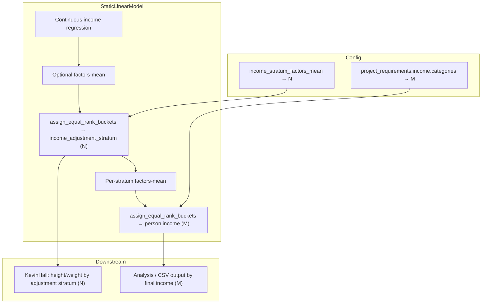

# Dynamic Final Income Categories (3/4/5) + Stratum Adjustment

**Engineer:** Mahima — building this feature and the primary contact for questions on dynamic final income categories, income stratum adjustment integration, and related `config.json` / `project_requirements` behaviour.

---

## Goal

Enable `project_requirements.income.categories: "5"` while keeping **adjustment strata** (`adjustment_income_stratum_count`, quintile CSVs, `person.income_adjustment_stratum`) fully independent. Both features are config-driven and composable without coupling N to M.




**Enum ceiling:** `core::Income` supports at most 5 final buckets (`low`, `lowermiddle`, `middle`, `uppermiddle`, `high`). No `Person` or enum changes required.

---

## Phase 1 — Shared layout module (new)

Add `[src/HealthGPS.Core/income_category_layout.h](src/HealthGPS.Core/income_category_layout.h)` + `[income_category_layout.cpp](src/HealthGPS.Core/income_category_layout.cpp)`; register in `[src/HealthGPS.Core/CMakeLists.txt](src/HealthGPS.Core/CMakeLists.txt)`.

```cpp
struct IncomeCategoryLayout {
    std::size_t count;                        // 3, 4, or 5
    std::vector<core::Income> strata;         // ordered final buckets
    std::vector<std::string> labels;          // debug table headers
};

IncomeCategoryLayout income_category_layout_from_config(std::string_view categories);
std::size_t income_table_index(core::Income income, const IncomeCategoryLayout &layout);
core::Income income_from_equal_split_bucket(std::size_t bucket, const IncomeCategoryLayout &layout);
double income_category_numeric(core::Income income, const IncomeCategoryLayout &layout);
```

**Mapping tables (single definition):**


| count | strata (in order)                           |
| ----- | ------------------------------------------- |
| 3     | low, middle, high                           |
| 4     | low, lowermiddle, uppermiddle, high         |
| 5     | low, lowermiddle, middle, uppermiddle, high |


**Numeric encoding** (`income_category_numeric`):

- count 3 → legacy 1, 2, 4 (unchanged)
- count 4 → legacy 1, 2, 3, 4 (unchanged)
- count 5 → 1, 2, 3, 4, 5 (one-to-one)

`Person::income_to_value()` in `[src/HealthGPS/person.cpp](src/HealthGPS/person.cpp)` stays unchanged for backward compatibility.

---

## Phase 2 — Config validation and schema

**Parser** — `[src/HealthGPS.Input/model_parser.cpp](src/HealthGPS.Input/model_parser.cpp)`:

- Replace `must be "3" or "4"` with layout parse (`"5"` accepted).
- `map_income_category`: add `"5"` branch accepting all five JSON keys (`low`, `lowermiddle`, `middle`, `uppermiddle`, `high`).
- Continuous income placeholder models: emplace all five enum keys when count is 5.
- Categorical path: after loading `IncomeModels`, validate model key count matches `layout.count` (excluding `simple`/`continuous`).

**Pass layout into models** — replace `std::string income_categories` with `IncomeCategoryLayout` in:

- `[src/HealthGPS/static_linear_model.h](src/HealthGPS/static_linear_model.h)` / `.cpp` (both `StaticLinearModel` and `DynamicStaticLinearModel` constructors; member `income_category_layout_` replaces `income_categories_`).
- `[src/HealthGPS.Input/model_parser.cpp](src/HealthGPS.Input/model_parser.cpp)` factory call (~line 1830).

**Schemas** (required for valid configs):

- `[schemas/v1/config/project_requirements.json](schemas/v1/config/project_requirements.json)` — add `"5"` to enum.
- `[schemas/v1/config.json](schemas/v1/config.json)` — same if `income_categories` documented there.
- `[src/HealthGPS.Input/poco.h](src/HealthGPS.Input/poco.h)` — update comment on `categories` field (`"3" | "4" | "5"`).

**Example config** — optional one-line note in `[examples/config_skeleton.json](examples/config_skeleton.json)` NOTES block only (no new doc file).

---

## Phase 3 — Unify rank-bucket assignment in static model

In `[src/HealthGPS/static_linear_model.cpp](src/HealthGPS/static_linear_model.cpp)`:

1. **Extract generic helper** (anonymous namespace or small function in layout module):

```cpp
template<typename SetBucket>
void assign_equal_rank_buckets(Population &pop, std::size_t bucket_count, SetBucket set_bucket);
```

1. **Refactor existing functions** to call it:
  - `assign_income_adjustment_strata_equal_split` → sets `income_adjustment_stratum` (unchanged behavior, N from config).
  - `assign_income_categories_equal_split` → uses `layout.count` + `income_from_equal_split_bucket`.
2. **Replace all `income_categories_ == "4"` branches** with `income_category_layout_.count`:
  - Threshold selection for debug printouts: add `calculate_percentile_thresholds(population, layout.count)` (generalizes existing `calculate_income_tertiles` / `calculate_income_quartiles`; keep old functions as thin wrappers or inline callers to minimize diff).
  - `convert_income_continuous_to_category` / `convert_income_to_category`: branch on `layout.count` (3/4/5) using shared thresholds helper.
3. **Fix summary tables** (`print_final_income_category_table`):
  - Use `layout.count`, `layout.labels`, and `income_table_index(person.income, layout)` — **do not** merge `lowermiddle` + `middle` when count is 5.

No change to stratum adjustment gating (`income_stratum_adjustment_enabled_`, `adjustment_income_stratum_count_`) — already dynamic.

---

## Phase 4 — Downstream consumers


| File                                                                                            | Change                                                                                                                                                                                            |
| ----------------------------------------------------------------------------------------------- | ------------------------------------------------------------------------------------------------------------------------------------------------------------------------------------------------- |
| `[src/HealthGPS/analysis_module.cpp](src/HealthGPS/analysis_module.cpp)`                        | `configured_income_strata` returns `layout.strata` from `project_requirements.income.categories`. Use `income_category_numeric` where category count is known for income-stratified output paths. |
| `[src/HealthGPS.Console/result_file_writer.h/.cpp](src/HealthGPS.Console/result_file_writer.h)` | Store `IncomeCategoryLayout` instead of `std::string income_categories_`; `merge_configured_income_strata` and `income_category_numeric` delegate to layout.                                      |
| `[src/HealthGPS.Console/program.cpp](src/HealthGPS.Console/program.cpp)`                        | Pass `income_category_layout_from_config(input.project_requirements().income.categories)` to `ResultFileWriter`.                                                                                  |
| `[src/HealthGPS/kevin_hall_model.cpp](src/HealthGPS/kevin_hall_model.cpp)`                      | `print_weight_by_final_income_category_table` / `print_height_by_final_income_category_table`: take `IncomeCategoryLayout` (or parse once at call site from context); fix 5-way indexing.         |


**Optional small win** — `[src/HealthGPS/data_series.cpp](src/HealthGPS/data_series.cpp)`: where analysis sets up channels, prefer `add_income_channels_for_categories(keys, layout.strata)` over hardcoded 5-enum loop (only if a natural call site exists after analysis refactor; skip if it adds scope).

---

## Phase 5 — Tests

**New unit test file** — `[src/HealthGPS.Tests/IncomeCategoryLayout.Test.cpp](src/HealthGPS.Tests/IncomeCategoryLayout.Test.cpp)`:

- Parse `"3"`, `"4"`, `"5"`; reject invalid values.
- `income_table_index` / `income_from_equal_split_bucket` for each count.
- `income_category_numeric` preserves 3/4 legacy values; 5 maps 1..5.

**Extend existing tests:**

- `[src/HealthGPS.Tests/ResultFileWriter.Test.cpp](src/HealthGPS.Tests/ResultFileWriter.Test.cpp)` — `FiveIncomeCategoriesCreateAllStratumFiles` (5 CSV files, no spurious `MiddleIncome` unless in layout).
- `[src/HealthGPS.Tests/IncomeStratumAdjustment.Test.cpp](src/HealthGPS.Tests/IncomeStratumAdjustment.Test.cpp)` — one test: `categories="5"` + `adjustment_income_stratum_count=5`; assert all five `person.income` values appear and adjustment strata 0..4 assigned.
- `[src/HealthGPS.Tests/KevinHallHeight.Test.cpp](src/HealthGPS.Tests/KevinHallHeight.Test.cpp)` — mirror existing 3-category table test for `"5"` (height-by-final-income table present with 5 labels).
- Update `[src/HealthGPS.Tests/IncomeStratumAdjustment.Test.cpp](src/HealthGPS.Tests/IncomeStratumAdjustment.Test.cpp)` `create_test_static_linear_model_bundle` to pass `IncomeCategoryLayout` instead of `"4"` string.

Register new test file in `[src/HealthGPS.Tests/CMakeLists.txt](src/HealthGPS.Tests/CMakeLists.txt)`.

---

## Non-goals (explicit)

- No change to `adjustment_income_stratum_count` validation or quintile CSV loading (already N-dynamic).
- No requirement that N == M.
- No enum extension beyond 5 final categories.
- No global change to `Person::income_to_value()` legacy mapping.

---

## Verification checklist

1. Build + run `HealthGPS.Tests` (especially new layout test, ResultFileWriter, IncomeStratumAdjustment, KevinHallHeight).
2. Manual smoke: config with `categories: "5"` and `income_stratum_factors_mean.enabled: true`, `adjustment_income_stratum_count: 5` — Kevin Hall uses quintile strata; final output has five income CSVs.
3. Regression: existing `"3"` and `"4"` tests pass unchanged behavior.

