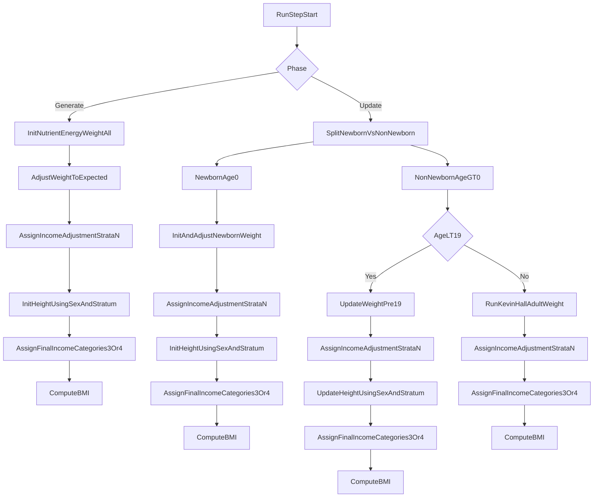

# Height CSV Quintile Integration Plan

## Goal
Support new `height_female.csv` and `height_male.csv` inputs in KevinHall dynamic model config, with either:
- 1 row (`slope`, `std`) broadcast to all adjustment strata, or
- multiple rows mapped by row order to strata `1..N` (`N = adjustment_income_stratum_count`).

Keep existing `HeightSlope` / `HeightStdDev` JSON fields working for backward compatibility.

## Person Lifecycle Walkthrough (with new height quintile logic)

### 1) Start-of-run initialization (`generate_risk_factors`)
- **Current behavior**
  - KevinHall initializes nutrient intake, energy intake, and weight for everyone.
  - Weight is globally adjusted to expected means.
  - Height is initialized from expected height, current weight, sex-specific `HeightSlope`, and sex-specific `HeightStdDev`.
- **With new height CSV**
  - For each person, choose height params by `(sex, income_adjustment_stratum)`:
    - If CSV has `N` rows: use row `stratum_index`.
    - If CSV has `1` row: broadcast that row to all strata.
    - If no CSV: fallback to legacy scalar JSON values.
  - Then compute and store:
    - `Height_residual` using selected `std`.
    - `Height` using selected `slope/std` and weight power mean.
- **Income mapping order to preserve**
  - Use adjustment strata (`adjustment_income_stratum_count`, e.g. 5) for quintile-based height selection.
  - Keep final `person.income` categories from project requirements (`3` or `4`) as downstream output buckets.

### 2) Yearly update (`update_risk_factors`) split by age
- **Newborns (`age == 0`)**
  - Reinitialize nutrient/energy/weight.
  - Apply newborn weight adjustment.
  - Initialize height and KevinHall state.
  - New logic: height params selected by quintile/broadcast fallback before setting height.
- **Children/adolescents (`0 < age < 19`)**
  - Update nutrient/energy/weight with pre-19 branch.
  - Apply scenario adjustment to weight/state.
  - Recompute height (`update_height`) each step.
  - New logic: `update_height` selects stratum-based slope/std before computing height.
- **Adults (`age >= 19`)**
  - Weight evolves through the full Kevin Hall run and scenario adjustment.
  - Height is not in the under-19 update branch.
  - No new height update behavior unless future requirements explicitly extend adult height updates.

### 3) 5-strata adjustment with 4-category output (example)
- If `adjustment_income_stratum_count = 5` and `project_requirements.income.categories = 4`:
  - Assign people into 5 rank-balanced adjustment strata from continuous income.
  - Apply height quintile parameters using those 5 strata.
  - Reassign final reporting income categories to 4 buckets.
  - Outputs/channels remain 4-category, but height assignment benefited from 5-strata resolution.

## Flowchart

## Implementation Steps
- Extend KevinHall dynamic model schema to allow optional CSV file blocks for male/female height parameters in addition to legacy scalar fields.
  - Update [`C:/healthgps/schemas/v2/config/models/kevinhall.json`](C:/healthgps/schemas/v2/config/models/kevinhall.json)
  - Update [`C:/healthgps/schemas/v1/config/models/kevinhall.json`](C:/healthgps/schemas/v1/config/models/kevinhall.json)
- Add parser support for new CSV inputs in KevinHall model loading.
  - Read `HeightCsv.Female` / `HeightCsv.Male` (or final agreed field names) as CSV metadata blocks via existing CSV helpers in [`C:/healthgps/src/HealthGPS.Input/model_parser.cpp`](C:/healthgps/src/HealthGPS.Input/model_parser.cpp).
  - Parse columns `slope` and `std` (row-order mapping).
  - Validate row count:
    - `1` row => broadcast to all adjustment strata.
    - `N` rows => map row `i` to stratum `i+1`.
    - otherwise => validation error.
  - Fallback precedence:
    1. New CSV input if present.
    2. Legacy `HeightSlope`/`HeightStdDev` scalar values if CSV absent.
- Extend KevinHall model definition/runtime data structures to carry either scalar or per-stratum height parameters.
  - Update types in [`C:/healthgps/src/HealthGPS/kevinhall_model.h`](C:/healthgps/src/HealthGPS/kevinhall_model.h) and relevant constructor/definition wiring in [`C:/healthgps/src/HealthGPS.Input/model_parser.cpp`](C:/healthgps/src/HealthGPS.Input/model_parser.cpp).
- Apply height assignment using `income_adjustment_stratum` before final income category remap.
  - Reuse existing stratum assignment pattern (already used by other factor adjustments) from static model flow in [`C:/healthgps/src/HealthGPS/static_linear_model.cpp`](C:/healthgps/src/HealthGPS/static_linear_model.cpp) as behavioral reference.
  - In KevinHall height logic (`generate`/`update` paths), select `slope`/`std` by person’s adjustment stratum when available; otherwise use broadcast/scalar defaults.
  - Preserve downstream final income category behavior (`project_requirements.income.categories`) unchanged.
- Add/adjust tests for both backward compatibility and quintile behavior.
  - Update/add tests near [`C:/healthgps/src/HealthGPS.Tests/KevinHallWeightValidation.Test.cpp`](C:/healthgps/src/HealthGPS.Tests/KevinHallWeightValidation.Test.cpp) and related KevinHall input tests.
  - Cover scenarios:
    - Legacy scalar-only config still produces prior behavior.
    - CSV single-row broadcast works.
    - CSV multi-row row-order mapping works for `N` strata.
    - Invalid row count throws clear error.
    - Mixed male/female CSV content handled independently.
- Update sample config/input-data docs fixture(s) to demonstrate new format while keeping legacy fields in examples for compatibility.
  - Start with KevinHall fixture under [`C:/healthgps/input-data/data/KevinHall_FINCH/dynamic_model.json`](C:/healthgps/input-data/data/KevinHall_FINCH/dynamic_model.json).

## Validation Strategy
- Build and run targeted KevinHall tests.
- Run any config/schema validation tests that exercise KevinHall dynamic model parsing.
- Spot-check one end-to-end run where adjustment strata count differs from final income categories (e.g., 5 -> 4) to confirm height uses stratum values during assignment while outputs remain in configured final categories.