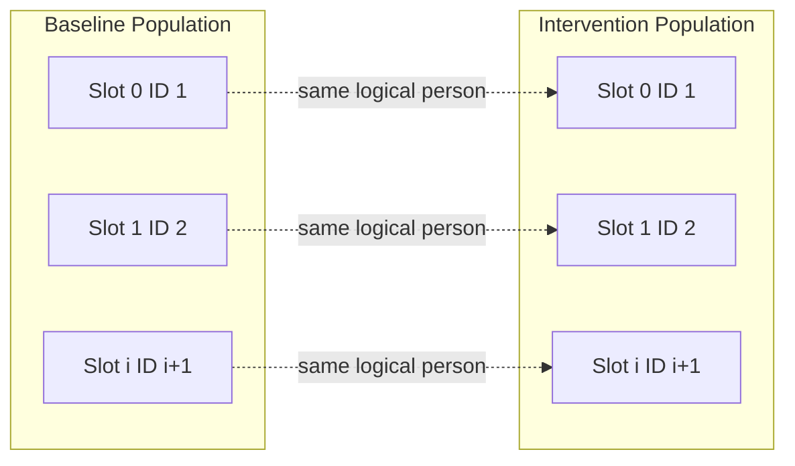
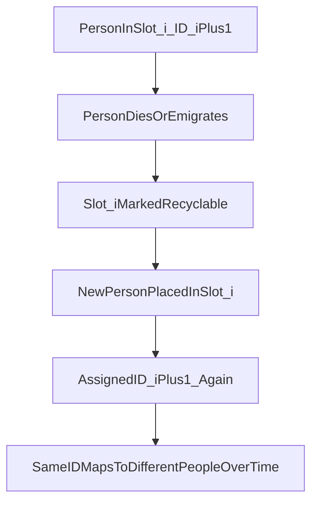
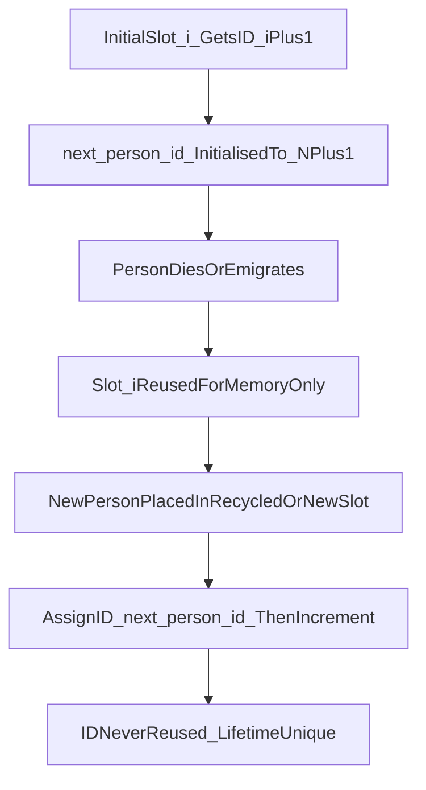
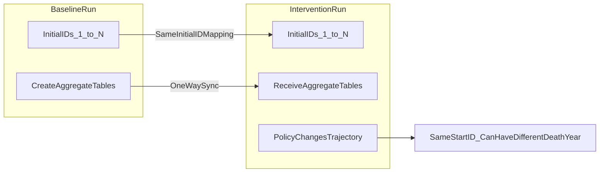
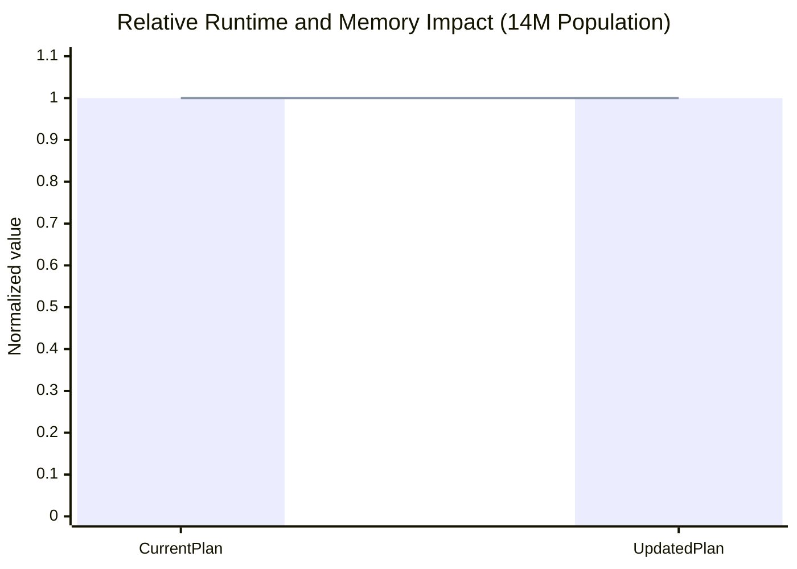

# Same person ID across baseline and intervention

## Goal

Make the same logical person have the **same ID** in both baseline and intervention by deriving ID from **population index** (ID = index + 1) instead of a global counter. This enables tracking individuals across scenarios without breaking existing behaviour.

## Why this is safe

- **Scenario code** (physical_activity, marketing, food_labelling, fiscal): Each scenario holds its own `interventions_book`_ keyed by `entity.id()`. Baseline and intervention are separate Simulation/Scenario instances, so they have separate maps. Same ID in both runs does not cause collision.
- **No global ID key**: No code keys data globally by Person ID across runs; IDs are only used within one population.
- **result_file_writer.cpp** `message.id()` is `ResultEventMessage::id()` (event type enum), not Person ID — no change.

## What data is transferred 
Only aggregate tables, not person-level records:

NetImmigrationMessage = age x gender net migration table
ResidualMortalityMessage = age x gender residual mortality rates
No person object, no ID, no region/ethnicity individual records are transferred between scenarios.

## Design: ID assignment rules

| Context                                      | ID assigned                           |
| -------------------------------------------- | ------------------------------------- |
| Initial population slot `i`                  | `i + 1`                               |
| Newborn replacing slot `i`                   | `i + 1` (slot keeps its ID)           |
| Newborn added via `emplace_back` (new slot)  | `people_.size()` (new index + 1)      |
| Person added via `add()` (immigration clone) | Set to slot index + 1 after placement |

## Implementation plan

### 1. Person ([person.h](src/HealthGPS/person.h), [person.cpp](src/HealthGPS/person.cpp))

- **Add constructors** (MAHIMA):
  - `Person(std::size_t id)` — sets `id_ = id` (for initial population construction).
  - `Person(core::Gender gender, std::size_t id)` — sets gender and `id_ = id` (for newborns).
- **Add** `void set_id(std::size_t id)` — allows Population to assign ID after placing a person (e.g. immigration clone). Document that it is for internal use by Population.
- **Keep** existing `Person()` and `Person(gender)` using `++Person::newUID` so standalone construction (tests, any code outside Population) remains unchanged and tests that expect distinct IDs for sequentially created persons still pass.
- **Comments**: Add a short MAHIMA block at the top of the ID-related section explaining index-based ID for same-person tracking across baseline and intervention.

### 2. Population ([population.h](src/HealthGPS/population.h), [population.cpp](src/HealthGPS/population.cpp))

- **Constructor** (MAHIMA): Replace `people_(size)` (default-constructed Persons) with a loop that creates each person with ID = index + 1:
  - e.g. `people_.reserve(size);` then `for (size_t i = 0; i < size; ++i) people_.emplace_back(i + 1);`
  - Use the new `Person(std::size_t id)` constructor.
- **add_newborn_babies** (MAHIMA):
  - When **replacing** a recycled slot at index `recycle.at(index)`: create `Person(gender, recycle.at(index) + 1)` so the newborn gets that slot’s ID.
  - When **emplace_back** (no recycle): create `Person(gender, people_.size() + 1)` so the new slot gets ID = new index + 1.
- **add** (MAHIMA):
  - After `people_.at(recycle.at(0)) = std::move(person)`: call `people_.at(recycle.at(0)).set_id(recycle.at(0) + 1)`.
  - After `people_.emplace_back(std::move(person))`: call `people_.back().set_id(people_.size())`.
- **Comments**: Add a MAHIMA block above the constructor and above add/add_newborn_babies explaining that IDs are index-based for cross-scenario tracking.

### 3. Tests ([Population.Test.cpp](src/HealthGPS.Tests/Population.Test.cpp))

- **CreateUniquePerson**: Currently expects `p2.id() > p1.id()` and `p1.id() == p3.id()`. `p3` is a reference to `p1`, so the second assertion is unchanged. The first relies on global uniqueness for two standalone `Person{}` — leave as-is (still using newUID).
- **CreateDefaultPerson**: Only checks `p.id() > 0` — still true for newUID.
- **AddSingleNewEntity / AddMultipleNewEntities**: They use `Population(init_size)` and then `add(Person{...})` or `add_newborn_babies(...)`. After our changes:
  - Initial population will have IDs 1..init_size.
  - Added persons will get IDs set by Population (recycled slot ID or new size). No change to test logic required; only IDs may differ from current (still positive and stable per slot).
- Add a **new test** (MAHIMA): e.g. "PersonIdEqualsSlotIndexPlusOne" — create a Population(10), assert `population[i].id() == i + 1` for several indices; add newborns (replace and emplace), assert the replaced slot keeps ID = slot_index + 1 and the new tail has ID = size.

### 4. No changes to

- **Simulation::partial_clone_entity**: Still returns `Person{}` (newUID). When that clone is passed to `population().add()`, Population will assign the correct slot-based ID via `set_id` — no change to this function.
- **DemographicModule**: Only assigns age, gender, region, ethnicity to existing `context.population()[index]`; does not create Person objects.
- **Scenario classes**: They only use `entity.id()` as key within their own map; same ID in baseline and intervention is desired and safe.
- **reset_id()**: Leave in place; can remain unused or used by tests. No need to call it for index-based ID.

### 5. Commenting convention (MAHIMA)

- At each changed site, add a short comment prefixed with `// MAHIMA:` explaining the change.
- In Person and Population, add a small block comment (e.g. before the new constructors and set_id, and above the Population constructor and add/add_newborn_babies) describing that IDs are index-based so that the same logical person has the same ID in baseline and intervention.

## File change summary

| File                                                           | Changes                                                                                                                                         |
| -------------------------------------------------------------- | ----------------------------------------------------------------------------------------------------------------------------------------------- |
| [person.h](src/HealthGPS/person.h)                             | Add `Person(std::size_t id)`, `Person(core::Gender, std::size_t id)`, `void set_id(std::size_t id)`; MAHIMA block for index-based ID.           |
| [person.cpp](src/HealthGPS/person.cpp)                         | Implement new constructors and `set_id`; MAHIMA comments.                                                                                       |
| [population.cpp](src/HealthGPS/population.cpp)                 | Constructor: build vector with `Person(i+1)`; add_newborn_babies: use ID = slot+1 or size+1; add: call set_id after placement; MAHIMA comments. |
| [Population.Test.cpp](src/HealthGPS.Tests/Population.Test.cpp) | Add test verifying ID == index + 1 for initial and after add/newborns; MAHIMA comment.                                                          |

## Order of implementation

1. Person: add constructors and `set_id`, with comments.
2. Population: constructor, then add_newborn_babies, then add, with comments.
3. Run existing tests; fix any that assume previous ID behaviour (only Population tests might need a new case).
4. Add the new Population test for index-based ID.

---

## Update: Lifetime-unique ID strategy (no ID reuse after death/emigration)

### Why this update is needed

The implemented slot-based rule (`ID = slot index + 1`) achieved baseline/intervention alignment
for initial people, but it also reuses IDs when dead/emigrated slots are recycled. That allows one
ID to represent multiple different people over time (e.g. changed sex/age/region/ethnicity in
tracking), which breaks lifetime person identity.

### Updated objective

- Keep baseline/intervention comparability for the initial cohort.
- Ensure each person gets a unique ID for their lifetime within a run.
- Never reuse a dead/emigrated person ID.
- Preserve runtime and memory efficiency.

### Updated design (minimal changes)

1. Keep initial population IDs deterministic and aligned across scenarios:
   - Initial slot `i` still gets ID `i + 1`.
2. Add a Population-owned monotonic counter:
   - `next_person_id_` in `Population` private state.
   - Initialise to `initial_size + 1` after population construction.
3. For all post-initial entrants (newborns and `add()` entities):
   - Assign `ID = next_person_id_++` regardless of recycled or appended slot.
4. Continue slot recycling for memory efficiency:
   - Reuse memory slots, not person IDs.

### Why this preserves performance

- **Runtime:** still O(1) ID assignment (one increment + assignment per new entity).
- **Memory:** one extra `std::size_t` per `Population` object (negligible).
- **No extra maps/sets/lookups**, so no added per-entity search or hash overhead.

### Baseline/intervention compatibility after update

- Initial individuals still align by ID across baseline and intervention (`1..N`).
- IDs for births/immigration remain unique and non-reused within each scenario run.
- Existing scenario event logic remains valid since it already treats `entity.id()` as opaque key.

### Delta to implementation steps

#### 1) Population only (primary behavior change)

- **[population.h](src/HealthGPS/population.h)**
  - Add `std::size_t next_person_id_{1};` private member.

- **[population.cpp](src/HealthGPS/population.cpp)**
  - Constructor:
    - Keep initial construction with `Person(i + 1)`.
    - Set `next_person_id_ = size + 1`.
  - `add(Person, time)`:
    - After placing person in recycled slot or push-back slot, call
      `set_id(next_person_id_++)` (not slot index based).
  - `add_newborn_babies(number, gender, time)`:
    - On both recycled-slot and append paths, assign IDs from `next_person_id_++`.

#### 2) Person

- No new API required beyond existing `set_id` and constructors.
- Keep current `Person{}` and `Person(gender)` behavior unchanged.

#### 3) Tests update

- **[Population.Test.cpp](src/HealthGPS.Tests/Population.Test.cpp)**
  - Replace/extend slot-based ID assertions to lifetime-unique assertions:
    - Initial IDs are deterministic (`1..init_size`).
    - Recycled-slot replacement gets a fresh new ID (not old slot ID).
    - IDs are never duplicated in the exercised sequence.

### Validation checklist (updated)

1. Run `Population.Test` and ensure lifetime-unique assertions pass.
2. Run targeted simulation/analysis tests covering individual tracking output.
3. Smoke-check individual tracking CSV:
   - Same ID should not switch to a different person profile due to slot recycling.
4. Confirm no changes to scenario sync behavior between baseline/intervention.

### Summary of why this is better than current implemented version

- Fixes the observed bug where one ID can change demographic identity over time.
- Maintains cross-scenario comparability for the initial matched population.
- Keeps memory reuse and near-identical runtime characteristics.
- Achieves the intended semantics: **slot reuse allowed, ID reuse forbidden**.

## Additional clarifications from review Q&A

### 1) What if a person is alive in intervention but dead in baseline?

This is valid and expected. Baseline and intervention are separate simulation populations; a shared
starting ID means "same initial person for comparison", not "forced identical life outcome". Policy
effects can keep someone alive in intervention while baseline has death for the matched starting ID.

### 2) Is scenario data transfer one-way only?

Yes. Synchronisation is baseline -> intervention only. Intervention receives baseline-generated
aggregate synchronisation tables; intervention does not send these back to baseline.

### 3) What data is transferred across scenarios?

Only aggregate tables, never person-level records:

- `NetImmigrationMessage`: age x gender net migration table.
- `ResidualMortalityMessage`: age x gender residual mortality table.

No person object, no person ID, no region/ethnicity per-person payload is transferred.

## Before vs updated behavior flowcharts

### Before (implemented slot-based ID reuse)

### Updated (lifetime-unique IDs with slot reuse only)

### Baseline/intervention sync and divergence model

## Runtime and memory impact at large scale (14 million people)

### Assumptions for this estimate

- We compare **current slot-based ID assignment** vs **updated monotonic counter assignment**.
- Both designs keep slot recycling, same person object size, same module order.
- Only extra state in updated design: one `std::size_t next_person_id_` per `Population`.

### Complexity impact

- Old assignment: O(1) write per new person.
- Updated assignment: O(1) increment + write per new person.
- Asymptotic runtime and memory are unchanged.

### Memory delta for 14M population

- Additional memory is **constant**, not proportional to number of people:
  - `+ sizeof(std::size_t)` (typically 8 bytes) per `Population` object.
- Approximate delta:
  - Baseline run population object: +8 bytes.
  - Intervention run population object: +8 bytes.
  - Combined additional working memory: about **16 bytes** total (typical 64-bit build).

### Runtime effect estimate (relative)

- Additional operation per newly added entity: one integer increment.
- Expected wall-time impact is negligible versus existing demographic/risk/disease updates.
- Practical expectation at 14M scale: near-0% change in overall runtime, while fixing identity
  correctness.

### Relative impact plot (normalized)

Notes:
- Bar = normalized runtime (effectively unchanged at this resolution).
- Line = normalized extra memory factor (tiny constant increase shown illustratively).
