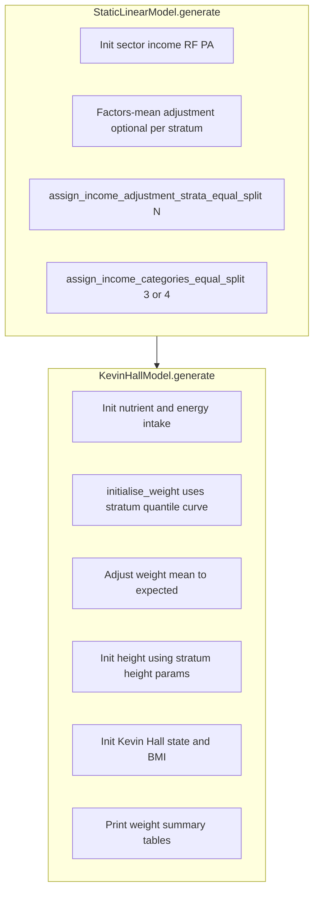
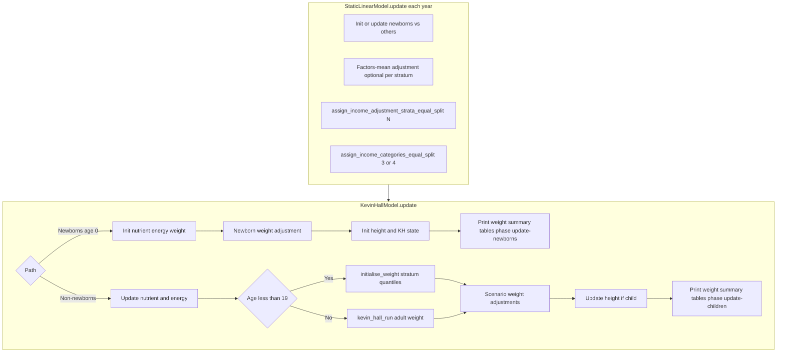

# Weight quantiles by income adjustment stratum

## Goal

- Keep **legacy** `WeightQuantiles.Female` / `Male` as a single `csv_file` (e.g. `weight_quantiles_NCDRisk_female.csv`).
- Add **stratum files**: `Female.Quintile1` → `weight_quantiles_NCDRisk_female_quintile1.csv`, and the same for Male.
- At **weight assignment**, use `person.income_adjustment_stratum` (from `adjustment_income_stratum_count` rank buckets) to choose which quantile curve to use—the same idea as height via `resolve_height_params_for_person` in [kevin_hall_model.cpp](src/HealthGPS/kevin_hall_model.cpp).
- **Final reporting income** stays on `project_requirements.income.categories` (`"3"` or `"4"`) on `person.income`; that does not change.

Example: 5 adjustment strata for factors-mean / weight curves, 4 categories in ProjectRequirements for output.

## Pipeline order (static before dynamic)

[RiskFactorModule](src/HealthGPS/riskfactor.cpp) always runs **static** then **Kevin Hall**. So when `initialise_weight` runs, the static model has already assigned `income_adjustment_stratum` and remapped `person.income` to 3 or 4 categories ([static_linear_model.cpp](src/HealthGPS/static_linear_model.cpp) ~786–905).

## Lifecycle — initialize (`generate_risk_factors`)

Applies on run start (first simulation year). Static completes stratum assignment and final income categories **before** Kevin Hall touches weight.



**Weight-specific step:** `initialise_weight` resolves the quantile vector for `(gender, income_adjustment_stratum)` (or index 0 if no stratum flag), then applies the existing E/PA → weight quantile logic (~873–908).

## Lifecycle — update (`update_risk_factors`)

Runs each simulation year. Static runs first again (strata can refresh from updated continuous income); then Kevin Hall updates weight/height.



**Note:** Adults (`age >= 19`) do not re-run `initialise_weight` each year; stratum-based quantiles matter most at init and for children. Console tables still run on update paths so we can confirm strata and weights wherever weight was set in that step.

## Config and schema

**Files:** [schemas/v2/config/models/kevinhall.json](schemas/v2/config/models/kevinhall.json), [schemas/v1/config/models/kevinhall.json](schemas/v1/config/models/kevinhall.json)

For `WeightQuantiles.Female` and `.Male`, use **`oneOf`**:

1. Legacy — `$ref` to `csv_file.json`
2. Stratum — object with `Quintile1`, `Quintile2`, … each a `csv_file` block

**New format example:**

```json
"WeightQuantiles": {
  "Female": {
    "Quintile1": { "name": "weight_quantiles_NCDRisk_female_quintile1.csv", "format": "csv", ... },
    "Quintile2": { ... }
  },
  "Male": { ... }
}
```

**Legacy (unchanged):**

```json
"Female": { "name": "weight_quantiles_NCDRisk_female.csv", "format": "csv", ... }
```

### Why list each quintile in JSON (vs something shorter)

This is the approach to use unless requirements change later.

| Approach | Config effort | Tradeoff |
|----------|---------------|----------|
| **Explicit `Quintile1`…`N` (chosen)** | Repeat `format` / `delimiter` / `columns` per file (or copy-paste blocks) | Same pattern as factors-mean strata in [examples/config_skeleton.json](examples/config_skeleton.json); schema can validate each file; wrong or missing file fails at load with a clear path |
| **Name pattern** e.g. `…_quintile{n}.csv`, N from `adjustment_income_stratum_count` | One block per gender, fewer lines | Assumes rigid filenames; harder to mix non-standard names or skip a stratum |
| **Ordered `files` array** | List filenames once, shared format on parent | Slightly shorter JSON, but still N filenames; new schema shape |
| **Directory glob** | Almost nothing in JSON | Fragile ordering, accidental extra CSVs, weak validation |

**Practical tip:** For FINCH, duplicate the existing `Female` / `Male` csv block five times, change `name` to `_quintile1` … `_quintile5`, and nest under `Quintile1` … `Quintile5`. No magic paths—the filenames in JSON are exactly what get loaded.

Factors-mean quintiles stay in **config.json** (`baseline_adjustments.income_stratum_factors_mean.strata`); weight quantiles stay in **dynamic_model.json** because Kevin Hall already owns `WeightQuantiles` there today.

Update [dynamic_model.json](input-data/data/KevinHall_FINCH/dynamic_model.json) when quintile CSVs are in the data folder.

## Parser ([model_parser.cpp](src/HealthGPS.Input/model_parser.cpp))

Replace the flat load at ~1864–1883 with a helper similar to Height (~1901–1937):

| Config input | `adjustment_income_stratum_count` | Loaded shape per gender |
|--------------|-----------------------------------|-------------------------|
| Single `csv_file` | any | One vector; broadcast to N if stratum mode on and N > 1 |
| `Quintile1`…`QuintileN` | N | N vectors; error if file count ≠ N |
| Wrong count | — | Parse error with file count vs expected N |

- Load each file: `load_datatable_from_csv`, first column `double`, sort once at load.
- Order quintile keys numerically (`Quintile1`, `Quintile2`, …).
- Read `config.modelling.baseline_adjustment.income_stratum_factors_mean` for `enabled` and `adjustment_income_stratum_count` (same as height ~1897–1899).
- If multiple quintile files are configured but stratum adjustment is disabled, fail at parse time.

## Runtime ([kevin_hall_model.h](src/HealthGPS/kevin_hall_model.h) / [kevin_hall_model.cpp](src/HealthGPS/kevin_hall_model.cpp))

**Storage** (mirror `height_params_`):

```cpp
std::unordered_map<core::Gender, std::vector<std::vector<double>>> weight_quantiles_by_stratum_;
```

**Logic:**

1. `resolve_weight_quantiles_for_person` — same rules as height (~69–85): stratum index when `has_income_adjustment_stratum`, else index 0.
2. `get_weight_quantile(epa_quantile, const std::vector<double>& quantiles)` — no per-person allocation; quantiles already sorted at load.
3. `initialise_weight` — resolve stratum vector, then existing EPA percentile → weight quantile math (~1027–1038).

**Performance:** I/O and sorting only at load; per person stays O(log n) on `epa_quantiles_` plus O(1) index into the stratum vector.

## Console output tables (required)

Mirror the height helpers in [kevin_hall_model.cpp](src/HealthGPS/kevin_hall_model.cpp) (~87–225, ~1176–1194). Not optional—needed to verify stratum weight assignment in the log.

**Gating** — reuse the same policy as `should_print_height_summary_tables` (~49–58):

- Baseline scenario only
- Start year and start year + 1 only (avoid flooding long runs)

**Table 1 — `[WEIGHT STRATUM ASSIGNMENT]`** (by adjustment stratum)

Modeled on `print_height_stratum_assignment_table`:

| Column | Content |
|--------|---------|
| Bucket | `person.income_adjustment_stratum` (0..N-1) |
| Stratum ID | `Quintile1` … `QuintileN` |
| Count | Active people in bucket |
| Quantile size | Number of values loaded for that stratum (sanity check) |
| Weight Min / Max / Mean | From `person.risk_factors["Weight"]` after assignment in that step |

Header note: uses `person.income_adjustment_stratum` from static model.

**Table 2 — `[WEIGHT BY FINAL INCOME CATEGORY]`** (by output income)

Modeled on `print_height_by_final_income_category_table`:

| Column | Content |
|--------|---------|
| Category | Low / LowerMid / UpperMid / High (4) or Low / Middle / High (3) |
| Count | People in `person.income` category |
| Weight Min / Max / Mean | After assignment |

Header note: `person.income` from ProjectRequirements categories after static remapping.

**Call sites** — add `print_weight_summary_tables(context, phase)` alongside existing height printing:

| Phase string | When |
|--------------|------|
| `generate` | End of `generate_risk_factors` (~291) |
| `update-newborns` | End of `update_newborns` (~370) |
| `update-children` | End of `update_non_newborns` child path (~441) |

`bucket_count` for the stratum table: max loaded stratum count across genders (same as height ~1182–1186).

## Tests

In [KevinHallHeight.Test.cpp](src/HealthGPS.Tests/KevinHallHeight.Test.cpp) and/or [KevinHallWeightValidation.Test.cpp](src/HealthGPS.Tests/KevinHallWeightValidation.Test.cpp):

- Legacy single-file config still parses and runs
- Five quintile files with `adjustment_income_stratum_count = 5`
- Single file broadcast when N = 5
- File count mismatch throws a clear error
- Two people, same EPA quantile, different strata → different weights
- Console output contains `[WEIGHT STRATUM ASSIGNMENT]` and `Quintile1` when tables are enabled (capture stdout like height tests ~542)

## Docs

Short note in `Technical Documentations/weight_quantiles_quintile_plan.md` with config examples, both lifecycle diagrams, and table format—aligned with [height_csv_quintile_plan.md](Technical%20Documentations/height_csv_quintile_plan.md).

## Out of scope

- Changing static income rebucketing
- Multi-row single CSV per gender (nested quintile files only)
- Generating production quintile CSVs (tests use small fixtures)
