## Global Health Policy Simulation model

| [Home](index) | [Quick Start](getstarted) | [User Guide](userguide) | Software Architecture | [Data Model](datamodel) | [Developer Guide](development) | [API](api/index.html) |

# Software Architecture

The Health-GPS software architecture adopts a modular design approach to provide the building blocks necessary to compose the microsimulation, which is written in modern, standard ANSI [C++20][cpp20] and using object-oriented principles for software development. The software application is open source, cross-platform,  and comprises of four main components:

|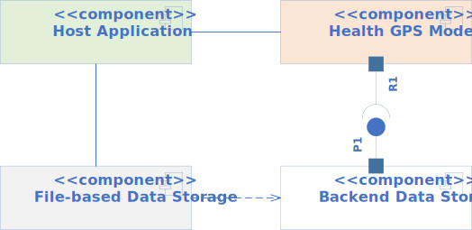|
|:--:|
|*Health-GPS Microsimulation Components*|

- ***Host Application*** - responsible for parsing the user’s inputs via a configuration file, initialise the supporting infrastructure, compose the Health-GPS instance by assembling the required modules, running the experiment, and collect the results. This component is provided as a console terminal application, but can equality be a graphical user interface (GUI) or web page.
- ***Health-GPS Model*** - defines the microsimulation engine, executive, core modules and algorithms used to create the virtual population, simulate over time, and produce results.
- ***Backend Data Storage*** - provides an interface (`Data API`) and persistence-agnostic data types (plain old class object - POCO) as required to initialise the internal modules. This component is a contract for all concrete implementations that manage the storage and access of datasets.
- ***File-base Data Storage*** - implements the `Data API` interface using a *file-based* storage to provide the modules’ required data. This component can be replaced by a different storage type, e.g., database, without affecting the Health-GPS model ecosystem.

These components along with the physical data storage are the *minimum package* to deploy and use the Health-GPS microsimulation. All input data processing, model parameters fitting, and results analysis procedures are carried out *outside* the microsimulation using tools such R, Julia and Python which are very efficient in data wrangling, statistical analysis, and machine learning algorithms.

The Health-GPS framework adopts a modular design to specify the building blocks necessary to compose the overall system, several modules and sub-model types are required as shown below.

||
|:--:|
|*High-level Architecture of the Health-GPS Framework*|

- ***Inputs*** – provides additional datasets, models hierarchy definition, fitted parameters, diseases selection, intervention scenario and simulation run-time settings.
- ***Host Application*** – process the user’s inputs, initialise the required infrastructure, create the microsimulation instance, run the experiment, collect, and write results to the output file.
- ***Data Storage*** - contains the datasets in a consistent format as required by all simulation modules not externally fitted by the user. The data in storage comes from multiple sources and have already been externally processed, smoothly interpolated missing information to conform with the required data format. The datastore uses [ISO 3166](https://www.iso.org/iso-3166-country-codes.html)  country code to index the datasets by country and stores information on birth and death rates by age and gender, total population, relative risks for risk factors-diseases associations, epidemiological rates for most countries by age and gender, and disability weights. New datasets can be added without code change.
- ***Risk Factors Module*** – represents the generic factors hierarchy as defined by the user to generate the dynamic equations with respective parameters fitted to a dataset, e.g., survey. Their values provide additional properties to individuals within the virtual population and are continuously updated throughout the simulation based on the derived equations. There are two types of hierarchical models: *static* used only during individual’s initialisation, and *dynamic* which includes a dynamic factor, time (year), and is used during subsequent individual’s risks updates.
- ***SES Module*** – defines the virtual population individuals’ socio-economic status properties such as education and income to represent their relative importance as determinants of health by gender and age. These properties values can be updated throughout the simulation.
- ***Demographics Module*** – defines the population of interest to be simulated, providing historic and projected indicators of a country’s population size, age, and gender. Their values are used to create the initial virtual population, the building blocks of the simulation holding vital information about virtual individuals such as age, gender, education, income, risk factors exposures and comorbidities. The module also provided indicators on a country’s population birth and death rates, which is used throughout the simulation to update the individuals’ life cycle.
- ***Diseases Module*** – holds the collection of diseases sub-models selected by the user. The definition of diseases is data driven, the design provides a reusable generic interface to represent diseases epidemiological rates and relative risks for risk factors-diseases associations; and update individual’s disease status based on their risk factors exposures.
- ***Burden of Diseases Module*** – collects statistical indicators about the simulated population, calculates diseases prevalence, risk factors exposure, and standardised metrics such as YLL, YLD, DALY, and publish the results to the outside world asynchronously via messaging.
- ***Intervention Module*** – defines the alternative scenario used to update risk factors distributions based on the intervention’s population targets and parameters. Interventions are designed specifically to study a particular scenario and may require new data formats and additional module in code.
- ***Health-GPS*** - the core of the microsimulation engine. It holds all the other modules instances and state machine to run a full simulation, dictating the calling order of each module during initialisation and multiple update steps to completion, and notify progress via messaging.
- ***Output*** – the collection of results published by the simulation (Analysis Module) at the end of each time step and written to a file in disk, JSON format, by the Host Application to be analysed by the user externally to draw conclusions about the simulated experiment. An alternative to writing the results to a file in disk, is to use a message broker, e.g., [RabbitMQ][broker], or a distributed event streaming platform such as [Apache Kafka][kafka] to distribute the messages and enable parallel analysis of results while the simulation is running by an external application.

The *simulation engine* clock and events scheduling is based on the *Discrete Event System Specification* ([DEVS][devs]) and provided by the [ADEVS][adevs] library. The simulation results are streamed asynchronous to the outside world via the *message bus* instance provided to the model by the *host application* during initialisation.

The software architecture defines interfaces for modules, sub-models, and external communication; these abstractions provide decoupling, reuse, and flexibility for composing the microsimulation to answer different research questions. All modules share a common interface, as shown below, to enable dynamic registration of different modules version using a *factory pattern*, which also makes available the underline data infrastructure and user inputs for module instance creation.

|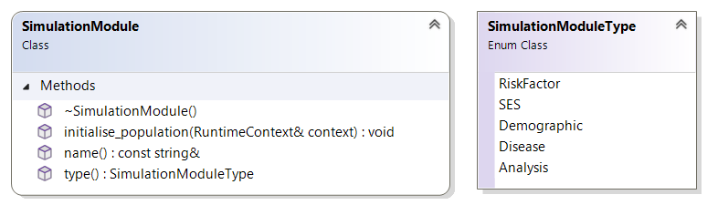|
|:--:|
|*Simulation Module Common Interface*|

The *simulation module type* enumeration is used by the microsimulation engine to request the correct simulation module type implementation from the Module Factory, which uses the same enumeration for registration of the module builder functions required to be defined by each concrete implementation of a simulation module interface as shown below. The *RuntimeContext* data structure, used as parameter, is created by the simulation engine to store the virtual population, share the policy scenario, run-time information, e.g., current run number and time, and common infrastructure such as random number generator, message bus and model settings with all modules during calls via the public interface.

|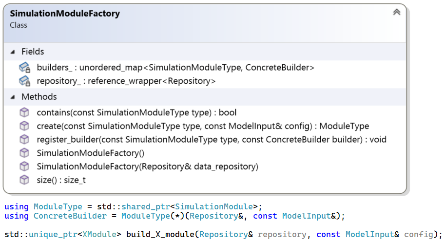|
|:--:|
|*Module Factory Class Diagram with Concrete Builder Function example*|

The *module builder* functions have access to both the model inputs and backend data storage (Repository) when requested to create the respective simulation module instance. The *Repository* interface shown below, provides read-only access to external datasets loaded via configuration to parameterise the risk factor module, and exposes the `Datastore` interface implementation instance. The factory registered module builders can retrieve the required raw data, reshape, and combine to create the respective module parameters definition and instance.

|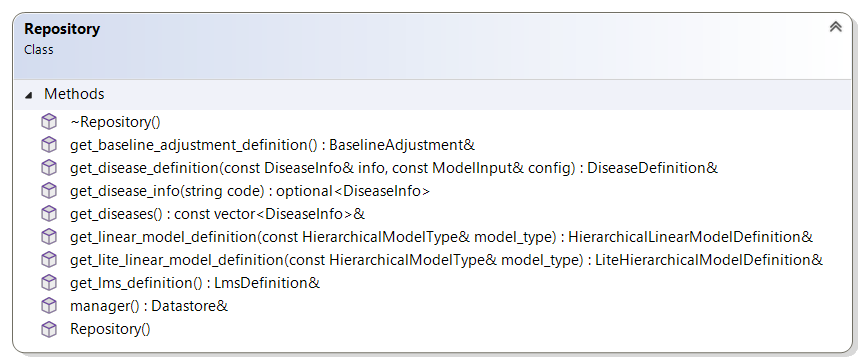|
|:--:|
|*Data Repository Interface Diagram*|

This minimalistic design exposes the available datasets to the factory module builder functions, ultimately responsible for creating fully working module instances when requested. The requirement to evaluate *baseline* and *intervention* scenarios together as discussed later, provides an opportunity to extend the design to support caching of read-only modules parametrisation to share between the two scenarios. This optimisation would minimise backend I/O and memory usage, at the expense of introduced coupling between the repository and modules parameter.

The *backend data storage* interface shown below, defines the contract, the *Data API* abstraction providing Health-GPS a uniform data easy access layer to the physical backend storage, with strong typing, and fully agnostic of implementation.

||
|:--:|
|*Backend Data API Interface*|

> See [Data Model](datamodel) for the backend *data model*.definition.

To take the ***virtual population*** through time, the simulation modules have different requirements, and consequently the simulation module interface has been extended with new properties and operations to satisfy the different modules as shown below.

|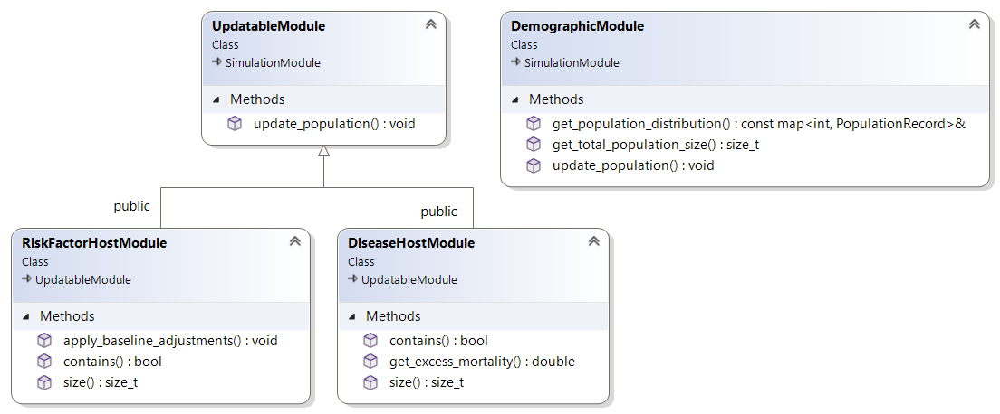|
|:--:|
|*Extended Simulation Module Common Interface*|

All modules must initialise the virtual population at the beginning of the simulation and update the respective properties at each subsequent simulated time step until the simulation ends. Modules providing additional functionality to the simulation algorithm such as population trends and disease indicators have specific extension added to their interfaces.

The two *host modules*, risk factor and disease respectively, are special containers for similar *sub-models* and likewise are responsible for managing the creation, ownership and execution order when requested by the simulation engine or other modules.

The *risk factor* module hosts hierarchical linear models defined and fitted to data by the user; and provided to the host application in the configuration file. The *hierarchical linear model* interface below defines the two types of models as previously described: *Static* and *Dynamic*, the first is used to initialise the population, and the second to update the population’s dynamics respectively.

|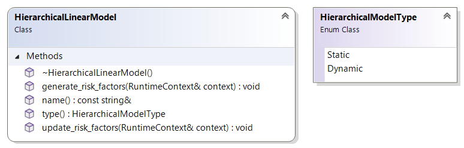|
|:--:|
|*Hierarchical Linear Model Common Interface*|

The *disease* module hosts multiple instances of disease models from known groups, configured for different diseases definition. The disease model public interface is shown below; diseases are uniquely identified by type, two groups of diseases a current modelled: *others* and *cancers*, the first represents general noncommunicable diseases, and the second types of cancer respectively.

|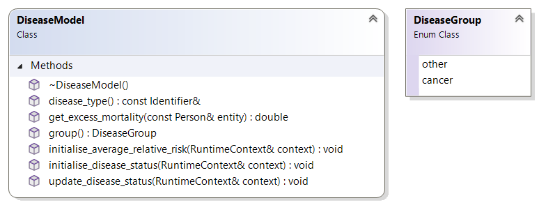|
|:--:|
|*Disease Model Common Interface*|

The main difference between the two groups of diseases is on internal modelling, both groups’ definition is country-based and include rates for disease: prevalence, incidence, mortality and remission by age and gender; and relative risks for diseases and risk factors. However, cancers detection, mortality and remission are modelled differently from the others’ group and require an additional set of parameters data to be provided as part of the definition.

## Virtual Population

All modules act on a *virtual population* of entities, individuals, or actors, that are the centre of the microsimulation model. The Health-GPS population is dynamic and changes over time with births, deaths and immigration being the events affecting the population size. The entire population is stored using a C++ standard library vector&lt;T> for dynamic memory management and exception safety, the vector is protected with the thin wrapper for easy access.

Below are the class diagrams for the thin *Population* wrapper, the virtual *Person* data structure and associated types as used to represent individuals within the simulated virtual population.

|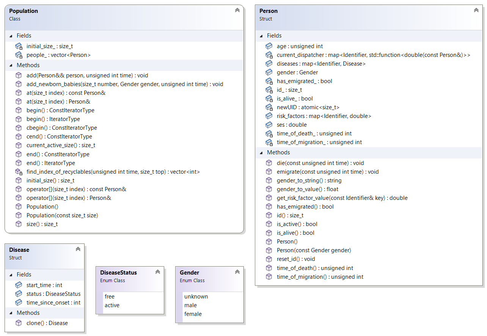|
|:--:|
|*Virtual Population’s Entity definition*|

Individual are given a unique identifier number at creation, contains trivial properties
and flags, and dynamic properties for representing diseases and risk factors values as
follows:

- ***id*** - autogenerated unique identifier number, population only, not globally unique.
- ***age*** - current age of the individual, zero for new-borns, and updated at each time step.
- ***gender*** - enumeration of the individual gender given at initialisation and never changes.
- ***is_alive*** - flag indicating whether the individual’s alive status in the population, default true.
- ***time_of_death*** - holders the time (simulation time) when the individual died, is_alive = false.
- ***has_emigrated*** - flag indicating whether the individual has emigrated the population, default false.
- ***ses*** - the individual’s socio-economic status (SES), a proxy value combining education and income, assigned at initialisation or birth, and stays constant over time.
- ***risk_factors*** - hold a dynamic the list of risk factor values, key/value pairs, associated with the individual. The list is populated with all risk factors during initialisation and values are updated continuously during the simulation.
- ***diseases*** - hold a dynamic list of diseases, key/value pairs, that at least once affected the individual. Absent from the list means that the individual never had the disease.

The *Disease* type stores the diseases' value, status: *Active*, indicates that the individual current has the disease; *Free*, the individual had the disease, but is now free (remission). The *start_time* value holds the time (simulation time) when the individual was diagnosed with the disease, and the *time_since_onset* holds the onset time of the disease at diagnose, used for cancers only.

Helper methods are provided for easy access, for instance the `is_active` method checks all the *status flags* to indicate whether an individual is current in the simulation; and the `get_risk_factor_value` method handle the complex access to the dynamic properties.

# Simulation Engine

The *simulation engine* is responsible for managing the simulation clock, events scheduling and simulation execution order. The Health-GPS engine is based on the *Discrete Event System Specification* ([DEVS][devs]) and provided by the [ADEVS][adevs] library. DEVS formalism is a system-theoretic concept that represents inputs, states, and outputs, like a *state machine*, but with the critical addition of a time-advance function. This combination enables DEVS models to represent discrete event systems, agent-based systems as well as hybrids with continuous components in a straightforward manner. Health-GPS describes a discrete event dynamic system, which can be advantageously represented as DEVS models for greater generality, clarity, and flexibility.

The DEVS model has been abstracted behind the `Simulation` base class, which defines the Health-GPS simulation engine shown below, it adds extensions to support this specific workflow, and stores the `SimulationDefinition` data structure containing the minimum information required to create a simulation. The pseudorandom number generator functionality required by the model is defined by the `RandomBitGenerator` interface, algorithms for generating sequence of numbers can be implemented and easily used by the simulation engine at runtime.

|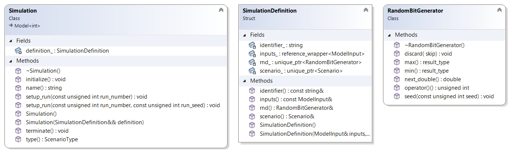|
|:--:|
|*Health-GPS Simulation Engine Interface*|

The default implementation of the `Simulation` interface, the *simulation engine*, is provided by the `HealthGPS` class shown below. The *simulation engine* requests the module factory to create all the required modules type instances during construction. The engine owns the module instances created by the factory and has full control over the duration of each run and time step advancements during its lifespan. The `RuntimeContext` data structure is created by the *Health-GPS engine* during construction to store the virtual population, and share common infrastructure, runtime information, and model settings with modules via calls to the public interface.

|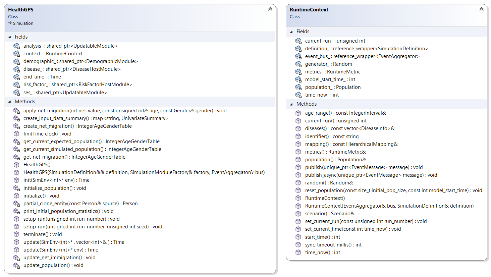|
|:--:|
|*Health-GPS Simulation Engine*|

The engine enables communication with the outside world to update on progress, report errors, and publish simulation results via messaging, the `EventAggregator` and `EventSubscriber` interfaces define the required functionality that a concrete Message Bus implementation must provide as shown below. Four types of messages are current defined, however new messages can easily be added by extending the `EventMessage` interface, a single message is broadcasted to one or more subscribers.

|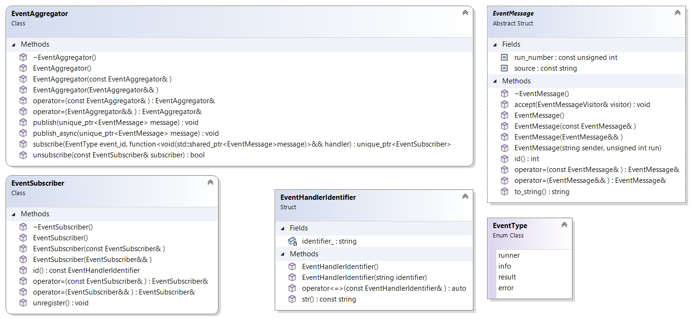|
|:--:|
|*Health-GPS Message Bus Interface*|

A concrete *message bus* instance is provided to the *Health-GPS engine* during construction and exposed by the `RuntimeContext` via the *publish* method to streamline usage. Messages can be sent *synchronous* or *asynchronous*, depending on specific requirements, for example, *error* messages need immediate attention before continuing, usually synchronous; while notification messages are typically queued before processing, may be asynchronous.

The *simulation engine* internal workflow shown below, highlights the main algorithms executed during the Health-GPS engine instance lifecycle, experiment scenario evaluation, and a single simulation run respectively. The number of simulation replications or runs required by an experiment is controlled externally by the *simulation executive*, which uses the same engine instance to complete multiple runs of the same scenario.

|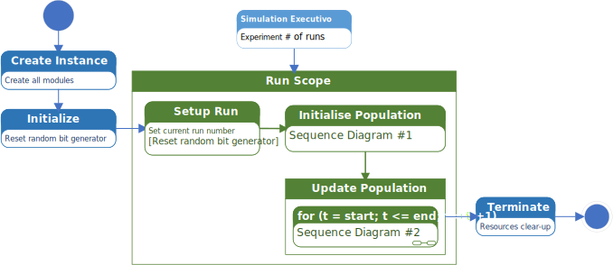|
|:--:|
|*Health-GPS Simulation Engine Workflow*|

The order of execution of each module and provision of parameters for each call is the responsibility of the simulation engine algorithm. The same random number generator instance is used throughout the simulation, the generator is initialised during the *Initialise* step, users can optionally provide a fixed seed to initialise the generator for reproducibility. This initialisation is sufficient for experiment with only *baseline* scenario, however experiments with *baseline* and *intervention* scenarios being evaluated together, the random number generator is reset before each run by the simulation executive to ensure reproducibility. The simulation engine consists of two main algorithms to *initialise* and *update* the virtual population over time respectively.

## Initialise Population

Creating and initialising the virtual population is the first step of a simulation run, below is the sequence diagram showing the events and order of activation of the different modules by the Health-GPS algorithm.

|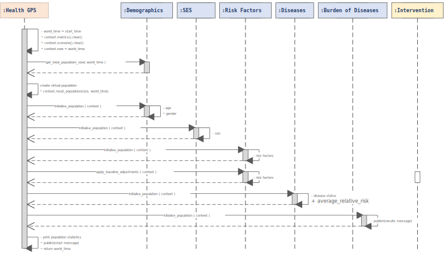|
|:--:|
|*Initialise Population Algorithm (Sequence Diagram #1)*|

The algorithm sets the simulation world clock, in years, to the user’s defined start time, and uses the simulation module interface to request each module to initialise the relevant properties of the virtual population individuals.

## Update Population

The update population algorithm is the heart of the Health-GPS microsimulation, the sequence of events and order of activation for different modules during each time step update of the simulation is shown below. The algorithm moves the simulation clock, in years, forwards until the user’s defined end time is reached, at which point the algorithm terminates, finishing the run.

|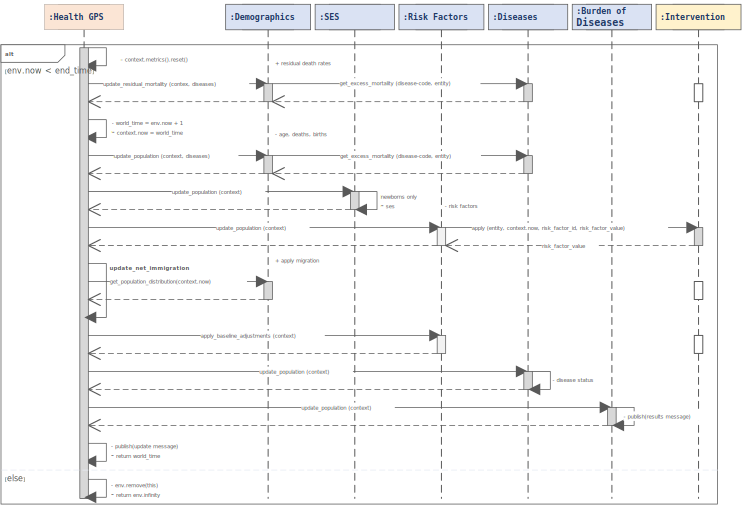|
|:--:|
|*Update Population Algorithm (Sequence Diagram #2)*|

The empty squares in the Scenario timeline highlight data synchronisation points between the baseline and intervention scenarios, see next section for details.

# Policy Scenarios

Each simulation instance must have a single policy scenario associated as part of the experiment, the scenarios common interface definition is shown below. There are wwo types of scenarios are supported: ***Baseline*** to define the trends in the observed population to measure outcomes against; and ***Intervention*** for policies designed to change the observed trends during a specific time frame.

|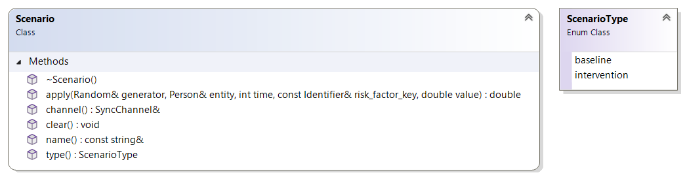|
|:--:|
|*Policy Scenario Common Interface*|

Policy scenario is not a typical module, their implementation consists of a single function that is invoked with the information required for it to act: the individual, current time, the risk factor key, and risk factor value. The baseline scenario implementation simply loopback the *risk factor value* without making any change, independent of arguments, while the intervention scenarios definition might consist of external data, complex rules, and specific time frame to act upon invocation.

The current modelling of intervention scenario requires data synchronisation between the *baseline* and *intervention* scenarios at multiple points, resulting on pairs of simulations being evaluated at a time, instead of independently. The figure below illustrates the present solution, based on shared memory to work on a single machine, it creates a unidirectional channel to send messages, asynchronous, from baseline to intervention scenarios. At the receiving end, the channel is synchronous, blocking until the message arrives or a pre-defined time expires, forcing the experiment to terminate.

|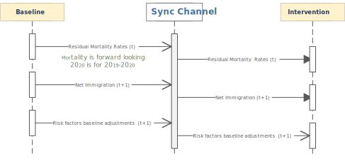|
|:--:|
|*Policy Scenario’s Data Synchronisation Mechanism*|

An alternative to this design is to use a message broker, e.g., [RabbitMQ][broker], or a distributed event streaming platform such as [Apache Kafka][kafka] to distribute random generator seeds and messages over a network of computers running in pairs to scale-up the model’s virtual population size and throughput. This solution would allow for a single baseline scenario data to be shared by multiple intervention scenarios, marked reducing the requirement for simulation pair coupling.

# Simulation Executive

The *simulation executive* creates the simulation running environment, instructs the *simulation engine* to evaluate the experiment scenarios for a pre-defined number of runs, manage master seeds generation, notify progress, and handle experiment for cancellation. The `ModelRunner` class shown below, implements the *Health-GPS simulation executive*.

|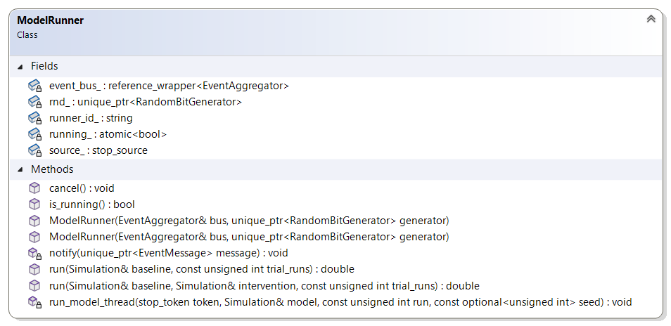|
|:--:|
|*Simulation Executive Class Diagram*|

Two modes of evaluating a simulation experiment as provided by the simulation executive, using the *run* function with overloaded parameters. The two  paths of execution are illustration below, the first simulates *no-intervention*, baseline scenario only experiments, while the second simulates *intervention* experiments with baseline and intervention scenarios evaluated as a pair, and data synchronisation as described above.

|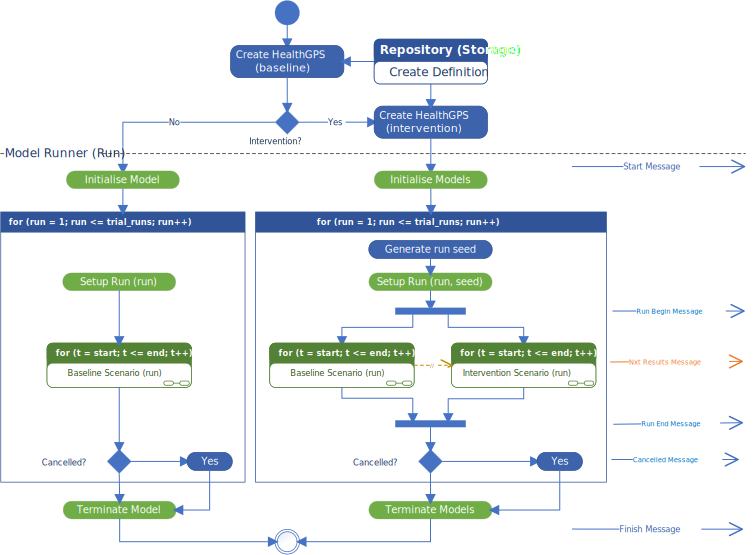|
|:--:|
|*Health-GPS Simulation Executive Activity Diagram*|

Experiment scenarios are evaluated in parallel using multiple threads, however the need to exchange data between scenarios creates an indirect synchronisation with a small overhead. The [ADEVS][adevs] executive, [Simulator][adevsim] class, is use inside each thread loop to execute the respective experiment scenario. The simulation executive communicates with the outside world via messages, ideally sharing the same message bus instance with the simulation engine, indicating the start and finish of the experiment, notifying error and cancellation.

The *message bus* mechanism decouples the sender from the receiver, typically one or more event monitors are used to subscriber for messages, receive, queue, and process the messages queue on its own pace and thread, common activities are display on screen, stream over the internet, summarise results and/or log to file.

# Deployment

The various components of the Health-GPS ecosystem can be deployed to multiple computing platforms. The four components are packaged together into the *host application* executable, which is purpose built for each target platforms as shown below. The backend *data storage* is platform independent, but must be available, accessible, and properly configured for the application to work correctly at runtime.

|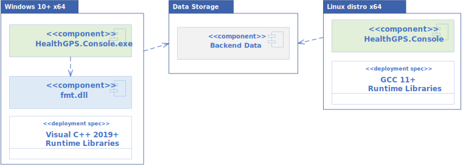|
|:--:|
|*Health-GPS Deployment Package*|

The version of the *libraries* required by the application at runtime depends on the compiler being used to build Health-GPS executable. The source code is portable for compilers supporting C++20 standard, however the resulting binaries are platform *dependent* and must be built, tested, and deployed accordingly for the model to work as expected.

> See [Data Model](datamodel) and [Developer Guide](development) for detailed information on the backend data storage and the various *interfaces* implementation respectively.

[cpp20]:https://en.cppreference.com/w/cpp/20 "C++ 20 standard features and compiler support"
[kafka]:https://kafka.apache.org "Distributed event streaming platform"
[broker]:https://www.rabbitmq.com "Message-broker with Advanced Message Queuing Protocol"
[adevs]:https://web.ornl.gov/~nutarojj/adevs "A Discrete EVent System simulator library"
[devs]:https://doi.org/10.1016/j.ifacol.2017.08.672 "From Discrete Event Simulation to Discrete Event Specified Systems (DEVS)"
[adevsim]:https://github.com/imperialCHEPI/healthgps/blob/main/source/external/adevs/adevs_base.h#L193 "healthgps/blob/main/source/external/adevs/adevs_base.h"
