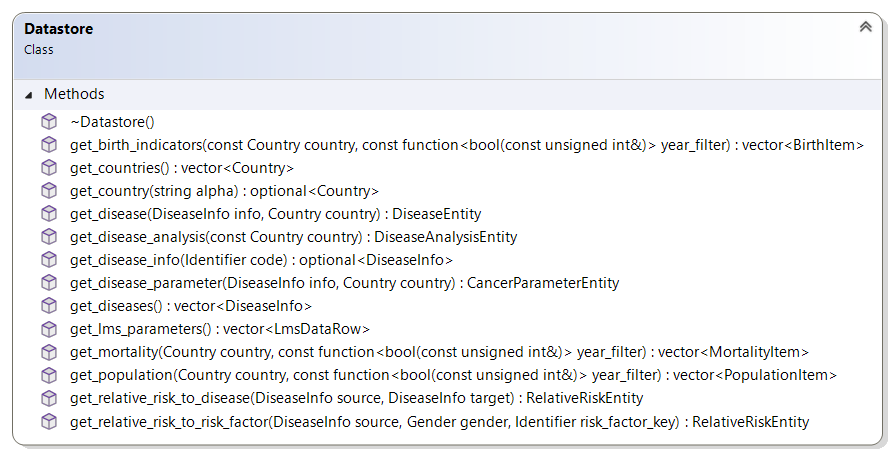
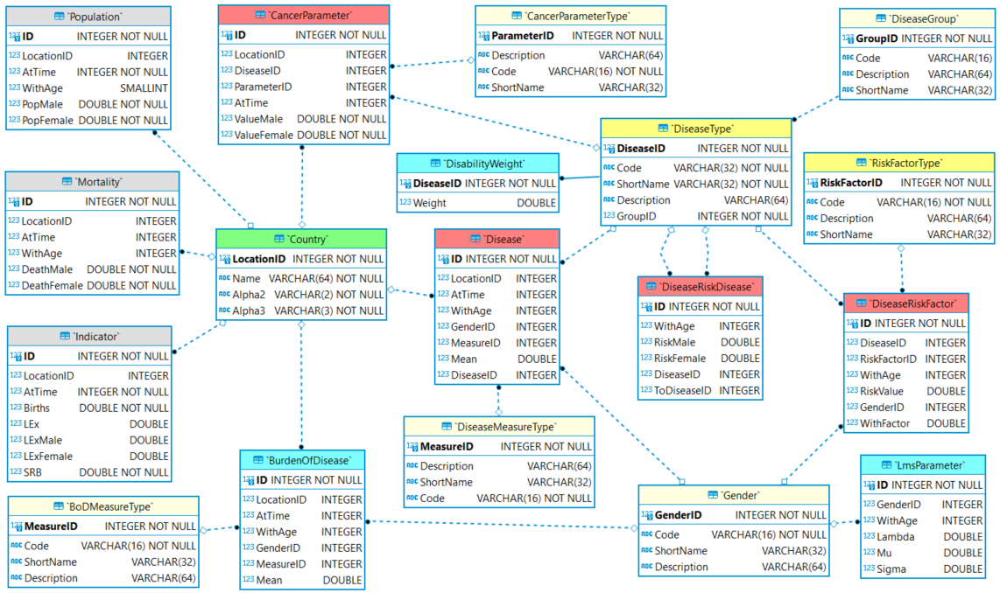

## Global Health Policy Simulation model

| [Home](index) | [Quick Start](getstarted) | [User Guide](userguide) | [Software Architecture](architecture) | Data Model | [Developer Guide](development) | [API](api/index.html) |

# Data Model

The backend *data model* defines an abstract model to organises data entities and how they relate to one another in a standardised schema and format to be used within the Health-GPS systems. The backend storage provides a reference dataset that reconcile various disparate data sources required by the model, fill gaps, adjust units, etc, for easy use. The standardised format allows the reference dataset to be easily expanded to accommodate new and non-traditional data sources.

The data model is storage agnostic, the [Data API][dataapi] abstraction interface shown below, provides a contract for the minimum dataset, easy access, strong typing, and decoupling from the backend storage implementation.

||
|:--:|
|*Backend Data API Interface*|

The data model defines the minimum dataset required by the model, the backend storage can hold more data to support external analysis for example. The backend dataset diagram is shown below, it identifies the required entities, relationships, and fields with respective data types. The dataset is indexed by country, *green*, entities representing demographics are *gray*, diseases are *red*, analysis are *blue*, and enumeration types are *yellow* respectively. Primary key (PK) fields are shown in **bold**, the ***ID*** fields are auto-generated row identifiers for internal use and data integrity enforcement.

||
|:--:|
|*Data Model Entity–Relationship Diagram*|

The *country* index entity is based on the [ISO 3166-1][iso3166] standard. All external data sources must provide some kind of *location identifier*, most likely with different values, but must enable mapping with the data storage index definition to be reconcile.

## Enumerations

The data model defines normalised enumerations, *yellow*, to provide *stable identifier* for the commonly used concepts, such as gender, and consistent dimensional data lookups. Enumerations are defined by four fields as shown below, must populated before any data entry, provide also mapping with external data sources during the reconcile process.

| Field name | Data Type | Constraint | Description             |
| :---       | :---      | :---       | :---                    |
| **XyzID**  | Integer   | PK         | Model unique identifier |
| Code       | Text      | UQ         | User stable identifier  |
| ShortName  | Text      |            | User facing display name|
| Description| Text      |            | Optional documentation  |

The unique constraint (UQ) may include multiple fields within the entity definition, *ShortName* fields are the user facing name for the *code* identifier and must always be provided. It is very **important** to be consistent when populating the enumerations *code* field to provide users and applications stable lookups, the following list is a suggested guide:

* start with a letter
* use only letters, numbers, and/or the underscore character, no spaces
* be consistent with casing, prefer lower case, avoid mixing
* keep it short, but meaningful and recognisable

The same recommendation applies to *folders* and *file names* definitions in cross-platform applications, operating system like *Linux* is case-sensitive by default, adopt a consistent naming convention that works everywhere. Following are enumerations defined by the Health-GPS model:

### Gender

| GenderID | Code   | ShortName | Description      |
| :---     | :---   | :---      | :---             |
| 1        | male   | Male      |                  |
| 2        | female | Female    |                  |

### Disease Group

| GroupID  | Code   | ShortName | Description|
| :---     | :---   | :---      | :---       |
| 0        | other  | Other     | General noncommunicable diseases|
| 1        | cancer | Cancer    | Cancer type diseases|

### Disease Measure Type

| MeasureID | Code   | ShortName | Description|
| :---      | :---   | :---      | :---       |
| 5         | prevalence | Prevalence | |
| 6         | incidence  | Incidence  | |
| 7         | remission  | Remission| | |
| 15        | mortality  | Mortality  | |

### BoD Measure Type

| MeasureID | Code   | ShortName | Description|
| :---      | :---   | :---      | :---       |
| 2         | daly | DALY | Disability adjusted life years |
| 3         | yld  | YLD  | Years lived with disability |
| 4         | yll  | YLL  | Years of life lost|

### Cancer Parameter Type

| ParameterID | Code         | ShortName  | Description              |
| :---        | :---         | :---       | :---                     |
| 0           | deathweight  | Deaths     | Death weight             |
| 1           | prevalence   | Prevalence | Prevalence distribution  |
| 2           | survivalrate | Survival   | Survival rate parameters |

## Registries

The *DiseaseType* and *RiskFactorType* are *dynamic enumerations*, providing a consistent *Registry* for available *diseases* and relative *risk factors* respectively. These enumerations are populated on demand, when defining new diseases within the Health-GPS ecosystem. Following are the examples of dynamic enumerations defined in the Health-GPS model:

### Disease Type

| DiseaseID | Code        | GroupID | ShortName         | Description              |
| :---      | :---        | :---:   | :---              | :---                     |
| Auto      | asthma      | 0       | Asthma            | |
| Auto      | diabetes    | 0       | Diabetes          | Diabetes mellitus type 2 |
| Auto      | lowbackpain | 0       | Low back pain     | |
| Auto      | colorectum  | 1       | Colorectal  cancer| |

### Risk Factor Type

| ParameterID | Code | ShortName | Description     |
| :---      | :---   | :---      | :---            |
| Auto      | bmi    | BMI       | Body Mass Index |

>The risk factor *code* must be consistent, and exact match the risk factor naming convention used in the external model's definition. Only risk factors with relative effects on diseases data should be registered to minimise the constraint on external modelling.

# Data Entities

All entities in the model have a *time* and/or *age* dimension associated with the *measures* being stored. The following notation is used to represent these two dimensions across the data model:

| Field Name| Data Type | Description             |
| :---      | :---      | :---                    |
| AtTime    | Integer   | The time reference in years |
| WithAge   | Integer   | Time reference at time in years |

Entities with a single measure associated with gender, e.g. Population, store the values for each enumeration as column, while entities with higher dimensionality, e.g. disease, represent *Gender* and *Measure* independent dimensions. All data stored in the model should have a consistent unit, with all unit's conversion performed outside prior to data ingestion.

## Demographics

Country specific demographics data containing historic estimates and projections are modelled using one entity per measure, representing a two-dimensional series, *time x age*, with expanded *gender* enumeration columns. The following entities provide the demographics module data, all fields are required for a row definition.

### Population

Stores the number of *males* and *females* measure for a location at each *time* and *age* combination.

| Field name | Data Type | Constraint | Description |
| :---       | :---      | :---       | :--- |
| **ID**     | Integer   | PK         | Model unique identifier |
| LocationID | Integer   | UQ         | Location unique identifier |
| AtTime     | Integer   | UQ         | Time reference of the measure values |
| WithAge    | Integer   | UQ         | Age reference of the measure values |
| PopMale    | Real      |            | Number of males in population |
| PopFemale  | Real      |            | Number of female in population |

### Mortality

Stores the number for *male* and *female* deaths for a location at each *time* and *age* combination.

| Field name | Data Type | Constraint | Description |
| :---       | :---      | :---       | :--- |
| **ID**     | Integer   | PK         | Model unique identifier |
| LocationID | Integer   | UQ         | Location unique identifier |
| AtTime     | Integer   | UQ         | Time reference of the measure values |
| WithAge    | Integer   | UQ         | Age reference of the measure values |
| DeathMale  | Real      |            | Number of males deaths in population |
| DeathFemale| Real      |            | Number of female deaths in population |

### Indicators

Stores general population indicators number for a location at each *time* entry.

| Field name | Data Type | Constraint | Description |
| :---       | :---      | :---       | :--- |
| **ID**     | Integer   | PK         | Model unique identifier |
| LocationID | Integer   | UQ         | Location unique identifier |
| AtTime     | Integer   | UQ         | Time reference of the indicator values |
| Births     | Real      |            | Number of births, both sexes combined |
| SRB        | Real      |            | Sex ratio at birth (male births per female births)|
| LEx        | Real      |            | Life expectancy at birth for both sexes combined in years|
| LExMale    | Real      |            | Male life expectancy at birth (years)|
| LExFemale  | Real      |            | Female life expectancy at birth (years) |

## Diseases

Countries disease specific estimates are modelled using a multi-dimensional entity to represent a two dimensional series, *time x age*, for *gender* and *measure type* combinations. The following entities provide the *diseases model* required data, all fields are required for a row definition.

### Disease

Diseases can be dynamic defined within the *Health-GPS framework* using data only. The *disease* entity models the common measures required to define all diseases.

| Field name | Data Type | Constraint | Description |
| :---       | :---      | :---       | :--- |
| **ID**     | Integer   | PK         | Model unique identifier |
| LocationID | Integer   | UQ         | Location unique identifier |
| DiseaseID  | Integer   | UQ         | Disease type unique identifier |
| MeasureID  | Integer   | UQ         | Measure type unique identifier |
| GenderID   | Integer   | UQ         | Gender type unique identifier |
| AtTime     | Integer   | UQ         | Time reference of the measure values|
| WithAge    | Integer   | UQ         | Age reference of the measure values |
| Mean       | Real      |            | The measure mean value |

### Cancer Parameter

In addition to the common data above, *cancers* definition requires extra parameters, which are modelled using a multi-dimensional entity, storing *time-based* parameter values using expanded *gender* enumeration as columns.

| Field name | Data Type | Constraint | Description |
| :---       | :---      | :---       | :--- |
| **ID**     | Integer   | PK         | Model unique identifier |
| LocationID | Integer   | UQ         | Location unique identifier |
| DiseaseID  | Integer   | UQ         | Disease type unique identifier |
| ParameterID| Integer   | UQ         | Parameter type unique identifier |
| AtTime     | Integer   | UQ         | Time reference of the measure values|
| ValueMale  | Real      |            | The parameter value for males |
| ValueFemale| Real      |            | The parameter value for females |

### Relative Risks

The disease relative risk measure represents the association of risk factors and diseases, how exposures to risk factors affects the probabilities of developing the disease, the incidence of diseases in the population.

#### Relative risk to Disease (DiseaseRiskDisease)

The diseases relative risk to other diseases is modelled to represent the relative risk values by *age* using expanded *gender* enumeration as columns.

| Field name | Data Type | Constraint | Description |
| :---       | :---      | :---       | :--- |
| **ID**     | Integer   | PK         | Model unique identifier |
| DiseaseID  | Integer   | UQ         | Disease type unique identifier |
| ToDiseaseID| Integer   | UQ         | Relative to disease type unique identifier |
| WithAge    | Integer   | UQ         | Age reference of the risk values|
| RiskMale   | Real      |            | The relative risk value for males |
| RiskFemale | Real      |            | The relative risk value for females |

#### Relative Risk due to Risk Factor (DiseaseRiskFactor)

The risk factors relative risk to diseases is modelled as a two-dimensional entity with *age* x *factor value* lookups value, stored for the relevant diseases by *gender*.

| Field name   | Data Type | Constraint | Description |
| :---         | :---      | :---       | :--- |
| **ID**       | Integer   | PK         | Model unique identifier |
| DiseaseID    | Integer   | UQ         | Disease type unique identifier |
| RiskFactorID | Integer   | UQ         | Relative to risk factor unique identifier |
| GenderID     | Integer   | UQ         | Gender type unique identifier |
| WithAge      | Integer   | UQ         | Age reference of the risk values |
| WithFactor   | Real      | UQ         | Factor reference of the risk values |
| RiskValue    | Real      |            | The relative risk values |

## Analysis

Defines the data model to support the analysis modules, which calculates among other things calculates the *Burden of Diseases* (BoD) indicators, describing death and loss of health due to diseases, injuries, and risk factors for the simulated population.

### Disability Weight

Stores disease specific disability weight estimates, which representing the magnitude of health loss associated with specific health outcomes, used to calculate years lived with disability (YLD) for these outcomes in a given population.

| Field name | Data Type | Constraint | Description |
| :---       | :---      | :---       | :--- |
| DiseaseID  | Integer   | PK         | Disease type unique identifier |
| Weight     | Real      |            | The disease weight value |

### LMS Parameters

Stores the Lambda-Mu-Sigma (LMS) model parameters, which is used to convert BMI risk factor values to z-scores for children.

| Field name | Data Type | Constraint | Description |
| :---       | :---      | :---       | :--- |
| **ID**     | Integer   | PK         | Parameter unique identifier |
| GenderID   | Integer   | UQ         | Gender type unique  |
| WithAge    | Integer   | UQ         | Age reference of the parameter |
| Lambda     | Real      |            | The lambda parameter value |
| Mu         | Real      |            | The mu parameter value |
| Sigma      | Real      |            | The sigma parameter value |

### Burden of Disease

The burden of diseases (BoD) measure is modelled using a two-dimensional entity, *time* x *age*, to represent the measure values for each *gender* enumeration entry.

| Field name | Data Type | Constraint | Description |
| :---       | :---      | :---       | :--- |
| **ID**     | Integer   | PK         | Model unique identifier |
| LocationID | Integer   | UQ         | Location unique identifier |
| MeasureID  | Integer   | UQ         | BoD measure type unique identifier |
| GenderID   | Integer   | UQ         | Gender type unique identifier |
| AtTime     | Integer   | UQ         | Time reference of the measure values |
| WithAge    | Integer   | UQ         | Age reference of the measure values |
| Mean       | Real      |            | The measure mean value |

The ***data model*** definition is now *complete*. The design makes heavy use of relational-database notations; however, the backend data model is storage and implementation agnostic, the Health-GPS ecosystem seamlessly supports different [Data API][dataapi] implementations via instance injection during construction.

>See [Development Guide](development) for a *file-based* backend storage implementation detail.

[dataapi]: https://github.com/imperialCHEPI/healthgps/blob/main/source/HealthGPS.Core/datastore.h "Health-GPS Data API definition."

[iso3166]: https://www.iso.org/iso-3166-country-codes.html "ISO 3166 Country Codes"
