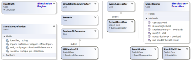

## Global Health Policy Simulation model

| [Home](index) | [Quick Start](getstarted) | [User Guide](userguide) | [Software Architecture](architecture) | [Data Model](datamodel) | Developer Guide | [API](api/index.html) |

# Developer Guide

The *Health GPS* software is written in modern, standard ANSI C++, targeting the [C++20 version](https://en.cppreference.com/w/cpp/20) and using the C++ Standard Library. The project is fully managed by [CMake](https://cmake.org/) and [Microsoft Visual Studio](https://visualstudio.microsoft.com), the code base is portable but requires a C++20 compatible compiler to build. The development toolset users [Ninja](https://ninja-build.org/) for build, [vcpkg](https://github.com/microsoft/vcpkg) package manager for dependencies, [googletest](https://github.com/google/googletest) for unit testing and [GitHub Actions](https://docs.github.com/en/actions) for continuous integration (CI) builds and testing.

To start working on the *Health GPS* code base, the suggested development machine needs:

1. Windows 10 or newer, [WSL 2](https://docs.microsoft.com/en-us/windows/wsl/) enabled and Linux distribution of choice installed.
2. [Git](https://git-scm.com/downloads) 2.3 or newer.
3. [CMake](https://cmake.org/) 3.20 or newer with support for [presets](https://cmake.org/cmake/help/latest/manual/cmake-presets.7.html).
4. [Ninja](https://ninja-build.org/) 1.10 or newer.
5. [Microsoft Visual Studio](https://visualstudio.microsoft.com) 2022 or newer with CMake presets integration.
6. [GCC](https://gcc.gnu.org/) 11.1 or newer installed on *Linux* environment, plus.
   * [Intel TBB](https://github.com/oneapi-src/oneTBB) library version 2018 or later installed (e.g. `sudo apt update && sudo apt install libtbb-dev`)
7. The latest [vcpkg](https://github.com/microsoft/vcpkg) installed globally for Visual Studio projects, and the VCPKG_ROOT environment variable set to the installation directory.
8. Internet connection.

Download the *Health GPS* source code to the local machine, we recommend somewhere like root `/src` or `/source`, since otherwise you may run into path issues with the build systems.

```cmd
> git clone https://github.com/imperialCHEPI/healthgps
```

Finally, open the `healthgps` folder in Visual Studio and hit build. The first build takes considerably longer than normal due to the initial work required by CMake and the package manager.

>**NOTE:** *This is the current toolset being used for developing the HealthGPS model, however CMake is supported by VS Code and many other IDE of choice, e.g. the model is current being compiled and built on Ubuntu Linux 22.04 LTS using only the CMake command line.*

## CMake Build

Health-GPS source code is configured to use [CMake](https://cmake.org/) by default for development, building and testing. The following steps are recommended for building and testing Health-GPS from source code without modification.

```cmd
cmake --list-presets=all

# Windows
cmake --preset='x64-release'
cmake --build --preset='release-build-windows' --target install --config Release

# Linux
cmake --preset='linux-release'
cmake --build --preset='release-build-linux' --target install --config Release
```

> To build the `Benchmark` application, add `-DBUILD_BENCHMARKS=ON` to the CMake configuration command (first for each OS).

The `HealthGPS` binaries will now be inside the `healthgps/out/install/[preset]/bin` directory.

To run the unit tests:

```cmd
# Windows
cmake --preset='x64-debug'
cmake --build --preset='debug-build-windows'
ctest --preset='core-test-windows'

# Linux
cmake --preset='linux-debug'
cmake --build --preset='debug-build-linux'
ctest --preset='core-test-linux'
```

All available options are defined using CMake *presets* in the `CMakePresets.json` file, which also declare *build presets* and other options previously provided to [CMake](https://cmake.org/) via command line arguments. The use of *presets* provides consistent build scripts across development and CI/CD environments using source control for reproducibility.

## HPC Build

Although Health-GPS is compatible with most High Performance Computing (HPC) system, this section contents are specific for using *Health-GPS software* at the *Imperial College London* [HPC system](https://www.imperial.ac.uk/admin-services/ict/self-service/research-support/rcs/), which users need to register to *get access* and support. The HPC is **Linux** based, therefore users *must* be familiar with *Unix command line* and *shell script* to properly navigate the file system, build programs, run applications, and automate repetitive tasks. See the [User Guide](userguide#50-hpc-running) for a very brief introduction to Imperial HPC system.

This tutorial describes building Health-GPS using [EasyBuild](https://easybuild.io/), a framework specially designed to manage (scientific) software on HPC systems, adopted by the Imperial HPC to manage the installation of users' software on different stacks depending on maturity and quality.

Software can be installed via three stacks:

* **local** (tools/eb-dev) - allows the building and installation of software in your own user space, one can create locally modified version of a software, or set up a reproducible build environment for you own software development projects.
* **development** (tools/dev) - a generic stack for software not current available directly from EasyBuild, available on the login nodes but without any guarantees,  software on this stack might change on short notice due to required rebuilds.
* **production** (tools/prod) - a generic stack for software available as an [EasyBuild package](https://github.com/easybuilders/easybuild-easyconfigs), built to support specific architectures, and is *not* available on the login nodes. To *view* which software is installed, load the *'tools/prod-headnode'* and search for the software.

> **Warning**  
> Modules name are case sensitive for both script and search.
>
> **Note**  
> To get access to [Imperial HPC](https://www.imperial.ac.uk/admin-services/ict/self-service/research-support/rcs/) and learn more about [EasyBuild](https://easybuild.io/), users should consider taking the hands-on [workshops](https://www.imperial.ac.uk/students/academic-support/graduate-school/students/doctoral/professional-development/research-computing-data-science/courses/) offered by the Imperial's Professional Development Programme, specially **the Linux command line & large-scale computing** courses.

The remaining of this tutorial focus on building a Health-GPS *release* source code, `version 1.2.1.0 or newer`, on the *Imperial HPC* using *EasyBuild* on the **local** stack. Installing Health-GPS on the *development* and *production* stacks must be done via the [Software Install](https://servicemgt.imperial.ac.uk/ask?id=sc_cat_item&sys_id=7c8e0ddf1b6eb8101fd24043b24bcb7f) request service. Health-GPS still has dependencies missing in the EasyBuild production pipeline, configuration [pull requests](https://github.com/easybuilders/easybuild-easyconfigs/pulls?q=healthgps) are under review, the following script builds on the latest Health-GPS version (1.3.0.0) that is available on the *development stack*.

```bash
# Clear all modules
module purge

# Load the local stack module
module add tools/eb-dev

# Create a new directory, change into that directory
mkdir easybuild/healthgps
cd easybuild/healthgps

# Download EasyConfig config file for Health-GPS from
# https://github.com/easybuilders/easybuild-easyconfigs/pulls
eb --copy-ec --from-pr=16212

# Create a copy of file: healthgps-1.1.3.0-GCCcore-11.3.0.eb for a new release (X.Y.Z.B)
cp healthgps-1.1.3.0-GCCcore-11.3.0.eb healthgps-X.Y.Z.B-GCCcore-11.3.0.eb

# Download the release X.Y.Z.B source code's checksum file locally
wget https://github.com/imperialCHEPI/healthgps/releases/download/vX.Y.Z.B/sha256sum.txt

# Edit and replace the release [version] and code [checksum] in the config file
nano healthgps-X.Y.Z.B-GCCcore-11.3.0.eb

# Check the configuration file syntax and dependencies (dry-run)
eb -D healthgps-X.Y.Z.B-GCCcore-11.3.0.eb

# Install the Health-GPS program locally
eb -r healthgps-X.Y.Z.B-GCCcore-11.3.0.eb

# Check for versions of Health-GPS installed, version X.Y.Z.B should be available
module av healthgps

# Load the newly installed Health-GPS module
module add healthgps/X.Y.Z.B-GCCcore-11.3.0

# Finally, check the Health-GPS location, version and we are done!
which HealthGPS.Console
HealthGPS.Console --version
```

The Health-GPS build and installation on the HPC is now complete using EasyBuild software management tool. The resulting *configuration* file should now be checked-in to the [easybuild-easyconfigs](https://github.com/easybuilders/easybuild-easyconfigs) repository via pull request to create a *reproducible* build of the application, see the EasyBuild [documentation](https://docs.easybuild.io/en/latest/Integration_with_GitHub.html) for details.

### Known Issues

* EasyBuild by default optimises the software for different types of hardware available within a HPC systems, the following compiler flags: `-ftree-vectorize -march=native -fno-math-errno` are typical used for Health-GPS builds using GCC version 11.1 or newer. The cluster contains many CPU types, e.g., AMD rome, and Intel skylake, haswell, ivy, sandy. The mismatch between building and using CPUs might cause performance issues, a **workaround** is to lock the `cpu_type=rome` in the PBS job script, *if you know the build CPU type*.

* Imperial HPC job scheduler, PBS, does not provided good support non-OpenMP threading, e.g., Threading Building Blocks ([oneTBB](https://github.com/oneapi-src/oneTBB)). PBS relays on old fashion environment variables to control the number of threads an application should use, e.g., `ompthreads=8` will set `OMP_NUM_THREADS=8`, the OpenMP runtime reads this value and behaves accordingly as a good citizen. There is no hardware isolation, like a VM or container, the application still sees all the CPU cores available in the running node. Modern threading libraries are controlled via code, the aim is to maximize the available hardware usage, and might result on the following error: `PBS: job killed: ncpus 15.25 exceeded limit 8 (sum)`. The **workaround** is to size the job to use a full node, e.g., `#PBS -l select=1:ncpus=64:mem=XXgb:cpu_type=rome` to provide hardware isolation, but this might be inefficient for the HPC system.

### Using Health-GPS Module

The EasyBuild installation described above, installs the Health-GPS software in the users' own space, usually `$HOME/apps/software/healthgps` folder, where EasyBuild store logs and other information for reproducibility of the build environment. The `$HOME/apps/*` directory structure is created and updated by EasyBuild during local software installation and *should be left alone by the user*. To load a specific version of the Health-GPS software for use, the following steps are suggested:

```bash
# Clear all modules
module purge

# Load the software stack, e.g., local
module add tools/eb-dev

# Check for Health-GPS module versions available
module av healthgps

# Load the desirable Health-GPS module version
module add healthgps/X.Y.Z.B-GCCcore-11.3.0

# Use the Health-GPS application. e.g. using development example and dataset
HealthGPS.Console -f healthgps/example/France.Config.json -s ~/healthgps/data
```

In general, you should avoid running you own applications on the shared HPC login nodes, the *etiquette* for working with HPC system is the create and submit jobs to be evaluated by the HPC nodes instead. See the [User Guide](userguide#50-hpc-running) for details on how to use the installed Health-GPS modules on the Imperial HPC system.

## Third-party components

The project dependencies are included using [vcpkg](https://github.com/microsoft/vcpkg) package manager, and declared in the *vcpkg.json* manifest file. The package manager is integrated with CMake and automatically invoked by the `find_package` command during build.

| Name  | License |
|:---   |:---     |
| [Adevs](https://sourceforge.net/projects/adevs)       | BSD 3-Clause |
| [crossguid](https://github.com/graeme-hill/crossguid) | MIT          |
| [cxxopts](https://github.com/jarro2783/cxxopts)       | MIT          |
| [indicators](https://github.com/p-ranav/indicators)   | MIT          |
| [fmt](https://github.com/fmtlib/fmt)                  | MIT          |
| [nlohmann-json](https://github.com/nlohmann/json)     | MIT          |
| [rapidcsv](https://github.com/d99kris/rapidcsv)       | BSD 3-Clause |
| [googletest](https://github.com/google/googletest)    | BSD 3-Clause |
| [googletest](https://github.com/google/googletest)    | BSD 3-Clause |
| [benchmark](https://github.com/google/benchmark)      | Apache-2.0   |

# Implementation

The software application provides a Command Line Interface (CLI) for the user to inform the configuration to run and backend storage location. The experiment options are provided to the model via a configuration file (JSON format), including population size, intervention scenarios and number of runs.

 The console terminal application aims to provide the users of with a wider range of cross-platform options to run the microsimulation, including hardware ranging from desktops to high performance computers. However, the microsimulation software program can equality be a graphical user interface (GUI) or web page program.

## Composing a Microsimulation

To run a microsimulation experiment, at least one simulation engine and one simulation executive must be created, the HealthGPS class implements the engine, and ModelRunner class implements the executive respectively as shown below. To create a simulation engine instance, the user must provide a SimulationDefinition with the model configuration, the SimulationModuleFactory with builders for each module type registered, and one implementation of the EventAggregator interface for external communication.

||
|:--:|
|*Composing a Health-GPS Microsimulation*|

The simulation executive requires a RandomBitGenerator interface implementation for master seed generation and an implementation of the EventAggregator interface, in this example the DefaultEventBus class, which should be shared by the engines and executive to provide a centralised source of communication. The simulation engine must have its own random number generator instance as part of the simulation definition, the Mersenne Twister pseudorandom number generator algorithms is the default implementation, however other algorithms can easily be used.

EventMonitor class has been created to receive all messages from the microsimulation, notifications and error messages are displayed on the application terminal, and result messages are queued to be processed by an implementation of the ResultWriter interface, ResultFileWriter class in this example, which writes the results to a file in JSON format.

The following code snippet shows how to compose a microsimulation using the classes discussed above. The modules factory holds the backend datastore instance and allows dynamic registration of implementations for the required module types, the default module factory function registers the current production implementations. The contents of the input configuration file is loaded and processed to create the model input, a read-only data structure shared with all the simulation engines. An implementation of *scenario* interface must be provided for each simulation definition, the *BaselineScenario* class is a generic type, while the intervention scenarios are defined to test specific policies.

```cpp
// Parse configuration file from command line arguments
auto config = load_configuration(cmd_args);

try {
    // Create factory with backend data store and modules implementation
    auto factory = get_default_simulation_module_factory(...);

    // Create the complete model input from configuration
    auto model_input = create_model_input(...);

    // Create event bus and monitor
    auto event_bus = DefaultEventBus();
    auto json_file_logger = create_results_file_logger(config, model_input);
    auto event_monitor = EventMonitor{ event_bus, json_file_logger };

    // Create simulation executive
    auto seed_generator = std::make_unique<hgps::MTRandom32>();
    if (model_input.seed().has_value()) {
        seed_generator->seed(model_input.seed().value());
    }
    auto executive = ModelRunner(event_bus, std::move(seed_generator));
    
    // Create baseline scenario with data sync channel
    auto channel = SyncChannel{};
    auto baseline_scenario = std::make_unique<BaselineScenario>(channel);
    
    // Create simulation engine for baseline scenario
    auto baseline_rnd = std::make_unique<hgps::MTRandom32>();
    auto baseline = HealthGPS{
        SimulationDefinition{ model_input,
            std::move(baseline_scenario), 
            std::move(baseline_rnd)},
        factory, event_bus };

    std::atomic<bool> done(false);
    auto runtime = 0.0;
    if (config.has_active_intervention) {
        // Create intervention scenario
        auto policy_scenario = create_intervention_scenario(channel, config.intervention);

        // Create simulation engine for intervention scenario
        auto policy_rnd = std::make_unique<hgps::MTRandom32>();
        auto intervention = HealthGPS{
            SimulationDefinition{ model_input,
                std::move(policy_scenario),
                std::move(policy_rnd)},
            factory, event_bus };

        // Create worker thread to run the two scenarios side by side
        auto worker = std::jthread{ [&runtime, &executive, &baseline, &intervention, &config, &done] {
            runtime = executive.run(baseline, intervention, config.trial_runs);
            done.store(true);
        } };

        // Waits for it to finish, cancellation can be enabled here
        while (!done.load()) {
            std::this_thread::sleep_for(std::chrono::microseconds(100));
        }
        worker.join();
    }
    else {
        // Create worker thread to run only the baseline scenario
        channel.close(); // Will not store any message
        auto worker = std::jthread{[&runtime, &executive, &baseline, &config, &done] {
            runtime = executive.run(baseline, config.trial_runs);
            done.store(true);
        } };
        
        // Waits for it to finish, cancellation can be enabled here
        while (!done.load()) {
            std::this_thread::sleep_for(std::chrono::microseconds(100));
        }
        worker.join();
    }
}
catch (const std::exception& ex) {
    fmt::print(fg(fmt::color::red), "\n\nFailed with message - {}.\n", ex.what());
}

// Stop listening for new messages.
event_monitor.stop();
```

The simulation executive can run experiments for baseline scenario only, or baseline and intervention scenarios combination as shown above. The results message is a polymorphic type carrying a customisable data payload, table below shows the default implementation outputs.

| Property     | Overall | Male  | Female | Description             |
| :---         | :---:   | :---: | :---:  |:---                     |
| Id           | ✓       | -     | -      | The message type identifier (results type)
| Source       | ✓       | -     | -      | The results experiment identification |
| Run number   | ✓       | -     | -      | The results rum number identification |
| Model time   | ✓       | -     | -      | The results model time identification |
| Average Age  | -       | ✓     | ✓      | Average age of the population alive |
| Prevalence   | -       | ✓     | ✓      | Prevalence for each disease in the population |
| Risk factors | -       | ✓     | ✓      | Average risk factor values in the population |
| Indicators (DALYs) | ✓ | - | - | YLL, YLD and DALY values per 100'000 people |
| Population Counts | ✓ | - | - |  Total size, number alive, dead and emigrants |
|Comorbidities | -       | ✓     | ✓      | Percentage of people with 0 to N+ diseases |
| Metrics | ✓ | - | - | Custom key/value metrics for algorithms |
| Series | - | ✓ | ✓ | Detailed time series by time, age, and gender |

These measures are calculated and published by the analysis module at the end of each simulation time step, the combination of *source*, *run number* and *model time* is unique.

The following code snippet illustrates the dynamic registration of module builder functions with the simulation module factory by using the default module factory function used above. A similar mechanism can be used to register dummy or mock module versions, with deterministic behaviour for testing purpose.

```cpp
SimulationModuleFactory get_default_simulation_module_factory(Repository& manager)
{
    auto factory = SimulationModuleFactory(manager);
    factory.register_builder(SimulationModuleType::SES,
        [](Repository& repository, const ModelInput& config) ->
        SimulationModuleFactory::ModuleType {
            return build_ses_noise_module(repository, config); });

    factory.register_builder(SimulationModuleType::Demographic,
        [](Repository& repository, const ModelInput& config) -> 
        SimulationModuleFactory::ModuleType {
            return build_population_module(repository, config); });

    factory.register_builder(SimulationModuleType::RiskFactor,
        [](Repository& repository, const ModelInput& config) ->
        SimulationModuleFactory::ModuleType {
            return build_risk_factor_module(repository, config); });

    factory.register_builder(SimulationModuleType::Disease,
        [](Repository& repository, const ModelInput& config) -> 
        SimulationModuleFactory::ModuleType {
            return build_disease_module(repository, config); });

    factory.register_builder(SimulationModuleType::Analysis,
        [](Repository& repository, const ModelInput& config) -> 
        SimulationModuleFactory::ModuleType {
            return build_analysis_module(repository, config); });

    return factory;
}
```

The factory must provide builder functions for all the required *module types* to successfully create an instance of the *HealthGPS* simulation engine, however, the user can disable a particular module behaviour by registering an implementation that makes no change to the virtual population properties when invoked by the simulation engine at runtime.

## Reproducibility

Simulation experiment results reproducibility is a fundamental requirement for a rigorous scientific approach. Health-GPS defines mechanisms to enable  reproducibility of experiment run continuous run and batch mode typical of HPC environments. The core mechanism requires traceable inputs, Health-GPS version, and a custom random number seed, the following algorithm is used to manage the master seed for all experiments.

||
|:--:|
|*Experiment reproducibility algorithm (seed management)*|

When running the simulation as a single experiment, the solution is trivial using the same seed, however in a cluster or HPC environment, reproducibility of parallel simulation is more challenging. See the [User Guide](userguide#50-hpc-running) for an worked example using *Health-GPS* on *HPC computer* arrays to evaluate the *same experiment* in parallel.
