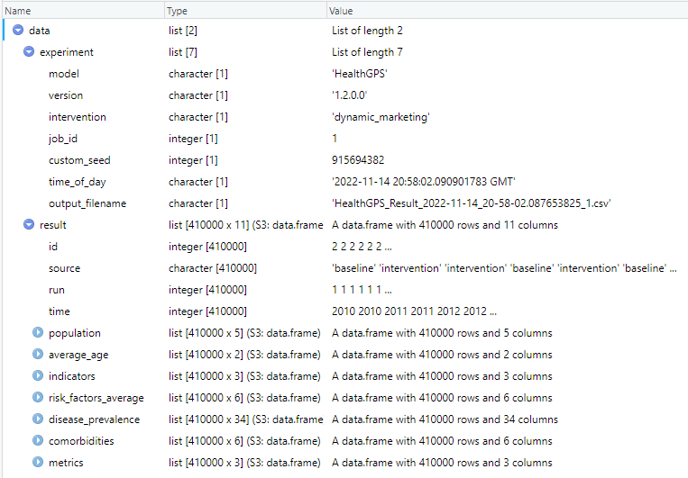
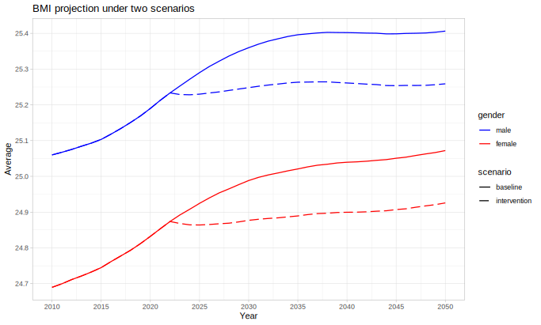

## Global Health Policy Simulation model

| [Home](index) | Quick Start | [User Guide](userguide) | [Software Architecture](architecture) | [Data Model](datamodel) | [Developer Guide](development) | [API](api/index.html) |

# Quick Start

The *Health GPS* application provides a *Command Line Interface* (CLI) and runs on *Windows 10 (and newer)* and *Linux* devices. All supported options are provided to the model via a [configuration][configjson] file (JSON format), including population size, intervention scenarios and number of runs. Users are encouraged to start exploring the model by using the included example dataset, changing the provided configuration file, and running the model.

Pre-compiled binaries for `Windows` and `Linux` are available on the [releases page](https://github.com/imperialCHEPI/healthgps/) for generic x86-64 CPUs. If you want a version of the program tailored to your specific CPU (e.g. for HPC) or you wish to develop *Health GPS*, follow the instructions to build from source in the [developer guide](development). To use the binaries, you will need to unzip the downloaded file to a directory of your choice.

***Known Issue:*** `Windows 10` support for VT (Virtual Terminal) / ANSI escape sequences is turned OFF by default, this is required to display colours on console / shell terminals. You can enable this feature manually by editing windows [registry keys](https://superuser.com/questions/413073/windows-console-with-ansi-colors-handling/1300251#1300251), however we recommend the use of [Windows Terminal](https://www.microsoft.com/en-gb/p/windows-terminal/9n0dx20hk701?rtc=1&activetab=pivot:overviewtab), which is a modern terminal application for command-line tools, has no such limitation, and is now distributed as part of the `Windows 11` installation.

## Example usage

*Health GPS* requires model configuration files in order to be able to run. These files can either be in a local directory or as a zip file on the local machine or on the web. Here, we will use a model available from the [Health-GPS examples repository]. (We are assuming that you have changed directories to wherever you have built or extracted the Health-GPS binaries.)

For Windows:

```cmd
.\HealthGPS.Console.exe -c https://github.com/imperialCHEPI/healthgps-examples/releases/download/20240907/HLM_France.zip
```

For Linux:

```sh
./HealthGPS.Console -c https://github.com/imperialCHEPI/healthgps-examples/releases/download/20240907/HLM_France.zip
```

Output data will be written to a subfolder of your home directory, `healthgps/results/france`.

## Results

The current model output format is JSON (JavaScript Object Notation), an open standard file format designed for data interchange in human-readable text. It is language-independent; however, all programming language and major data science tools supports JSON format because they have libraries and functions to read/write JSON structures. To read the model results in [R](https://www.r-project.org/), for example, you need the [`jsonlite`](https://cran.r-project.org/web/packages/jsonlite/vignettes/json-aaquickstart.html) package:

```R
require(jsonlite)
data <- fromJSON(result_filename.json)
View(data)
```

The above script reads the results data from file and makes the data variable available in R for analysis as shown below, it is equally easy to write a R structure to a JSON string or file.

||
|:--:|
|*Health-GPS results in R data frame example*|

The results file contains the output of all simulations in the experiment, *baseline*, and *intervention* scenarios over one or more runs. The user should not assume data order during analysis of experiments with intervention scenarios, the results are published by both simulations running in parallel *asynchronously* via messages, the order in which the messages arrive at the destination queue, before being written to file is not guaranteed. A robust method to tabulate the results shown above, is to always group the data by: ```data.result(source, run, time)```, to ensure that the analysis algorithms work for both types of simulation experiments. For example, using the results data above in R, the following script will tabulate and plot the experiment's BMI projection.

```R
require(dplyr)
require(ggplot2)

# create groups frame
groups <- data.frame(data$result$source, data$result$run, data$result$time)
colnames(groups) <- c("scenario", "run", "time")

# create dataset
risk_factor <- "BMI"
sim_data <- cbind(groups, data$result$risk_factors_average[[risk_factor]])

# pivot data
info <- sim_data %>% group_by(scenario, time) %>%
  summarise(runs = n(),
            avg_male = mean(male, na.rm = TRUE),
            sd_male = sd(male, na.rm = TRUE),
            avg_female = mean(female, na.rm = TRUE),
            sd_female = sd(female, na.rm = TRUE),
            .groups = "keep")

# reshape data
df <- data.frame(scenario = info$scenario, time = info$time, runs = info$runs,
      bmi = c(info$avg_male, info$avg_female),
      sd = c(info$sd_male, info$sd_female),
      se = c(info$sd_male / sqrt(info$runs), info$sd_female) / sqrt(info$runs),
      gender = c(rep('male', nrow(info)), rep('female', nrow(info))))

# Plot BMI projection
p <- ggplot(data=df, aes(x=time, y=bmi, group=interaction(scenario, gender))) +
  geom_line(size=0.6, aes(linetype=scenario, color=gender)) + theme_light() +
  scale_linetype_manual(values=c("baseline"="solid","intervention"="longdash")) +
  scale_color_manual(values=c("male"="blue","female"="red")) +
  scale_x_continuous(breaks = pretty(df$time, n = 10)) +
  scale_y_continuous(breaks = pretty(df$bmi, n = 10)) +
  ggtitle(paste(risk_factor, " projection under two scenarios")) +
  xlab("Year") + ylab("Average")

show(p)
```

||
|:--:|
|*Experiment BMI projection example*|

In a similar manner, the resulting dataset `df`, can be re-created and expanded to summarise other variables of interest, create results tables and plots to better understand the experiment.

[configjson]:https://github.com/imperialCHEPI/healthgps/blob/main/example/France.Config.json "Configuration file example"
