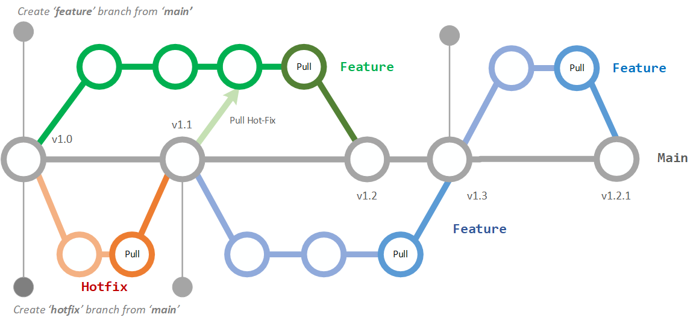
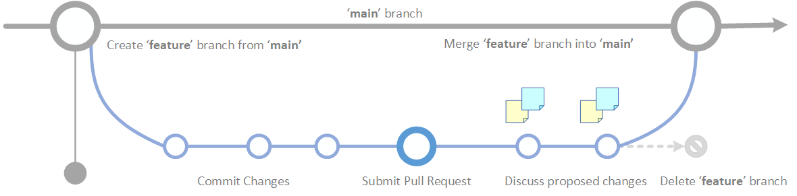

# Health-GPS Project Model Branching Policy

Traditional Git-flow branching patterns are usually adopted by large software teams with complex release processes to support the deployment of multiple versions of the same application in production. Not all software projects benefit from the flexibility provided by the Git-flow branching structure, the popularity of GitHub hosting for open-source projects with a single version in production, has given rise to a simpler branching policy for its developers, called ***GitHub Flow***. The *Health-GPS Model* source code is hosted by GitHub (https://github.com/imperialCHEPI) and adopts the GitHub Flow branching policy for development.

The GitHub Flow branching structure assumes a single version in production with high-frequency integration onto a release-ready mainline, `main` branch, which should always be deployable. **Figure 1** shows the GitHub flow branching pattern, to work on something new, always start by creating a descriptively named branch off of `main` branch, and there is no difference between *hotfix* and a very small or large feature.

*Figure 1 – Workflow using GitHub Flow Branching Policy*

Developers always work with feature branching, never on the `main` branch. They push their feature branches regularly to the central repository, to support visibility, but there's no integration with mainline until the feature is complete. A feature branches can be a single line of code, or run for a couple of weeks, the process is intended to work the same way in either case. The GitHub pull-request mechanism must be used to integrate a new feature into the mainline with the option for pre-integration code review. **Figure 2** shows the suggested workflow for developing a single feature within the Health-GPS microsimulation project.

*Figure 2 - GitHub Flow for a Single Feature*

Here is a summary of the entire GitHub Flow suggested for working on the Health-GPS project:  
- Anything in the `main` branch should be working and deployable.
- To start work on something new, create a descriptively named branch off of `main`.
- Commit your changes to the local branch and regularly push your work to the same named branch on the GitHub server.
- When you need feedback or help, or you think the branch is ready for merging, open a pull request.
- After someone else has reviewed and signed off on the feature, you can merge it into `main`.
- Once it is merged and pushed to `main`, you can and should deploy immediately.
- Delete your local and remote branches.

It is very important to remember that any conflicting changes between your branch and `main` must be resolved in your branch before your pull request. It is highly recommended the use automatic code quality checks enforced via Continuous Integration tests e.g., GitHub Actions, during the pull request process.

## Source Control Guidelines

The GitHub workflow described above aims at enabling collaboration and productivity of the Health-GPS Project development team. GitHub provides support for issues tracking and project management via Kanban boards, enabling an integrated environment for managing work planning and linking feature branches with tasks in progress. In addition, there are general guidelines for working with source control:

-	***No direct commits into the main*** - the `main` branch should always be deployable. Enable branch protection on `main` to prevent direct commits, everything should be managed via pull requests.

-	***Use short-lived branches*** – the longer a branch lives separate from the `main` branch, the higher the risk for merge conflicts, complex pull request delays and deployment challenges. Short-lived branches promote better work planning, faster code reviews, cleaner merges and deploys.

-	***Minimise `main` reverts*** – the workflow should to proactively prevent merges that will have to be reverted, e.g., automatic test a branch before allowing it to be merged into the `main` branch.

-	***Separate secrets from source control*** – never leak secret credentials such as account passwords, API keys, private tokens, and SSH keys in source control. You should not check them into your source code, store secrets externally in secure store, e.g., azure vault, and inject into your code as environment variables.

-	***Avoid committing dependencies into source control*** – projects dependencies should not be included in repositories, let package managers download them in each build and reduce your repository size.

-	***Create a .gitignore file for your projects*** – every repository should have a meaningful .gitignore file with predefined ignore rules for files and folders associated with you tooling. It will prevent you committing secret keys, dependencies and many other possible discrepancies in your project to source control.

-	***Name feature branches by convention*** - use a consistent naming convention for your feature branches to identify the work done in the branch, e.g., `hotfix/description` and `feature/feature-name`.

Finally, GitHub extensions are available for workflow integration with many popular development tools, however the graphical interfaces are usually task-based and perform multiple commands to accomplish the required task. To learn and be confident with the Git source control system, the use of the Git command line is strongly recommended, see [GitHub Git Cheat Sheet](https://education.github.com/git-cheat-sheet-education.pdf) for a summary the Git commands associated with the GitHub flow branching policy.

