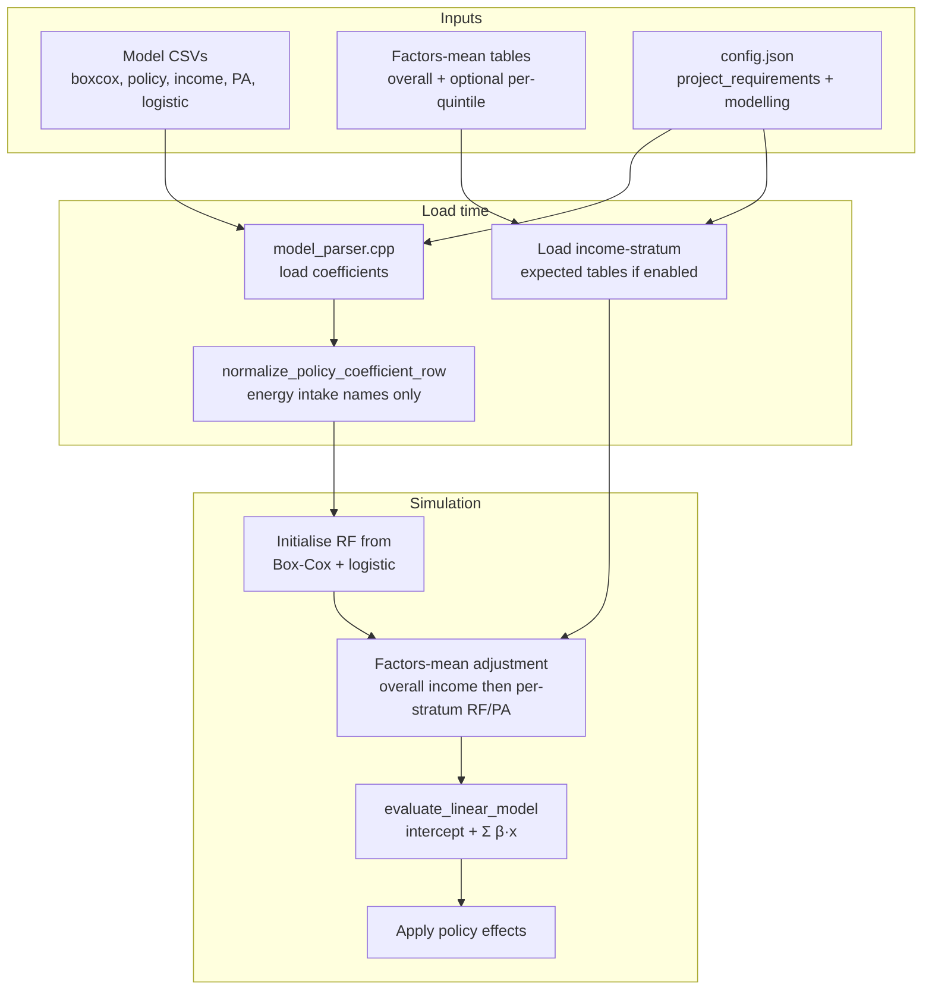
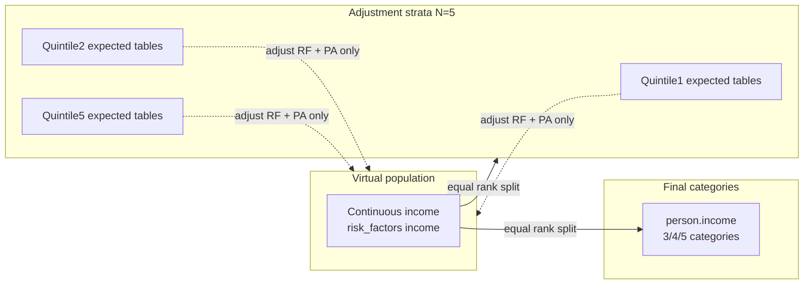
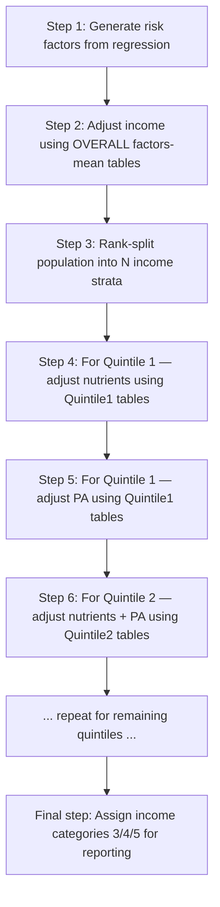

# FINCH linear models, predictor encoding, and income-stratum adjustment

## **Author:** Mahima

**Last updated:** June 2026
**Engineering contact:** **Mahima** — please reach out for implementation questions, config issues, or anything not covered here

## About this note

I put this document together for economists and modellers working on **FINCH** (and upcoming project) project in Health-GPS. It covers work I have recently integrated:

1. **Income-stratum factors-mean adjustment** — optional baseline adjustment by income quintile.
2. **How CSV predictor names map to regression terms** — `log_income`, `log_income2`, energy intake, dummies, etc.
3. **Questions colleagues have raised** about policy equations and coefficient consistency.
4. **`gender2` encoding** — FINCH convention and the `project_requirements.demographics.gender2` setting.

If anything is unclear or you need a walkthrough of the code path, contact **Mahima** :).

### Related documentation

| Topic | Document |
| ----- | -------- |
| Income-stratum adjustment (implementation plan) | [Income quintile factor means plan](../plans/income-quintile-factor-means-plan.md) |
| 3 / 4 / 5 income categories | [Dynamic income categories plan](../plans/dynamic-income-categories-plan.md) |
| `project_requirements` schema | [Project requirements plan](../plans/project-requirements-plan.md) |
| Feb 2026 integrated changes | [HealthGPS update report](../reports/healthgps-update-report-2026-02-20.md) |
| Kevin Hall height by quintile | [Height CSV quintile plan](../plans/height-csv-quintile-plan.md) |
| Kevin Hall weight by quintile | [Weight quintile plan](../plans/weight-quintile-plan.md) |
| All technical docs | [Technical documentation index](../README.md) |
| Documentation home | [docs/index.md](../../index.md) |

---

## Table of contents

1. [Overview diagram](#1-overview-diagram)
2. [Income-stratum factors-mean adjustment](#2-income-stratum-factors-mean-adjustment)
3. [Linear models and policy equations](#3-linear-models-and-policy-equations)
4. [Predictor naming reference](#4-predictor-naming-reference)
5. [Colleague Q&A](#5-colleague-qa)
6. [`gender2` encoding](#6-gender2-encoding)
7. [Configuration reference](#7-configuration-reference)
8. [What we deliberately did not change](#8-what-we-deliberately-did-not-change)

---

## 1. Overview diagram

High-level picture of how FINCH static linear models, factors-mean adjustment, and predictor evaluation fit together:



---

## 2. Income-stratum factors-mean adjustment

### 2.1 Why we added this

For FINCH projects with **continuous income**, we initialise risk factors from regression models, then optionally **adjust them to match expected population means** (factors-mean tables by sex and age).

Previously we only had one overall pair of tables:

| File                           | Role                     |
| ------------------------------ | ------------------------ |
| `Finch.FactorsMean.Male.csv`   | Expected means — males   |
| `Finch.FactorsMean.Female.csv` | Expected means — females |

**Income-stratum adjustment** lets us load **one male/female pair per income quintile** (or other rank bucket). Risk factors and physical activity are then adjusted **within each stratum**, using that stratum's expected table. Income itself is still adjusted against the **overall** table first.

This way the virtual population can match nutrient and activity patterns **conditional on income rank**, not only sex and age.

### 2.2 Two different “income bucket” concepts — do not mix them up

| Concept                     | Where in config                                                | What it does                                                                                                                                               |
| --------------------------- | -------------------------------------------------------------- | ---------------------------------------------------------------------------------------------------------------------------------------------------------- |
| **Final income categories** | `project_requirements.income.categories` (`"3"`, `"4"`, `"5"`) | Sets discrete `person.income` for reporting and other model logic. Assigned by equal rank split after continuous income is set.                            |
| **Adjustment strata**       | `modelling.baseline_adjustments.income_stratum_factors_mean`   | Rank buckets used **only** for factors-mean adjustment. Each bucket has its own expected CSV pair. Stored as `person.income_adjustment_stratum` (0 … N−1). |

**FINCH example:** we use `income.categories = "5"` and `adjustment_income_stratum_count = 5` with quintile-specific factors-mean files — five final categories **and** five adjustment strata, but they serve different purposes.



### 2.3 Configuration example

Under `modelling.baseline_adjustments` in `new_config.json`:

```json
"baseline_adjustments": {
    "format": "csv",
    "delimiter": ",",
    "encoding": "ASCII",
    "file_names": {
        "factorsmean_male": "Finch.FactorsMean.Male.csv",
        "factorsmean_female": "Finch.FactorsMean.Female.csv"
    },
    "income_stratum_factors_mean": {
        "enabled": true,
        "adjustment_income_stratum_count": 5,
        "strata": [
            {
                "id": "Quintile1",
                "factorsmean_male": "Finch.FactorsMean.Male.Quintile1.csv",
                "factorsmean_female": "Finch.FactorsMean.Female.Quintile1.csv"
            }
        ]
    }
}
```

(Full FINCH config lists Quintile1 … Quintile5.)

### 2.4 Validation rules (enforced at load)

| Rule              | Detail                                                                 |
| ----------------- | ---------------------------------------------------------------------- |
| `enabled = true`  | `adjustment_income_stratum_count` must be **≥ 2**                      |
| Strata count      | `strata.length` must **equal** `adjustment_income_stratum_count`       |
| Each stratum      | Non-empty `id`, `factorsmean_male`, `factorsmean_female`               |
| Missing data      | Missing files or risk factors → fail fast with stratum-specific errors |
| `enabled = false` | Legacy behaviour — overall male/female tables only                     |

Schema: `schemas/v1/config/modelling.json` → `baseline_adjustments.income_stratum_factors_mean`.

**See also:** [Income quintile factor means plan](../plans/income-quintile-factor-means-plan.md) (implementation phases) · [Dynamic income categories plan](../plans/dynamic-income-categories-plan.md) (final `person.income` buckets)

### 2.5 Adjustment flow — what happens, in order

This path runs when **all** of the following are true:

- `project_requirements.risk_factors.adjust_to_factors_mean = true`
- `project_requirements.income.type = "continuous"`
- `income_stratum_factors_mean.enabled = true`
- At least one stratum expected table loaded successfully

#### Step-by-step (initial generation)

Read this top to bottom. Each step finishes before the next one starts.

| Step     | What happens                                                                                                                                               | Which expected table?                               | Who is affected?         |
| -------- | ---------------------------------------------------------------------------------------------------------------------------------------------------------- | --------------------------------------------------- | ------------------------ |
| **1**    | Generate starting risk factors (nutrients, etc.) from Box–Cox / logistic / regression models                                                               | — (model CSVs only)                                 | Whole population         |
| **2**    | Adjust **income only**                                                                                                                                     | Overall `Finch.FactorsMean.Male.csv` / `Female.csv` | Whole population         |
| **3**    | Sort everyone by continuous income and split into **N equal rank buckets** (e.g. 5 quintiles). Each person gets `income_adjustment_stratum` = 0, 1, …, N−1 | —                                                   | Whole population         |
| **4a**   | Adjust **risk factors** (all nutrients — **not** income, **not** physical activity)                                                                        | Quintile **1** male/female tables                   | Only people in stratum 0 |
| **4b**   | Adjust **physical activity** (if enabled in config)                                                                                                        | Quintile **1** male/female tables                   | Only people in stratum 0 |
| **5a**   | Same as 4a                                                                                                                                                 | Quintile **2** tables                               | Only people in stratum 1 |
| **5b**   | Same as 4b                                                                                                                                                 | Quintile **2** tables                               | Only people in stratum 1 |
| …        | Repeat for quintiles 3, 4, 5 (or however many strata you configured)                                                                                       | Per-quintile tables                                 | One stratum at a time    |
| **Last** | Assign **final income categories** (3, 4, or 5 groups per `income.categories`)                                                                             | —                                                   | Whole population         |

**In plain terms:** income is calibrated to the **national** expected table first; then nutrients and PA are calibrated **separately within each income quintile**, using that quintile’s own factors-mean files.

#### Small example (N = 5 quintiles)

Suppose after step 2 we have 1,000 people and continuous income is spread across the population.

```text
Step 3 — split by income rank:
  Stratum 0 (Quintile1): lowest 200 people  → use Finch.FactorsMean.*.Quintile1.csv
  Stratum 1 (Quintile2): next 200 people    → use Finch.FactorsMean.*.Quintile2.csv
  Stratum 2 (Quintile3): middle 200         → use Finch.FactorsMean.*.Quintile3.csv
  Stratum 3 (Quintile4): next 200           → use Finch.FactorsMean.*.Quintile4.csv
  Stratum 4 (Quintile5): highest 200        → use Finch.FactorsMean.*.Quintile5.csv

Step 4–5 — for Quintile1 only:
  Adjust FoodCarbohydrate, FoodFat, … (not income, not PA) to match Quintile1 expected means by sex/age

Step 4–5 — for Quintile2 only:
  Same nutrients, but now using Quintile2 expected means
  … and so on for Quintile3, 4, 5
```



**Yearly updates** follow the same ordering for non-trended adjustment; trended paths mirror this with the relevant `trended` flags.

**Design choices we locked in:**

| Choice                                | Rationale                                                              |
| ------------------------------------- | ---------------------------------------------------------------------- |
| Income → **overall** table only       | Stratum tables are for conditional RF/PA means, not re-defining income |
| RF + PA → **per-stratum** tables      | Match observed patterns within income rank                             |
| Recompute strata each step            | Newborns and income changes stay in the correct bucket                 |
| Filter by `income_adjustment_stratum` | Only people in stratum *k* are adjusted in pass *k*                    |

### 2.6 Related `project_requirements` flags

| Field                                      | Effect                                           |
| ------------------------------------------ | ------------------------------------------------ |
| `risk_factors.adjust_to_factors_mean`      | Master switch for any factors-mean adjustment    |
| `income.adjust_to_factors_mean`            | Step 2 — overall income adjustment               |
| `income.trended`                           | Trended income adjustment in yearly trended path |
| `physical_activity.enabled`                | Whether PA is in the model                       |
| `physical_activity.adjust_to_factors_mean` | Per-stratum PA adjustment                        |
| `physical_activity.trended`                | Trended PA adjustment                            |

### 2.7 Debug output

When verbosity allows, the simulation prints an income-stratum assignment table at start year and start year + 1 (count, min/max/mean income per bucket, stratum id). Search logs for:

`[INCOME BASED FACTOR MEANS ADJUSTMENT][INCOME-STRATUM ASSIGNMENT]`

---

## 3. Linear models and policy equations

This section explains the maths in **plain language**. You do not need to read C++ to follow it.

### 3.1 Box–Cox risk-factor model (how a nutrient is generated)

Each nutrient (e.g. FoodCarbohydrate) goes through **two stages**.

**Stage A — build a linear score `Z`**

Add up the intercept and every predictor × its coefficient from the Box–Cox CSV:

```text
Z = intercept
  + (coef_gender2  × gender2)
  + (coef_age1     × age)
  + (coef_age2     × age²)
  + (coef_log_income × log(income))
  + … other predictors …
```

**Stage B — transform `Z` back to the nutrient scale `Y`**

Each nutrient has a **lambda** value in the CSV (row named `lambda`). Then:

| If lambda ≠ 0                 | If lambda = 0 |
| ----------------------------- | ------------- |
| `Y = (Z^lambda - 1) / lambda` | `Y = exp(Z)`  |

**Worked intuition:** the regression was fit on a transformed scale; the code computes `Z` exactly like the regression linear part, then reverses the Box–Cox transform to get the actual nutrient value stored on the person.

### 3.2 Policy effect equation (same structure as your spreadsheets)

Policy CSVs use the **same linear part** on the Box–Cox scale. For nutrient *i* (a column in the CSV):

```text
Z_i = Intercept
    + β_gender2    × gender2
    + β_age1       × age
    + β_age2       × age²
    + β_log_income × log(income)
    + β_log_income2 × (log(income))²
    + β_region2    × (1 if region 2, else 0)
    + β_region3    × (1 if region 3, else 0)
    + … etc …
    + β_log_energy × log(EnergyIntake)
```

**How the CSV maps to this:**

| In the CSV file                        | Meaning                                              |
| -------------------------------------- | ---------------------------------------------------- |
| **Column** (e.g. `FoodCarbohydrate`)   | The nutrient *i* — one equation per column           |
| **Row** (e.g. `gender2`, `log_income`) | A predictor — one term in the sum                    |
| **Cell** at (row, column)              | The coefficient β for that predictor × that nutrient |

Coefficients are read **directly from the CSV**. The code does not re-estimate or rescale them. They only work correctly if predictor values match how the regression was coded (Sections 4 and 6).

### 3.3 How the code adds up the linear part

In code, the linear score is:

```text
linear = intercept
       + sum of (coefficient[j] × predictor_value[j])   for each row j in the CSV
```

Special cases:

- Rows named `log_income`, `log_EnergyIntake`, etc. → the code computes **log of the underlying variable** before multiplying by β.
- Rows named `min`, `max`, `stddev`, `lambda` → stored for bounds/transforms, **not** added into the linear sum.

**Example for one person and one nutrient:**

| Predictor row | Coefficient (from CSV) | Person value       | Term added                |
| ------------- | ---------------------- | ------------------ | ------------------------- |
| Intercept     | 17.99                  | 1 (implicit)       | 17.99                     |
| gender2       | 0.062                  | 0 (male)           | 0                         |
| log_income    | −8.36                  | log(25000) ≈ 10.13 | −8.36 × 10.13 ≈ −84.7     |
| …             | …                      | …                  | …                         |
| **Sum**       |                        |                    | **→ Z for that nutrient** |


### 3.4 Code locations (for Mahima / developers)

| Step                            | File                         |
| ------------------------------- | ---------------------------- |
| Load CSV                        | `model_parser.cpp`           |
| Evaluate linear sum             | `linear_model_evaluator.cpp` |
| Resolve predictors              | `predictor_resolver.cpp`     |
| Box–Cox + adjustment + policies | `static_linear_model.cpp`    |

---

## 4. Predictor naming reference

### 4.1 Income and log-income

| CSV row name  | What the code plugs in                | Example (income = 20,000) |
| ------------- | ------------------------------------- | ------------------------- |
| `income`      | income on the person                  | 20,000                    |
| `income2`     | income² (levels, not log)             | 400,000,000               |
| `log_income`  | log(income)                           | ≈ 9.90                    |
| `log_income2` | (log(income))² — **not** log(income²) | ≈ 98.0                    |

**Critical rule — read the prefix:**

| Name          | Means                     | Does **not** mean    |
| ------------- | ------------------------- | -------------------- |
| `income2`     | income × income           | —                    |
| `log_income2` | log(income) × log(income) | log(income × income) |

### 4.2 Age

| CSV row              | What the code plugs in                                 |
| -------------------- | ------------------------------------------------------ |
| `age`, `age1`, `Age` | age (optionally capped by `max_age_for_linear_models`) |
| `age2`, `Age2`       | age × age                                              |
| `age3`, …            | age raised to that power                               |

### 4.3 Region and ethnicity dummies

| CSV row                                  | Value                                       |
| ---------------------------------------- | ------------------------------------------- |
| `region2`, `region3`, `region4`          | 1 if person in that region category, else 0 |
| `ethnicity2`, `ethnicity3`, `ethnicity4` | Same for ethnicity                          |

Reference category = omitted level (typically region1 / ethnicity1).

### 4.4 Energy intake in policy CSVs

`normalize_policy_coefficient_row()` **only** renames energy-intake rows:

| CSV row name        | After load          | What gets plugged in |
| ------------------- | ------------------- | -------------------- |
| `EnergyIntake`      | `log_energy_intake` | log(EnergyIntake)    |
| `log_EnergyIntake`  | `log_energy_intake` | log(EnergyIntake)    |
| `log_energy_intake` | `log_energy_intake` | log(EnergyIntake)    |

Switching from legacy `EnergyIntake` to `log_EnergyIntake` in scenario files (e.g. `S1_policyeffect_model.csv`) should **not** cause errors — both are equivalent after normalization.

This function does **not** create or rename `log_income`; that name comes straight from the CSV.

### 4.5 Metadata rows (not predictors)

| Row names                        | Role                                                               |
| -------------------------------- | ------------------------------------------------------------------ |
| `min`, `max`, `stddev`, `lambda` | Model bounds / dispersion — **not** summed in the linear predictor |

---

## 5. Colleague Q&A

Questions economists on the project have asked, with the answers we agreed on.

---

### Q1: Why doesn’t `normalize_policy_coefficient_row()` mention `log_income`?

**Answer:** `log_income` is **not** created by normalization. It is a **literal row name** in the policy CSV. The loader stores the coefficient; at evaluation the code computes `log(income)` when the row name starts with `log_`.

Normalization is **only** for energy-intake naming (Section 4.4).

---

### Q2: New policy files use `log_EnergyIntake` instead of `EnergyIntake` — will that error?

**Answer:** **No.** Both map to `log_energy_intake` and the code plugs in `log(EnergyIntake)`. The newer name is clearer; we are fine using it in new scenario files.

---

### Q3: Is the policy model “BoxCox(Y) = β₀ + β₁ X₁ + …” consistent with the code?

**Answer:** **Yes.**

| Your notation       | Code                                        |
| ------------------- | ------------------------------------------- |
| Columns = nutrients | Risk factor identifiers                     |
| Rows = predictors   | Coefficient map keys                        |
| β in each cell      | `coefficients[predictor]` for that nutrient |
| Box–Cox transform   | Applied after the linear sum Z is computed  |

Coefficients are not altered at load (except energy-intake **renaming**, not sign/magnitude changes).

---

### Q4: Should `log_income` be log(income) and `log_income2` be log(income) × log(income)?

**Answer:** **Yes.**

| CSV name      | Code plugs in                |
| ------------- | ---------------------------- |
| `log_income`  | log(income)                  |
| `log_income2` | log(income) × log(income)    |
| `income2`     | income × income (not logged) |

---

### Q5: Should `gender2` be male = 0 and female = 1?

**Answer:** **For FINCH, yes.** That matches how the regressions were estimated and how factors-mean files encode sex (`Gender` column: 0 = male, 1 = female in `Finch.FactorsMean.*.csv`).

On main **before** the `gender2` config fix, the integrated code incorrectly used **male = 1, female = 0** for the `gender2` CSV row. That applied the sex coefficient to the **wrong people**. **Negating all `gender2` coefficients is not a valid fix.**

**After the fix**, set in config:

```json
"gender2": "female"
```

so female = 1 and male = 0 for the `gender2` row. If omitted, default is `"male"` (backward compatibility for non-FINCH projects).

---

### Q6: Was it correct before the integrated codebase? Are main-branch FINCH runs wrong?

**Answer:** FINCH **data** convention (female = 1) did not change. The **regression evaluation** for the `gender2` row was wrong on main until `project_requirements.demographics.gender2` was wired through. FINCH simulations on main **before that fix** should be treated as **incorrect for the sex term** unless they ran on a branch with the fix.

Internally each person still has `male` / `female` as an enum — only the **dummy for the `gender2` CSV row** is configurable.

---

### Q7: Can we use `gender_to_value()` to get female = 1 for FINCH?

**Answer:** **Not for the `gender2` row.** `gender_to_value()` still returns male = 1, female = 0 (used for legacy `Gender` predictors, e.g. India). The `gender2` row uses `gender2_regression_value()` and the `gender2` config (Section 6).

---

## 6. `gender2` encoding

### 6.1 FINCH convention

| Sex    | `gender2` in regression | `Gender` in factors-mean CSV |
| ------ | ----------------------- | ---------------------------- |
| Male   | 0                       | 0                            |
| Female | 1                       | 1                            |

Dummy form (FINCH, after fix with `"gender2": "female"`):

```text
gender2 = 1  if person is female
gender2 = 0  if person is male
```

Contribution to the linear sum: `coef_gender2 × gender2`

### 6.2 Configuration

```json
"project_requirements": {
    "demographics": {
        "gender2": "female"
    }
}
```

| Config value | Meaning                                                     |
| ------------ | ----------------------------------------------------------- |
| `"female"`   | `gender2` = 1 for females, 0 for males (**FINCH**)          |
| `"male"`     | `gender2` = 1 for males, 0 for females (default if omitted) |

Schema: `schemas/v1/config/project_requirements.json`.

**See also:** [Project requirements plan](../plans/project-requirements-plan.md)

### 6.3 How gender2 is computed (plain logic)

```text
1. Read config:  project_requirements.demographics.gender2  →  "female" or "male"
2. That setting means: which sex gets the value 1 for the gender2 row
3. For each person:
     if person.sex matches the configured indicator  →  gender2 = 1
     else                                            →  gender2 = 0
4. Add to linear sum:  coef_gender2 × gender2
```

| Config `gender2`   | Female person | Male person |
| ------------------ | ------------- | ----------- |
| `"female"` (FINCH) | gender2 = 1   | gender2 = 0 |
| `"male"` (default) | gender2 = 0   | gender2 = 1 |

### 6.4 Which FINCH files use `gender2`

| File                                                     | Contains `gender2` row |
| -------------------------------------------------------- | ---------------------- |
| `boxcox_coefficients.csv`                                | Yes                    |
| `policyeffect_model.csv` / `S1_policyeffect_model.csv` … | Yes                    |
| `logistic_regression.csv`                                | Yes                    |
| `income_model.csv`                                       | Yes                    |
| `physicalactivity_model.csv`                             | Yes                    |

India-style models using a `Gender` JSON key (not `gender2`) are unchanged.

---

## 7. Configuration reference

### 7.1 FINCH `new_config.json` (key excerpt)

```json
{
    "project_requirements": {
        "demographics": {
            "age": true,
            "gender": true,
            "region": true,
            "ethnicity": true,
            "max_age_for_linear_models": 80,
            "gender2": "female"
        },
        "income": {
            "enabled": true,
            "type": "continuous",
            "categories": "4",
            "adjust_to_factors_mean": true
        },
        "physical_activity": {
            "enabled": true,
            "type": "continuous",
            "adjust_to_factors_mean": true
        },
        "risk_factors": {
            "adjust_to_factors_mean": true
        }
    },
    "modelling": {
        "baseline_adjustments": {
            "income_stratum_factors_mean": {
                "enabled": true,
                "adjustment_income_stratum_count": 5,
                "strata": [
                    { "id": "Quintile1", "factorsmean_male": "...", "factorsmean_female": "..." }
                ]
            }
        }
    }
}
```

### 7.2 Checklist before running FINCH with new features

| Check                                                        | ✓   |
| ------------------------------------------------------------ | --- |
| `income.type = "continuous"`                                 |     |
| `risk_factors.adjust_to_factors_mean = true`                 |     |
| `demographics.gender2 = "female"` for FINCH                  |     |
| If using strata: `enabled = true`, count = strata length ≥ 2 |     |
| Quintile CSV pairs exist for each stratum id                 |     |
| Policy CSV predictor names match Section 4                   |     |

---

## 8. What we deliberately did not change

| Item                                                           | Status                                         |
| -------------------------------------------------------------- | ---------------------------------------------- |
| CSV coefficient values                                         | No sign flips or re-estimation                 |
| Internal person sex (`male` / `female` enum)                   | Unchanged                                      |
| `gender_to_value()` for legacy `Gender` predictor              | Still male = 1 (e.g. India)                    |
| Disease logic, demographics, other predictors                  | Unchanged                                      |
| Legacy path when `income_stratum_factors_mean.enabled = false` | Same as before                                 |
| Default when `gender2` omitted                                 | `"male"` (male = 1) for backward compatibility |

---

## Questions?

For implementation detail, debugging, or config help, please contact **Mahima** (engineer on the Health-GPS integration).

**Useful source files:**

| Topic                     | Location                                                                    |
| ------------------------- | --------------------------------------------------------------------------- |
| Income stratum adjustment | `src/HealthGPS/static_linear_model.cpp`, `risk_factor_adjustable_model.cpp` |
| Config parsing            | `src/HealthGPS.Input/model_parser.cpp`, `configuration_parsing.cpp`         |
| Linear evaluation         | `src/HealthGPS/linear_model_evaluator.cpp`                                  |
| Predictors                | `src/HealthGPS/predictor_resolver.cpp`                                      |
| Schema                    | `schemas/v1/config/modelling.json`, `project_requirements.json`             |
| FINCH example             | `input-data/data/KevinHall_FINCH/new_config.json`                           |
| Tests                     | `IncomeStratumAdjustment.Test.cpp`, `PredictorResolver.Test.cpp`            |

---

*June 2026 — income-stratum adjustment and `demographics.gender2` on the Health-GPS development branch.*

[← Technical documentation index](../README.md) · [Documentation home](../../index.md)
