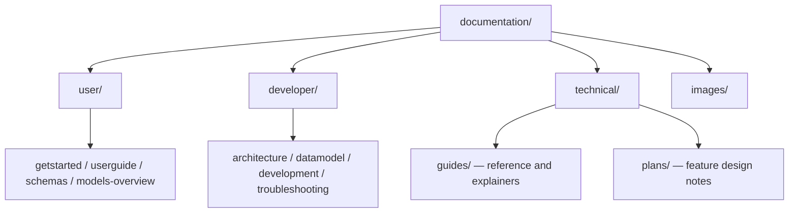

# Health-GPS documentation

## Global Health Policy Simulation model

| [Home](index.md) | [Quick Start](user/getstarted.md) | [User Guide](user/userguide.md) | [Schemas](user/schemas.md) | [Models](user/models-overview.md) | [Architecture](developer/architecture.md) | [Data Model](developer/datamodel.md) | [Developer Guide](developer/development.md) | [Technical docs](technical/README.md) | [API](https://imperialchepi.github.io/healthgps/api/) |

This folder is the project documentation. Start here, then pick the section that matches what you need.

There is also a longer site-style intro in [index.md](index.md) (diagrams and model overview).

---

## Documentation key (how folders differ)

Docs are split by **audience and job**, not by topic alone. The same subject (e.g. models or income strata) can appear in more than one place at different depths.

| Folder | Audience | What belongs here | What does *not* |
| ------ | -------- | ----------------- | --------------- |
| **[user/](user/)** | Modellers and analysts running Health-GPS | How to install/run, write config, choose modules/scenarios, read outputs, use schemas at a practical level | Deep C++ design, feature implementation checklists, build-toolchain debugging |
| **[developer/](developer/)** | Engineers building or changing the codebase | CMake/vcpkg/tests, architecture, data API, contribution flow, Windows/MSVC and Pages deploy troubleshooting | End-user “how do I set `config.json`?” walkthroughs; FINCH equation detail; open feature plans |
| **[technical/](technical/)** | Engineers *and* advanced modellers who need implementation truth | Domain/project deep-dives (FINCH, update reports, model I/O reference) plus engineering **plans** for specific features | Generic “first run” material; repo-wide build instructions (those stay in `developer/`) |

**Why three top-level folders?** `user/` stays runnable and short. `developer/` stays about the product as software. `technical/` holds longer domain notes and design work that would clutter either of the other two—without forcing every modeller through CMake, or every contributor through FINCH nutrient equations.

### Inside `technical/`: guides vs plans

| Subfolder | Role | Tone | Lifecycle |
| --------- | ---- | ---- | --------- |
| **[guides/](technical/guides/)** | Stable reference and explainers | “How it works / how to interpret inputs and logs” | Kept current; cite from user and developer pages |
| **[plans/](technical/plans/)** | Feature design notes | “What we intend to change, where in code, how to validate” | Living design docs; status may be Done/Planned; useful after merge as rationale |

**Rule of thumb:** if you are *using* the model → start in `user/`, jump to a `technical/guides/` page only when you need equations or FINCH-specific detail. If you are *building* or fixing the tree → start in `developer/`. If you are *implementing or reviewing a feature* → read the matching `technical/plans/` page, then the related guide.

### Supporting folders (not “content hubs”)

| Path | Purpose |
| ---- | ------- |
| `images/` | Shared figures (SVG/PNG) linked from pages |
| `images/finch/` | FINCH console-screenshot examples |
| `_includes/` | Jekyll/Pages helpers (e.g. Mermaid on the deployed site) |
| `assets/` | Site/theme assets if present |
| API on Pages (`/api`) | Doxygen C++ API — **not** stored under `documentation/`; built by the [docs workflow](../.github/workflows/docs.yml) |

**API reference:** Page headers link to **[API (Pages)](https://imperialchepi.github.io/healthgps/api/)**. Local clones will not have `documentation/api/`.

**Diagrams:** SVG figures live under `documentation/images/`. **Mermaid** (`` ```mermaid `` blocks) renders on the **built GitHub Pages site** via [`_includes/head-custom.html`](_includes/head-custom.html). On **github.com** when viewing `.md` source, Mermaid often appears as code—use the deployed site to review diagrams.

**Site navigation:** The top link row (Home, Schemas, Models, …) is plain markdown in each page so it reads correctly on GitHub; if you add a new doc hub link, update the nav line on the affected section pages.

Section indexes: [user/README.md](user/README.md) · [developer/README.md](developer/README.md) · [technical/README.md](technical/README.md)

---

## Quick links

| Need | Go to |
| ---- | ----- |
| First run / binaries | [Quick Start](user/getstarted.md) |
| Full user guide | [User Guide](user/userguide.md) |
| Config JSON schemas (diagrams) | [Configuration schemas](user/schemas.md) |
| Models and module I/O (overview) | [Models overview](user/models-overview.md) |
| Simulation models (detail) | [Simulation models reference](technical/guides/simulation-models-reference.md) |
| Build from source | [Developer Guide](developer/development.md) |
| Windows build broken (`cstdint`, `MSVCRTD.lib`) | [MSVC troubleshooting](developer/msvc-windows-build-troubleshooting.md) |
| Pages deploy failed (Configure HealthGPS) | [Docs deploy troubleshooting](developer/docs-deploy-troubleshooting.md) |
| Architecture | [Software Architecture](developer/architecture.md) |
| Data model | [Data Model](developer/datamodel.md) |
| FINCH / Kevin Hall inputs | [FINCH guide](technical/guides/finch-linear-models-and-income-adjustment.md) |
| What changed in Feb 2026 | [Update report](technical/guides/healthgps-update-report-2026-02-20.md) |
| All technical plans | [technical/README.md](technical/README.md) |

---

## Folder map



For documentation questions, use the **Author** line at the bottom of each page.

---

**Author:** Mahima Ghosh
