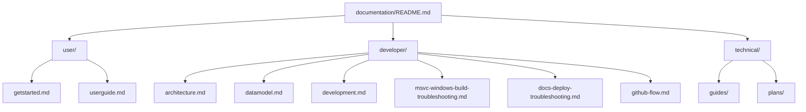

# Health-GPS documentation

This folder is the project documentation. Start here, then pick the section that matches what you need.

| Section | Who it is for | Index |
| ------- | ------------- | ----- |
| [user/](user/) | Running simulations, config, HPC | [user/README.md](user/README.md) |
| [developer/](developer/) | Building, architecture, contributions | [developer/README.md](developer/README.md) |
| [technical/](technical/) | FINCH guides, update notes, feature plans | [technical/README.md](technical/README.md) |

There is also a longer site-style intro in [index.md](index.md) (diagrams and model overview).

**API reference:** Page headers link to **[API (Pages)](https://imperialchepi.github.io/healthgps/api/)**. That Doxygen site is **not** checked into `documentation/`; the [docs workflow](../.github/workflows/docs.yml) builds it on deploy and publishes it under `/api` on GitHub Pages. Local clones will not have `documentation/api/`.

**Diagrams:** Existing figures are SVG under `documentation/images/`. Markdown **Mermaid** blocks (`` ```mermaid ``) are rendered on GitHub.com natively but need [`_includes/head-custom.html`](_includes/head-custom.html) for the Jekyll GitHub Pages build.

---

## Quick links

| Need | Go to |
| ---- | ----- |
| First run / binaries | [Quick Start](user/getstarted.md) |
| Full user guide | [User Guide](user/userguide.md) |
| Config JSON schemas (diagrams) | [Configuration schemas](user/schemas.md) |
| Models and module I/O (overview) | [Models overview](user/models-overview.md) |
| Build from source | [Developer Guide](developer/development.md) |
| Windows build broken (`cstdint`, `MSVCRTD.lib`) | [MSVC troubleshooting](developer/msvc-windows-build-troubleshooting.md) |
| Pages deploy failed (Configure HealthGPS) | [Docs deploy troubleshooting](developer/docs-deploy-troubleshooting.md) |
| Architecture | [Software Architecture](developer/architecture.md) |
| Data model | [Data Model](developer/datamodel.md) |
| FINCH / Kevin Hall inputs | [FINCH guide](technical/guides/finch-linear-models-and-income-adjustment.md) |
| What changed in Feb 2026 | [Update report](technical/guides/healthgps-update-report-2026-02-20.md) |
| All technical plans | [technical/README.md](technical/README.md) |

---

## How the folders fit together



Build and tooling notes live under **developer/** next to the normal build guide. FINCH and feature work live under **technical/**.

For documentation questions, use the **Author** line at the bottom of each page.

---

**Author:** Mahima Ghosh
