## Global Health Policy Simulation model

| [Home](../index.md) | [Quick Start](../user/getstarted.md) | [User Guide](../user/userguide.md) | [Schemas](../user/schemas.md) | [Models](../user/models-overview.md) | [Architecture](architecture.md) | [Data Model](datamodel.md) | [Developer Guide](development.md) | [Technical docs](../technical/README.md) | [API](https://imperialchepi.github.io/healthgps/api/) |

# Health-GPS Software & Architecture

This page is the engineer-facing **software architecture** for Health-GPS: how the C++ libraries fit together, how the Console host composes a run, how modules and scenarios interact, and where parallelism and messaging sit. It is written against the current tree under `src/`.

For build/CMake, see the [Developer Guide](development.md). For entity schemas in the Datastore, see the [Data Model](datamodel.md). For person-field maths and FINCH equations, use the [technical guides](../technical/README.md)—this page points at them instead of duplicating them.

**Source layout**

| Library | Path | Role |
| ------- | ---- | ---- |
| Host | `src/HealthGPS.Console` | CLI entry (`program.cpp`), event monitor, result writers |
| Engine | `src/HealthGPS` | `Simulation`, `Runner`, modules, scenarios, message bus |
| Core | `src/HealthGPS.Core` | `Datastore` contract, POCOs, shared types |
| Input | `src/HealthGPS.Input` | File `DataManager`, config/schema load, model registration |
| ADEVS | `src/external/adevs` | Discrete-event clock used by `hgps::Simulation` |
| Tests | `src/HealthGPS.Tests` | Unit / integration tests |

### Contents

1. [Components](#components)
2. [General workflow](#general-workflow)
3. [Host application](#host-application)
4. [Modules and factory](#modules-and-factory)
5. [Data model overview](#data-model-overview)
6. [Virtual population: initialise and update](#virtual-population-initialise-and-update)
7. [Risk-factor pipeline](#risk-factor-pipeline)
8. [Energy balance / Kevin Hall](#energy-balance--kevin-hall)
9. [Message bus](#message-bus)
10. [Policy levers](#policy-levers)
11. [Baseline / intervention sync](#baseline--intervention-sync)
12. [Parallelism](#parallelism)
13. [Deployment](#deployment)

---

## Components

The deployable stack has four logical pieces. Today the shippable host is `HealthGPS.Console`; another host (for example a GUI) can link the same libraries.

| 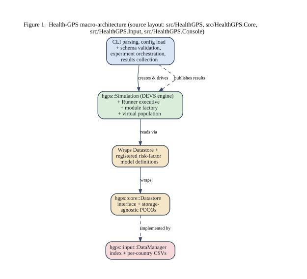 |
|:----------------------------------------------------------------------------:|
| *Health-GPS microsimulation components* |

- **Host application** — parses configuration, sets up infrastructure, builds `Simulation` instance(s), runs the experiment via `Runner`, and writes results (`src/HealthGPS.Console`).
- **Health-GPS model (engine)** — `Simulation`, modules, scenarios, and algorithms that create the virtual population, step through time, and publish results (`src/HealthGPS`).
- **Backend data storage** — the `hgps::core::Datastore` interface and persistence-agnostic POCOs (`src/HealthGPS.Core/datastore.h`).
- **File-based data storage** — `hgps::input::DataManager` (`src/HealthGPS.Input`), which implements `Datastore` from files. Another storage backend can replace it without changing the engine.

Input preparation, parameter fitting, and results analysis stay *outside* the microsimulation (R, Julia, Python, and so on). Country-indexed reference data go through the Datastore; project-specific modelling CSVs (FINCH policy equations, income strata, height/weight curves, PIF, …) are loaded via Input / modelling config.

---

## General workflow

Datasets from many sources define modules and parameters. Common country datasets are reconciled into the Datastore; research-specific risk-factor and intervention inputs are prepared externally and referenced from configuration.

| 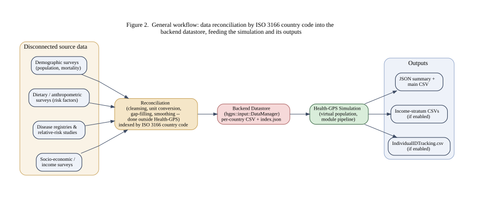 |
|:---------------------------------------------------------------------------------------:|
| *Health-GPS general workflow* |

At a high level a run:

1. Loads and validates config (JSON schemas) and datastore files.
2. Registers risk-factor model definitions and builds the module factory.
3. Creates the event bus, result writers, `Runner`, and a shared `SyncChannel`.
4. Builds a baseline `Simulation` (and optionally an intervention pair).
5. Executes trial runs; analysis publishes yearly results; the host writes JSON/CSV (and optional income-stratum or individual ID-tracking CSVs).

How to configure outputs as a modeller: [User Guide — Results](../user/userguide.md#results).

---

## Host application

The Console host is the reference composition path. Entry point: `src/HealthGPS.Console/program.cpp`.

| 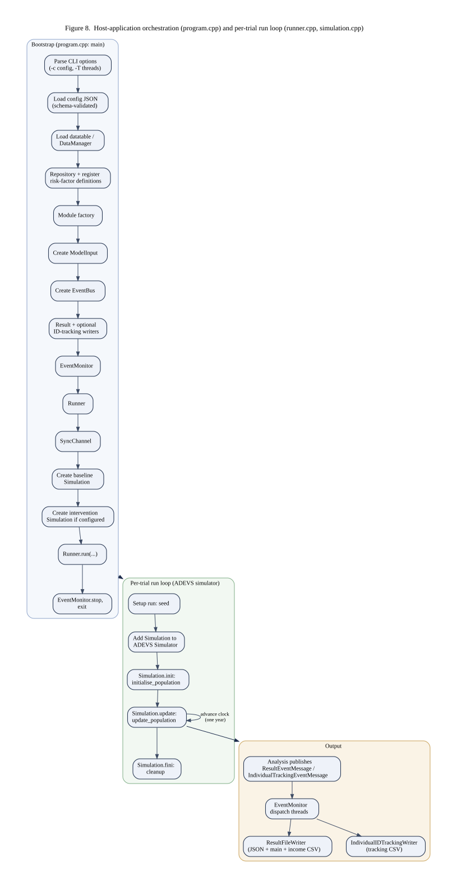 |
|:------------------------------------------------------------------------------:|
| *Console host: compose and run an experiment* |

Typical compose order in `main`:

1. Parse CLI / load config (`HealthGPS.Input` configuration helpers).
2. Optionally cap TBB parallelism (`tbb::global_control` when `--threads` is set).
3. Construct `input::DataManager` and wrap it in `hgps::CachedRepository`.
4. `register_risk_factor_model_definitions(...)` then `get_default_simulation_module_factory(repository)`.
5. Build `ModelInput` from config + country + diseases.
6. Create `DefaultEventBus`, `EventMonitor`, `ResultFileWriter` (and optional `IndividualIDTrackingWriter`).
7. Create `Runner` with a master seed generator.
8. Create a shared `SyncChannel`.
9. `create_baseline_simulation(...)`; if an intervention is active, also `create_intervention_simulation(...)` (both helpers live under `src/HealthGPS.Input/configuration.*`).
10. `runner.run(baseline[, intervention], trial_runs)` then stop the event monitor.

Dry-run mode validates inputs and exits before constructing the runner.

---

## Modules and factory

The framework is modular. Simulation behaviour is composed from modules that share a common interface and are created through a **factory** with registered builders.

| 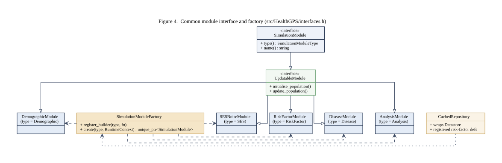 |
|:----------------------------------------------------------------------------------:|
| *Simulation modules, factory, and repository access* |

**Module types** (`SimulationModuleType` in `src/HealthGPS/interfaces.h`):

| Enum value | Typical class | Responsibility |
| ---------- | ------------- | -------------- |
| `RiskFactor` | `RiskFactorModule` | Hosts static + dynamic risk-factor model packs |
| `SES` | SES noise module | Continuous `ses` noise on `Person` |
| `Demographic` | `DemographicModule` | Age/gender, births/deaths, residual mortality, migration drivers |
| `Disease` | Disease host | NCD (`others`) and `cancers` sub-models |
| `Analysis` | `AnalysisModule` | BoD-style indicators; publishes result events |

Policy **scenarios** are *not* a `SimulationModuleType`; each `Simulation` owns one `Scenario` object (see [Policy levers](#policy-levers)).

Default builders are registered in `get_default_simulation_module_factory` (`src/HealthGPS/simulation_module.cpp`): SES, Demographic, RiskFactor, Disease, Analysis.

**Factory create order vs runtime call order**

In the `Simulation` constructor (`src/HealthGPS/simulation.cpp`), modules are created as: SES → Demographic → RiskFactor → Disease → Analysis. That is ownership/wiring order only.

Runtime call order is fixed in `initialise_population` / `update_population` (next section). Do not assume factory registration order is the yearly update order.

Builders receive the `Repository` (and thus the `Datastore`) plus `ModelInput` so they can load parameters when constructing module instances. The Console host uses `CachedRepository` so baseline and intervention simulations can share loaded definitions.

---

## Data model overview

The backend **data model** is the country-indexed reference dataset contract. Physical files are behind `Datastore`; the engine stays storage-agnostic.

| 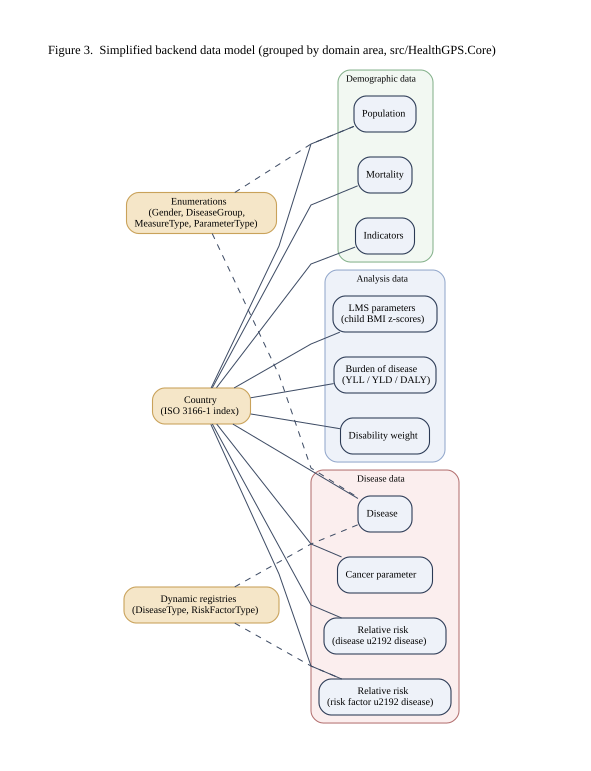 |
|:--------------------------------------------------------------------------:|
| *Backend data model (conceptual)* |

- Contract: `hgps::core::Datastore` — `src/HealthGPS.Core/datastore.h`
- File implementation: `hgps::input::DataManager` — `src/HealthGPS.Input/datamanager.*`
- POCOs / entities: `src/HealthGPS.Core` (country, population, mortality, disease, analysis types, …)
- Engine-facing cache: `Repository` / `CachedRepository` — `src/HealthGPS/repository.*`

Indexed by [ISO 3166](https://www.iso.org/iso-3166-country-codes.html) country code. Entity relationships, enumerations, and field-level schema: **[Data Model](datamodel.md)**.

Project modelling CSVs (policy effects, factors-mean strata, height/weight curves) are separate from this Datastore ER view; see [Models overview](../user/models-overview.md) and the [simulation models reference](../technical/guides/simulation-models-reference.md).

---

## Virtual population: initialise and update

All modules act on a virtual population of `Person` entities stored in a `Population` wrapper (`src/HealthGPS/person.h`, `population.*`). The engine class is **`hgps::Simulation`** (`simulation.h` / `simulation.cpp`)—there is no separate `HealthGPS` engine type or `SimulationDefinition` in the current tree.

| 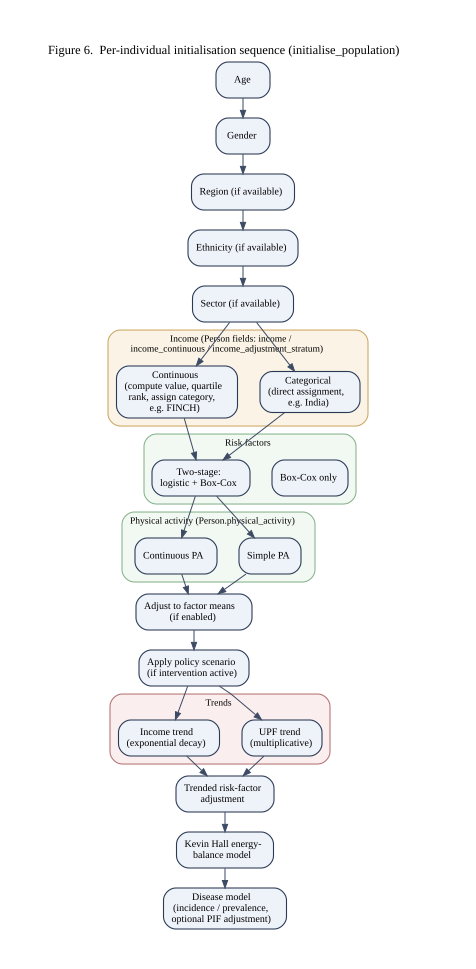 |
|:--------------------------------------------------------------------------------:|
| *Virtual population initialise and yearly update* |

**Construction.** The Console path builds:

```text
Simulation(SimulationModuleFactory& factory,
           shared_ptr<const EventAggregator> bus,
           shared_ptr<const ModelInput> inputs,
           unique_ptr<Scenario> scenario)
```

The engine owns module instances and a `RuntimeContext` (population, scenario, settings, RNG, bus, clock).

**Initialise** (`Simulation::initialise_population`) — order is required:

1. Size and `reset_population`
2. Demographic
3. SES
4. RiskFactor (static pack `generate`, then dynamic pack `generate`)
5. Disease
6. Analysis

**Yearly update** (`Simulation::update_population`):

1. Demographic (with disease for mortality)
2. Net immigration (`update_net_immigration`)
3. SES
4. RiskFactor (static pack `update`, then dynamic pack `update`)
5. Disease
6. Analysis

Main `Person` fields used across modules: lifetime-unique `id` within one population; `age`, `gender`; optional `sector` / `region` / `ethnicity`; `income`, `income_continuous`, `income_adjustment_stratum`; `physical_activity`; alive/emigration flags; continuous `ses`; `risk_factors` map; `diseases` map.

Per-attribute assignment and update maths: [How Health-GPS models a person](../technical/guides/how-healthgps-models-a-person.md). Sequence diagrams already on the site intro: [index.md](../index.md) (and SVGs such as `initialise_sequence.svg` / `update_sequence.svg` under `documentation/images/`).

---

## Risk-factor pipeline

Config exposes two risk-factor **slots** historically named `static` and `dynamic`. Those names are **pipeline roles** (packs registered as `RiskFactorModelType::Static` and `::Dynamic`), not labels for individual nutrients.

| 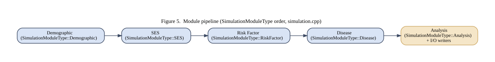 |
|:------------------------------------------------------------------------:|
| *Static and dynamic risk-factor packs inside RiskFactorModule* |

`RiskFactorModule` (`src/HealthGPS/riskfactor.cpp`) always requires both packs:

| Phase | Call order |
| ----- | ---------- |
| Initialise | Static `generate_risk_factors` → Dynamic `generate_risk_factors` |
| Yearly update | Static `update_risk_factors` → Dynamic `update_risk_factors` |

So both packs run at **initialisation and** on every yearly update. Do not read “static = init only” / “dynamic = update only”—that wording is obsolete relative to the code.

Concrete models include hierarchical linear models, static linear models (FINCH-style), and Kevin Hall (typically registered in the dynamic slot). Clarification for modellers: [Models overview — static vs dynamic](../user/models-overview.md#the-confusing-words-static-and-dynamic). Per-model I/O: [Simulation models reference](../technical/guides/simulation-models-reference.md).

---

## Energy balance / Kevin Hall

Childhood obesity and energy-balance style pathways are implemented primarily by `KevinHallModel` (`src/HealthGPS/kevin_hall_model.*`), usually as the dynamic pack. Architecture-wise it sits inside the risk-factor host and participates in generate/update like any other pack.

| 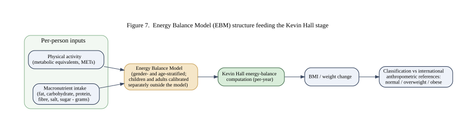 |
|:-------------------------------------------------------------------:|
| *Energy-balance / Kevin Hall placement in the framework* |

When weight (or related) mean adjustment is enabled across paired scenarios, Kevin Hall exchanges aggregate adjustment tables over the shared `SyncChannel` (`send_weight_adjustments` / `receive_weight_adjustments`). That is scenario sync, not person copying—see [Baseline / intervention sync](#baseline--intervention-sync).

Equations, nutrients, BMI, and FINCH wiring: [simulation models reference](../technical/guides/simulation-models-reference.md), [FINCH guide](../technical/guides/finch-linear-models-and-income-adjustment.md), [how a person is modelled](../technical/guides/how-healthgps-models-a-person.md).

---

## Message bus

Outside communication uses an in-process **event aggregator**. The host supplies the bus when constructing `Simulation`; analysis and the runner publish; Console subscribers write files and log progress.

| 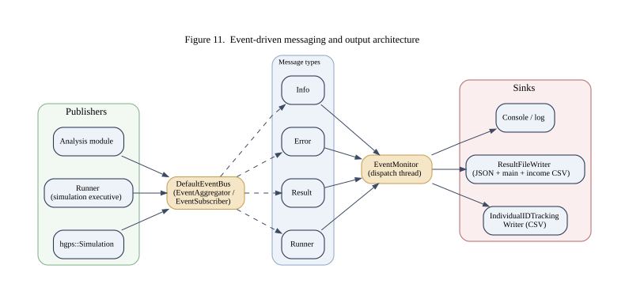 |
|:-----------------------------------------------------------------:|
| *Event aggregator / message bus* |

| Piece | Location |
| ----- | -------- |
| Interface | `EventAggregator` — `event_aggregator.h` |
| Default impl | `DefaultEventBus` — `event_bus.h` / `.cpp` |
| Message base / types | `event_message.h` |
| Host consumer | `EventMonitor` — `src/HealthGPS.Console/event_monitor.*` |

**`EventType`** values:

| Type | Typical use |
| ---- | ----------- |
| `runner` | Executive start / run begin / finish / cancel (`Runner`) |
| `info` | Progress and informational notices from the engine |
| `result` | Yearly analysis aggregates → result file writer |
| `individual_tracking` | Optional per-person tracking rows → ID-tracking CSV |
| `error` | Error reporting |

`EventMonitor` subscribes to all of the above. Publishers include `Runner::notify`, `RuntimeContext::publish` / analysis `ResultEventMessage`, and optional individual-tracking publishers. Scaling to an external broker (RabbitMQ, Kafka) is a possible custom-host design; the Console path is in-process only.

---

## Policy levers

Each `Simulation` takes one `Scenario`. Scenarios change how risk-factor updates (and related policy hooks) behave; they are **not** registered as simulation modules.

| 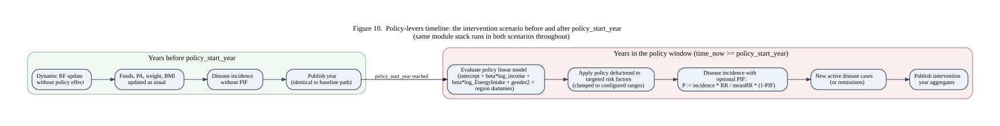 |
|:---------------------------------------------------------------------:|
| *Baseline vs intervention policy scenarios* |

| Kind | Examples | Notes |
| ---- | -------- | ----- |
| Baseline | `BaselineScenario` | Status-quo path; typically pass-through for policy apply |
| Intervention | `SimplePolicyScenario`, `MarketingPolicyScenario`, `MarketingDynamicScenario`, `FoodLabellingScenario`, `PhysicalActivityScenario`, `FiscalPolicyScenario` | Built via `create_intervention_scenario` in Input configuration |

Intervention start year and scenario type come from config (`running` / modelling CSVs). The **same** module stack runs in both scenarios; only the intervention scenario evaluates policy equations after `policy_start_year`, and only intervention may apply optional PIF to disease incidence.

Modeller-oriented policy sequence: [index.md — Policy levers](../index.md#policy-levers-sequence). FINCH policy CSVs: [FINCH guide](../technical/guides/finch-linear-models-and-income-adjustment.md).

---

## Baseline / intervention sync

When an intervention is configured, the Runner starts baseline and intervention simulations together (separate threads, separate `Person` populations). They share one `SyncChannel` (`Channel<unique_ptr<SyncMessage>>`, aliases in `scenario.h` / `channel.h`).

| 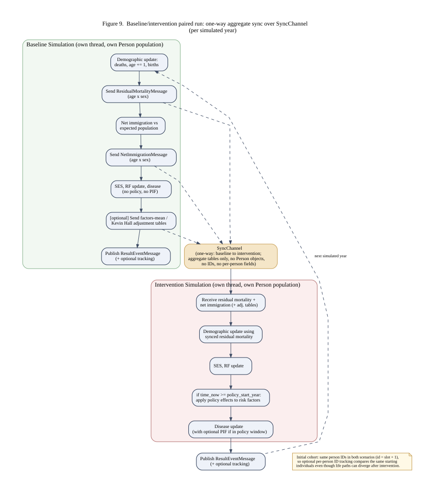 |
|:-----------------------------------------------------------------:|
| *One-way aggregate synchronisation baseline → intervention* |

Sync is **one-way: baseline → intervention**, and transfers **aggregate tables only** (not individual people, IDs, or per-person risk factors).

Message kinds used in the current tree include:

| Message (conceptual) | Payload idea | Where |
| -------------------- | ------------ | ----- |
| Residual mortality | age × sex table | `demographic.cpp` send / receive |
| Net immigration | age × sex counts | `simulation.cpp` (`NetImmigrationMessage`) |
| Risk-factor mean adjustment | sex × age × factor table | `risk_factor_adjustable_model.cpp` |
| Kevin Hall weight adjustment | sex × age weights | `kevin_hall_model.cpp` |

Initial cohort person IDs can still match across scenarios (`id = slot + 1`) so optional ID-tracking CSVs compare the same starting individuals even though populations are not synced. Design notes: [same-person ID plan](../technical/plans/same-person-id-baseline-intervention-plan.md), [individual ID tracking plan](../technical/plans/individual-id-tracking-csv-plan.md).

---

## Parallelism

Health-GPS uses **two levels** of parallelism.

| 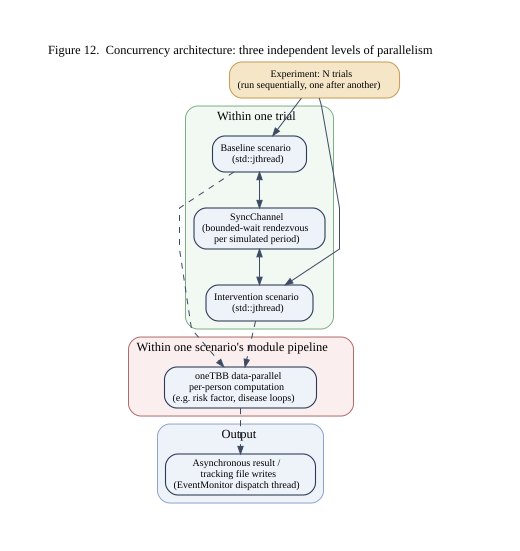 |
|:----------------------------------------------------------------------:|
| *Runner scenario threads and population-level parallel loops* |

**1. Simulation executive (`Runner`, `src/HealthGPS/runner.cpp`)**

- Baseline-only: one `std::jthread` per trial (`run(baseline, trial_runs)`), joined before the next trial.
- Baseline + intervention: two `std::jthread`s per trial (baseline and intervention), same run seed, joined together (`run(baseline, intervention, trial_runs)`).
- Each thread drives an ADEVS `Simulator` over that scenario’s `Simulation` (`run_model_thread`).

**2. Population / module work (TBB)**

Modules use Intel oneTBB (`tbb::parallel_for_each`, `core::parallel_for`, and related) over people or table slices—for example demographics, disease models, analysis, and adjustable risk-factor code. The Console host can cap the TBB thread pool with `tbb::global_control` from CLI.

Indirect synchronisation between paired scenarios (FIFO `SyncChannel`) adds a small overhead versus fully independent runs. Sizing and optimisation notes: [Performance optimizations](../technical/guides/performance-optimizations.md).

---

## Deployment

The host executable packages Console + engine + Core + Input for each target platform. The Datastore content is platform-independent but must be present and correctly configured at runtime. Binaries are compiler/platform dependent (C++20); build and test per platform.

See [Developer Guide](development.md) for CMake presets, vcpkg, tests, and HPC notes. API reference (Doxygen on GitHub Pages): [API](https://imperialchepi.github.io/healthgps/api/).

---

### Related documentation

| Topic | Document |
| ----- | -------- |
| Developer docs index | [developer/README.md](README.md) |
| Data model (Datastore ER / entities) | [Data Model](datamodel.md) |
| Build / CMake / vcpkg / tests | [Developer Guide](development.md) |
| GitHub flow | [GitHub Flow](github-flow.md) |
| How a virtual person is modelled | [How Health-GPS models a person](../technical/guides/how-healthgps-models-a-person.md) |
| Per-model inputs and outputs | [Simulation models reference](../technical/guides/simulation-models-reference.md) |
| FINCH / income / predictors | [FINCH guide](../technical/guides/finch-linear-models-and-income-adjustment.md) |
| Models overview (static vs dynamic) | [Models overview](../user/models-overview.md) |
| Config / results for modellers | [User Guide](../user/userguide.md) |
| Feb 2026 integrated changes | [Update report](../technical/guides/healthgps-update-report-2026-02-20.md) |
| Threading and HPC sizing | [Performance guide](../technical/guides/performance-optimizations.md) |
| Technical docs index | [technical/README.md](../technical/README.md) |
| Documentation home | [documentation/README.md](../README.md) |
| Site intro (Mermaid sequences) | [index.md](../index.md) |

---


---

**Author:** Mahima Ghosh
