## Global Health Policy Simulation model



# Software Architecture

**Source layout:** `src/HealthGPS` (engine), `src/HealthGPS.Core` (Data API / POCOs), `src/HealthGPS.Input` (file datastore + config), `src/HealthGPS.Console` (host), `src/HealthGPS.Tests`. ADEVS is vendored under `src/external/adevs`.

The Health-GPS software architecture uses a modular design. It is written in modern [C++20][cpp20]. The deployable stack has four main pieces:

| 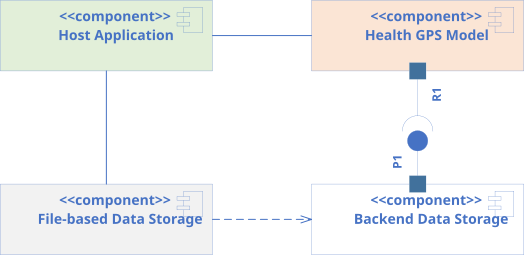 |
|:------------------------------------------------------:|
|        *Health-GPS Microsimulation Components*         |

- ***Host Application*** - parses the configuration, sets up infrastructure, builds `Simulation` instance(s), runs the experiment via `Runner`, and writes results. Today that host is `HealthGPS.Console` (`src/HealthGPS.Console`). A GUI or other host can use the same libraries.
- ***Health-GPS Model*** - the microsimulation engine (`Simulation`), executive (`Runner`), modules, and algorithms that create the virtual population, step through time, and publish results.
- ***Backend Data Storage*** - the `Datastore` interface (`src/HealthGPS.Core/datastore.h`) and persistence-agnostic POCOs used to initialise modules.
- ***File-based Data Storage*** - `hgps::input::DataManager` in `src/HealthGPS.Input`, which implements `Datastore` from files. Another storage backend can replace it without changing the engine.

These components along with the physical data storage are the *minimum package* to deploy and use the Health-GPS microsimulation. All input data processing, model parameters fitting, and results analysis procedures are carried out *outside* the microsimulation using tools such R, Julia and Python which are very efficient in data wrangling, statistical analysis, and machine learning algorithms.

The Health-GPS framework adopts a modular design to specify the building blocks necessary to compose the overall system, several modules and sub-model types are required as shown below.

|   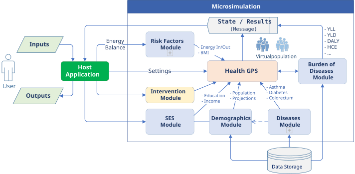   |
|:-----------------------------------------------------:|
| *High-level Architecture of the Health-GPS Framework* |

- ***Inputs*** - configuration JSON (validated against schemas), model hierarchy and fitted parameters, disease selection, intervention scenario, and run-time settings. Project-specific CSVs (FINCH policy equations, income stratum tables, height/weight curves, PIF, and so on) are loaded through Input / modelling config, not only through the country Datastore.
- ***Host Application*** - processes inputs, creates simulations, runs the experiment, and writes outputs.
- ***Data Storage*** - country-indexed reference datasets (births, deaths, population, relative risks, epidemiology, disability weights, LMS, and related). Indexed by [ISO 3166](https://www.iso.org/iso-3166-country-codes.html) country code. New country files can be added without engine changes.
- ***Risk Factors Module*** - hosts risk-factor models registered as static and/or dynamic. Implementations include hierarchical linear models (`StaticHierarchicalLinearModel`, `DynamicHierarchicalLinearModel`), static linear models used for FINCH-style pipelines (`StaticLinearModel`), and the Kevin Hall energy-balance model (`KevinHallModel`). Static models run at initialisation; dynamic models run on later yearly updates.
- ***SES Module*** - assigns socio-economic status noise (`ses`) used as a continuous proxy. Income is modelled separately on `Person` (category, continuous value, optional adjustment stratum). See the [FINCH guide](../technical/guides/finch-linear-models-and-income-adjustment.md) and [update report](../technical/guides/healthgps-update-report-2026-02-20.md).
- ***Demographics Module*** - population size, age, gender, births, deaths, and residual mortality; also drives net immigration. Person demographics can include sector, region, and ethnicity when configured.
- ***Diseases Module*** - hosts disease sub-models (`others` and `cancers` groups). Optional population impact fraction (PIF) adjustment can modify incidence when configured.
- ***Analysis Module*** (Burden of Diseases) - collects indicators (prevalence, exposure, YLL/YLD/DALY, income strata, and related channels) and publishes `ResultEventMessage`s on the message bus.
- ***Policy scenarios*** - not a `SimulationModuleType`. Baseline and intervention behaviour is a `Scenario` object passed into each `Simulation` (for example `BaselineScenario`, fiscal, marketing, food labelling, physical activity). Interventions may need extra data and code.
- ***Simulation engine*** - class `hgps::Simulation` (`src/HealthGPS/simulation.h`). Owns module instances, `RuntimeContext`, clock, and call order for initialise / update. Progress and results go out through the event bus.
- ***Output*** - the Console host writes results from analysis messages: JSON, a main CSV, optional income-stratum CSVs (`ResultFileWriter`), and optionally a per-person tracking CSV (`IndividualIDTrackingWriter`). Results can also be consumed live over the bus (for example toward a broker such as [RabbitMQ][broker] or [Kafka][kafka] in a custom host).

The *simulation engine* clock and events scheduling is based on the *Discrete Event System Specification* ([DEVS][devs]) and provided by the [ADEVS][adevs] library. The simulation results are streamed asynchronous to the outside world via the *message bus* instance provided to the model by the *host application* during initialisation.

The software architecture defines interfaces for modules, sub-models, and external communication; these abstractions provide decoupling, reuse, and flexibility for composing the microsimulation to answer different research questions. All modules share a common interface, as shown below, to enable dynamic registration of different modules version using a *factory pattern*, which also makes available the underline data infrastructure and user inputs for module instance creation.

| 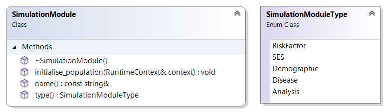 |
|:------------------------------------------------------------------:|
|                *Simulation Module Common Interface*                |

The *simulation module type* enumeration (`SimulationModuleType` in `src/HealthGPS/interfaces.h`) is: `RiskFactor`, `SES`, `Demographic`, `Disease`, `Analysis`. The engine asks the module factory for each type. `RuntimeContext` holds the virtual population, scenario, run number, time, RNG, bus, and settings for module calls.

|        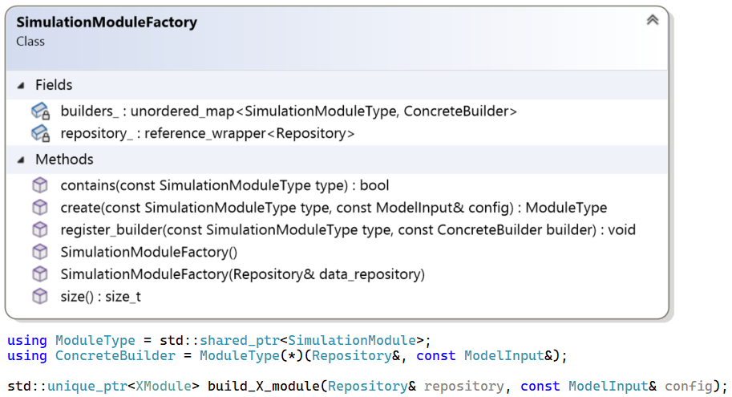        |
|:---------------------------------------------------------------------:|
| *Module Factory Class Diagram with Concrete Builder Function example* |

The *module builder* functions have access to both the model inputs and backend data storage (Repository) when requested to create the respective simulation module instance. The *Repository* interface shown below provides read-only access to external datasets loaded via configuration to parameterise the risk factor module, and exposes the `Datastore` interface implementation. The factory registered module builders can retrieve the required raw data, reshape, and combine to create the respective module parameters definition and instance.

| 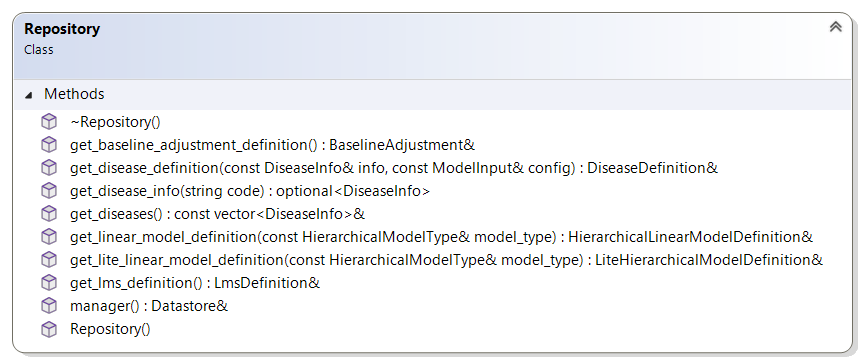 |
|:---------------------------------------------------------:|
|            *Data Repository Interface Diagram*            |

This design exposes datasets to factory builders. In the current Console host, a `CachedRepository` wraps the datastore and registered risk-factor model definitions so baseline and intervention simulations can share loaded data.

The *backend data storage* interface shown below defines the `Datastore` contract: a typed, storage-agnostic access layer.

| 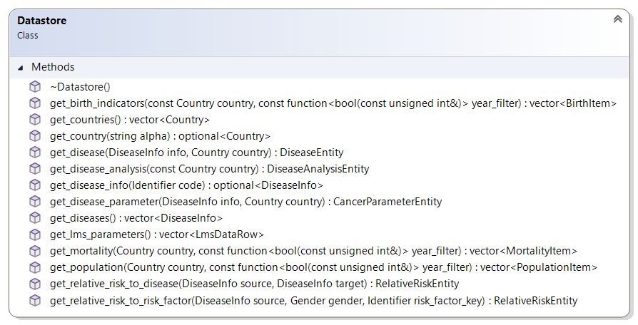 |
|:-------------------------------------------:|
|        *Backend Data API Interface*         |

> See [Data Model](datamodel.md) for the backend data model.

To take the ***virtual population*** through time, the simulation modules have different requirements, and consequently the simulation module interface has been extended with new properties and operations to satisfy the different modules as shown below.

| 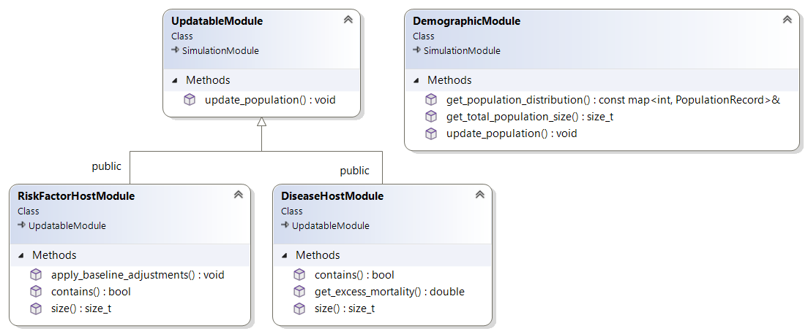 |
|:-----------------------------------------------------------------------:|
|              *Extended Simulation Module Common Interface*              |

All modules must initialise the virtual population at the beginning of the simulation and update the respective properties at each subsequent simulated time step until the simulation ends. Modules providing additional functionality to the simulation algorithm such as population trends and disease indicators have specific extension added to their interfaces.

The two *host modules*, risk factor and disease respectively, are special containers for similar *sub-models* and likewise are responsible for managing the creation, ownership and execution order when requested by the simulation engine or other modules.

The *risk factor* module hosts models supplied through configuration. Models implement `RiskFactorModel` with type `Static` or `Dynamic` (`src/HealthGPS/risk_factor_model.h`). Concrete types include hierarchical linear models, static linear models (FINCH-style), and Kevin Hall. Static models initialise the population; dynamic models update it each year.

| 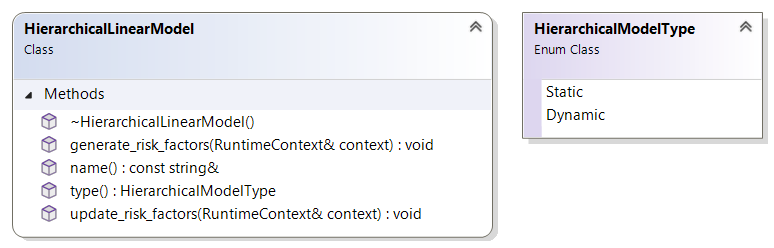 |
|:--------------------------------------------------------------------------:|
|                *Hierarchical Linear Model Common Interface*                |

The *disease* module hosts multiple instances of disease models from known groups, configured for different diseases definition. The disease model public interface is shown below; diseases are uniquely identified by type, two groups of diseases a current modelled: *others* and *cancers*, the first represents general noncommunicable diseases, and the second types of cancer respectively.

| 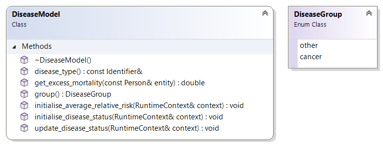 |
|:----------------------------------------------------------------:|
|                 *Disease Model Common Interface*                 |

The main difference between the two groups of diseases is on internal modelling, both groups’ definition is country-based and include rates for disease: prevalence, incidence, mortality and remission by age and gender; and relative risks for diseases and risk factors. However, cancers detection, mortality and remission are modelled differently from the others’ group and require an additional set of parameters data to be provided as part of the definition.

## Virtual Population

All modules act on a *virtual population* of entities, individuals, or actors, that are the centre of the microsimulation model. The Health-GPS population is dynamic and changes over time with births, deaths and immigration being the events affecting the population size. The entire population is stored using a C++ standard library vector<T> for dynamic memory management and exception safety, the vector is protected with the thin wrapper for easy access.

Below are the class diagrams for the thin *Population* wrapper, the virtual *Person* data structure and associated types as used to represent individuals within the simulated virtual population.

| 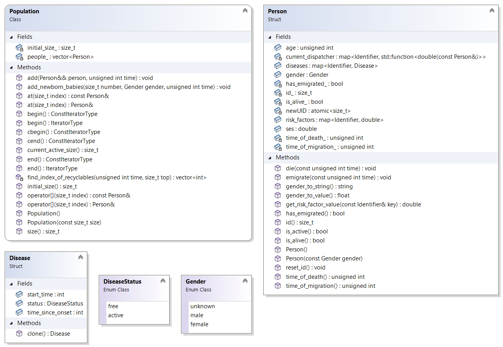 |
|:---------------------------------------------------------------:|
|            *Virtual Population’s Entity definition*             |

Individuals get a lifetime-unique `id` within one `Population` (not reused after death or emigration; default-constructed persons stay unassigned until placed). Main fields on `Person` (`src/HealthGPS/person.h`):

- ***id*** - lifetime-unique within one population / simulation run.
- ***age*** - years; newborns start at zero; updated each step.
- ***gender*** - `core::Gender` (including `unknown` until set).
- ***sector***, ***region***, ***ethnicity*** - optional demographics from config / CSV.
- ***income***, ***income_continuous***, ***income_adjustment_stratum*** - final income category for reporting, continuous income, and optional stratum index for factors-mean adjustment.
- ***physical_activity*** - continuous activity level where used.
- ***is_alive*** / ***time_of_death*** - mortality status.
- ***has_emigrated*** / migration time - emigration status.
- ***ses*** - continuous SES noise assigned by the SES module (separate from income categories).
- ***risk_factors*** - map of identifier to value; filled at init and updated by risk-factor models.
- ***diseases*** - map of disease history (`DiseaseStatus` active/free, start time, time since onset for cancers).

Helpers such as `is_active()`, `get_risk_factor_value()`, and gender/sector/income converters live on `Person`.

## Simulation Engine

The *simulation engine* manages the clock, DEVS scheduling, and module call order. Health-GPS uses a slim ADEVS-based model (`adevs::Model<int>`), vendored under `src/external/adevs`.

The concrete engine is class **`hgps::Simulation`** (`src/HealthGPS/simulation.h`). There is no separate `HealthGPS` engine class and no `SimulationDefinition` type in the current tree.

Construction (as used by the Console host):

```text
Simulation(SimulationModuleFactory& factory,
           shared_ptr<const EventAggregator> bus,
           shared_ptr<const ModelInput> inputs,
           unique_ptr<Scenario> scenario)
```

During construction the engine asks the factory for each `SimulationModuleType`, owns those modules, and builds a `RuntimeContext` (population, scenario, settings, RNG, bus). Randomness goes through the RNG held on the context (seeded per run via `setup_run`).

| 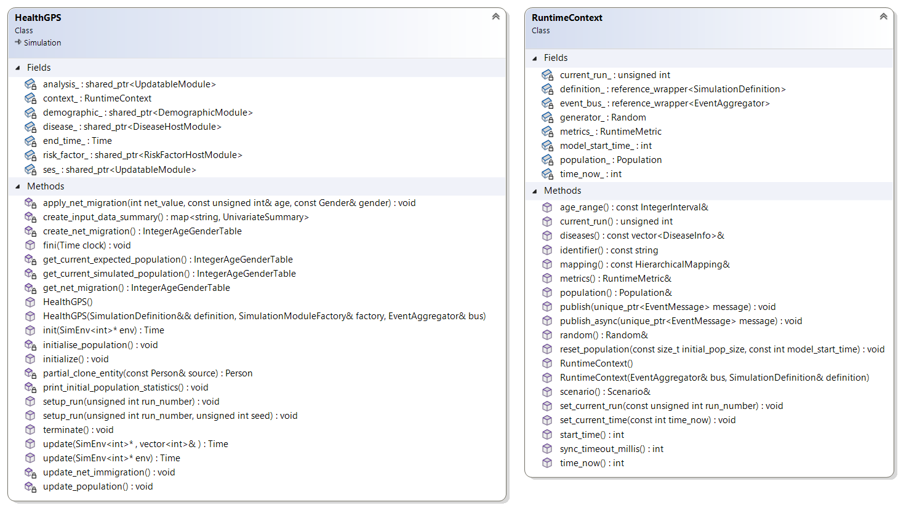 |
|:-------------------------------------------------:|
|          *Health-GPS Simulation Engine*           |

Outside communication uses `EventAggregator` / subscribers. Message kinds include errors, info, runner progress, analysis results, and optional individual-tracking events.

| 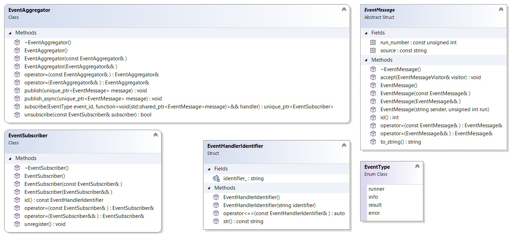 |
|:------------------------------------------------------:|
|           *Health-GPS Message Bus Interface*           |

The host supplies the bus when constructing `Simulation`. Analysis publishes result messages; Console writers subscribe and write files.

The engine workflow covers lifecycle, scenario evaluation, and a single run. The **`Runner`** executive decides how many replications to execute and whether baseline alone or baseline+intervention pairs run.

| 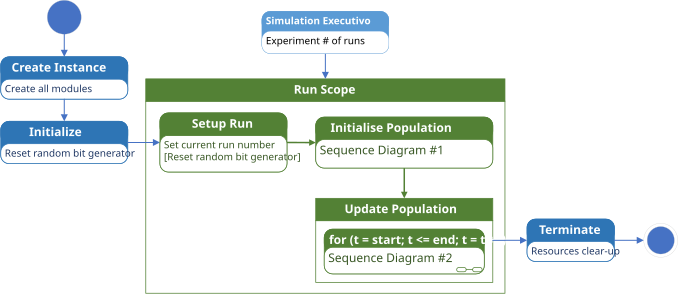 |
|:-----------------------------------------------------------:|
|           *Health-GPS Simulation Engine Workflow*           |

Call order is fixed in `Simulation::initialise_population` / `update_population` (`src/HealthGPS/simulation.cpp`).

### Initialise Population

| 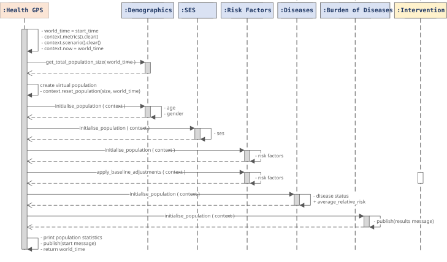 |
|:-------------------------------------------------------------------:|
|       *Initialise Population Algorithm (Sequence Diagram #1)*       |

Order: Demographic -> SES -> RiskFactor -> Disease -> Analysis.

### Update Population

| 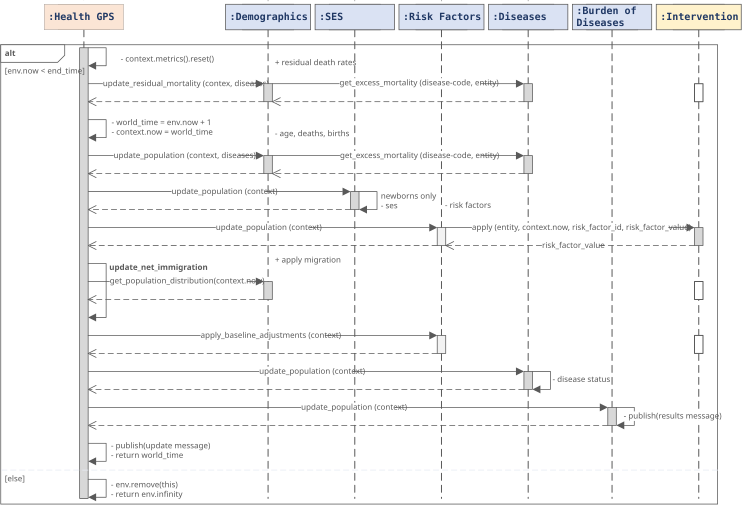 |
|:-----------------------------------------------------------:|
|     *Update Population Algorithm (Sequence Diagram #2)*     |

Order: Demographic (with disease for mortality) -> net immigration -> SES -> RiskFactor -> Disease -> Analysis.

Empty squares on the scenario timeline mark synchronisation between baseline and intervention (see Policy Scenarios).

## Policy Scenarios

Each `Simulation` takes one `Scenario`. Two kinds are used: ***Baseline*** (status-quo trends) and ***Intervention*** (policy that changes risk-factor paths for a target window). Scenario is not a `SimulationModuleType`.

| 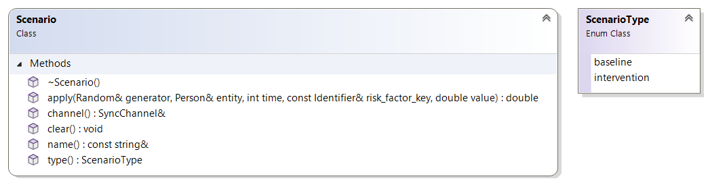 |
|:------------------------------------------------------------------------:|
|                    *Policy Scenario Common Interface*                    |

Baseline usually passes risk-factor values through unchanged. Intervention scenarios apply policy rules (and often external data) when invoked.

Baseline and intervention runs can be paired with shared-memory synchronisation (`SyncChannel`) so the intervention side waits for baseline messages at agreed points.

| 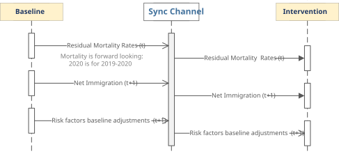 |
|:--------------------------------------------------------------:|
|       *Policy Scenario’s Data Synchronisation Mechanism*       |

Scaling across machines with a broker (RabbitMQ, Kafka, and so on) is a possible future host design; the current Console path uses in-process pairing.

## Simulation Executive

The *simulation executive* creates the simulation running environment, instructs the *simulation engine* to evaluate the experiment scenarios for a pre-defined number of runs, manage master seeds generation, notify progress, and handle experiment for cancellation. The `Runner` class shown below, implements the *Health-GPS simulation executive*.

| 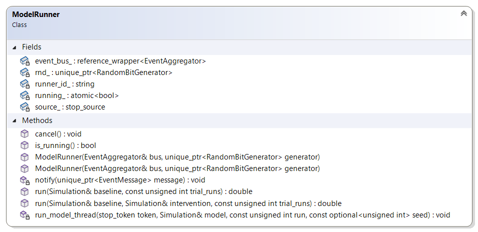 |
|:-----------------------------------------------------------:|
|            *Simulation Executive Class Diagram*             |

Two modes of evaluating a simulation experiment as provided by the simulation executive, using the *run* function with overloaded parameters. The two  paths of execution are illustration below, the first simulates *no-intervention*, baseline scenario only experiments, while the second simulates *intervention* experiments with baseline and intervention scenarios evaluated as a pair, and data synchronisation as described above.

| 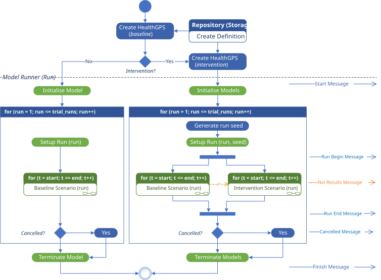 |
|:-----------------------------------------------------------------:|
|        *Health-GPS Simulation Executive Activity Diagram*         |

Experiment scenarios are evaluated in parallel using multiple threads, however the need to exchange data between scenarios creates an indirect synchronisation with a small overhead. The [ADEVS][adevs] executive, [Simulator][adevsim] class, is use inside each thread loop to execute the respective experiment scenario. The simulation executive communicates with the outside world via messages, ideally sharing the same message bus instance with the simulation engine, indicating the start and finish of the experiment, notifying error and cancellation.

The *message bus* mechanism decouples the sender from the receiver, typically one or more event monitors are used to subscriber for messages, receive, queue, and process the messages queue on its own pace and thread, common activities are display on screen, stream over the internet, summarise results and/or log to file.

## Deployment

The various components of the Health-GPS ecosystem can be deployed to multiple computing platforms. The four components are packaged together into the *host application* executable, which is purpose built for each target platforms as shown below. The backend *data storage* is platform independent, but must be available, accessible, and properly configured for the application to work correctly at runtime.

| 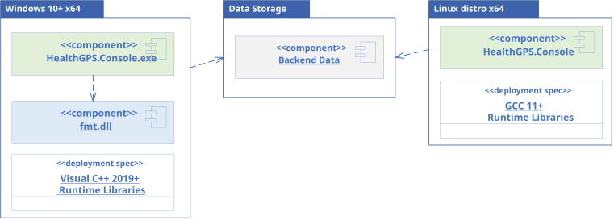 |
|:-------------------------------------------------------:|
|             *Health-GPS Deployment Package*             |

The version of the *libraries* required by the application at runtime depends on the compiler being used to build Health-GPS executable. The source code is portable for compilers supporting C++20 standard, however the resulting binaries are platform *dependent* and must be built, tested, and deployed accordingly for the model to work as expected.

> See [Data Model](datamodel.md) and [Developer Guide](development.md) for detailed information on the backend data storage and the various *interfaces* implementation respectively.

---

### Related documentation

| Topic | Document |
| ----- | -------- |
| Developer docs index | [developer/README.md](README.md) |
| Data model | [Data Model](datamodel.md) |
| Build guide | [Developer Guide](development.md) |
| GitHub flow | [GitHub Flow](github-flow.md) |
| FINCH / income / predictors | [FINCH guide](../technical/guides/finch-linear-models-and-income-adjustment.md) |
| Feb 2026 integrated changes | [Update report](../technical/guides/healthgps-update-report-2026-02-20.md) |
| Windows MSVC builds | [MSVC troubleshooting](msvc-windows-build-troubleshooting.md) |
| Technical docs | [Technical documentation index](../technical/README.md) |
| Documentation home | [documentation/README.md](../README.md) |

---

[cpp20]:https://en.cppreference.com/w/cpp/20 "C++ 20 standard features and compiler support"
[kafka]:https://kafka.apache.org "Distributed event streaming platform"
[broker]:https://www.rabbitmq.com "Message-broker with Advanced Message Queuing Protocol"
[adevs]:https://web.ornl.gov/~nutarojj/adevs "A Discrete EVent System simulator library"
[devs]:https://doi.org/10.1016/j.ifacol.2017.08.672 "From Discrete Event Simulation to Discrete Event Specified Systems (DEVS)"
[adevsim]:https://github.com/imperialCHEPI/healthgps/blob/main/src/external/adevs/adevs_base.h "Vendored ADEVS headers under src/external/adevs"

---

**Author:** Mahima Ghosh
