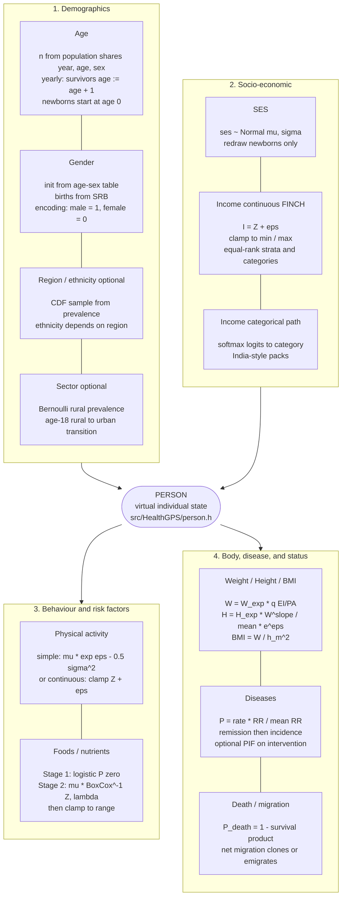
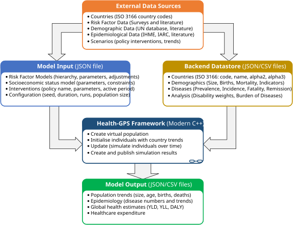
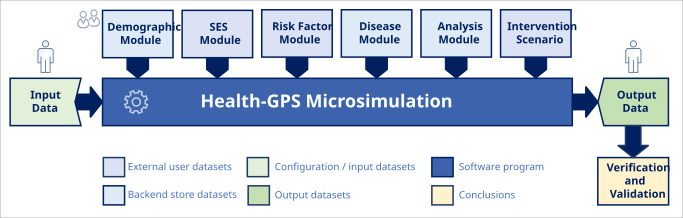
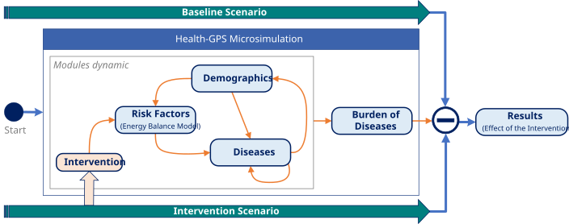
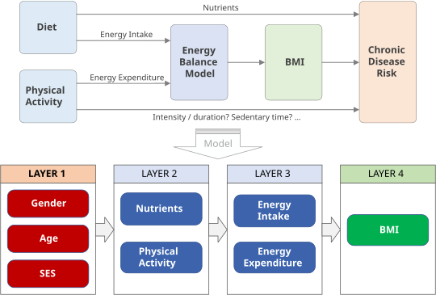
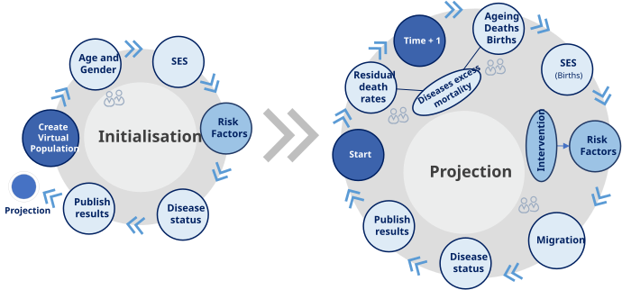
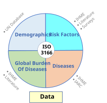
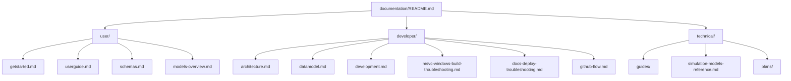

## Global Health Policy Simulation model

| [Home](index.md) | [Quick Start](user/getstarted.md) | [User Guide](user/userguide.md) | [Schemas](user/schemas.md) | [Models](user/models-overview.md) | [Architecture](developer/architecture.md) | [Data Model](developer/datamodel.md) | [Developer Guide](developer/development.md) | [Technical docs](technical/README.md) | [API](https://imperialchepi.github.io/healthgps/api/) |

# Introduction

**Health-GPS** is a modular and flexible microsimulation framework developed in collaboration between the Centre for Health Economics & Policy Innovation ([CHEPI](https://www.imperial.ac.uk/business-school/faculty-research/research-centres/centre-health-economics-policy-innovation/)), Imperial College London; and [INRAE](https://www.inrae.fr), France. It was created for the [STOP project](https://www.stopchildobesity.eu/) and now supports analysis of health and economic impacts of policies on *chronic diseases* and *obesity*, including childhood obesity in European settings.

Health-GPS models the impacts of behavioural and metabolic risk factors on chronic diseases and measures lifelong outcomes so researchers can test the effectiveness of health policies and interventions. The framework has been extended for additional CHEPI-led work, including [FINCH](https://www.imperial.ac.uk/business-school/faculty-research/research-centres/centre-health-economics-policy-innovation/research/finch/), [GOLDFINCH](https://www.imperial.ac.uk/business-school/faculty-research/research-centres/centre-health-economics-policy-innovation/research/goldfinch/), [CoDiet](https://www.imperial.ac.uk/business-school/faculty-research/research-centres/centre-health-economics-policy-innovation/research/codiet/), [JACARDI](https://www.imperial.ac.uk/business-school/faculty-research/research-centres/centre-health-economics-policy-innovation/research/jacardi/), and [JA PreventNCD](https://www.imperial.ac.uk/business-school/faculty-research/research-centres/centre-health-economics-policy-innovation/research/ja-prevent-ncd/). Project-specific inputs are maintained in [HealthGPS-examples](https://github.com/imperialCHEPI/healthgps-examples); the table below links each setting to a typical example folder.

| Setting / project       | More information                                                                                                                                                                                                       | Example inputs ([HealthGPS-examples](https://github.com/imperialCHEPI/healthgps-examples))       |
| ----------------------- | ---------------------------------------------------------------------------------------------------------------------------------------------------------------------------------------------------------------------- | ------------------------------------------------------------------------------------------------ |
| STOP (France-style HLM) | [STOP project](https://www.imperial.ac.uk/business-school/faculty-research/research-centres/centre-health-economics-policy-innovation/research/stop/)                                                                  | [HLM_France](https://github.com/imperialCHEPI/healthgps-examples/tree/main/HLM_France)           |
| India                   | [HFSS food tax modelling in India (CHEPI)](https://www.imperial.ac.uk/business-school/faculty-research/research-centres/centre-health-economics-policy-innovation/research/modelling-the-impact-tax-hfss-foods-india/) | [KevinHall_India](https://github.com/imperialCHEPI/healthgps-examples/tree/main/KevinHall_India) |
| FINCH                   | [FINCH (CHEPI)](https://www.imperial.ac.uk/business-school/faculty-research/research-centres/centre-health-economics-policy-innovation/research/finch/)                                                                | [KevinHall_FINCH](https://github.com/imperialCHEPI/healthgps-examples/tree/main/KevinHall_FINCH) |
| GOLDFINCH               | [GOLDFINCH (CHEPI)](https://www.imperial.ac.uk/business-school/faculty-research/research-centres/centre-health-economics-policy-innovation/research/goldfinch/)                                                        | Use inputs in progress                                                                           |
| CoDiet                  | [CoDiet (CHEPI)](https://www.imperial.ac.uk/business-school/faculty-research/research-centres/centre-health-economics-policy-innovation/research/codiet/)                                                              | Use inputs in progress[HealthGPS-examples](https://github.com/imperialCHEPI/healthgps-examples)  |
| JACARDI                 | [JACARDI (CHEPI)](https://www.imperial.ac.uk/business-school/faculty-research/research-centres/centre-health-economics-policy-innovation/research/jacardi/)                                                            | Use inputs in progress                                                                           |
| JA PreventNCD           | [JA PreventNCD (CHEPI)](https://www.imperial.ac.uk/business-school/faculty-research/research-centres/centre-health-economics-policy-innovation/research/ja-prevent-ncd/)                                               | Use inputs in progress                                                                           |

For FINCH-specific modelling (income, Kevin Hall, predictors), see the [FINCH guide](technical/guides/finch-linear-models-and-income-adjustment.md). For a full map of how every person attribute is assigned and updated, see [How Health-GPS models a person](technical/guides/how-healthgps-models-a-person.md).

Health-GPS creates a *virtual population* representative of a distinct country's population and simulates close to reality life histories from birth to death of each member of the population including key characteristics such as gender, age, socio-economic status, risk factors, and disease profiles. These characteristics evolve over time and are updated in discrete time *annually* using statistical and probabilistic models which are calibrated to reproduce key demographic and epidemiological statistics from the specific country.

The diagram below is the person-centric view of Health-GPS: what sits on each `Person`, and the assignment equations used at initialisation and update. Full derivation and code pointers: [How Health-GPS models a person](technical/guides/how-healthgps-models-a-person.md).

|:---------------------------------------------------:|
| *How Health-GPS models a person. Person sits in the centre; demographics and socio-economic status feed in from above, behaviour/risk factors and body/disease/status update below. Each card shows the core assignment equation. Full maths: [How Health-GPS models a person](technical/guides/how-healthgps-models-a-person.md).*|

The model uses proprietary equations to account for a variety of complex interactions such as risk factor-disease interactions and disease-disease interactions. Modellers are then able to evaluate health-related policies by changing some of the parameters and comparing the outputs with a *baseline* simulation. The model produces detailed quantitative outputs covering demographics, risk factors, diseases, mortality, global health estimates and health care expenditure, which could then be used to complement qualitative policy evaluation tools.

## General Workflow

The Health-GPS workflow is summarised below, datasets from many disconnected sources are used to define the various modules and components of the framework. Commonly used datasets are processed, aggregated, indexed by country, and stored in the backend *datastore*, while research specific datasets are analysed externally to build the *risk factors* and *socio-economic status* modules, design and parameterise *intervention* to be tested.

|  |
|:---------------------------------------------------:|
| *Health-GPS General Workflow Diagram* |

The simulation creates the virtual population, simulates the synthetic individuals over time, collects population statistics and publish to the outside world at the end of each simulated time step. It is the user's responsibility to analyse and quantify the model results, which are saved to a chosen output folder as **JSON and CSV**, and optionally **income-stratum CSVs** or **individual ID tracking** CSVs (same person IDs in baseline and intervention when tracking is enabled). See the [User Guide - Results](user/userguide.md#results) and [Policy Evaluation](#policy-evaluation) below.

Health-GPS is a flexible and modular framework, written in modern C++, designed using object-oriented principles to provide the building blocks necessary to compose the overall microsimulation, several data sources, modules, and sub-model are required as shown below.

|  |
|:-------------------------------------------------------:|
| *Health-GPS Concept Diagram* |

### Modules Dynamic

The framework defines multi-dimensional interactions on *demographics*, *risk factors*, *diseases* and *intervention* modules as shown below. The model dynamics capture the effects of the various interacting modules overtime to stablish the population *baseline* projection and quantify the impact of *interventions* on risk factors, the *burden of diseases* (BoD) module estimate population outcomes such as risk factors, disease prevalence, and health care expenditure. Finally, *the different between the two scenarios* is the effect of the intervention.

|  |
|:---------------------------------------------------------:|
| *Health-GPS Dynamics Diagram* |

A brief overview of each module is provided next, the framework has been designed to allow module composition, modellers can experiment with different module implementations at run-time.

## Demographics

The population historical trends and projections are used to define the baseline scenario for the model. The model requires historical and projected populations by *year*, *age*, and *gender* for each country of interest, covering the entire duration of the experiment. All data processing, units' conversion, gap filling, smoothing, etc, must be carried out outside to produce the complete datasets required. The following demographic measures are required by the model:

- *Population size*
- *Birth rates*
- *Death rates*
- *Residual Mortality* - deaths from non-modelled causes.

Births, deaths, and immigration are the only drivers of changes in demographics in a population. While the births and deaths modelling are data driven, finding accurate data about immigration is more challenging. *Net migration*, the net flow of migrants between two consecutive years, is estimated as the difference by age and gender between the simulated population and the expected population from the country's input data.

### Socio-Economic Status (SES)

SES plays an important role in the levels of risk factors observed within the population. The levels of income and education can influence the nature of diet, and physical activity. In simple France-style configs, Health-GPS models SES as a continuous noise draw (`ses`) assigned at birth and held fixed. **Income categories**, quintile adjustment, and FINCH-style predictors are configured separately via `project_requirements` and modelling CSVs; see the [FINCH guide](technical/guides/finch-linear-models-and-income-adjustment.md) and [Software Architecture](developer/architecture.md).

## Risk Factors

The population cultural and social behaviours are represented by *risk factors*, defined as any attributes that can influence the likelihood of acquiring a disease. Individual choices such as smoking, alcohol consumption, physical activity, and diet, can lead to long-term consequences such as hypertension, obesity, and diabetes. Furthermore, certain diseases can be risk factors for other diseases or certain types of cancers.

The dynamics of risk factors modelling is a major challenge for health policy modellers, there are divergent opinions on the types and directions of causality between risk factors and diseases. *Health-GPS* defines a dynamic hierarchical risk factor model structure, modellers can configure the hierarchy outside for different problems, fit parameters to data and provide to fully built model as part of the experiment configuration.

### Energy Balance Model (EBM)

To represent childhood obesity, national dietary surveys from various European countries are analysed to build the risk factor model. Estimates of yearly changes in physical activity, diet, energy balance, and Body Mass Index (BMI) are created using dietary and anthropometric surveys. These include measures of physical activity expressed in metabolic equivalents (METs) and macronutrients intakes measures including grams of fat, carbohydrates, protein, fibre, salt, and sugar. The general concept for an EBM is shown below (top diagram), and a possible *Health-GPS* translation is provided for illustration purpose.

|  |
|:--------------------------------------------------------:|
| *Energy balance model structure example* |

The calibration of the equations is carried out outside of the model by gender for children and adults separately to ensure capturing gender- and age-related differences. Emphasis is placed on capturing the rapid growth and changes in children BMIs. International anthropometric references are used to properly classify individuals as normal weight, overweight or obese. This classification is used throughout the simulation to identify children with growth problems and devise appropriate policies and interventions to tackle the health issues.

## Diseases

Individuals may acquire new diseases for many reasons, including genetics, environment, and lifestyles. The associations between risk factors and the incidence of certain types of diseases is a major subject being widely study. Health-GPS accounts for the associations between risk factors and diseases by using equations to translate exposures to risk factors into probabilities that are used to simulate the incidence of diseases in the population.

The association between risk factor and disease stays constant throughout the simulation, however any changes in the distribution of a risk factor, will still translate to more/fewer disease cases through relative risk equations. Any change in the prevalence of a disease is therefore solely caused by changes in risk factors distributions alongside the ageing effect on the simulated population. Health-GPS supports two groups of diseases: general *noncommunicable* diseases, and types of *cancer* respectively.

## Burden of Diseases

Collects statistical indicators about the simulated population, life expectancy, disease prevalence, risk factors exposure; and standardised metrics such as years of life lost due to premature mortality (YLL), years of healthy life lost due to disability (YLD), disability-adjusted life years (DALY), and healthcare expenditure (HCE) to reflect the impact of the intervention compared to a status-quo simulation.

## Policy Evaluation

The overall approach adopted to evaluate the impacts and cost-effectiveness of intervention policies to reduce childhood obesity using the policy simulation tool is based upon *“what-if”* analyses to quantify the causal relations between variables, scenarios can be classified as:

- *Baseline scenarios*: elaborated to define the trends in observed childhood obesity we measure outcomes against (e.g., population, calories intake, diseases prevalence trends).
- *Intervention scenarios*: policies designed to change the observed trends in childhood obesity during a specific time frame (e.g., food labelling, healthy eating promotion, BMI reduction).

The choice of baseline scenario is critical for analyses as it serves as a reference for comparison and can influence outcomes. Having defined the baseline scenario, the simulation assesses the impacts of different intervention policies by projecting populations, risk factors, diseases, and life trajectories into the future comparing pairs of *no-intervention* and *intervention* scenarios.

The first run evaluates the no-intervention, *“baseline scenario”* where demographics, risk factors, and diseases are projected based solely on estimates from historical data. The second run evaluates the *“intervention scenario”* where a specific policy is applied to the same population with the aim of modifying the underlying trends and risk factor distribution.

### Same person ID across baseline and intervention

For the **initial cohort**, Health-GPS assigns each synthetic person a stable **person ID** (derived from their slot in the population) so the **same logical individual** shares the same ID in both baseline and intervention runs. That makes it possible to compare scenarios at the person level - for example in optional tracking output - not only from aggregate JSON and CSV summaries. Life paths can still **diverge** after the intervention is applied; matching IDs mean “same starting person for comparison”, not guaranteed identical outcomes.

When you need filtered per-person time series (run, year, scenario, demographics, selected risk factors), enable `output.individual_id_tracking` in config. The model then writes an additional `*_IndividualIDTracking.csv` alongside the main results. Configuration, filters, and an example are in the [User Guide - Output](user/userguide.md#output) (FINCH example: `KevinHall_FINCH/config.json` in [HealthGPS-examples](https://github.com/imperialCHEPI/healthgps-examples/tree/main/KevinHall_FINCH)). Design notes: [same-person ID plan](technical/plans/same-person-id-baseline-intervention-plan.md), [individual ID tracking plan](technical/plans/individual-id-tracking-csv-plan.md).

Finally, detailed analysis can be carried out, externally, to compare the two simulated scenarios results in terms of population demographics and burden of diseases to estimate the cost-effectiveness and impacts of the targeted intervention in tackling childhood obesity.

## Simulation Workflow

The microsimulation follows a two-step process to capture time-serial and cross-sectional correlations between risk factors, preserve the cross-sectional correlations between factors, and their hierarchical structure to allow changes to be propagated from lower to high level variables. The workflow consists of two main algorithms to *initialise* and *project* the virtual population over time respectively. Creating and *initialising* the virtual population is the first step of a simulation run, while the algorithm *projecting* the population over time is the core of the microsimulation as shown below.

|  |
|:-----------------------------------------------------------------:|
| *Health-GPS Workflow Diagram* |

The initialisation sets the simulation world clock, in years, to the user’s defined start time, and requests the simulation modules to initialise the relevant properties of the virtual population individuals. The projection moves the simulation clock, in years, forwards until the user’s defined end time is reached, at which point the algorithm terminates.

## Data Sources

Health-GPS makes use of various types of data such as cross-sectional and longitudinal surveys to produce consistent estimates of a particular variable of interest. To reconcile large swathes of datasets describing determinants of health,
demographics, socio-economic, behavioural, risk exposure, diseases, healthcare delivery and expenditure from otherwise unconnected sources, the Health-GPS *data model* adopts the [ISO 3166](https://www.iso.org/iso-3166-country-codes.html) country code to link all datasets as shown below.

|  |
|:--------------------------------------------------------:|
| *Health-GPS Data Reconciliation* |

The reconcile process can be extremely laborious with each dataset having to be processed individually to for general data cleansing, map country code, use consistent unit of measurement, filling gaps, and smoothing. Health-GPS assumes complete datasets, all data processing must take place out outside of the model.

---

## Documentation map

All project docs live under `documentation/`. Start at [README.md](README.md).

| Folder                   | Audience                   | Contents                                                                                                                                                                         |
| ------------------------ | -------------------------- | -------------------------------------------------------------------------------------------------------------------------------------------------------------------------------- |
| [user/](user/)           | Modellers, policy analysts | [Quick Start](user/getstarted.md), [User Guide](user/userguide.md), [Schemas](user/schemas.md), [Models overview](user/models-overview.md) - [user index](user/README.md)        |
| [developer/](developer/) | Software developers        | Architecture, data model, build guide, [Pages deploy troubleshooting](developer/docs-deploy-troubleshooting.md), MSVC note, GitHub flow - [developer index](developer/README.md) |
| [technical/](technical/) | Economists and developers  | FINCH guide, [simulation models reference](technical/guides/simulation-models-reference.md), update reports, feature plans - [technical index](technical/README.md)              |

### Recommended starting points

- New to Health-GPS -> [Quick Start](user/getstarted.md)
- FINCH / Kevin Hall inputs -> [FINCH linear models guide](technical/guides/finch-linear-models-and-income-adjustment.md)
- What changed in 2026 -> [Update report](technical/guides/healthgps-update-report-2026-02-20.md)
- Threading and HPC sizing -> [Performance guide](technical/guides/performance-optimizations.md)
- Building from source -> [Developer Guide](developer/development.md)
- Per-person baseline vs intervention output -> [User Guide - Output](user/userguide.md#output)
- Config validation / `$schema` / v1 vs v2 -> [Configuration schemas](user/schemas.md)
- Which model does what (HLM, Kevin Hall, …) -> [Models overview](user/models-overview.md)
- Windows build fails (`cstdint` / `MSVCRTD.lib`) -> [MSVC troubleshooting](developer/msvc-windows-build-troubleshooting.md)
- Pages deploy failed (Configure HealthGPS) -> [Docs deploy troubleshooting](developer/docs-deploy-troubleshooting.md)
- Documentation questions -> see **Author** at the bottom of each page ([documentation index](README.md))

### Cross-area navigation

| From                                   | To                                                                                           |
| -------------------------------------- | -------------------------------------------------------------------------------------------- |
| [Documentation root](README.md)        | [User](user/README.md) / [Developer](developer/README.md) / [Technical](technical/README.md) |
| [User index](user/README.md)           | [Developer index](developer/README.md) / [Technical index](technical/README.md)              |
| [Developer index](developer/README.md) | [User index](user/README.md) / [MSVC note](developer/msvc-windows-build-troubleshooting.md)  |
| [Technical index](technical/README.md) | [Developer Guide](developer/development.md) / [User Guide](user/userguide.md)                |

---

**Author:** Mahima Ghosh
