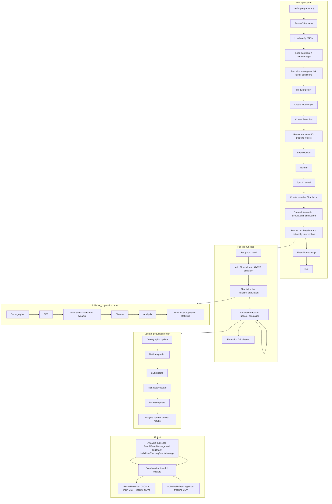
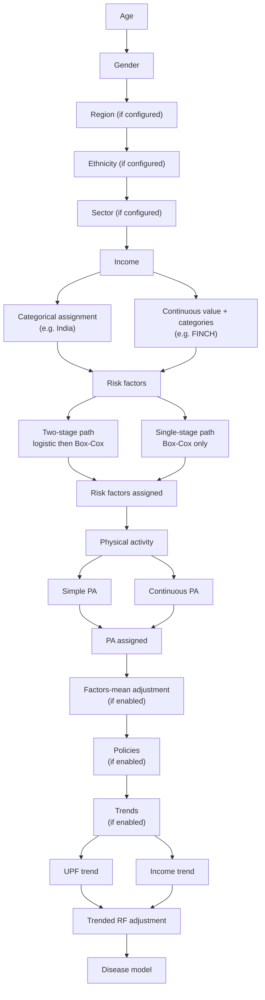

# HealthGPS Project Update Report

**Author:** Mahima Ghosh
**Period:** September 2025 – February 2026
**Last updated:** 20 February 2026

**Related documentation:** [FINCH linear models guide](finch-linear-models-and-income-adjustment.md) · [Income quintile factor means plan](../plans/income-quintile-factor-means-plan.md) · [Individual ID tracking plan](../plans/individual-id-tracking-csv-plan.md) · [Same person ID plan](../plans/same-person-id-baseline-intervention-plan.md) · [Architecture guide](../../developer/architecture.md) · [Technical index](../README.md)

---

## Executive summary

This report documents the integrated Health-GPS codebase changes delivered between November 2025 and February 2026. The work unifies support for **India**, **ADB**, and **FINCH** within a single branch, extends demographic and socioeconomic modelling, refines static and dynamic risk-factor pipelines, and adds analysis, disease, policy, and configuration capabilities described below.

The report is intended for modellers, economists, and developers who need a single reference for **what changed**, **how modules interact**, and **where to look in the source tree**. It complements the existing [architecture guide](../../developer/architecture.md), [user guide](../../user/userguide.md), and [quick start](../../user/getstarted.md) rather than replacing them.

---

## Table of contents

1. [Introduction and scope](#1-introduction-and-scope)
2. [Supported projects and compatibility](#2-supported-projects-and-compatibility)
3. [Application workflow](#3-application-workflow)
4. [Parallelization](#4-parallelization)
5. [Demographic module](#5-demographic-module)
6. [Socioeconomic module (income)](#6-socioeconomic-module-income)
7. [Risk factors — static linear model](#7-risk-factors--static-linear-model)
8. [Risk factors — Kevin Hall (dynamic) model](#8-risk-factors--kevin-hall-dynamic-model)
9. [Analysis module and output](#9-analysis-module-and-output)
10. [Disease module](#10-disease-module)
11. [Policy](#11-policy)
12. [Configuration and schema](#12-configuration-and-schema)
13. [Data loading and model parser](#13-data-loading-and-model-parser)
14. [Person initialization sequence](#14-person-initialization-sequence)
15. [Progress and outstanding work](#15-progress-and-outstanding-work)
16. [Verification and testing](#16-verification-and-testing)
17. [Related documentation](#17-related-documentation)

---

## 1. Introduction and scope

The updates described in this report extend Health-GPS from a project-specific codebase into an integrated platform that supports multiple country and study configurations through shared modules, schemas, and input conventions.

Scope includes:

- Demographic assignment (region, ethnicity, individual ID tracking)
- Socioeconomic modelling (categorical and continuous income)
- Static linear and Kevin Hall dynamic risk-factor models
- Analysis output (aggregates, income-stratified files, individual ID tracking)
- Disease modelling (including Population Impact Fraction)
- Policy timing and configuration/schema extensions

Behaviour is documented relative to the main branch as of **20 February 2026**.

---

## 2. Supported projects and compatibility

| Project | Status                             |
| ------- | ---------------------------------- |
| India   | Supported on the integrated branch |
| ADB     | Supported on the integrated branch |
| FINCH   | Supported on the integrated branch |

**Backward compatibility:** Legacy India configuration formats continue to work. Configurations may be migrated to the new format incrementally; the code accepts both old and revised schemas where stated in Section 12.

**Repository note:** When uploading JSON to `healthgps-examples`, existing Kevin Hall folders should be preserved. New JSON files should be added in a separate folder rather than replacing or deleting legacy examples.

---

## 3. Application workflow

The diagrams below describe the overall Health-GPS execution path — from program entry through simulation and output — rather than the per-person initialization sequence (see Section 14).

### 3.1 Module pipeline

### 3.2 Host application and run loop

Entry point: `program.cpp`. Run loop: `runner.cpp`. Population lifecycle: `simulation.cpp` (`initialise_population`, `update_population`).

### 3.3 Developer file map

| Area                                           | Entry / main files                                                                                                                                                                                                                 |
| ---------------------------------------------- | ---------------------------------------------------------------------------------------------------------------------------------------------------------------------------------------------------------------------------------- |
| Program entry, config, data load               | [program.cpp](src/HealthGPS.Console/program.cpp)                                                                                                                                                                                   |
| Run loop, trials, ADEVS                        | [runner.cpp](src/HealthGPS/runner.cpp)                                                                                                                                                                                             |
| Simulation init/update, module order           | [simulation.cpp](src/HealthGPS/simulation.cpp)                                                                                                                                                                                     |
| Demographic (age, gender, region, ethnicity)   | [demographic.cpp](src/HealthGPS/demographic.cpp)                                                                                                                                                                                   |
| SES (income)                                   | SES module via factory (see [demographic.cpp](src/HealthGPS/demographic.cpp) and config)                                                                                                                                           |
| Risk factors (static, dynamic e.g. Kevin Hall) | [static_linear_model.cpp](src/HealthGPS/static_linear_model.cpp), [kevin_hall_model.cpp](src/HealthGPS/kevin_hall_model.cpp), [riskfactor.cpp](src/HealthGPS/riskfactor.cpp)                                                       |
| Disease, PIF                                   | [default_disease_model.cpp](src/HealthGPS/default_disease_model.cpp), disease host module                                                                                                                                          |
| Analysis, results aggregation                  | [analysis_module.cpp](src/HealthGPS/analysis_module.cpp)                                                                                                                                                                           |
| Result and ID-tracking output                  | [result_file_writer.cpp](src/HealthGPS.Console/result_file_writer.cpp), [individual_id_tracking_writer.cpp](src/HealthGPS.Console/individual_id_tracking_writer.cpp), [event_monitor.cpp](src/HealthGPS.Console/event_monitor.cpp) |
| Config and schema                              | [configuration.cpp](src/HealthGPS.Input/configuration.cpp), [configuration_parsing.cpp](src/HealthGPS.Input/configuration_parsing.cpp), [schema.cpp](src/HealthGPS.Input/schema.cpp)                                               |

---

## 4. Parallelization

Health-GPS uses Intel TBB and core threading helpers in selected hot paths. The tables below summarise where concurrency is applied and where sequential execution is retained for correctness or reproducibility.

### 4.1 Parallelized components

| Location                                                                                                                                                                                         | Mechanism                                                                                                                     | Rationale                                                                                                                   |
| ------------------------------------------------------------------------------------------------------------------------------------------------------------------------------------------------ | ----------------------------------------------------------------------------------------------------------------------------- | --------------------------------------------------------------------------------------------------------------------------- |
| **Runner** ([runner.cpp](src/HealthGPS/runner.cpp))                                                                                                                                              | Baseline and intervention run in parallel (two `std::jthread`s per trial when intervention is configured)                     | Independent simulations; no shared mutable state between them                                                               |
| **Program** ([program.cpp](src/HealthGPS.Console/program.cpp))                                                                                                                                   | Async datatable load via `core::run_async`; TBB parallelism cap via `-T`                                                      | Overlap I/O with startup; user-configurable thread count                                                                    |
| **Simulation** ([simulation.cpp](src/HealthGPS/simulation.cpp))                                                                                                                                  | `tbb::parallel_for_each` for population counts; `core::run_async` for expected population and input summary                   | Per-person independence in aggregation                                                                                      |
| **Demographic** ([demographic.cpp](src/HealthGPS/demographic.cpp))                                                                                                                               | `tbb::parallel_for_each` for region/ethnicity assignment; async residual mortality                                            | Independent per-person assignment                                                                                           |
| **Risk factor adjustable** ([risk_factor_adjustable_model.cpp](src/HealthGPS/risk_factor_adjustable_model.cpp))                                                                                  | `tbb::parallel_for_each` over population during adjustment                                                                    | Independent per-person adjustment                                                                                           |
| **Disease** ([default_disease_model.cpp](src/HealthGPS/default_disease_model.cpp), [default_cancer_model.cpp](src/HealthGPS/default_cancer_model.cpp), [disease.cpp](src/HealthGPS/disease.cpp)) | `tbb::parallel_for_each` for incidence/remission; mutex on shared counters                                                    | Parallel per-person updates; protected reduction                                                                            |
| **Analysis** ([analysis_module.cpp](src/HealthGPS/analysis_module.cpp))                                                                                                                          | `core::parallel_for` over population; concurrent DALY and historical stats via `core::run_async`; `sum_mutex` on accumulators | Large-population performance                                                                                                |
| **Result writing** ([result_file_writer.cpp](src/HealthGPS.Console/result_file_writer.cpp))                                                                                                      | `tbb::parallel_for_each` over income categories; per-stream mutex                                                             | Separate output files                                                                                                       |
| **Event bus** ([event_bus.cpp](src/HealthGPS/event_bus.cpp))                                                                                                                                     | `publish_async` via `core::run_async`                                                                                         | Non-blocking subscriber notification                                                                                        |
| **EventMonitor** ([event_monitor.cpp](src/HealthGPS.Console/event_monitor.cpp))                                                                                                                  | Separate queues and dispatch threads for result vs individual-tracking messages                                               | Parallel main-result and tracking writes (see [parallelize output writes plan](../plans/parallelize-output-writes-plan.md)) |

### 4.2 Sequential components

| Location                                                                                                                                 | Behaviour                                                   | Rationale                                        |
| ---------------------------------------------------------------------------------------------------------------------------------------- | ----------------------------------------------------------- | ------------------------------------------------ |
| **Static linear model** ([static_linear_model.cpp](src/HealthGPS/static_linear_model.cpp))                                               | Sequential population loops                                 | Shared model state; ordering and reproducibility |
| **Kevin Hall model** ([kevin_hall_model.cpp](src/HealthGPS/kevin_hall_model.cpp))                                                        | Sequential per-person updates                               | Shared parameters; temporal dependencies         |
| **Simulation module order** ([simulation.cpp](src/HealthGPS/simulation.cpp))                                                             | Strict Demographic → SES → Risk factor → Disease → Analysis | Cross-module data dependencies                   |
| **Repository / model parser** ([repository.cpp](src/HealthGPS/repository.cpp), [model_parser.cpp](src/HealthGPS.Input/model_parser.cpp)) | Single mutex on load/cache                                  | Cache consistency                                |
| **SyncChannel** (baseline ↔ intervention)                                                                                                | Synchronous send/receive for net immigration etc.           | Deterministic scenario coupling                  |

### 4.3 Concurrency primitives

- **TBB:** `tbb::parallel_for_each`, `tbb::global_control::max_allowed_parallelism`, `tbb::concurrent_queue`, `tbb::task_group` / `task_group_context`
- **Core helpers** ([thread_util.h](src/HealthGPS.Core/thread_util.h)): `core::parallel_for`, `core::run_async`
- **Mutexes:** Used where parallel loops reduce into shared state (analysis, disease, simulation counts, result writers, repository cache, EventBus subscribers)

Further runtime notes: [Performance optimizations](performance-optimizations.md).

---

## 5. Demographic module

| Feature           | Description                                                           | Key code                                                                                                                                                        |
| ----------------- | --------------------------------------------------------------------- | --------------------------------------------------------------------------------------------------------------------------------------------------------------- |
| **Region**        | Assignment via `region.csv` by age and gender (random probability)    | [demographic.cpp](src/HealthGPS/demographic.cpp) — `initialise_region`; [repository.cpp](src/HealthGPS/repository.cpp) — `get_region_prevalence`                |
| **Ethnicity**     | Assignment via `ethnicity.csv` by age and gender (random probability) | `initialise_ethnicity`; `get_ethnicity_prevalence`                                                                                                              |
| **Gender**        | Encoding: 1 = Female, 0 = Male                                        | Demographic module                                                                                                                                              |
| **Individual ID** | Stable ID tracking across baseline and intervention runs              | See [individual ID tracking plan](../plans/individual-id-tracking-csv-plan.md) and [same person ID plan](../plans/same-person-id-baseline-intervention-plan.md) |

---

## 6. Socioeconomic module (income)

- **Income categorical** (formerly `income`): Renamed to `income_categorical`; assignment via logits; category count is user-defined in config.
- **Income (continuous) model:** Assigns `income_continuous` via linear regression on age, gender, region, ethnicity, and random noise; optional adjustment to factors mean; ranks values and assigns tertiles or quartiles per config.
- **Configuration:** Factors-mean adjustment for income and final category count (e.g. 3 or 4) are specified in `config.json` / `project_requirements`.

Reference: [demographic.cpp](src/HealthGPS/demographic.cpp), [configuration.cpp](src/HealthGPS.Input/configuration.cpp), [model_parser.cpp](src/HealthGPS.Input/model_parser.cpp).

---

## 7. Risk factors — static linear model

- **Physical activity naming:** `physical_activity` replaced by `simple_physical_activity` (random probability, constant mean, small standard deviation).
- **Continuous physical activity:** Regression on age, gender, region, ethnicity, `income_continuous`, and noise; optional factors-mean adjustment.
- **Two-stage modelling** (e.g. alcohol zero vs non-zero):
  - **Initialisation:** Stage 1 — logistic regression for P(value = 0); Stage 2 — Box-Cox + linear regression for non-zero values. Logistic stage is optional; Box-Cox stage is required when two-stage is enabled.
  - **Update:** Stage 1 probability adjusted by prior-year status (e.g. if previous year zero, P(0) = (P_stage1 + 1) / 2; else (P_stage1 + 0) / 2). Coefficients for two-stage factors are added to `logistic_regression.csv`.
- **Policy CSV input:** Energy intake rows are normalised to **log** energy intake at load time.
- **Static model config:** File names and columns are user-specifiable for region, ethnicity, income (continuous or categorical), physical activity (continuous or simple), logistic model, Box-Cox coefficients, and policy model.

Reference: [static_linear_model.cpp](src/HealthGPS/static_linear_model.cpp), [risk_factor_adjustable_model.cpp](src/HealthGPS/risk_factor_adjustable_model.cpp). Modeller-facing detail: [FINCH linear models guide](finch-linear-models-and-income-adjustment.md).

---

## 8. Risk factors — Kevin Hall (dynamic) model

- **Weight — `get_expected`:** Physical activity is read from factors-mean CSV data rather than hardcoded values when setting expected weight.
- **Dynamic model JSON:** Kevin Hall parameters are specified in the dynamic model configuration.

Reference: [kevin_hall_model.cpp](src/HealthGPS/kevin_hall_model.cpp).

---

## 9. Analysis module and output

- **Simulated mean:** Includes non-zero risk factors and factors using Box-Cox; excludes factors modelled by logistic regression only. Implemented in [risk_factor_adjustable_model.cpp](src/HealthGPS/risk_factor_adjustable_model.cpp).
- **Income-based CSV:** Results stratified by `income_category` with corrected assignment logic.
- **Individual ID tracking:** Optional per-person CSV output with user-defined filters. Baseline IDs are stable until death; intervention copies receive offset IDs (baseline ID + N, where N is population size). See design plans linked in Section 5.
- **Optional income-based files:** Enabled or disabled via config.
- **Output parallelism:** Separate writer threads for main results vs individual tracking; reduced `is_active()` calls in analysis hot paths — see [parallelize output writes plan](../plans/parallelize-output-writes-plan.md).

Reference: [analysis_module.cpp](src/HealthGPS/analysis_module.cpp), [result_file_writer.cpp](src/HealthGPS.Console/result_file_writer.cpp), [individual_id_tracking_writer.cpp](src/HealthGPS.Console/individual_id_tracking_writer.cpp).

---

## 10. Disease module

- **Population Impact Fraction (PIF):** Optional mode computes disease probability as `incidence × (1 − PIF)`, with PIF depending on age, gender, years post intervention, and disease-specific values. Configurable on/off.
- **Outputs:** Incidence, remission, prevalence, YLD, YLL, DALY, and mortality follow existing module structure with PIF integration where enabled.

Reference: [default_disease_model.cpp](src/HealthGPS/default_disease_model.cpp), [pif_data.cpp](src/HealthGPS.Input/pif_data.cpp).

---

## 11. Policy

Policy implementation may start from a user-specified year. For the ADB paper, implementation begins in the first simulation year. The code default is the second year; config overrides this behaviour.

Reference: [configuration.cpp](src/HealthGPS.Input/configuration.cpp), [configuration_parsing.cpp](src/HealthGPS.Input/configuration_parsing.cpp).

---

## 12. Configuration and schema

**Config extensions:**

- Income category count for `income_categorical`
- Trend type: `null`, `UPF_trend`, `income_trend`
- Optional income-stratified result files
- Adjust-to-factors-mean flags (income, physical activity)
- Trended adjustment to factors mean
- Policy start year
- `project_requirements` (demographics, income layout, PA, trends, two-stage flags — see [project requirements plan](../plans/project-requirements-plan.md))

**Static model:** User-specified file names and columns for region, ethnicity, income, physical activity, logistic regression, Box-Cox, and policy models.

**Dynamic model:** Kevin Hall parameters in dynamic model JSON.

**Schemas:** Act as intermediaries to CSV inputs in Health-GPS-examples (file-name placeholders rather than full coefficient listings). Legacy configs remain valid; extended schema options include income categories (3 or 4), trend type, income-based output, adjust-to-factors-mean, trended adjustment, and policy start year.

Reference: [configuration.cpp](src/HealthGPS.Input/configuration.cpp), [configuration_parsing.cpp](src/HealthGPS.Input/configuration_parsing.cpp), [schema.cpp](src/HealthGPS.Input/schema.cpp).

---

## 13. Data loading and model parser

The `names_` vector in the model parser preserves a consistent order for risk-factor correlation and covariance data. It contains risk-factor names (e.g. carbohydrate, sugar, protein) and **excludes** weight, height, BMI, income, physical activity, and energy intake — quantities supplied via dynamic model JSON and used in [kevin_hall_model.cpp](src/HealthGPS/kevin_hall_model.cpp).

Reference: [model_parser.cpp](src/HealthGPS.Input/model_parser.cpp).

---

## 14. Person initialization sequence

Per-person initialization follows this order:

Age → Gender → Region (if configured) → Ethnicity (if configured) → Sector (if configured) → Income → [Categorical: direct assignment (e.g. India) **or** Continuous: compute value, rank, assign categories (e.g. FINCH)] → Risk factors → [Two-stage: logistic then Box-Cox **or** Box-Cox only] → Physical activity → [Simple PA **or** continuous PA regression] → Adjust to factors mean (if enabled) → Policies (if enabled) → Trends (if enabled) → Trended risk-factor adjustment → Disease model.

---

## 15. Progress and outstanding work

### 15.1 Completed (as of 20 February 2026)

The integrated codebase supports India, ADB, and FINCH. The following items from the original work plan are **complete**:

- Trended adjustment to factors mean
- Schema validation extensions
- Risk factors driven from config
- Dynamic age cap
- Dynamic schemas
- Income-based output files
- Consistent data loading
- Age limits
- Log energy intake normalisation for policy CSVs
- FINCH age cap
- Trended factors-mean pipeline

### 15.2 Outstanding

| Item           | Description                                |
| -------------- | ------------------------------------------ |
| Food section   | Remove from config/schema where applicable |
| DataFile.csv   | Remove from config                         |
| SES model      | Remove from config                         |
| Level property | Remove from schemas                        |

### 15.3 Open verification question

Whether income and physical activity are adjusted to factors mean for **India** as well as **FINCH** should be confirmed against project configs and reference runs. Behaviour is config-driven; defaults may differ by project.

---

## 16. Verification and testing

The following test files were updated or added to cover the integrated behaviour:

| Test file                                                                                | Coverage area                          |
| ---------------------------------------------------------------------------------------- | -------------------------------------- |
| [Population.Test.cpp](src/HealthGPS.Tests/Population.Test.cpp)                           | Person ID assignment                   |
| [ConfigSchemaExpanded.Test.cpp](src/HealthGPS.Tests/ConfigSchemaExpanded.Test.cpp)       | Extended config/schema                 |
| [RepositoryPIF.Test.cpp](src/HealthGPS.Tests/RepositoryPIF.Test.cpp)                     | PIF data loading                       |
| [PIFIntegration.Test.cpp](src/HealthGPS.Tests/PIFIntegration.Test.cpp)                   | PIF integration                        |
| [PIFData.Test.cpp](src/HealthGPS.Tests/PIFData.Test.cpp)                                 | PIF data structures                    |
| [DiseaseModelPIF.Test.cpp](src/HealthGPS.Tests/DiseaseModelPIF.Test.cpp)                 | Disease + PIF                          |
| [DataManagerPIF.Test.cpp](src/HealthGPS.Tests/DataManagerPIF.Test.cpp)                   | Data manager PIF                       |
| [ConfigurationPIF.Test.cpp](src/HealthGPS.Tests/ConfigurationPIF.Test.cpp)               | Config PIF options                     |
| [Simulation.Test.cpp](src/HealthGPS.Tests/Simulation.Test.cpp)                           | Simulation integration (where touched) |
| [PredictorResolver.Test.cpp](src/HealthGPS.Tests/PredictorResolver.Test.cpp)             | Predictor naming and `gender2`         |
| [IncomeStratumAdjustment.Test.cpp](src/HealthGPS.Tests/IncomeStratumAdjustment.Test.cpp) | Income-stratum factors-mean adjustment |

Example runs and configuration: [quick start](../../user/getstarted.md).

---

## 17. Related documentation

| Document                                                                           | Purpose                                                 |
| ---------------------------------------------------------------------------------- | ------------------------------------------------------- |
| [FINCH linear models guide](finch-linear-models-and-income-adjustment.md)          | Policy equations, predictors, income-stratum adjustment |
| [Performance optimizations](performance-optimizations.md)                          | Parallel trial execution and runtime tuning             |
| [Individual ID tracking plan](../plans/individual-id-tracking-csv-plan.md)         | Per-person CSV output design                            |
| [Same person ID plan](../plans/same-person-id-baseline-intervention-plan.md)       | ID assignment across scenarios                          |
| [Income quintile factor means plan](../plans/income-quintile-factor-means-plan.md) | Optional stratum-specific adjustment                    |
| [Architecture guide](../../developer/architecture.md)                              | Core system design                                      |
| [Developer Guide](../../developer/development.md)                                  | Build, CMake, vcpkg                                     |
| [MSVC troubleshooting](../developer/msvc-windows-build-troubleshooting.md)         | Windows toolset / Ninja environment failures            |
| [Technical index](../README.md)                                                    | Full technical documentation listing                    |
| [User Guide](../../user/userguide.md)                                              | Configuration and HPC usage                             |
| [Documentation home](../../index.md)                                               | Documentation map                                       |

---

*February 2026 — integrated Health-GPS codebase (India, ADB, FINCH).*

**Author:** Mahima Ghosh · [← Technical documentation index](../README.md) · [Documentation home](../../index.md)
