# How Health-GPS models a person

## Global Health Policy Simulation model

| [Home](../../index.md) | [Quick Start](../../user/getstarted.md) | [User Guide](../../user/userguide.md) | [Schemas](../../user/schemas.md) | [Models](../../user/models-overview.md) | [Architecture](../../developer/architecture.md) | [Data Model](../../developer/datamodel.md) | [Developer Guide](../../developer/development.md) | [Technical docs](../README.md) | [API](https://imperialchepi.github.io/healthgps/api/) |

**Last updated:** August 2026

## About this note

This guide is the person-centric view of Health-GPS. If you open one modelling page and want the overall gist of the framework, start here.

Health-GPS builds a virtual population of `Person` entities and updates their characteristics each simulated year. The pages below walk through **every main attribute** on that person: where it lives in memory, which module sets it, which inputs drive it, and what can change later.

I wrote it for modellers and engineers who need a clear map without reading the whole codebase first. Code pointers are included so you can jump into the source when you need detail.

### Related documentation

| Topic | Document |
| ----- | -------- |
| Module pipeline (short) | [Models overview](../../user/models-overview.md) |
| Module and ModelName I/O | [Simulation models reference](simulation-models-reference.md) |
| FINCH income, PA, predictors | [FINCH guide](finch-linear-models-and-income-adjustment.md) |
| Height by income stratum | [Height CSV quintile plan](../plans/height-csv-quintile-plan.md) |
| Weight by income stratum | [Weight quintile plan](../plans/weight-quintile-plan.md) |
| Income categories / strata | [Dynamic income categories](../plans/dynamic-income-categories-plan.md), [Income quintile plan](../plans/income-quintile-factor-means-plan.md) |
| Person IDs across scenarios | [Same person ID plan](../plans/same-person-id-baseline-intervention-plan.md) |
| Config layout | [User Guide](../../user/userguide.md), [Schemas](../../user/schemas.md) |
| Architecture | [Software Architecture](../../developer/architecture.md) |
| Technical index | [technical/README.md](../README.md) |

---

## Table of contents

1. [What a person is](#1-what-a-person-is)
2. [Assignment equations](#2-assignment-equations)
3. [When attributes are set](#3-when-attributes-are-set)
4. [Person ID](#4-person-id)
5. [Age and gender](#5-age-and-gender)
6. [Region, sector, and ethnicity](#6-region-sector-and-ethnicity)
7. [SES and income](#7-ses-and-income)
8. [Physical activity](#8-physical-activity)
9. [Height, weight, and BMI](#9-height-weight-and-bmi)
10. [Other risk factors](#10-other-risk-factors)
11. [Diseases](#11-diseases)
12. [Alive, death, and migration](#12-alive-death-and-migration)
13. [HLM France vs FINCH](#13-hlm-france-vs-finch)
14. [Where to look in code and config](#14-where-to-look-in-code-and-config)

---

## 1. What a person is

Every simulated individual is a `Person` (`src/HealthGPS/person.h`). Think of it as the full state vector for one life course inside one scenario run.

The Mermaid diagram below is the overview used on the documentation home page as well. Each box names an attribute group and the core assignment equation. Section 2 writes those equations out in full, matching the C++ implementation.

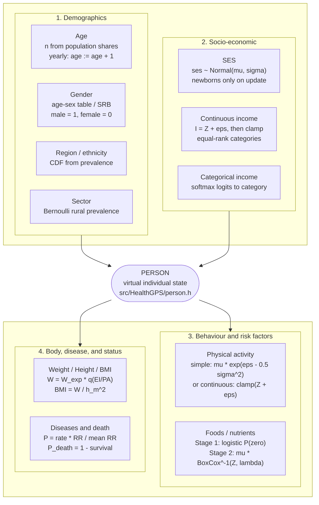

*How Health-GPS models a person. Top row: demographics and socio-economic status side by side. Centre: Person. Bottom row: behaviour/risk factors and body/disease/status side by side. Section 2 writes the equations in full.*

| Group | Fields on `Person` | Typical owner |
| ----- | ------------------ | ------------- |
| Identity | `id()` | `Population` |
| Core demographics | `age`, `gender`, `region`, `ethnicity` | Demographic module |
| Urban / rural | `sector` | StaticLinear (when configured) |
| SES noise | `ses` | SES module |
| Income | `income_continuous`, `income`, `income_adjustment_stratum` | StaticLinear + `project_requirements` |
| Physical activity | `physical_activity` (+ often `risk_factors["PhysicalActivity"]`) | StaticLinear or hierarchical RF |
| Risk factors | `risk_factors` map | Static then dynamic RF models |
| Anthropometrics | `Height`, `Weight`, `BMI` inside `risk_factors` | Kevin Hall (FINCH) or HLM/EBHLM (France) |
| Diseases | `diseases` map | Disease module |
| Status | alive / emigrated / event times | Demographic + migration |

Many nutrients and behaviours exist only inside `risk_factors`. Dedicated members (`physical_activity`, `income_continuous`) exist when the model needs them outside that map as well.

---

## 2. Assignment equations

These are the equations Health-GPS actually evaluates when assigning person characteristics. Notation matches the code (`evaluate_linear_model`, `inverse_box_cox`, `update_age_and_death_events`, Kevin Hall helpers, and the default disease model).

### Shared linear predictor

Used for continuous income, continuous PA, Box-Cox risk factors, and logistic Stage 1 scores:

```text
Z = intercept + sum_k (beta_k * x_k) + sum_m (beta_m * log(x_m))
```

`evaluate_linear_model` skips metadata coefficients such as `stddev`, `min`, `max`, and `lambda`. Predictors `x_k` come from person fields and `risk_factors` (age, gender encodings, region/ethnicity dummies, income, nutrients, and so on). See the [FINCH guide](finch-linear-models-and-income-adjustment.md) for predictor name mapping.

### Person ID

```text
initial cohort:   id(i) = i + 1          for slot index i = 0 .. N-1
new entrants:     id = next_person_id++  (newborns and immigrants)
```

IDs are never reused after death or emigration.

### Age and gender

```text
n_age,sex = round( population_share(year, age, sex) * virtual_population_size )
```

Yearly for survivors:

```text
age := age + 1
```

Birth sex uses the life-table sex ratio at birth (SRB). Encoding used elsewhere:

```text
gender_value(male) = 1
gender_value(female) = 0
```

### Region and ethnicity (optional)

With prevalence tables enabled:

```text
U ~ Uniform(0, 1)
region = first category whose cumulative prevalence(age, gender) >= U

U ~ Uniform(0, 1)
ethnicity = first category whose cumulative prevalence(age_group, gender, region) >= U
```

Age group is Under18 if `age < 18`, else Over18. Newborns require an exact `age_0` region row.

### Sector (StaticLinear, optional)

```text
U ~ Uniform(0, 1)
sector = rural  if U < rural_prevalence(age_group, gender)
       = urban  otherwise
```

At age 18, if currently rural:

```text
p_urban = 1 - rural_prevalence(Over18, gender) / rural_prevalence(Under18, gender)
U ~ Uniform(0, 1);  become urban if U < p_urban
```

### SES equation

```text
ses ~ Normal(mu, sigma)
```

from `modelling.ses_model` (`function_name = "normal"`, parameters `[mu, sigma]`). Redrawn only for newborns on yearly update.

### Continuous income (FINCH)

```text
I0 = Z_income
eps  ~ Normal(0, sigma_income)     if stddev coefficient present
I  = clamp(I0 + eps, min, max) if min/max coefficients present
```

Store `income_continuous = I` and `risk_factors["income"] = I`.

Equal-rank reporting categories with `C` categories (`project_requirements.income.categories`):

```text
sort active incomes I_(1) <= ... <= I_(n)
threshold_j = I_( round((n-1) * j/C) )     for j = 1 .. C-1
category(I) = strata[j] if I <= threshold_j, else highest stratum
```

Adjustment strata (`0 .. N-1`) use the same equal-rank idea with `N = adjustment_income_stratum_count`.

### Categorical income (India-style)

```text
logit_c = intercept_c + Sum beta_{c,k} * x_k
p_c = exp(logit_c) / Sum_j exp(logit_j)
category ~ Categorical(p)
```

### Physical activity

Simple type:

```text
mu = expected PhysicalActivity(gender, age)
eps ~ Normal(0, sigma)
PA = clamp( mu * exp(eps - 1/2 sigma^2) )
```

Continuous type:

```text
PA = clamp( Z_PA + eps ),   eps ~ Normal(0, sigma)
```

Both write `physical_activity` and `risk_factors["PhysicalActivity"]`.

### Foods and other StaticLinear risk factors

Correlated residuals first (`r` from Cholesky of the residual correlation), then optional two-stage path.

Stage 1 (if a logistic model exists for factor `f`):

```text
p_zero = logistic(Z_logistic)
U ~ Uniform(0, 1)
if U < p_zero:  risk_factors[f] = 0
```

Stage 2 (non-zero path, or Box-Cox-only factors):

```text
Z = Z_linear + r * sigma
if |lambda| ~= 0:   BoxCox^{-1}(Z, lambda) = exp(Z)
else:         BoxCox^{-1}(Z, lambda) = (lambda Z + 1)^(1/lambda)     (0 if base <= 0)
risk_factors[f] = clamp( mu_f * BoxCox^{-1}(Z, lambda) )
```

`mu_f` is the expected factors-mean value for that person (gender, age, and optional income stratum).

### Weight, height, BMI (Kevin Hall)

```text
(EI/PA)_expected = EnergyIntake_expected / PhysicalActivity_expected
(EI/PA)_actual   = EnergyIntake / PhysicalActivity
q = quantile( (EI/PA)_actual / (EI/PA)_expected ; weight quantile curve )
Weight = Weight_expected * q
```

Height (slope and sigma may depend on income adjustment stratum):

```text
eps_H = Height_residual ~ Normal(0, sigma)   drawn once
Height = Height_expected * (Weight^slope / mean(Weight^slope)) * (exp(eps_H) / exp(1/2 sigma^2))
```

```text
h_m = Height / 100
BMI = Weight / h_m^2
```

### Diseases

Prevalence initialisation and yearly incidence share the same shape:

```text
RR = product over risk-factor RRs * product over comorbid-disease RRs
P  = rate(age, sex) * RR / mean_RR(age, sex)
U ~ Uniform(0, 1);  disease becomes active if U < P
```

`rate` is prevalence at init and incidence on yearly update. Intervention runs may apply PIF:

```text
P := P * (1 - PIF(age, sex, years_since_start))
```

Remission (if modelled):

```text
U ~ Uniform(0, 1);  status := free if U < remission(age, sex)
```

### Death

Residual (non-modelled) mortality is calibrated from life-table death rates and mean excess-mortality products. For an active person each year:

```text
survival = (1 - residual_death(age, sex))
for each active disease d:
    survival = survival * (1 - excess_mortality_d)
P_death = 1 - survival
U ~ Uniform(0, 1);  die if age >= max_age or U < P_death
```

Survivors then take `age := age + 1`.

---

## 3. When attributes are set

Attributes are not all drawn once. Health-GPS uses a fixed module order at initialisation and again each year.

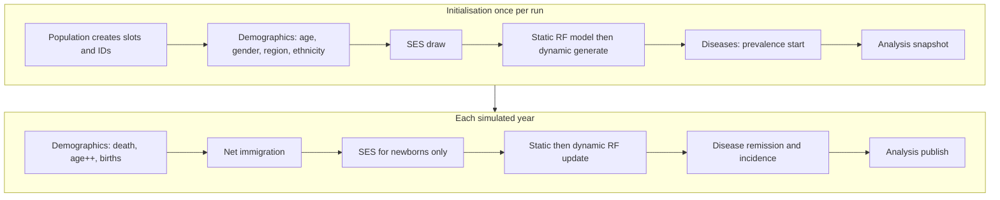

| Timing | What typically happens |
| ------ | ---------------------- |
| Population construction | Lifetime-unique `id` for each slot |
| Demographic init | Age and gender from population tables; optional region and ethnicity |
| SES init | Continuous `ses` for everyone |
| Static RF generate | Sector, income, PA, foods/nutrients (model-dependent) |
| Dynamic RF generate | Height, weight, BMI, energy state (Kevin Hall) or hierarchical updates (EBHLM) |
| Disease init | Starting prevalence |
| Yearly demographic | Deaths, survivors age by one year, births at age 0 |
| Yearly RF update | Newborns re-initialised; children/adults follow dynamic rules |
| Yearly disease | Remission then new incidence |
| Migration | Emigration flags or immigrant clones with new IDs |

For the module-level I/O view, see [Simulation models reference](simulation-models-reference.md). For the short pipeline summary, see [Models overview](../../user/models-overview.md).

---

## 4. Person ID

| | |
| --- | --- |
| **Field** | Private `id_`; read with `id()`. Sentinel `Person::unassigned_id` (`0`) until Population assigns an ID. |
| **Initial cohort** | Slot index `i` gets ID `i + 1`. |
| **Newborns and immigrants** | Monotonic `next_person_id_++`. Slots may be reused; IDs are never reused. |
| **Inputs** | None. Same seed and size give the same initial ID sequence across baseline and intervention. |
| **Later changes** | Never. Death and emigration do not free the ID for reuse. |

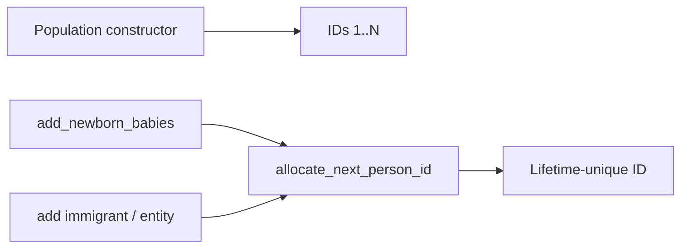

Detail: [Same person ID plan](../plans/same-person-id-baseline-intervention-plan.md). Optional CSV export: [Individual ID tracking plan](../plans/individual-id-tracking-csv-plan.md).

---

## 5. Age and gender

### Age

| | |
| --- | --- |
| **Field** | `unsigned int age` |
| **Initial set** | `DemographicModule::initialise_population` fills age by sex from datastore population shares for the start year, scaled to the virtual population size. |
| **Inputs** | Backend population tables; `inputs.settings` (`country_code`, `size_fraction`, `age_range`). |
| **Each year** | Survivors: `age += 1`. Newborns enter at age `0`. People at or above `age_range` upper bound die before ageing further. |

### Gender

| | |
| --- | --- |
| **Field** | `core::Gender gender` |
| **Initial set** | Male and female counts from the same age-sex distribution (with rounding correction on the last bins). |
| **Births** | Sex ratio at birth from the life table / birth process; newborns created via `add_newborn_babies(..., gender, ...)`. |
| **Encoding** | `gender_to_value`: male = 1, female = 0. FINCH linear models may also use `gender2` (see FINCH guide). |
| **Later changes** | Fixed for life. |

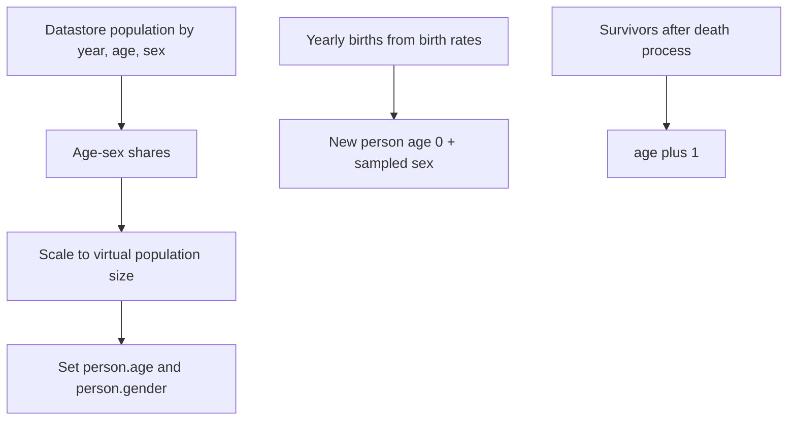

Code: `src/HealthGPS/demographic.cpp` (`initialise_population`, `update_age_and_death_events`).

---

## 6. Region, sector, and ethnicity

These are optional demographics extras. France-style HLM packs often leave them unused. FINCH-style packs usually enable region and ethnicity through `project_requirements.demographics`.

### Region

| | |
| --- | --- |
| **Field** | `std::string region` (default `"unknown"`) |
| **When** | Init for everyone; yearly only for newborns (`age == 0`). |
| **How** | `initialise_region`: CDF sample from age- and gender-specific prevalence. Exact `age_0` required for newborns; other ages may use closest available age key. |
| **Inputs** | Region prevalence CSV registered from the static model file (`RegionFile` path). Gate: `project_requirements.demographics.region`. |

### Ethnicity

| | |
| --- | --- |
| **Field** | `std::string ethnicity` |
| **When** | After region, same timing (init + newborns). |
| **How** | `initialise_ethnicity`: prevalence by age group (Under18 / Over18), gender, and **current region**. |
| **Inputs** | Ethnicity CSV (`EthnicityFile`). Gate: `project_requirements.demographics.ethnicity`. |
| **Remap** | CSV codes `"1"`..`"4"` become `"ethnicity1"`..`"ethnicity4"`; other names kept as-is. |

### Sector (urban / rural)

| | |
| --- | --- |
| **Field** | `core::Sector sector` |
| **When** | StaticLinear init; yearly update mainly for rural people turning 18. |
| **How** | `initialise_sector` uses Under18/Over18 rural prevalence by gender. At age 18, rural people may move to urban with probability derived from the prevalence ratio. |
| **Inputs** | `RuralPrevalence` in the static model JSON. |

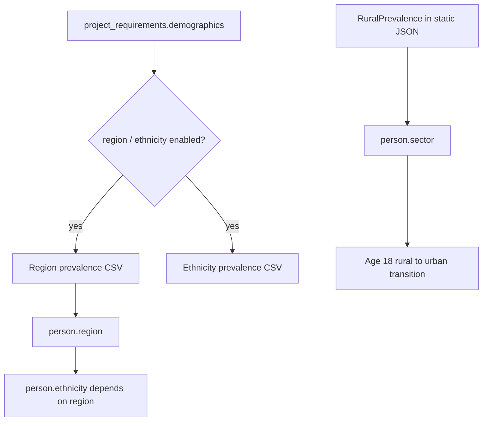

Code: `demographic.cpp` for region/ethnicity; `static_linear_model.cpp` for sector.

---

## 7. SES and income

SES noise and income are **different**. Mixing them up is a common source of confusion when reading France vs FINCH configs.

### SES field

| | |
| --- | --- |
| **Field** | `double ses` |
| **How** | `SESNoiseModule`: draw `N(mean, sd)` from `modelling.ses_model` (`function_name` must be `"normal"`). |
| **When** | Everyone at init; **newborns only** on yearly update. Adults keep their draw. |
| **Role** | Continuous predictor for hierarchical models (especially HLM France). |

### Income (FINCH continuous path)

| Field | Meaning |
| ----- | ------- |
| `income_continuous` | Continuous income value |
| `risk_factors["income"]` | Usually the same continuous value in FINCH |
| `income` (`core::Income`) | Reporting category (Low / LowerMid / UpperMid / High, or 3-category layout) |
| `income_adjustment_stratum` | Rank bucket `0..N-1` for optional quintile factors-mean tables |

Typical order inside StaticLinear generate:

1. Draw continuous income from the income linear model (+ optional noise), clamp to configured min/max.
2. Optional overall factors-mean adjustment on income.
3. Optional equal-rank split into adjustment strata (`income_adjustment_stratum`).
4. Optional per-stratum factors-mean on other risk factors / PA.
5. Equal-rank split into final `income` categories for outputs (`project_requirements.income.categories`).

### Income (India-style categorical path)

`initialise_categorical_income` draws a category from logits / softmax and stores the category numeric value in `risk_factors["income"]`. No continuous income pipeline.

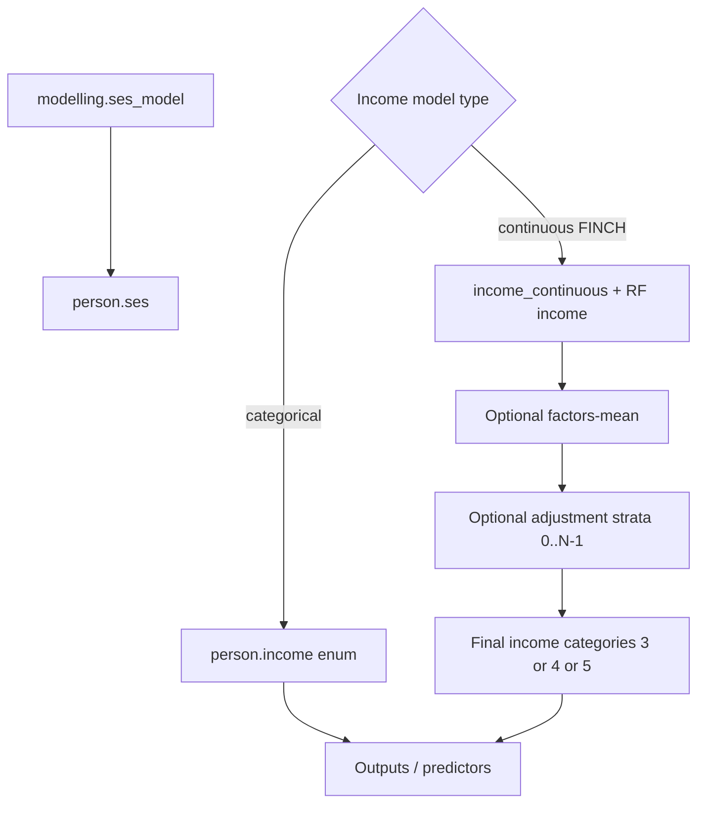

Deep dives: [FINCH guide](finch-linear-models-and-income-adjustment.md), [Dynamic income categories plan](../plans/dynamic-income-categories-plan.md), [Income quintile factor means plan](../plans/income-quintile-factor-means-plan.md).

---

## 8. Physical activity

| | |
| --- | --- |
| **Fields** | `physical_activity` and usually `risk_factors["PhysicalActivity"]` (kept in sync on the StaticLinear path). |
| **Gate** | `project_requirements.physical_activity.enabled` |
| **Simple type** | Expected mean by age/sex * lognormal-style noise. |
| **Continuous type** | Linear model + noise + clamp to configured bounds. |
| **When** | Init for the population; yearly re-init for **newborns**. Adults are not randomly re-drawn each year on this path. |
| **Kevin Hall** | Reads PA when forming energy / PA ratios for weight; it does not own the PA assignment. |
| **HLM France** | PA is often just another hierarchical risk factor (`PA`) inside HLM/EBHLM, not the dedicated StaticLinear PA models. |

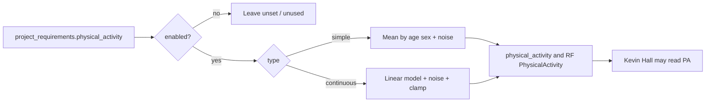

---

## 9. Height, weight, and BMI

On FINCH / Kevin Hall packs these are explicit anthropometrics. On HLM France, BMI (and related factors) usually come from the hierarchical model instead.

### Weight (Kevin Hall)

1. Build nutrient intakes and energy intake from foods.
2. Compare actual energy/PA to expected energy/PA.
3. Map that ratio onto a weight-quantile curve (optionally one curve per income adjustment stratum).
4. Set `risk_factors["Weight"]`, then optionally mean-adjust the population.

Children under 19 typically re-initialise weight on update. Adults use the Kevin Hall energy-balance run.

### Height (Kevin Hall)

After weight:

1. Resolve slope / std by sex and optional income stratum (`resolve_height_params_for_person`).
2. Draw a lifelong height residual once.
3. `update_height` combines expected height, weight slope term, and residual.
4. Growth updates continue through the child ages configured by the model.

### BMI

`BMI = Weight / (Height in metres)^2`, recomputed after anthropometric updates.

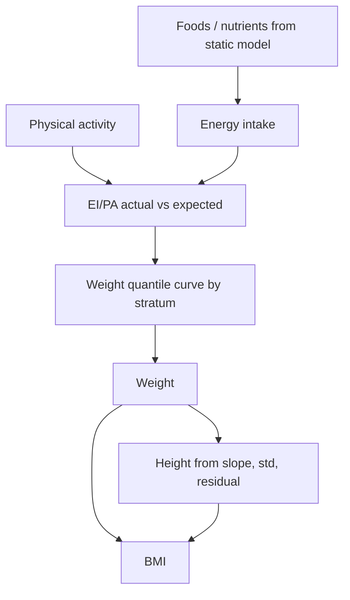

Detail and console tables: [Height CSV quintile plan](../plans/height-csv-quintile-plan.md), [Weight quintile plan](../plans/weight-quintile-plan.md).

---

## 10. Other risk factors

Everything else in `Person.risk_factors` (foods, nutrients, residuals, policy/trend copies, Kevin Hall internal state, and so on) is owned by the registered static and dynamic models.

### StaticLinear (FINCH-style foods and nutrients)

1. Draw correlated residuals (Cholesky).
2. Evaluate linear predictors.
3. Optional two-stage path: logistic chance of zero, then Box-Cox continuous value.
4. Clamp to configured ranges.
5. Store value and `{name}_residual`.
6. Optional factors-mean adjustment, policies, and trends.

### HLM + EBHLM (France-style)

- Static HLM walks the configured hierarchy level by level.
- Dynamic EBHLM applies age-specific deltas and boundary logic, then factors-mean adjustment where configured.

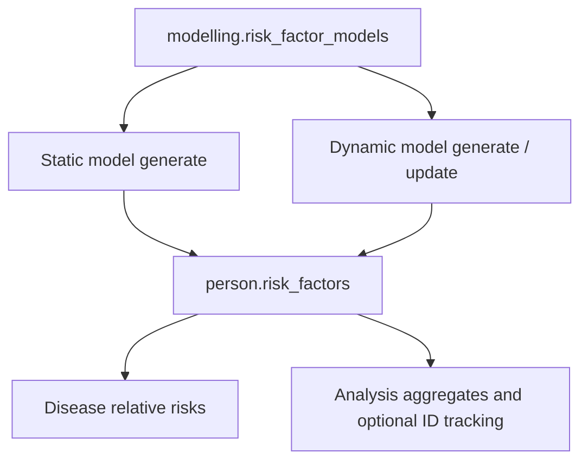

Predictor naming, Box-Cox, and policy equations for FINCH: [FINCH guide](finch-linear-models-and-income-adjustment.md). Per-model I/O: [Simulation models reference](simulation-models-reference.md).

---

## 11. Diseases

| | |
| --- | --- |
| **Field** | `diseases` map of `Disease{status, start_time, time_since_onset}` |
| **Status** | `free` or `active` |
| **Initial** | Prevalence draw using risk-factor relative risks (and mean RR normalisation). |
| **Yearly** | Remission (if applicable), then incidence. Age 0 clears disease history before infant logic runs. |
| **Cancer models** | Track `time_since_onset` and duration-based excess mortality. |
| **Inputs** | Datastore disease rates and RR tables; diseases selected in `running`; optional PIF on intervention incidence. |
| **Feedback** | Active disease excess mortality feeds the demographic death calculation. |

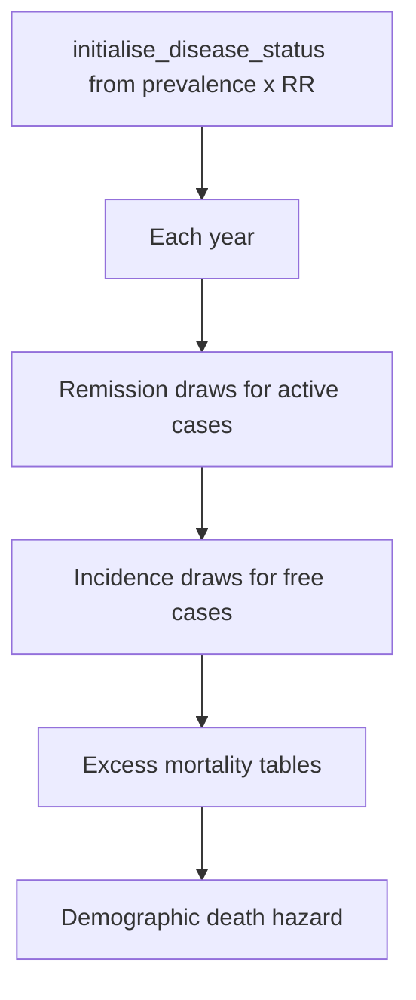

Code: `disease.cpp`, `default_disease_model.cpp`, `default_cancer_model.cpp`.

---

## 12. Alive, death, and migration

| Field / accessor | Meaning |
| ---------------- | ------- |
| `is_alive()` | False after `die(time)` |
| `has_emigrated()` | True after `emigrate(time)` |
| `time_of_death()` / `time_of_migration()` | Event times |
| `is_active()` | Alive and not emigrated |

**Death.** `update_age_and_death_events` combines residual (non-modelled) mortality with excess mortality from active diseases. People at max age die. Survivors then age by one year.

**Emigration.** When net migration for an age-sex cell is negative, active people in that cell are marked emigrated.

**Immigration.** When net migration is positive, the engine clones a similar active person (`partial_clone_entity`), assigns a **new** lifetime ID, and adds them. The clone copies age, gender, region, ethnicity, ses, sector, income category, risk factors, and diseases. Continuous-income extras and some PA/stratum bookkeeping may be incomplete until later module updates.

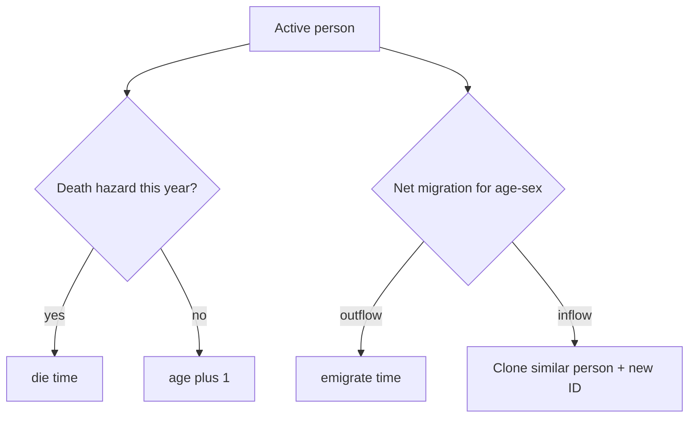

---

## 13. HLM France vs FINCH

Same `Person` type. Different models fill different fields.

| Attribute | HLM France typical path | FINCH typical path |
| --------- | ----------------------- | ------------------ |
| ID, age, gender, death, migration | Shared demographic / population logic | Same |
| Region / ethnicity / sector | Usually unused | Enabled via demographics + StaticLinear |
| `ses` | Important HLM predictor | Drawn, but income is the main socio-economic driver |
| Income continuous / category / stratum | Usually unused | StaticLinear + `project_requirements` |
| Physical activity | Hierarchical RF (`PA`) | Dedicated PA models + member field |
| Foods / nutrients | HLM then EBHLM | StaticLinear (+ policies / trends) |
| Height / Weight / BMI physiology | BMI as hierarchical RF | Kevin Hall anthropometrics |
| Diseases | Shared disease module | Shared disease module |

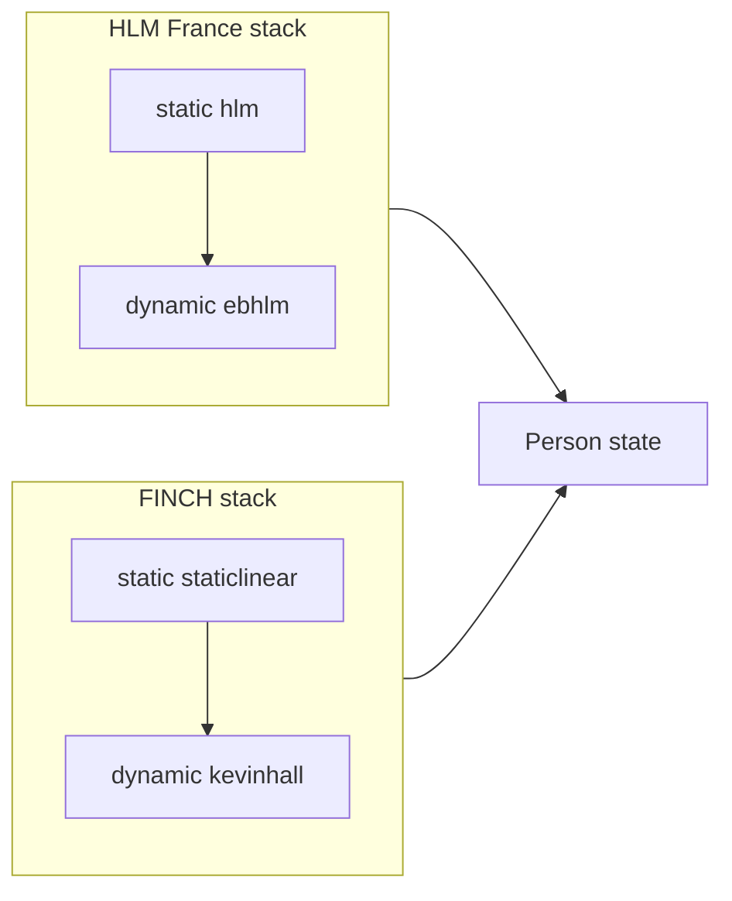

Example packs: [HLM_France](https://github.com/imperialCHEPI/healthgps-examples/tree/main/HLM_France), [KevinHall_FINCH](https://github.com/imperialCHEPI/healthgps-examples/tree/main/KevinHall_FINCH).

---

## 14. Where to look in code and config

| Concern | Primary code | Primary config / data |
| ------- | ------------ | --------------------- |
| Person fields | `src/HealthGPS/person.h` | n/a |
| IDs | `population.cpp` | `running` seeds / population size |
| Age, gender, births, deaths | `demographic.cpp` | `inputs.settings`, datastore population / births / deaths |
| Region / ethnicity | `demographic.cpp` | `project_requirements.demographics`, region/ethnicity CSVs |
| SES | `ses_noise_module.cpp` | `modelling.ses_model` |
| Sector, income, PA, foods | `static_linear_model.cpp` | static model JSON + CSVs, `project_requirements` |
| Height, weight, BMI | `kevin_hall_model.cpp` | dynamic Kevin Hall JSON + CSVs |
| Hierarchical RF (France) | `static_hierarchical_linear_model.cpp`, `dynamic_hierarchical_linear_model.cpp` | HLM / EBHLM JSON |
| Diseases | `disease.cpp`, default disease/cancer models | datastore disease tables, `running` disease list |
| Migration clone | `simulation.cpp` | population targets vs simulated counts |
| Factors-mean adjustment | `risk_factor_adjustable_model.cpp` | `modelling.baseline_adjustments` |

### Suggested reading order

1. This page (person-centric map)
2. [Models overview](../../user/models-overview.md)
3. [Simulation models reference](simulation-models-reference.md)
4. Project-specific deep dive: [FINCH guide](finch-linear-models-and-income-adjustment.md) or France architecture notes in the developer docs
5. Feature plans under [technical/plans](../README.md) when you need implementation detail

---

**Author:** Mahima Ghosh
