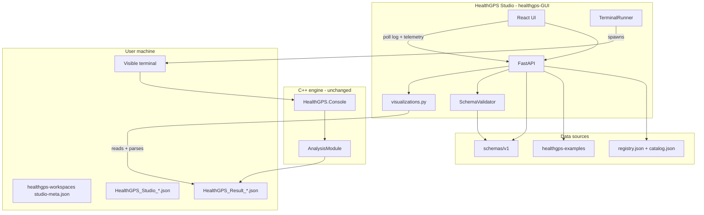
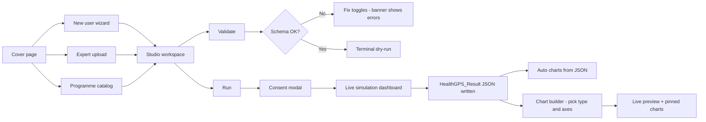
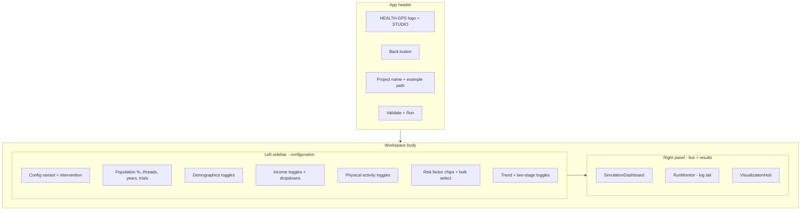
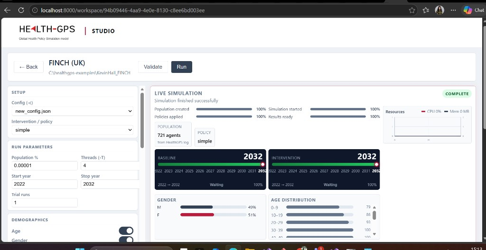
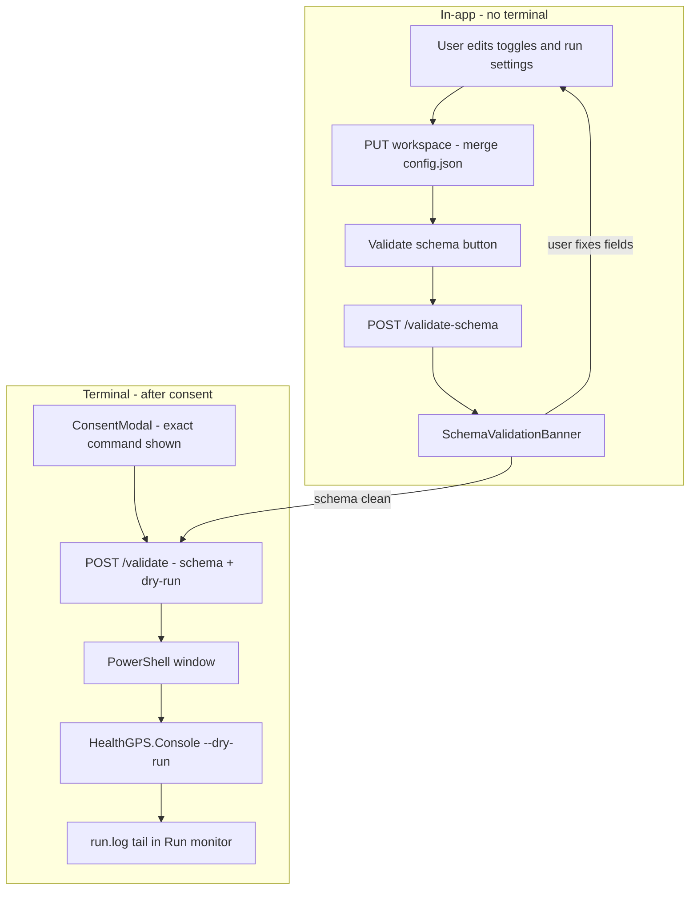
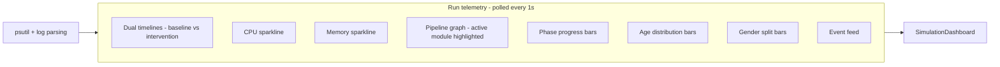
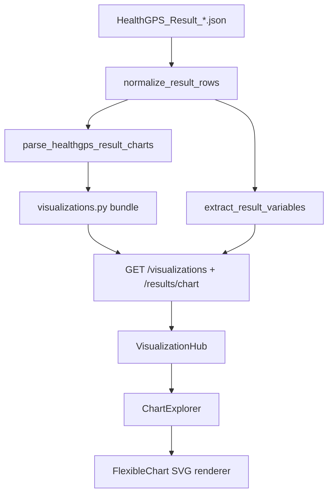
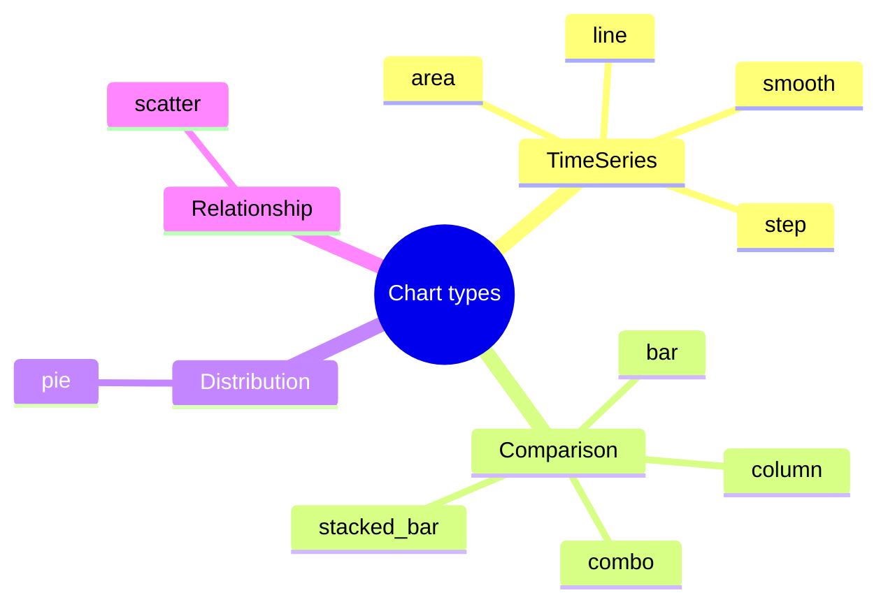
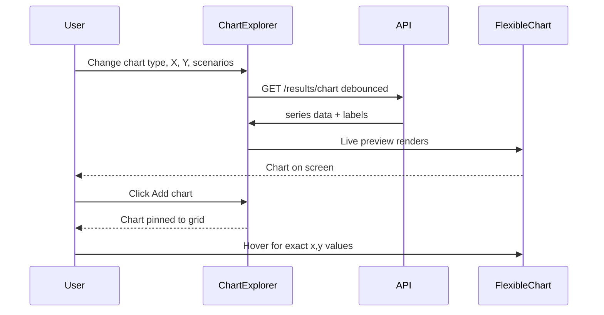
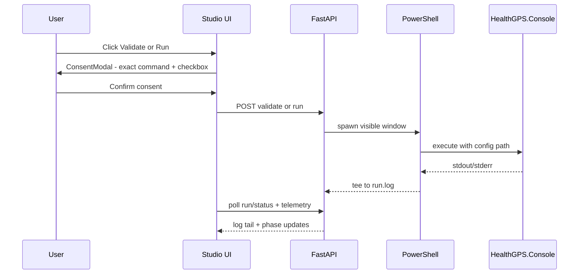

# HealthGPS Studio — GUI implementation plan

**Author:** Mahima Ghosh · **Product:** HealthGPS Studio · **Folder:** [`healthgps-GUI/`](../../../healthgps-GUI/) at repo root · **Related:** [Technical index](../README.md)

I'm building a local-first web GUI so researchers can configure HealthGPS runs without editing JSON by hand, validate configs before compute, watch simulations live, and explore results through interactive charts — all without touching the C++ engine.

---

## What I've built so far

| Area | Status |
|------|--------|
| Onboarding (cover page, wizard, expert upload, programme catalog) | Done |
| Full `project_requirements` editor + risk-factor chips | Done |
| Two-stage validation (JSON Schema + terminal dry-run) | Done |
| Visible terminal runs with consent modal | Done |
| Live simulation dashboard (timelines, CPU/memory, pipeline graph) | Done |
| Post-run plots from `HealthGPS_Result_*.json` (auto charts + chart builder) | Done |
| Live chart preview (updates as type/axes change) | Done |
| Engine source normalization (`baseline`/`intervention` → display names) | Done |
| Backend tests (32+ passing) | Done |
| Repo integration (commit to git, root README link) | **Not yet** |

The folder is currently **untracked** in git (`?? healthgps-GUI/`).

---

## My goals

1. Let users pick how they start — new user wizard, expert config upload, or curated examples.
2. Expose every `project_requirements` field as toggles/dropdowns on the workspace screen.
3. **Validate** configs in two layers before any full run (schema in-app, dry-run in terminal).
4. **Run** HealthGPS.Console in the user's visible terminal after explicit consent.
5. Show **live graphs** during the run (progress, resource use, pipeline phase).
6. After the run, parse `HealthGPS_Result_*.json` and let users **choose chart type, X axis, Y axis, and scenario** — charts render on screen immediately.
7. Keep all of this as a thin layer over the existing C++ engine — no changes to `analysis_module.cpp`.

**Out of scope for now:** HPC/PBS, full CSV data-pipeline wizard, C++ changes.

---

## How the system fits together



**Integration rule:** `config.root_path` is the parent of the config file. I write merged configs as `HealthGPS_Studio_{id}.json` beside the example directory in `healthgps-examples`, and keep workspace metadata under `%USERPROFILE%/healthgps-workspaces/`.

---

## User journey



### Routes and screens

| Route | Screen | What the user does |
|-------|--------|-------------------|
| `/` | **CoverPage** | Chooses one of three entry paths (new user, expert, examples) |
| `/new-user` | **NewUserWizard** | Picks country → sees defaults → creates workspace |
| `/expert` | **ExpertUserWorkspace** | Uploads `config.json` + optional data files |
| `/examples` | **ProjectPicker** | Browses programme × country catalog (STOP, FINCH, India, …) |
| `/workspace/new/:projectId` | **StudioWorkspace** | Configures and runs a new session |
| `/workspace/:workspaceId` | **StudioWorkspace** | Resumes an existing session |

### Cover page — first screen

Three large buttons:

- **New user** — configure a population from scratch (country, demographics, risk factors, SES)
- **Expert user** — upload your own config and data files
- **Use our existing examples** — open curated programme datasets (STOP, FINCH, India, …)

### Studio workspace — main working screen

Split layout:

| Left sidebar | Main panel |
|--------------|------------|
| Config variant (`config.json`, `new_config.json`, …) | **Live simulation** panel (phase badge, progress bars, timelines) |
| Intervention / policy dropdown | Population count, policy label, CPU/memory sparkline |
| Run parameters (population %, threads, years, trials) | Gender split bar + age distribution histogram |
| Demographics / income / PA / risk-factor toggles | **Results & charts** (after run completes) |
| Risk-factor chip selection | Run monitor (log tail, collapses when done) |
| **Validate** and **Run** buttons | |

---

## Workspace screen layout



### Screenshot — FINCH (UK) after a successful run

What I see at `http://localhost:8000/` (hard-refresh after `npm run build`):



| Area | What's on screen |
|------|------------------|
| **Header** | HEALTH-GPS \| STUDIO logo, Back, project title **FINCH (UK)**, example path `C:\healthgps-examples\KevinHall_FINCH`, **Validate** / **Run** |
| **Left sidebar** | Config (`new_config.json`), intervention (`simple`), run parameters (population %, threads, start/stop year, trials), demographics toggles (Age, Gender, …) |
| **Live simulation** | Green **COMPLETE** badge, four phase progress bars at 100% (population → policies → simulation → results), **721 agents**, policy **simple** |
| **Resources** | CPU / memory sparkline (top-right of live panel) |
| **Timelines** | Dual **BASELINE** and **INTERVENTION** year tracks (2022 → 2032, 100%) |
| **Inline charts** | Gender split (M 49% / F 51%) and age distribution histogram |
| **Below fold** | **Results & charts** — headline metrics, burden bars, auto JSON charts, comorbidity matrix, custom chart builder with live preview |

---

## Validation — two-stage flow

Users catch config mistakes **before** wasting compute time.



### Layer 1 — JSON Schema (in-process)

- **Service:** [`schema_validator.py`](../../../healthgps-GUI/backend/app/services/schema_validator.py)
- **Schema:** `schemas/v1/config.json` with `$ref` resolution
- **UI:** [`SchemaValidationBanner.tsx`](../../../healthgps-GUI/frontend/src/components/viz/SchemaValidationBanner.tsx)
- Shows field path, message, **expected vs supplied** for each error

### Layer 2 — Engine dry-run (terminal)

- Same consent flow as a full run ([`ConsentModal.tsx`](../../../healthgps-GUI/frontend/src/components/ConsentModal.tsx))
- `HealthGPS.Console -c {config} --dry-run` in a visible PowerShell window
- Output teed to `run.log`; Run monitor polls status

### What the user sees at each step

| Step | Where | Feedback |
|------|-------|----------|
| Edit config | Sidebar `ProjectRequirementsPanel` | Locked fields greyed with tooltip |
| Schema check | Red banner above workspace | Per-field expected/supplied |
| Full validate | Terminal + Run monitor | Engine stdout, completion markers |
| Run | Simulation dashboard | Phase badge, dual timelines, event feed |

---

## Graphs and charts

I split visualization into **live run graphs** (during simulation) and **post-run graphs** (from result JSON).

### Live run graphs (during simulation)



**Components:**

| Component | Purpose |
|-----------|---------|
| [`SimulationDashboard.tsx`](../../../healthgps-GUI/frontend/src/components/SimulationDashboard.tsx) | Main live panel — KPIs, timelines, inline gender/age charts |
| [`SimulationTimeline.tsx`](../../../healthgps-GUI/frontend/src/components/SimulationTimeline.tsx) | Year progress with playhead (baseline + intervention tracks) |
| [`ResourceMonitorChart.tsx`](../../../healthgps-GUI/frontend/src/components/ResourceMonitorChart.tsx) | CPU/memory over time |
| [`PipelineGraph.tsx`](../../../healthgps-GUI/frontend/src/components/viz/PipelineGraph.tsx) | Demographics → SES → Risk factors → Diseases → Analysis |
| [`RunMonitor.tsx`](../../../healthgps-GUI/frontend/src/pages/RunMonitor.tsx) | Log tail from `run.log` |

**API:** `GET /api/workspaces/{id}/run/telemetry`

### Post-run graphs (from `HealthGPS_Result_*.json`)

After the engine finishes, `AnalysisModule` writes aggregate JSON. Studio reads the **latest** file and builds plots.



#### Auto-generated views (shown prominently in Results & charts)

| Chart / view | Purpose |
|--------------|---------|
| **Headline metrics** | Policy impact chips (delta % at target year — DALY, diabetes, BMI, …) |
| **Burden delta bars** | Baseline vs intervention YLL, YLD, DALY |
| **Time-series charts** | DALY, YLL, YLD, population alive, deaths, diabetes, BMI, avg age, physical activity |
| **Comorbidity matrix** | Disease co-occurrence grid (final intervention year) |
| **Trajectories** | Quick diabetes / BMI / DALY line charts |

#### Custom chart builder

| Control | What user picks |
|---------|-----------------|
| Chart type | Line, area, bar, column, scatter, step, smooth, stacked bar, pie, combo |
| X axis | Year (time) or any numeric variable from result JSON |
| Y axis | Any variable grouped by category (Indicators, Diseases, Risk factors, …) |
| Scenarios | Baseline, Intervention, or both |
| Preview | **Live** — updates as controls change (350ms debounce) |
| Add chart | Pins the current preview into the comparison grid |

#### Supported chart types



#### Chart builder sequence



**Backend:** [`results.py`](../../../healthgps-GUI/backend/app/services/results.py), [`result_explorer.py`](../../../healthgps-GUI/backend/app/services/result_explorer.py), [`visualizations.py`](../../../healthgps-GUI/backend/app/services/visualizations.py)

**Frontend:** [`VisualizationHub.tsx`](../../../healthgps-GUI/frontend/src/components/VisualizationHub.tsx), [`ChartExplorer.tsx`](../../../healthgps-GUI/frontend/src/components/ChartExplorer.tsx), [`FlexibleChart.tsx`](../../../healthgps-GUI/frontend/src/components/FlexibleChart.tsx)

---

## Terminal execution and consent

Runs do **not** use a hidden background subprocess. The backend opens the **user's visible terminal**.



| What user sees | Where |
|----------------|-------|
| Toggle settings, Run/Validate buttons | HealthGPS Studio web UI |
| HealthGPS.Console stdout, errors, progress | **Their terminal window** |
| Summary status, log tail, result charts | Studio Run monitor + VisualizationHub |

---

## Project registry and catalog

Templates resolve from **`healthgps-examples`** (sibling repo), not `input-data/data/`.

### [`projects/registry.json`](../../../healthgps-GUI/projects/registry.json)

| ID | Example dir | Notes |
|----|-------------|-------|
| `hlm_france` | `HLM_France` | STOP France |
| `finch` | `KevinHall_FINCH` | Multiple config variants |
| `india` | `KevinHall_India` | Some fields locked per template |
| `pif` | `KevinHall_PIF` | PIF toggle enabled |

### [`projects/catalog.json`](../../../healthgps-GUI/projects/catalog.json)

| Programme | Status | Countries |
|-----------|--------|-----------|
| STOP | Active | France |
| Resolve to Save Lives | Active | India |
| FINCH | Active | United Kingdom |
| CoDiet | Upcoming | UK |
| JA Prevent NCD | Upcoming | Estonia, Belgium, Finland, … |
| JACARDI | Upcoming | Romania, Slovenia, Belgium, … |

---

## API endpoints

| Method | Path | Purpose |
|--------|------|---------|
| GET | `/api/catalog` | Programme catalog |
| GET | `/api/projects` | Registry list |
| GET | `/api/projects/{id}` | Template metadata + risk factors |
| POST | `/api/workspaces` | Create workspace |
| GET/PUT | `/api/workspaces/{id}` | Read/update config state |
| POST | `/api/workspaces/{id}/validate-schema` | JSON Schema only |
| POST | `/api/workspaces/{id}/validate` | Schema + terminal dry-run |
| GET | `/api/workspaces/{id}/preview-command` | Command for consent modal |
| POST | `/api/workspaces/{id}/run` | Full terminal run |
| GET | `/api/workspaces/{id}/run/status` | Log tail + state |
| GET | `/api/workspaces/{id}/run/telemetry` | Live graphs data |
| GET | `/api/workspaces/{id}/results` | Output file list |
| GET | `/api/workspaces/{id}/visualizations` | Full viz bundle from JSON |
| GET | `/api/workspaces/{id}/results/chart` | Custom chart series (type + axes) |

FastAPI also serves `frontend/dist` on port 8000 when built.

---

## Repository layout

```
healthgps-GUI/
  README.md
  projects/
    registry.json
    catalog.json
  backend/
    pyproject.toml
    scripts/run_healthgps.ps1
    app/
      main.py
      api/              catalog, custom, projects, runs, workspaces
      services/           config_builder, schema_validator, terminal_runner,
                          results, visualizations, result_explorer, run_analytics
    tests/              7 modules, 32+ tests
  frontend/
    src/
      pages/            CoverPage, NewUserWizard, ExpertUserWorkspace,
                        ProjectPicker, StudioWorkspace, RunMonitor
      components/       SimulationDashboard, VisualizationHub, ChartExplorer,
                        FlexibleChart, ConsentModal, ProjectRequirementsPanel, …
    dist/               production build (gitignored)
```

---

## How I run it locally

### Backend

```powershell
cd healthgps-GUI\backend
pip install python-multipart psutil
$env:HEALTHGPS_CONSOLE = "C:\healthgps\out\build\windows-release\src\HealthGPS.Console\HealthGPS.Console.exe"
$env:HEALTHGPS_EXAMPLES_ROOT = "C:\healthgps-examples"
python -m uvicorn app.main:app --reload --port 8000
```

### Frontend

```powershell
cd healthgps-GUI\frontend
npm run build
```

Open **<http://localhost:8000/>** and hard-refresh (Ctrl+Shift+R) after rebuilds.

### Optional — Vite dev server (React UI iteration)

```powershell
cd healthgps-GUI\frontend
npm run dev    # http://localhost:5173, proxies /api → :8000
```

Backend must still be running on :8000.

---

## Testing

```powershell
cd healthgps-GUI\backend && pytest
```

| Module | What I test |
|--------|-------------|
| `test_schema_validator.py` | Config schema pass/fail |
| `test_config_builder.py` | Toggle merge into config.json |
| `test_terminal_runner.py` | Command string, log completion markers |
| `test_results.py` | Result JSON parsing, output folder |
| `test_visualizations.py` | Pipeline graph, chart axes, headlines, lowercase sources |
| `test_api.py` | End-to-end workspace + custom flows |
| `test_registry.py` | All four projects resolve |

---

## Remaining work

1. **Repo integration** — commit `healthgps-GUI/`, link from root README
2. **README sync** — document validation flow and chart builder in `healthgps-GUI/README.md`
3. **Upcoming programmes** — CoDiet, JA Prevent NCD, JACARDI when examples exist
4. **CSV-based plots** — expand income stratum dumbbells and other CSV-driven views
5. **Cross-platform terminal** — macOS/Linux adapters in `TerminalRunner`

---

## Risks

| Risk | Mitigation |
|------|------------|
| Engine uses lowercase `source` values (`baseline`/`intervention`) | `normalize_result_rows()` in results pipeline |
| Result JSON shape changes | Fixture tests; graceful empty states via `VizPlaceholder` |
| Schema errors users don't understand | Banner shows expected vs supplied per field |
| Chart type vs data mismatch | API 404 with message; scatter needs numeric X |
| Untracked folder | Repo integration — priority |
| Windows-only terminal v1 | Documented; cross-platform adapter in backlog |
