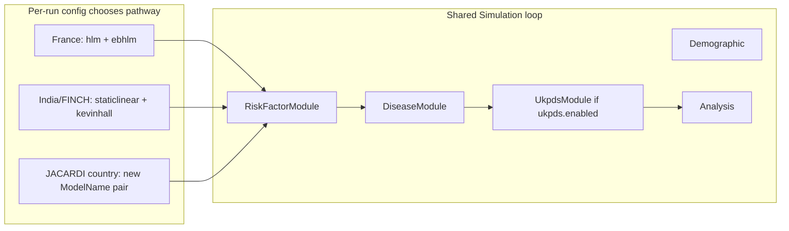
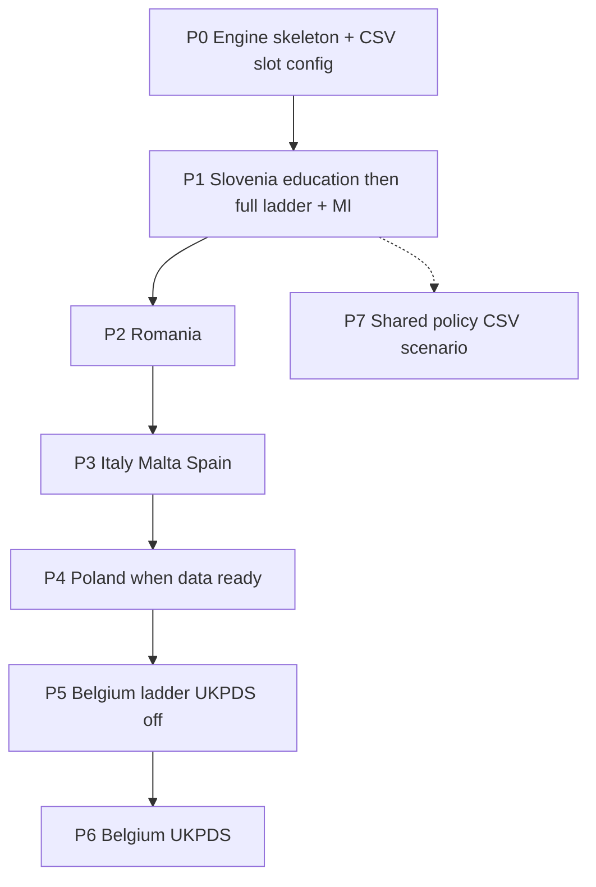

# JACARDI — 7 countries implementation plan

## Global Health Policy Simulation model

| [Home](../../index.md) | [Quick Start](../../user/getstarted.md) | [User Guide](../../user/userguide.md) | [Schemas](../../user/schemas.md) | [Models](../../user/models-overview.md) | [Architecture](../../developer/architecture.md) | [Data Model](../../developer/datamodel.md) | [Developer Guide](../../developer/development.md) | [Technical docs](../README.md) | [API](https://imperialchepi.github.io/healthgps/api/) |

**Author:** Mahima Ghosh · **GitHub:** `jacardi` · **Branch prefix:** `jacardi/`  
**Status:** Design / planning (written and maintained by Mahima)  
**Related:** [Technical index](../README.md) · [Project requirements plan](project-requirements-plan.md) · [Models overview](../../user/models-overview.md) · [How Health-GPS models a person](../guides/how-healthgps-models-a-person.md) · [Simulation models reference](../guides/simulation-models-reference.md) · [JACARDI-UKPDS-healthGPS](JACARDI-UKPDS-healthGPS.md) (Belgium diabetes submodel; restore/link when present on branch)

**Goal:** Add one new CSV-driven risk-factor pathway for JACARDI so Slovenia and the other six countries can initialise and update people without forking France HLM/EBHLM or India/FINCH StaticLinear/KevinHall. Same codebase; opt-in by `ModelName` + country data pack. Belgium alone enables UKPDS later.

---

## 1. Country set and coexistence

**Seven countries:** Romania, Slovenia, Belgium, Italy, Malta, Spain, Poland.  
**Not in scope:** Iceland.

| Project | Static slot | Dynamic slot | UKPDS |
| ------- | ----------- | ------------ | ----- |
| France / STOP | `hlm` | `ebhlm` | off |
| India / FINCH | `staticlinear` | `kevinhall` | off |
| SI, RO, IT, MT, ES, PL | *(new — see §2)* | *(new — see §2)* | off |
| Belgium | *(new)* | *(new)* | **on** when ready |

Registration is **additive** in `src/HealthGPS.Input/model_parser.cpp`. Never replace existing names.

**Regression gate after every merge:** one France pack, one India/FINCH pack, and every frozen JACARDI country smoke fixture that already exists.

All seven start with at least **sex, age, education**. Shared C++ for education lifecycle; each country brings its own CSVs when ready. Slovenia files delivered first.



---

## 2. Pathway naming (choose before coding)

I do **not** want `jacardi` / `jacardi_update` as `ModelName` — the project name should not be the algorithm name (same reason we say `staticlinear` not `finch`).

**Shortlist** (static slot → dynamic slot). Pick one pair:

| Option | Static `ModelName` | Dynamic `ModelName` | Why |
| ------ | ------------------ | ------------------- | --- |
| **A** | `cascade` | `cascadedyn` | Ordered cascade of regressions; short |
| **B** | `ladder` | `ladderdyn` | Matches economist “level / order of inclusion” language |
| **C** | `seqreg` | `seqregdyn` | Sequential regression; neutral |
| **D** | `stagewise` | `stagewisedyn` | Stage-wise person build |
| **E** | `hierreg` | `hierregdyn` | Hierarchical regression — **not** France HLM |
| **F** | `profile` | `profiledyn` | Builds the person profile then updates it |

**Until chosen:** this plan writes **`cascade` / `cascadedyn`** as the working placeholder. Swap the string everywhere once we pick.

Class names can mirror the choice (e.g. `CascadeModel` / `CascadeDynModel`).

---

## 3. Config shape — CSV slots only, no numbers in JSON

### 3.1 Host `config.json` (thin)

Keep host JSON for run control only:

- `inputs.settings` (country, size, age range)
- `modelling.risk_factor_models.static` / `.dynamic` → paths to thin model files
- diseases, output, interventions, optional `ukpds`
- **`project_requirements`** — feature flags (see §3.3 and [project-requirements-plan.md](project-requirements-plan.md))

**No scientific coefficients, probabilities, or residual banks in JSON.**

### 3.2 Model file = `ModelName` + CSV slots

Example (placeholder names; file info objects match existing Health-GPS CSV descriptors):

```json
{
  "$schema": "…/schemas/v1/config/models/cascade.json",
  "ModelName": "Cascade",
  "ScheduleFile": {
    "name": "schedule.csv",
    "format": "csv",
    "delimiter": ",",
    "encoding": "ASCII",
    "columns": {
      "order": "integer",
      "name": "string",
      "method": "string",
      "file": "string"
    }
  },
  "EducationLifecycle": {
    "lookup": { "name": "education_lookup.csv", "format": "csv", "delimiter": ",", "encoding": "ASCII" },
    "draw_at_22": { "name": "education_draw_at_22_ssp2.csv", "format": "csv", "delimiter": ",", "encoding": "ASCII" },
    "upgrade_transitions": { "name": "education_upgrade_transitions_ssp2.csv", "format": "csv", "delimiter": ",", "encoding": "ASCII" }
  }
}
```

- `schedule.csv` lists ladder steps and points at coeff / prevalence CSVs.
- Linear / logistic / multinomial **coefficients live only in those CSVs**.
- Caps such as age 110 / year 2110 come from the **data extent** (or a single optional CSV meta row later) — not hard-coded magic numbers in JSON if we can avoid them; document any unavoidable engine defaults in code comments + this plan.

Dynamic companion file: same idea — `ModelName: CascadeDyn`, CSV slots for yearly update behaviour (education Part B uses the education CSVs already loaded; newborns re-init schedule).

### 3.3 `project_requirements` for JACARDI

Reuse the existing section so users turn characteristics on/off without country `if`s. Extend only where JACARDI needs new flags (keep [project-requirements-plan.md](project-requirements-plan.md) as the source of truth for shared fields).

Example direction for a Slovenia-style run:

```json
"project_requirements": {
  "demographics": {
    "age": true,
    "gender": true,
    "region": false,
    "ethnicity": false
  },
  "education": {
    "enabled": true,
    "lifecycle": true
  },
  "income": { "enabled": false },
  "physical_activity": { "enabled": true, "type": "continuous" },
  "risk_factors": { "adjust_to_factors_mean": false, "trended": false },
  "trend": { "enabled": false, "type": "null" }
}
```

Exact `education` schema is new work — implement when coding; flags drive whether the education lifecycle runs, not which country string is set.

---

## 4. Locked modelling decisions (Mariia / Mahima, Sep 2026)

| Topic | Decision |
| ----- | -------- |
| New pathway | Yes — not StaticLinear, Kevin Hall, HLM, or EBHLM |
| Names | Pending §2 shortlist (not `jacardi` / `jacardi_update`) |
| Country set | RO, SI, BE, IT, MT, ES, PL |
| Education reuse | Shared lifecycle code; per-country CSVs |
| Residual correlation | Open — **default independent** until Mariia decides Cholesky / ICA / other |

### Delivered SI education CSVs (validated)

Copy into the Slovenia pack when implementing:

| File | Shape check |
| ---- | ----------- |
| `education_lookup.csv` | ages 22–110; gender 0/1; ids 1–7; probs sum to 1 per age×gender |
| `education_draw_at_22_ssp2.csv` | years 2025–2110; probs sum to 1 per year×gender |
| `education_upgrade_transitions_ssp2.csv` | years 2026–2110; ages 23–30; probs sum to 1 per year×age×gender×from_id |

Algorithm: economist `EDUCATION_ALGORITHM.md` (Part A init, Part B yearly). Supersedes older 1–9 / init-only notes under `examples/hlm_no_diet_bmi_only/EDUCATION_CSV_FORMAT.md`.

---

## 5. Engine design (shared for all 7)

Implement against `src/HealthGPS/risk_factor_model.h`:

1. **Static model** — load CSV slots; walk schedule; fill `Person.risk_factors`.
2. **Dynamic model** — every year: education Part B for all living persons in age windows; newborns re-run schedule steps as needed; adults otherwise hold until policy/UKPDS.
3. Schedule methods:

| method | Use |
| ------ | --- |
| `education_lifecycle` | SI-style Part A/B |
| `empirical` | Simple age×sex categorical draw (other countries if needed) |
| `linear` | Continuous (HLS, PA, BMI, SBP, HbA1c, …) |
| `logistic` | Binary (employment, medication) |
| `multinomial` | Smoking categories |

No per-country C++ subclasses. Predictor resolver expands `education_id` → ISCED dummies (`EducationISCED01`, …; no dummy for reference ISCED 3).

### Slovenia education rules (summary)

| Phase | Rule |
| ----- | ---- |
| Ages 0–5 | missing |
| 6–18 | id = 2 |
| 19–21 | id = 3 |
| 22+ at start | DRAW from lookup (age capped at table max) |
| Age 6 / 19 each year | set 2 / 3 |
| Age 22 each year | DRAW from draw_at_22 |
| Ages 23–30 | DRAW upgrade transitions; never decrease |
| 31+ | fixed |
| Births | missing at 0 |
| Immigration clones | copy education; no redraw |

Validation: monotonic education; no change at 31+; start-year 22+ shares ≈ lookup by age band×gender.

---

## 6. Country packs (isolation)

```
examples/jacardi_slovenia/   (or healthgps-examples)
examples/jacardi_romania/
examples/jacardi_belgium/      # ukpds.enabled true later
examples/jacardi_italy/
examples/jacardi_malta/
examples/jacardi_spain/
examples/jacardi_poland/
```

Each pack: thin `config.json` + `project_requirements` + model JSON with **CSV slots only** + CSV folder. Changing RO cannot affect SI.

---

## 7. Sequential rollout



| Phase | Work | Gate |
| ----- | ---- | ---- |
| P0 | Register new ModelNames; CSV-slot schema; schedule walker | India/FINCH/France green |
| P1a | SI education lifecycle + checks | Education fixture green |
| P1b | SI employment → … → SBP → MI | SI smoke frozen |
| P2 | Romania pack | SI + legacy + RO |
| P3 | IT / MT / ES packs | Prior fixtures |
| P4 | Poland when CSVs complete | Prior + PL |
| P5 | Belgium ladder, UKPDS off | Prior + BE |
| P6 | UKPDS (W1 after DiseaseModule, S1 prior-year snapshot) | V7/V8 + all prior |
| P7 | Conditional policy CSV when economists set timing | Optional per country |

Country ladder notes (data-driven; no new C++):

| Country | Ladder extras | Later eligibility / policy |
| ------- | ------------- | -------------------------- |
| SI | HLS, meds, SBP → MI | MI → ΔHLS → Δmeds → ΔSBP |
| RO | area, income, HLS, … | low HLS ∧ diabetes/CVD ∧ rural |
| IT | HbA1c | diabetes → ΔHbA1c |
| MT | SBP | post-MI / PCI/CABG → ΔSBP |
| ES | HbA1c, DSMQ-R | diabetes ∧ CVD ∧ DSMQ-R≤6 |
| PL | fill when ready | post-MI / PCI/CABG → ΔSBP |
| BE | FINDRISK, … | high FINDRISK; then UKPDS for diabetics |

---

## 8. Belgium UKPDS

Follow [JACARDI-UKPDS-healthGPS.md](JACARDI-UKPDS-healthGPS.md) when that file is on the branch (author Mahima; wiring **W1**, prior-year **S1**).

| Topic | Decision |
| ----- | -------- |
| Pre-diabetes RFs | New JACARDI pathway CSVs (not HLM / StaticLinear) |
| Default | `ukpds.enabled: false` except BE |
| Skip global clinical update for diabetics | Only when UKPDS on |

---

## 9. What I will not do

- Per-country C++ or `if (country == "SVN")` in the core loop  
- Mapping JACARDI binaries into France HLM residuals  
- Kevin Hall diet path for JACARDI  
- Putting coefficients or probabilities as numbers in JSON  
- Naming the pathway `jacardi` / `jacardi_update`  
- Turning UKPDS on outside Belgium without an explicit ask  
- Merging a country pack without green prior fixtures  

---

## 10. Complexity (my estimate)

- Shared schedule walker + CSV loaders: moderate, small LOC if one dispatch loop  
- Per-country work after P1: mostly packs + fixtures  
- UKPDS (P6): largest C++ piece; gated off by default  

---

## 11. Execution order (Mahima)

1. **Choose pathway names** (§2) with the team.  
2. Write CSV-slot schema + thin SI config skeleton (`project_requirements` + file slots).  
3. P0 engine stubs + register ModelNames.  
4. P1a SI education from delivered CSVs.  
5. P1b rest of SI ladder as partner coeffs arrive.  
6. Roll out RO → IT/MT/ES → PL → BE → UKPDS → policy.  
7. Keep India/FINCH/France green at every merge.

---

*Plan authored and maintained by **Mahima** · GitHub **jacardi** · JACARDI 7-country HealthGPS implementation.*
