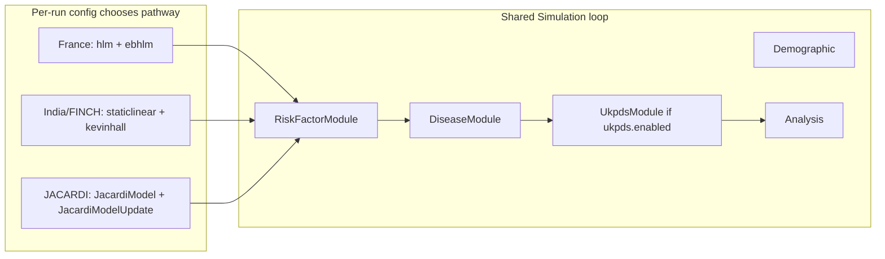
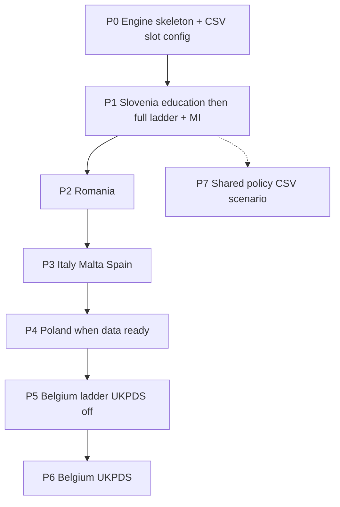

# JACARDI — 7 countries implementation plan

## Global Health Policy Simulation model

| [Home](../../index.md) | [Quick Start](../../user/getstarted.md) | [User Guide](../../user/userguide.md) | [Schemas](../../user/schemas.md) | [Models](../../user/models-overview.md) | [Architecture](../../developer/architecture.md) | [Data Model](../../developer/datamodel.md) | [Developer Guide](../../developer/development.md) | [Technical docs](../README.md) | [API](https://imperialchepi.github.io/healthgps/api/) |

**Author:** Mahima Ghosh · **GitHub:** `jacardi` · **Branch prefix:** `jacardi/`
**Status:** Design / planning (written and maintained by Mahima)
**Related:** [Technical index](../README.md) · [Project requirements plan](project-requirements-plan.md) · [Models overview](../../user/models-overview.md) · [How Health-GPS models a person](../guides/how-healthgps-models-a-person.md) · [Simulation models reference](../guides/simulation-models-reference.md) · [JACARDI-UKPDS-healthGPS](JACARDI-UKPDS-healthGPS.md) (Belgium diabetes submodel; restore/link when present on branch)

**Goal:** Add one new CSV-driven risk-factor pathway for JACARDI so Slovenia and the other six countries can initialise and update people without forking France HLM/EBHLM or India/FINCH StaticLinear/KevinHall. Same codebase; opt-in by `ModelName` + country data pack. Belgium alone enables UKPDS later for now.

---

## 1. Country set and coexistence

**Seven countries:** Romania, Slovenia, Belgium, Italy, Malta, Spain, Poland.
**Not in scope:** Iceland.

| Project                | Static slot    | Dynamic slot         | UKPDS             |
| ---------------------- | -------------- | -------------------- | ----------------- |
| France / STOP          | `hlm`          | `ebhlm`              | off               |
| India / FINCH          | `staticlinear` | `kevinhall`          | off               |
| SI, RO, IT, MT, ES, PL | `JacardiModel` | `JacardiModelUpdate` | off               |
| Belgium                | `JacardiModel` | `JacardiModelUpdate` | **on** when ready |

Registration is **additive** in `src/HealthGPS.Input/model_parser.cpp`. Never replace existing names.

**Regression gate after every merge:** one France pack, one India/FINCH pack, and every frozen JACARDI country smoke fixture that already exists.

All seven start with at least **sex, age, education**. Shared C++ for education lifecycle; each country brings its own CSVs when ready. Slovenia files delivered first.



---

## 2. Pathway naming

**Chosen `ModelName` pair** (matches Health-GPS PascalCase style like `StaticLinear` / `KevinHall`):

| Slot                      | `ModelName`          | C++ class (planned)                                   |
| ------------------------- | -------------------- | ----------------------------------------------------- |
| Static (init-oriented)    | `JacardiModel`       | `JacardiModel` / `JacardiModelDefinition`             |
| Dynamic (update-oriented) | `JacardiModelUpdate` | `JacardiModelUpdate` / `JacardiModelUpdateDefinition` |

Parser match is case-insensitive like other models (`jacardimodel` / `jacardimodelupdate`).

**Why this form:** keeps the project discoverable for partners (`Jacardi…`) while reading as a proper model family, not a folder nickname. Prefer **PascalCase** over `jacardiModel` so it sits cleanly next to `StaticLinear` and `KevinHall`.

**More “scientific” alternative we considered but did not lock:** `JacardiCascade` / `JacardiCascadeUpdate` (emphasises ordered regression cascade). Can rename later only if the team prefers; until then use `JacardiModel` / `JacardiModelUpdate` everywhere.

Config wiring example:

```json
"modelling": {
  "risk_factor_models": {
    "static": "jacardi_model.json",
    "dynamic": "jacardi_model_update.json"
  }
}
```

Inside those files: `"ModelName": "JacardiModel"` and `"ModelName": "JacardiModelUpdate"`.

**Source layout (separate files — same pattern as `static_linear_model` / `kevin_hall_model`):** do **not** put both models in one mega `.cpp`. Split by concern so helpers can grow without bloating either model.

| Files | Owns |
| ----- | ---- |
| `src/HealthGPS/jacardi_model.h` / `.cpp` | `JacardiModel` + `JacardiModelDefinition` (static slot / init) |
| `src/HealthGPS/jacardi_model_update.h` / `.cpp` | `JacardiModelUpdate` + `JacardiModelUpdateDefinition` (dynamic slot / yearly) |
| `src/HealthGPS/jacardi_education_lifecycle.h` / `.cpp` | Shared SI-style education Part A/B (used by both models) |
| `src/HealthGPS/jacardi_schedule.h` / `.cpp` | Schedule CSV load + method dispatch (linear / logistic / …) — add only when needed |
| `src/HealthGPS.Input/` parser helpers (or thin functions in `model_parser.cpp`) | Load thin JSON → definition; CSV path resolution |

Wire each pair in `src/HealthGPS/CMakeLists.txt` (and Input CMake if new parser sources). Register both `ModelName`s in `model_parser.cpp`. Later pieces (policy, UKPDS) stay in their **own** files — never dump into `jacardi_model.cpp`.

---

## 3. Config shape — CSV slots only, no numbers in JSON

### 3.1 Host `config.json` (thin)

Keep host JSON for run control only:

- `inputs.settings` (country, size, age range)
- `modelling.risk_factor_models.static` / `.dynamic` → paths to thin model files
- diseases, output, interventions, optional `ukpds`
- `project_requirements` — feature flags (see §3.3 and [project-requirements-plan.md](project-requirements-plan.md))
- **Do not** include `modelling.ses_model` — continuous SES noise is unused; socioeconomic pathways use Education / Employment / … India/HLM packs that still need SES keep the optional block (defaults to enabled when present).

**No scientific coefficients, probabilities, or residual banks in JSON.**

### 3.2 Model file = `ModelName` + CSV slots (no `schedule.csv`)

**Order of inclusion** lives in host `config.json` → `modelling.risk_factors[].level` (engine walks levels). **Do not** use a separate `schedule.csv`.

### Static vs dynamic — same ladder, different CSVs

| Slot | File | Education | Other ladder vars |
|------|------|-----------|-------------------|
| Static (init) | `jacardi_model.json` → `JacardiModel` | `lookup` only (Part A) | `*_coefs.csv` init slots |
| Dynamic (update) | `jacardi_model_update.json` → `JacardiModelUpdate` | `draw_at_22` + `upgrade_transitions` (Part B) | `*_update_coefs.csv` yearly slots |

Age/sex = UNDB / DemographicModule. **MI** = `running.diseases` + datastore RRs, not a Jacardi coef slot.

When a partner delivers a CSV, put its **filename in the matching slot** only (init → static; yearly → dynamic). Coefficients / probabilities live in those CSVs — never as numbers in JSON.

Example init file (abbrev.):

```json
{
  "ModelName": "JacardiModel",
  "Education": {
    "method": "empirical_lifecycle_init",
    "lookup": { "name": "education_lookup.csv", "format": "csv", "delimiter": ",", "encoding": "ASCII" }
  },
  "Employment": {
    "method": "logistic",
    "coefficients": { "name": "employment_coefs.csv", "format": "csv", "delimiter": ",", "encoding": "ASCII" }
  }
}
```

Example update file (abbrev.):

```json
{
  "ModelName": "JacardiModelUpdate",
  "Education": {
    "method": "empirical_lifecycle_update",
    "draw_at_22": { "name": "education_draw_at_22_ssp2.csv", "format": "csv", "delimiter": ",", "encoding": "ASCII" },
    "upgrade_transitions": { "name": "education_upgrade_transitions_ssp2.csv", "format": "csv", "delimiter": ",", "encoding": "ASCII" }
  },
  "Employment": {
    "method": "logistic",
    "coefficients": { "name": "employment_update_coefs.csv", "format": "csv", "delimiter": ",", "encoding": "ASCII" }
  }
}
```

Caps such as age 110 / year 2110 come from the **data extent** (or a single optional CSV meta row later) — not hard-coded magic numbers in JSON if we can avoid them; document any unavoidable engine defaults in code comments + this plan.

Country packs: `healthgps-examples/Jacardi_Template/`, `Jacardi_Slovenia/`, …

### 3.3 `project_requirements` for JACARDI

Reuse the existing section so users turn characteristics on/off without country `if`s. Extend only where JACARDI needs new flags (keep [project-requirements-plan.md](project-requirements-plan.md) as the source of truth for shared fields).

Example direction for a Slovenia-style run:

```json
"project_requirements": {
  "demographics": {
    "age": true,
    "gender": true,
    "region": false,
    "ethnicity": false
  },
  "education": {
    "enabled": true,
    "lifecycle": true
  },
  "income": { "enabled": false },
  "physical_activity": { "enabled": true, "type": "continuous" },
  "risk_factors": { "adjust_to_factors_mean": false, "trended": false },
  "trend": { "enabled": false, "type": "null" }
}
```

Exact `education` schema is new work — implement when coding; flags drive whether the education lifecycle runs, not which country string is set.

---

## 4. Locked modelling decisions (Mariia / Mahima, Sep 2026)

| Topic | Decision |
| ----- | -------- |
| New pathway | Yes — not StaticLinear, Kevin Hall, HLM, or EBHLM |
| ModelNames | **`JacardiModel`** / **`JacardiModelUpdate`** (see §2) |
| Country set | RO, SI, BE, IT, MT, ES, PL |
| Education reuse | Shared lifecycle code; per-country CSVs (same three-file pattern when ready) |
| Residual correlation | **Independent for v1** — ship SI education without Cholesky/ICA; revisit later |
| Simulation horizon | **Start 2025, end 2055** (30 years) for **all** JACARDI countries — config-driven; no engine complication |
| Example pack layout | **One folder per country** in HealthGPS-examples: `Jacardi_Slovenia`, `Jacardi_Romania`, … (not a single `Jacardi_allCountries`) |
| Missing education (ages 0–5) + employment | **v1:** employment model **skips** persons with missing education / below working age. **Likely next:** fix employment as unemployed/student for **age &lt; 18**; estimate employment only from **age 18+** |

### Delivered SI education CSVs (validated)

Copy into the `Jacardi_Slovenia` pack when implementing:

| File                                     | Shape check                                                             |
| ---------------------------------------- | ----------------------------------------------------------------------- |
| `education_lookup.csv`                   | ages 22–110; gender 0/1; ids 1–7; probs sum to 1 per age×gender         |
| `education_draw_at_22_ssp2.csv`          | years 2025–2110; probs sum to 1 per year×gender                         |
| `education_upgrade_transitions_ssp2.csv` | years 2026–2110; ages 23–30; probs sum to 1 per year×age×gender×from_id |

Algorithm: economist `EDUCATION_ALGORITHM.md` (Part A init, Part B yearly). Supersedes older 1–9 / init-only notes under `examples/hlm_no_diet_bmi_only/EDUCATION_CSV_FORMAT.md`.

---

## 5. Engine design (shared for all 7)

Implement against `src/HealthGPS/risk_factor_model.h`:

1. **Static model** — load CSV slots; walk schedule; fill `Person.risk_factors`.
2. **Dynamic model** — every year: education Part B for all living persons in age windows; newborns re-run schedule steps as needed; adults otherwise hold until policy/UKPDS.
3. Schedule methods:

| method                | Use                                                         |
| --------------------- | ----------------------------------------------------------- |
| `education_lifecycle` | SI-style Part A/B                                           |
| `empirical`           | Simple age×sex categorical draw (other countries if needed) |
| `linear`              | Continuous (HLS, PA, BMI, SBP, HbA1c, …)                    |
| `logistic`            | Binary (employment, medication)                             |
| `multinomial`         | Smoking categories                                          |

No per-country C++ subclasses. Predictor resolver expands `education_id` → ISCED dummies (`EducationISCED01`, …; no dummy for reference ISCED 3).

**Employment (when added after education):** skip if education missing or age &lt; 18 in v1; design schedule/flags so switching to fixed under-18 status (unemployed/student) is config/CSV later, not a rewrite.

### Slovenia education rules (summary)

| Phase                | Rule                                       |
| -------------------- | ------------------------------------------ |
| Ages 0–5             | missing                                    |
| 6–18                 | id = 2                                     |
| 19–21                | id = 3                                     |
| 22+ at start         | DRAW from lookup (age capped at table max) |
| Age 6 / 19 each year | set 2 / 3                                  |
| Age 22 each year     | DRAW from draw_at_22                       |
| Ages 23–30           | DRAW upgrade transitions; never decrease   |
| 31+                  | fixed                                      |
| Births               | missing at 0                               |
| Immigration clones   | copy education; no redraw                  |

Validation: monotonic education; no change at 31+; start-year 22+ shares ≈ lookup by age band×gender.

---

## 6. Country packs (isolation)

HealthGPS-examples (same pattern as `KevinHall_FINCH` / `HLM_France`):

```text
Jacardi_Slovenia/     # first
Jacardi_Romania/
Jacardi_Belgium/      # ukpds.enabled true later
Jacardi_Italy/
Jacardi_Malta/
Jacardi_Spain/
Jacardi_Poland/
```

Each pack: thin `config.json` (start **2025**, end **2055**) + `project_requirements` + model JSON with **CSV slots only** + education/coeff CSVs. Changing RO cannot affect SI.

---

## 7. Sequential rollout



| Phase | Work                                                      | Gate                     |
| ----- | --------------------------------------------------------- | ------------------------ |
| P0    | Add `jacardi_model` + `jacardi_model_update` `.h/.cpp` pairs; register ModelNames; CSV-slot schema; shared education helper stub | India/FINCH/France green |
| P1a   | SI education lifecycle + checks                           | Education fixture green  |
| P1b   | SI employment → … → SBP → MI                              | SI smoke frozen          |
| P2    | Romania pack                                              | SI + legacy + RO         |
| P3    | IT / MT / ES packs                                        | Prior fixtures           |
| P4    | Poland when CSVs complete                                 | Prior + PL               |
| P5    | Belgium ladder, UKPDS off                                 | Prior + BE               |
| P6    | UKPDS (W1 after DiseaseModule, S1 prior-year snapshot)    | V7/V8 + all prior        |
| P7    | Conditional policy CSV when economists set timing         | Optional per country     |

Country ladder notes (data-driven; no new C++):

| Country | Ladder extras        | Later eligibility / policy              |
| ------- | -------------------- | --------------------------------------- |
| SI      | HLS, meds, SBP → MI  | MI → ΔHLS → Δmeds → ΔSBP                |
| RO      | area, income, HLS, … | low HLS ∧ diabetes/CVD ∧ rural          |
| IT      | HbA1c                | diabetes → ΔHbA1c                       |
| MT      | SBP                  | post-MI / PCI/CABG → ΔSBP               |
| ES      | HbA1c, DSMQ-R        | diabetes ∧ CVD ∧ DSMQ-R≤6               |
| PL      | fill when ready      | post-MI / PCI/CABG → ΔSBP               |
| BE      | FINDRISK, …          | high FINDRISK; then UKPDS for diabetics |

---

## 8. Belgium UKPDS

Follow [JACARDI-UKPDS-healthGPS.md](JACARDI-UKPDS-healthGPS.md) when that file is on the branch (author Mahima; wiring **W1**, prior-year **S1**).

| Topic                                     | Decision                                        |
| ----------------------------------------- | ----------------------------------------------- |
| Pre-diabetes RFs                          | `JacardiModel` / `JacardiModelUpdate` CSV packs |
| Default                                   | `ukpds.enabled: false` except BE                |
| Skip global clinical update for diabetics | Only when UKPDS on                              |

---

## 9. What I will not do

- Per-country C++ or `if (country == "SVN")` in the core loop
- Mapping JACARDI binaries into France HLM residuals
- Kevin Hall diet path for JACARDI
- Putting coefficients or probabilities as numbers in JSON
- Using lowercase/`snake_case` ModelNames like `jacardi` / `jacardi_update` (use `JacardiModel` / `JacardiModelUpdate`)
- Turning UKPDS on outside Belgium without an explicit ask
- Merging a country pack without green prior fixtures

---

## 10. Complexity (my estimate)

- Shared schedule walker + CSV loaders: moderate, small LOC if one dispatch loop
- Per-country work after P1: mostly packs + fixtures
- UKPDS (P6): largest C++ piece; gated off by default

---

## 11. Execution order (Mahima)

1. CSV-slot schema + **`Jacardi_Slovenia`** pack skeleton (start **2025**, end **2055**; `project_requirements` + file slots; `JacardiModel` / `JacardiModelUpdate`).
2. P0: separate `jacardi_model` + `jacardi_model_update` `.h/.cpp` pairs + register ModelNames (+ shared education helper file).
3. P1a SI education from delivered CSVs (employment still skipped for missing / under-18).
4. P1b rest of SI ladder as partner coeffs arrive (employment from age 18+ when ready).
5. Roll out `Jacardi_Romania` → IT/MT/ES → PL → BE → UKPDS → policy.
6. Keep India/FINCH/France green at every merge.

---

## 12. Progress board (GitHub Project)

**Board:** [imperialCHEPI Project 7](https://github.com/orgs/imperialCHEPI/projects/7/views/1)

Track chat + implementation work as cards on that board. Sync helper (creates draft items once you are logged into `gh`):

`documentation/technical/plans/scripts/sync-jacardi-project7.ps1`

### Done (chat / packs / schema)

- [x] Lock static=init / dynamic=update; no `schedule.csv`; ladder order = `risk_factors[].level`
- [x] `Jacardi_Template` + `Jacardi_Slovenia` packs (education CSVs + full ladder slots)
- [x] Education Part A/B slot mapping (lookup / draw22 / upgrades)
- [x] Optional `ses_model` (schema + engine; Jacardi omits; India/HLM unchanged)
- [x] FactorsMean guidance for Jacardi (`file_names` omit; adjust flags)
- [x] Examples CI lint + `config_skeleton*` exclude; plan markdownlint fixes

### Next (engine)

- [ ] P0 — register `JacardiModel` / `JacardiModelUpdate` + CMake
- [ ] Ladder walker + CSV loaders (empirical / linear / logistic / multinomial)
- [ ] Optional `baseline_adjustments.file_names` in parser (dry-run without stubs)
- [ ] P1a SI education lifecycle from delivered CSVs
- [ ] P1b SI ladder coeffs + MI disease + country packs → UKPDS/policy

After running the sync script, paste each card URL next to the matching checkbox so the plan and Project 7 stay linked.

---

*Plan authored and maintained by **Mahima** · GitHub **jacardi** · JACARDI 7-country HealthGPS implementation.*
