# JACARDI-UKPDS-healthGPS — UKPDS integration into HealthGPS

**Author:** Mahima Ghosh · **GitHub:** `jacardi` · **Branch prefix:** `jacardi/`
**Status:** Design / planning (written and maintained by Mahima)
**Related:** [Technical index](../README.md)

**Goal:** Integrate the UKPDS diabetes submodel into HealthGPS so that (1) diabetes diagnosis is assigned by HealthGPS, (2) diagnosed individuals enter UKPDS, (3) from Year 2 of diabetes onward UKPDS equations update clinical risk factors and complications based on **prior-year** values, and (4) overlap complications (stroke, IHD, etc.) retain history from before diabetes onset.

---

## 1. Reference diagrams from design (UKPDS entry and recursive updates)

This is the temporal logic I am implementing. Year 1 is diagnosis; Years 2+ apply UKPDS equations recursively.

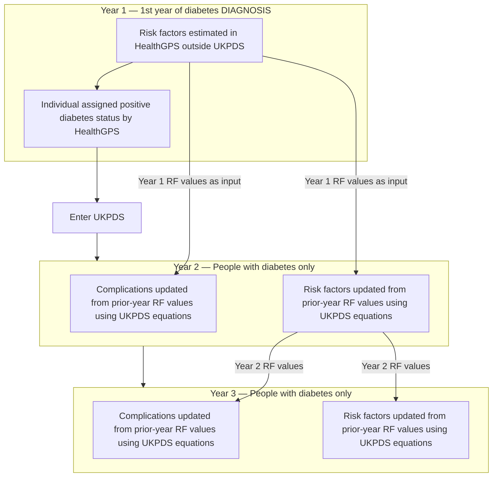

**Coding rules from this diagram:**

1. **Handover at diagnosis:** When a person is first diagnosed, their current HealthGPS risk factor values become the UKPDS initial state.
2. **Recursive from Year 2:** UKPDS uses its own equations; each year reads **prior-year** RF values.
3. **Complications before RFs in UKPDS pass:** Complications use prior-year RFs; then RFs update for next year (or same ordering as validated against UKPDS reference implementation).

---

## 2. Reference diagram (3-year HealthGPS population + UKPDS sub-process)

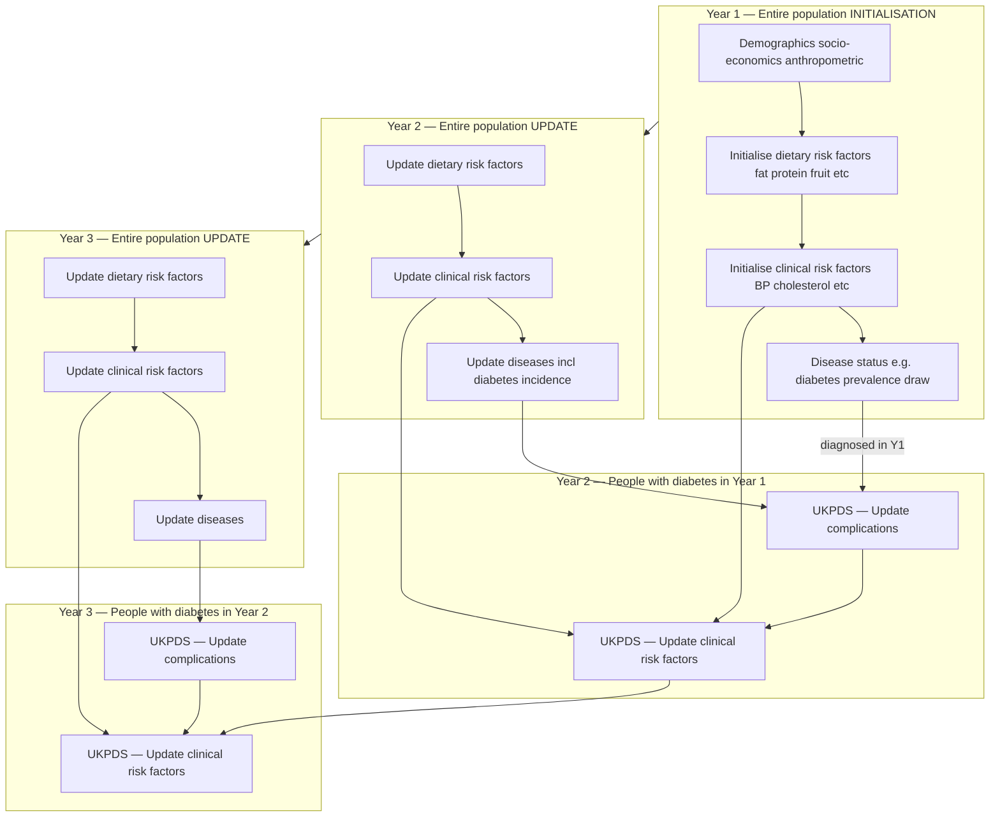

**Mapping to HealthGPS modules:**

| Diagram step                        | HealthGPS module                                       | When                                                |
| ----------------------------------- | ------------------------------------------------------ | --------------------------------------------------- |
| Demographics / SES / anthropometric | `DemographicModule`, `SESNoiseModule`                  | Year 1 init + every year                            |
| Dietary RFs                         | `StaticLinearModel` / `DynamicHierarchicalLinearModel` | Init + update                                       |
| Clinical RFs (non-UKPDS)            | Same RF models                                         | Init + update for **non-diabetic** or **pre-UKPDS** |
| Disease status / diabetes diagnosis | `DiseaseModule` → `DefaultDiseaseModel` for `diabetes` | Init prevalence + annual incidence                  |
| UKPDS complications                 | **New** `UkpdsComplicationModel`                       | After global RF + disease pass, diabetic only       |
| UKPDS clinical RFs                  | **New** `UkpdsRiskFactorModel`                         | After complications or paired in one UKPDS pass     |

---

## 3. UKPDS inside HealthGPS — how it all works together (Mahima's design)

### 3.1 Combined architecture (one diagram)

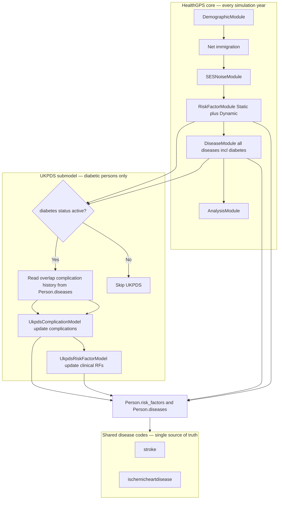

### 3.2 Annual sequence with UKPDS inserted

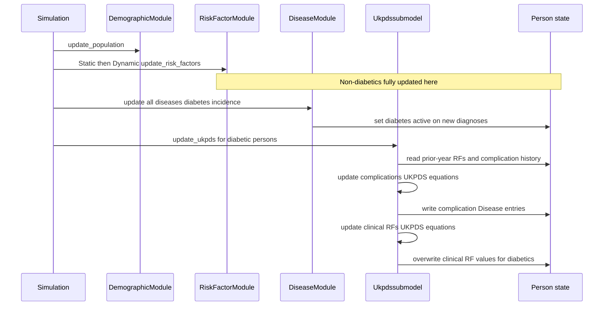

**Wiring choice:** UKPDS runs **after** `DiseaseModule` so new diagnoses in year t enter UKPDS in the same year (Year 1 of diabetes = diagnosis year). Complication/RF updates for that person use HealthGPS values from **before** the UKPDS pass as "prior year" inputs (or stored snapshot — see §5.3).

### 3.3 UKPDS internal flow (standalone view)

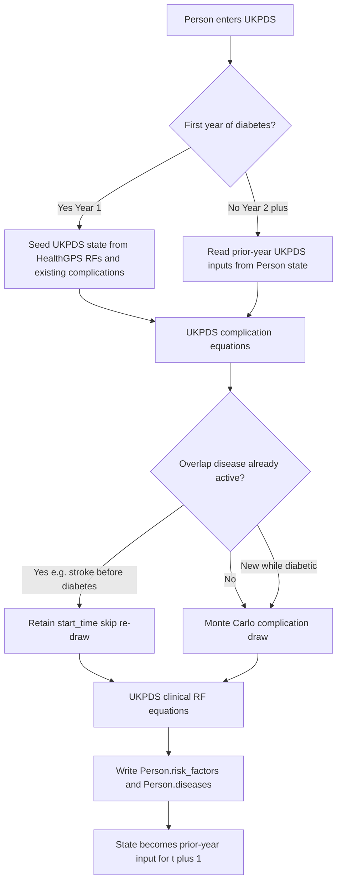

### 3.4 Single person lifecycle — initialisation through Year 3

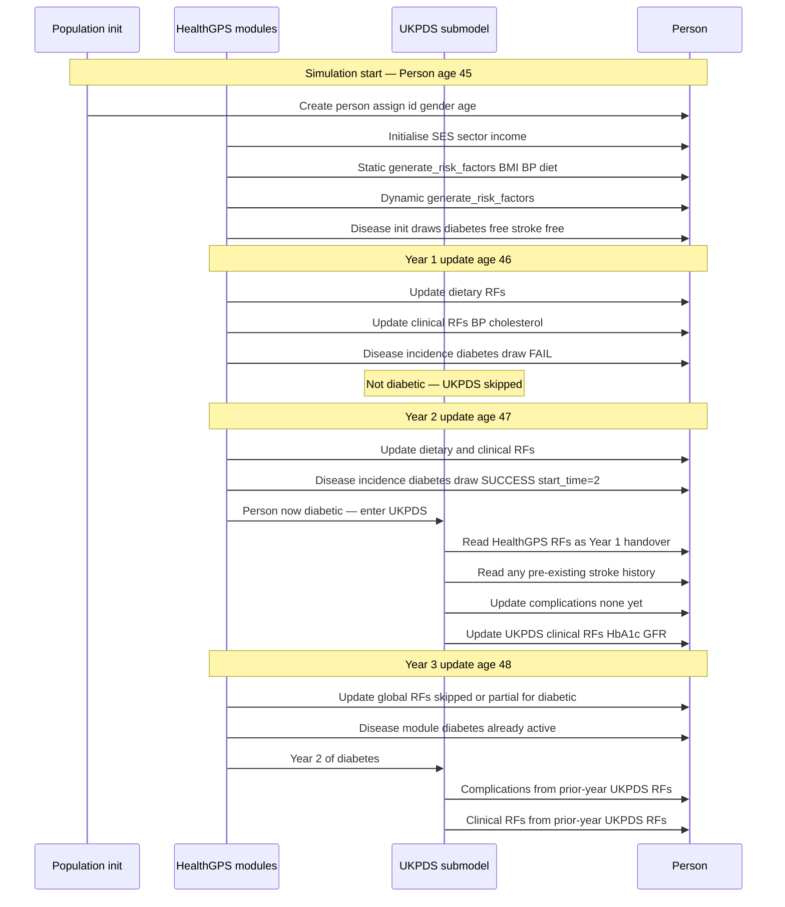

### 3.5 Class diagram — new UKPDS types in HealthGPS

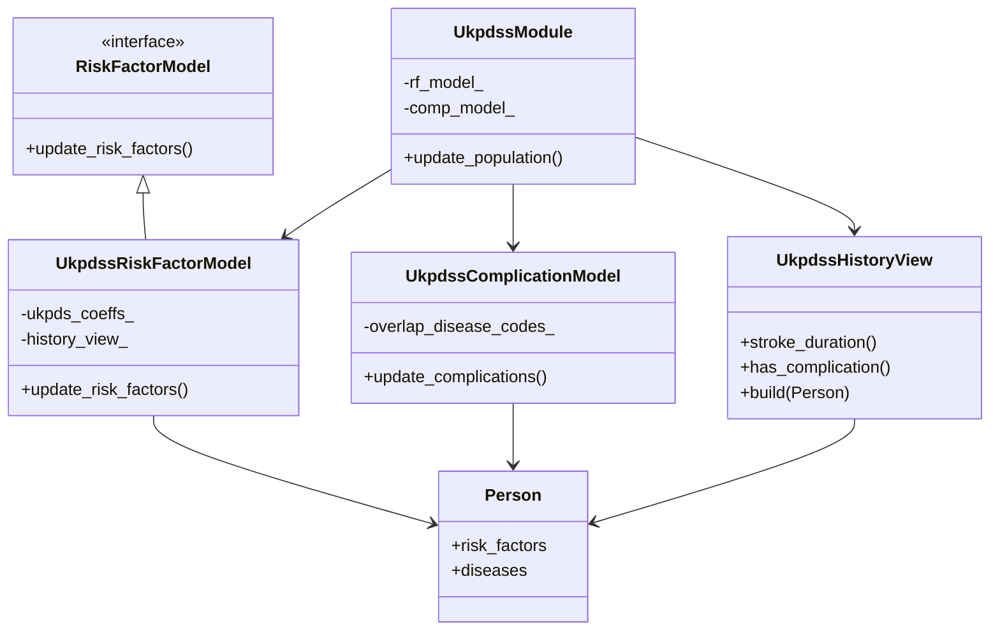

---

## 4. Pre-existing complications and history (stroke example)

When stroke occurs **before** diabetes, the global `DiseaseModule` owns the history. UKPDS reads it; it does not reset it.

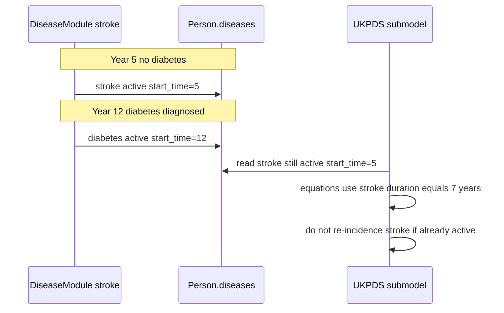

| Situation                                   | UKPDS behaviour                                                       |
| ------------------------------------------- | --------------------------------------------------------------------- |
| Complication already active before diabetes | Skip draw; use `start_time` in equations                              |
| Complication acquired while diabetic        | `DiseaseModule` or UKPDS sets `start_time = time_now`                 |
| Equation needs duration                     | `time_now - start_time`                                               |
| Overlap disease codes                       | `stroke`, `ischemicheartdisease`, etc. — same `Person.diseases` entry |

---

## 5. Where I plan to add code and how much change is required (Mahima)

### 5.1 File change map

| File / area                                                                               | Change type | Est. lines | Purpose                                                         |
| ----------------------------------------------------------------------------------------- | ----------- | ---------- | --------------------------------------------------------------- |
| **NEW** `src/HealthGPS/ukpds_risk_factor_model.h/.cpp`                                    | New         | 400–700    | UKPDS clinical RF equations per diabetic person                 |
| **NEW** `src/HealthGPS/ukpds_complication_model.h/.cpp`                                   | New         | 350–600    | 8 complication draws/updates, overlap logic                     |
| **NEW** `src/HealthGPS/ukpds_history_view.h/.cpp`                                         | New         | 100–200    | Build history predictors from `Person.diseases`                 |
| **NEW** `src/HealthGPS/ukpds_module.h/.cpp`                                               | New         | 150–250    | Orchestrates UKPDS pass; optional wrapper                       |
| **NEW** `src/HealthGPS.Input/ukpds_parser.h/.cpp`                                         | New         | 200–400    | Load UKPDS coefficient CSVs                                     |
| **NEW** `input-data/ukpds/`                                                               | New data    | —          | Equation coefficients, complication config                      |
| `[risk_factor_model.h](../../../src/HealthGPS/risk_factor_model.h)`                   | Modify      | ~15        | Add `RiskFactorModelType::Ukpds`                                |
| `[riskfactor.cpp](../../../src/HealthGPS/riskfactor.cpp)`                             | Modify      | ~30–50     | Call UKPDS RF after Static/Dynamic; or delegate to UkpdssModule |
| `[simulation.cpp](../../../src/HealthGPS/simulation.cpp)`                             | Modify      | ~20–40     | Call `ukpds_->update_population` after DiseaseModule            |
| `[simulation.h](../../../src/HealthGPS/simulation.h)`                                 | Modify      | ~10        | Optional `UkpdsModule` pointer                                  |
| `[interfaces.h](../../../src/HealthGPS/interfaces.h)`                                 | Modify      | ~5–20      | Optional `UkpdsUpdatable` interface                             |
| `[predictor_resolver.cpp](../../../src/HealthGPS/predictor_resolver.cpp)`             | Modify      | ~50–100    | Derived predictors `stroke_duration`, `has_stroke`              |
| `[configuration_parsing.cpp](../../../src/HealthGPS.Input/configuration_parsing.cpp)` | Modify      | ~40–80     | `ukpds.enabled`, paths, complication list                       |
| `[repository.cpp](../../../src/HealthGPS/repository.cpp)`                             | Modify      | ~30–50     | Load UKPDS definitions                                          |
| `[CMakeLists.txt](../../../src/HealthGPS/CMakeLists.txt)`                             | Modify      | ~10        | Add new source files                                            |
| **NEW** `src/HealthGPS.Tests/Ukpds*.Test.cpp`                                             | New         | 300–500    | Handover, 3-year recursive, overlap history                     |
| `[static_linear_model.cpp](../../../src/HealthGPS/static_linear_model.cpp)`           | Modify      | ~20–40     | Skip or partial update of clinical RFs for active diabetics     |

**Estimated total new C++:** ~1,500–2,500 lines
**Estimated modified C++:** ~200–400 lines across existing files
**New data files:** ~20–40 CSV/JSON files for UKPDS coefficients

### 5.2 Wiring options (pick one during implementation)

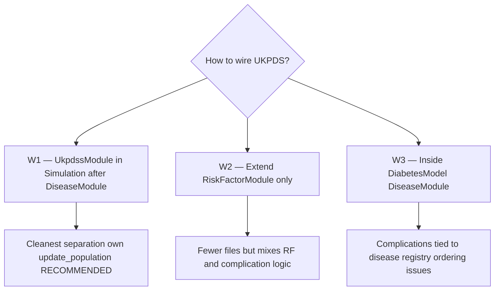

**My recommendation: W1** — add `UkpdsModule` called from `Simulation::update_population` immediately after `disease_->update_population`:

```cpp
// simulation.cpp — planned insertion point
risk_factor_->update_population(context_);
disease_->update_population(context_);
ukpds_->update_population(context_);   // NEW — diabetic persons only
analysis_->update_population(context_);
```

### 5.3 Prior-year state storage

UKPDS equations need **prior-year** RF values. Options:

| Option                         | Mechanism                                                                   | Code cost                                       |
| ------------------------------ | --------------------------------------------------------------------------- | ----------------------------------------------- |
| **S1 — Snapshot buffer**       | `Person` extension or side map `prior_risk_factors` copied end of each year | Medium (~100 lines)                             |
| **S2 — Read before overwrite** | UKPDS reads current values as prior before writing new                      | Low — but requires careful ordering within year |
| **S3 — Delayed write**         | Global RF updates skip diabetics; UKPDS owns all diabetic clinical RFs      | Medium — touches Static/Dynamic models          |

**Recommendation:** **S1** for clarity and to match diagram 1/2 semantics exactly.

Optional `Person` extension (if S1):

```cpp
// person.h — optional addition
std::map<core::Identifier, double> prior_risk_factors;  // snapshot at end of year t
```

~20 lines in `Person` + snapshot call at end of UKPDS pass.

---

## 6. My implementation options and time estimates (from scratch)

Assumes one developer familiar with HealthGPS.

### Option A — Minimal glue, UKPDS equations in data where possible

- Reuse `DefaultDiseaseModel` for diabetes diagnosis only
- UKPDS RF + complication as `UkpdsModule` with CSV-driven equations
- History via derived predictors only

| Phase                            | Duration        |
| -------------------------------- | --------------- |
| Data + parser                    | 3–4 weeks       |
| UkpdsModule + RF + complications | 4–5 weeks       |
| Handover + prior-year snapshot   | 1–2 weeks       |
| Tests + docs                     | 2–3 weeks       |
| **Total**                        | **10–14 weeks** |

### Option B — Full UKPDS module + history view + config schema (RECOMMENDED)

Everything in A plus `UkpdsHistoryView`, overlap disease gating, config schema, skip global clinical RF for diabetics.

| Phase                                | Duration        |
| ------------------------------------ | --------------- |
| Option A core                        | 8–10 weeks      |
| History view + overlap complications | 2 weeks         |
| Config schema + repository wiring    | 1 week          |
| Performance profiling                | 1 week          |
| **Total**                            | **12–14 weeks** |

### Option C — Option B + custom DiabetesModel + framework changes

- Adds `UkpdsDiseaseModel` replacing `DefaultDiseaseModel` for diabetes
- Possible `Person.prior_risk_factors` and `time_since_onset` generalisation

| **Total** | **18–22 weeks** |

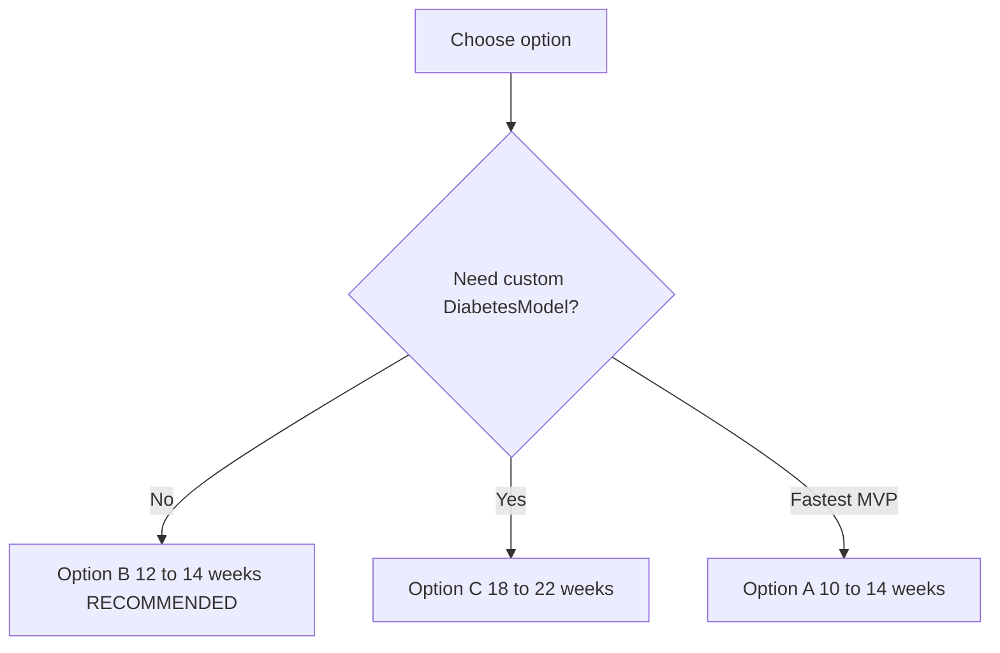

---

## 7. Overall HealthGPS flow (existing engine)

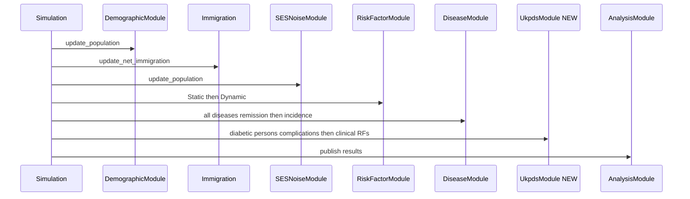

---

## 8. Data pipeline

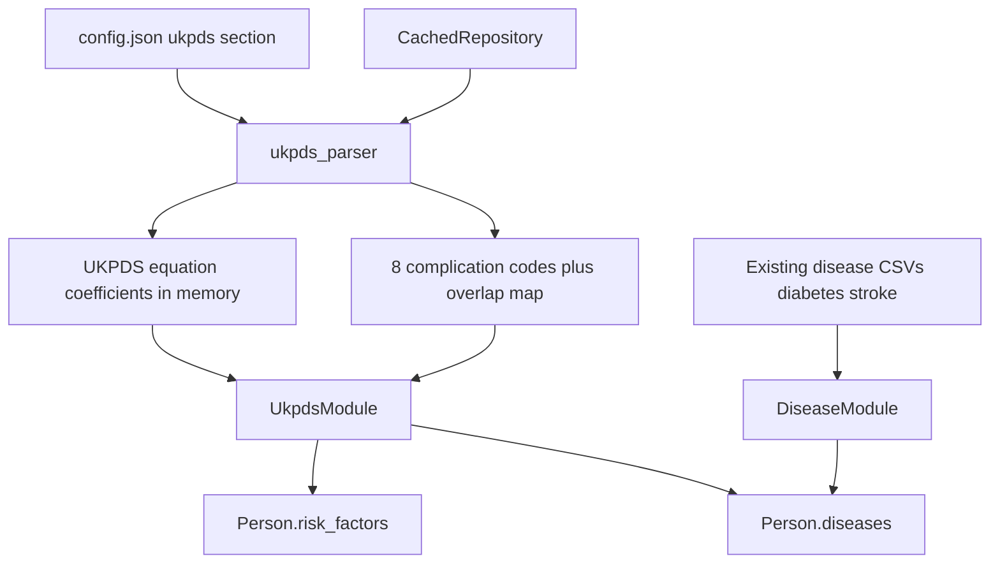

---

## 9. Validation scenarios

| #      | Scenario                             | Expected                                                          |
| ------ | ------------------------------------ | ----------------------------------------------------------------- |
| V1     | Stroke Y5, diabetes Y12              | stroke `start_time=5` preserved in UKPDS equations                |
| V2     | Diabetes first then stroke           | UKPDS + global RR elevates stroke incidence                       |
| V3     | Baseline prevalent stroke + diabetes | both `start_time=0`                                               |
| V4     | No remission                         | diabetes never returns to free                                    |
| V5     | 2nd amputation ordering              | blocked without 1st                                               |
| V6     | Performance                          | no major runtime regression                                       |
| **V7** | **3-year handover**                  | Y1 diagnosis → Y2 UKPDS uses HealthGPS RFs → Y3 uses Y2 UKPDS RFs |
| **V8** | **Non-diabetic control**             | UKPDS never runs; global RFs unchanged                            |

---

## 10. Economist-facing summary

Each year HealthGPS ages the population and updates lifestyle risk factors. When a person is diagnosed with diabetes they **enter UKPDS**. In the first year of diabetes, UKPDS uses their current HealthGPS clinical values. In later years, UKPDS uses its own equations based on last year's values to update complications and clinical biomarkers. Complications they already had (e.g. stroke before diabetes) are respected — the model does not duplicate them.

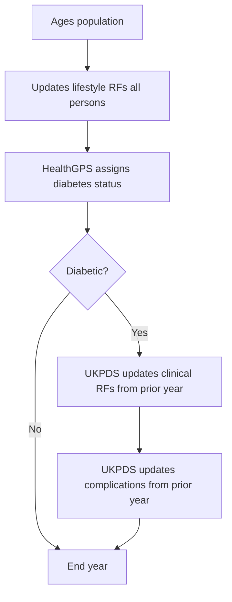

---

## 11. Performance constraints

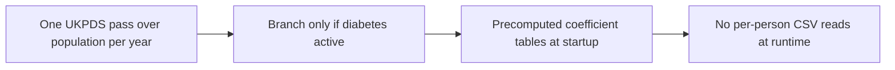

- Single `UkpdsModule` pass; no separate loop per complication
- Precompute all UKPDS tables in `Repository` at startup
- Cache overlap disease `Identifier` handles

---

## 12. Diagram index — all diagrams in Mahima's plan

| #   | Diagram                                                     | Section |
| --- | ----------------------------------------------------------- | ------- |
| 1   | UKPDS entry Year 1–3 recursive (Image 1)                    | §1      |
| 2   | HealthGPS population + UKPDS sub-process Year 1–3 (Image 2) | §2      |
| 3   | UKPDS inside HealthGPS combined architecture                | §3.1    |
| 4   | Annual sequence with UKPDS inserted                         | §3.2    |
| 5   | UKPDS internal flow                                         | §3.3    |
| 6   | Single person lifecycle init through Year 3                 | §3.4    |
| 7   | Class diagram new UKPDS types                               | §3.5    |
| 8   | Stroke-before-diabetes history sequence                     | §4      |
| 9   | Wiring options W1/W2/W3                                     | §5.2    |
| 10  | Implementation option decision tree                         | §6      |
| 11  | Overall HealthGPS sequence with UkpdsModule                 | §7      |
| 12  | Data pipeline                                               | §8      |
| 13  | Economist-facing loop                                       | §10     |
| 14  | Performance single-pass                                     | §11     |
| 15  | GitHub branch flow gitGraph (fixed — no slashes in IDs)     | §14.1   |
| 16  | Per-push PR workflow                                        | §14.3   |

---

## 13. Execution order — what I (Mahima) will do next

1. Finalise 8 UKPDS complication codes and overlap map (stroke, IHD, …).
2. Choose wiring **W1** and prior-year storage **S1**.
3. Implement `ukpds_parser` + data files.
4. Implement `UkpdsModule`, `UkpdsRiskFactorModel`, `UkpdsComplicationModel`, `UkpdsHistoryView`.
5. Wire into `simulation.cpp` after `DiseaseModule`.
6. Add `prior_risk_factors` snapshot (if S1).
7. Run validation V1–V8 including 3-year handover test.
8. Publish economist documentation.
9. Follow the GitHub branch plan in §14 — one focused PR per branch, merge in order.

---

## 14. GitHub workflow — branches, pushes, and PRs (Mahima / jacardi)

**Convention:** all branches use prefix `jacardi/` (my GitHub handle)
**Base branch:** `main` (merge target for every PR)
**Strategy:** stacked feature branches — each branch is one logical push/PR, builds on the previous merge. I (Mahima) keep `main` green after every merge.

### 14.1 Branch flow overview

> **Note:** Mermaid `gitGraph` does not allow `/` in branch IDs. Diagram labels below use short names; the real Git branch is always `jacardi/<name>` (see mapping table).

**Diagram name → Git branch mapping**

| Diagram branch ID | Real Git branch |
|---|---|
| `ukpds_scaffold` | `jacardi/ukpds-scaffold` |
| `ukpds_data` | `jacardi/ukpds-data` |
| `ukpds_config` | `jacardi/ukpds-config` |
| `ukpds_parser` | `jacardi/ukpds-parser` |
| `ukpds_person_state` | `jacardi/ukpds-person-state` |
| `ukpds_history` | `jacardi/ukpds-history` |
| `ukpds_rf_model` | `jacardi/ukpds-rf-model` |
| `ukpds_complication_model` | `jacardi/ukpds-complication-model` |
| `ukpds_module` | `jacardi/ukpds-module` |
| `ukpds_simulation_wire` | `jacardi/ukpds-simulation-wire` |
| `ukpds_static_rf_skip` | `jacardi/ukpds-static-rf-skip` |
| `ukpds_tests` | `jacardi/ukpds-tests` |
| `ukpds_docs` | `jacardi/ukpds-docs` |

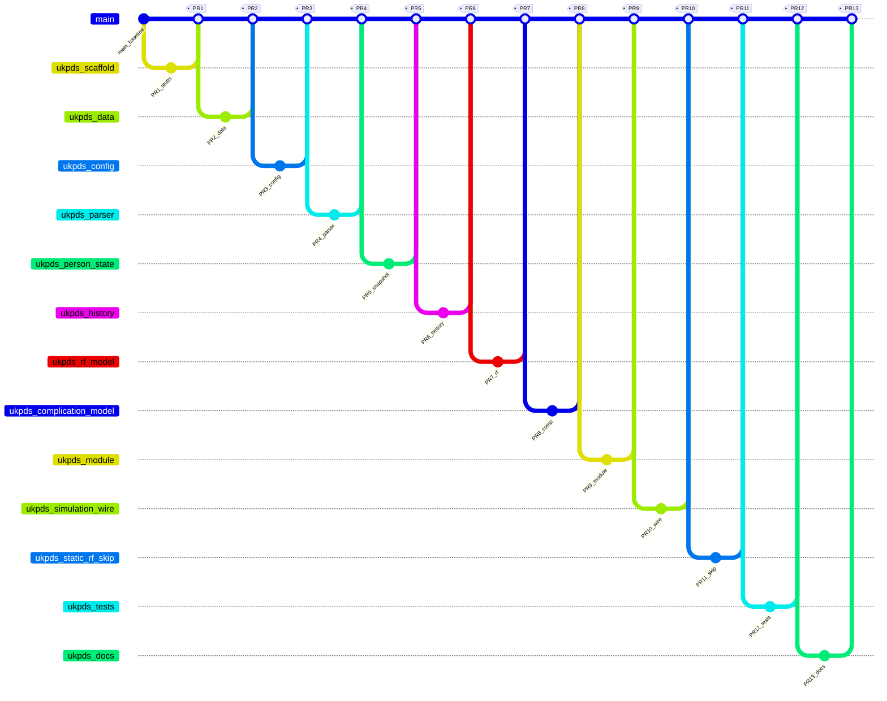

### 14.2 Branch catalogue — what goes in each push

| PR       | Branch                             | Push contains                                                                            | Files touched (main ones)                                                                                                         | Merge gate                                             |
| -------- | ---------------------------------- | ---------------------------------------------------------------------------------------- | --------------------------------------------------------------------------------------------------------------------------------- | ------------------------------------------------------ |
| **PR1**  | `jacardi/ukpds-architecture`       | Empty UKPDS class stubs; CMake entries; compiles with no behaviour change                | `ukpds_module.h/.cpp` (stub), `ukpds_risk_factor_model.h/.cpp` (stub), `ukpds_complication_model.h/.cpp` (stub), `CMakeLists.txt` | CI build green; no runtime change                      |
| **PR2**  | `jacardi/ukpds-data`               | UKPDS coefficient CSV layout; complication overlap map; placeholder data files           | `input-data/ukpds/`**, `input-data/ukpds/complication_map.json`                                                                   | Data files validate; no C++ behaviour yet              |
| **PR3**  | `jacardi/ukpds-config`             | `config.json` schema extension; parsing for `ukpds.enabled`, paths, complication list    | `configuration_parsing.cpp`, `configuration.h`, example config snippet                                                            | Existing configs unaffected when `ukpds.enabled=false` |
| **PR4**  | `jacardi/ukpds-parser`             | Load UKPDS coefficients at startup via Repository                                        | `ukpds_parser.h/.cpp`, `repository.cpp`, parser unit test                                                                         | Parser test passes                                     |
| **PR5**  | `jacardi/ukpds-person-state`       | Prior-year RF snapshot on `Person`; end-of-year copy helper                              | `person.h`, `person.cpp`, snapshot utility                                                                                        | Snapshot round-trips in test                           |
| **PR6**  | `jacardi/ukpds-history`            | `UkpdsHistoryView`; derived predictors (`stroke_duration`, `has_stroke`, …)              | `ukpds_history_view.h/.cpp`, `predictor_resolver.cpp`                                                                             | History unit tests pass (V1)                           |
| **PR7**  | `jacardi/ukpds-rf-model`           | `UkpdsRiskFactorModel` — UKPDS clinical RF equations for diabetics                       | `ukpds_risk_factor_model.h/.cpp`, handover tests                                                                                  | Year 1 handover + Year 2 recursive (V7 partial)        |
| **PR8**  | `jacardi/ukpds-complication-model` | `UkpdsComplicationModel` — 8 complications; overlap gating; no re-draw if already active | `ukpds_complication_model.h/.cpp`                                                                                                 | Complication tests V1–V5 pass                          |
| **PR9**  | `jacardi/ukpds-module`             | `UkpdsModule` orchestrates history → complications → RFs → snapshot                      | `ukpds_module.h/.cpp` (full impl)                                                                                                 | Module integration test passes                         |
| **PR10** | `jacardi/ukpds-simulation-wire`    | Hook `UkpdsModule` into `Simulation::update_population` after `DiseaseModule`            | `simulation.h`, `simulation.cpp`                                                                                                  | End-to-end sim runs; UKPDS off when disabled           |
| **PR11** | `jacardi/ukpds-static-rf-skip`     | Skip global clinical RF update for active diabetics                                      | `static_linear_model.cpp`, possibly `dynamic_hierarchical_linear_model.cpp`                                                       | V8 non-diabetic unchanged                              |
| **PR12** | `jacardi/ukpds-tests`              | Full test suite V1–V8; 3-year handover; performance smoke test                           | `UkpdsHandover.Test.cpp`, `UkpdsIntegration.Test.cpp`                                                                             | All tests green                                        |
| **PR13** | `jacardi/ukpds-docs`               | Economist note; CSV-to-equation map                                                      | `docs/ukpds/economist_note.md`, `docs/ukpds/csv_map.md`                                                                           | Economist review; no code change                       |

### 14.3 What each push should look like (my rules)

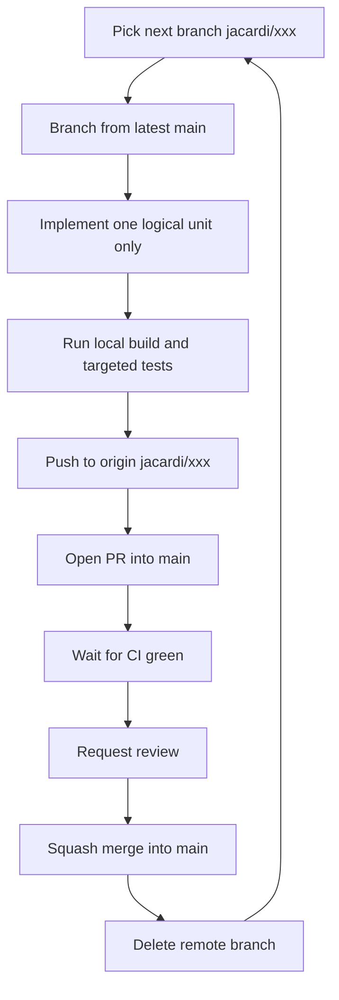

**Per-push checklist:**

- One branch = one concern (no mixing parser + simulation wiring in the same PR)
- PR description lists branch name, validation scenarios covered, and test evidence
- Every PR compiles and passes existing CI; new tests from PR7 onward
- UKPDS disabled by default until PR10 (`ukpds.enabled: false`)
- Rebase onto `main` before merge if branch is stale

### 14.4 PR title and commit message template

**PR title:** `jacardi/ukpds-<topic>: <short description>`

**Examples:**

- `jacardi/ukpds-architecture: add UKPDS module stubs and CMake entries`
- `jacardi/ukpds-simulation-wire: call UkpdsModule after DiseaseModule`

**Squash commit body:**

```
Add <what> for UKPDS integration.

Author: Mahima (@jacardi)
- <files or behaviour changed>
- Tests: <scenarios e.g. V7 handover>
- Ref: Mahima UKPDS plan section 14 PR<n>
```

### 14.5 Optional parallel branches

| Branch                             | Can start after | Depends on               |
| ---------------------------------- | --------------- | ------------------------ |
| `jacardi/ukpds-history`            | PR4 merged      | Parser only              |
| `jacardi/ukpds-rf-model`           | PR5 merged      | Parser + person snapshot |
| `jacardi/ukpds-complication-model` | PR6 merged      | Parser + history view    |

Do **not** open PR10 until PR9 is merged.

### 14.6 GitHub commands I will use

```bash
git checkout main && git pull origin main
git checkout -b jacardi/ukpds-scaffold
# ... work ...
git push -u origin jacardi/ukpds-scaffold
gh pr create --title "jacardi/ukpds-scaffold: add UKPDS module stubs and CMake entries" \
  --body "## Summary\n- Empty UKPDS stubs\n- CMake entries\n- Author: Mahima (@jacardi)\n\n## Test plan\n- [ ] CI build passes"
```

### 14.7 Timeline — branches to weeks

| Weeks | Branches  | Capability after merge                    |
| ----- | --------- | ----------------------------------------- |
| 1–2   | PR1–PR3   | Scaffold, data layout, config parses      |
| 3–4   | PR4–PR6   | Parser, prior-year snapshot, history view |
| 5–7   | PR7–PR9   | RF model, complications, full module      |
| 8–9   | PR10–PR11 | Live in simulation; handover works        |
| 10–11 | PR12–PR13 | Full validation + economist docs          |

---

*Plan authored and maintained by **Mahima** · GitHub **jacardi** · UKPDS integration design for HealthGPS.*
