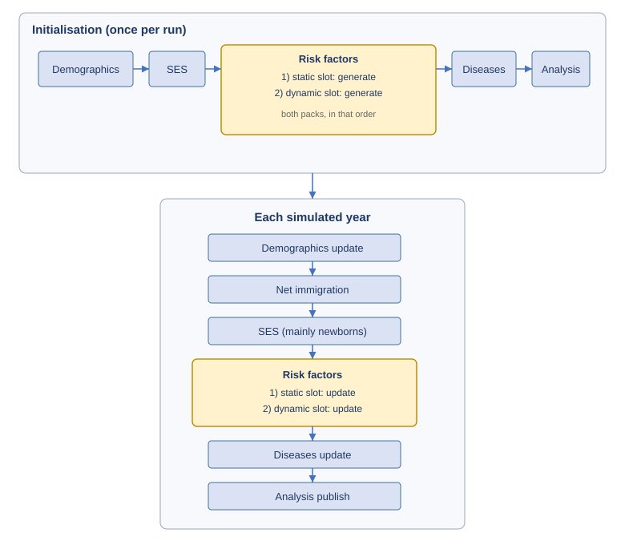
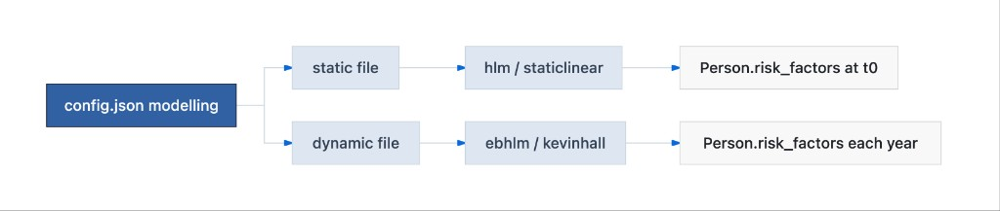

## Global Health Policy Simulation model

| [Home](../index.md) | [Quick Start](getstarted.md) | [User Guide](userguide.md) | [Schemas](schemas.md) | [Models](models-overview.md) | [Architecture](../developer/architecture.md) | [Data Model](../developer/datamodel.md) | [Developer Guide](../developer/development.md) | [Technical docs](../technical/README.md) | [API](https://imperialchepi.github.io/healthgps/api/) |

# Models in Health-GPS

Health-GPS runs a fixed stack of **simulation modules** on each person. Inside the risk-factor module, config registers **two model packs** (two JSON files). The config keys are historically called `static` and `dynamic`; those words name **roles in the pipeline**, not kinds of risk factor and not “protein is static then becomes dynamic”.

For file formats and FINCH maths, see the **[Simulation models reference](../technical/guides/simulation-models-reference.md)** and the [User Guide](userguide.md).

---

## Top-level simulation modules

|  |
|:----------------------------------------------------------------:|
| *Demographics → SES → risk factors → diseases → outputs* |

| Stage | Role |
| ----- | ---- |
| **Demographics** | Age, births, deaths, migration |
| **SES** | Continuous `ses` noise (not the same as income categories) |
| **Risk factors** | Runs the two configured model packs (see below) |
| **Diseases** | Incidence / prevalence from risk factors + datastore |
| **Analysis / output** | Aggregates and files under `output.folder` |

Architecture: [modules](../images/modules_diagram.svg), [simulation engine](../images/simulation_engine.svg), [Software Architecture](../developer/architecture.md).

---

## The confusing words: `static` and `dynamic`

In Health-GPS these are **config slot names**, not scientific labels for a nutrient.

| Config key | Better way to read it | What you put there | Example `ModelName` |
| ---------- | --------------------- | ------------------ | ------------------- |
| `modelling.risk_factor_models.static` | **Initialisation-oriented pack** | Model that mainly creates / adjusts baseline person profiles (and still participates on yearly update for newborns and some adjustments) | `hlm`, `staticlinear`, `dummy` |
| `modelling.risk_factor_models.dynamic` | **Time-update-oriented pack** | Model that mainly advances physiology / risk factors through years (and also runs a generate step at init) | `ebhlm`, `kevinhall`, `dummy` |

```json
"modelling": {
  "risk_factor_models": {
    "static": "new_static_model.json",
    "dynamic": "dynamic_model.json"
  }
}
```

Each file’s **`ModelName`** selects the real implementation (`staticlinear`, `kevinhall`, …). That name matters more than the slot word.

### What is *not* true

- A factor such as protein is **not** “a static risk factor in year 1 and a dynamic risk factor from year 2”.
- Protein (and income, PA, weight, …) are **fields on the person**. Different packs may write them at different times.
- “Static” does **not** mean “the model never changes anything later”. The initialisation-slot model still has an `update_risk_factors` path (e.g. newborns, age-18 income, factors-mean adjustment in FINCH).

### What *is* true (from the host module)

On **initialisation**, Health-GPS calls:

1. initialisation-slot → `generate_risk_factors`
2. update-slot → `generate_risk_factors`

On **each simulated year**, it calls:

1. initialisation-slot → `update_risk_factors`
2. update-slot → `update_risk_factors`

So if the update-slot is Kevin Hall, **both packs still run each year**; Kevin Hall is not the only code in the yellow risk-factor step. Older diagrams that show only “Static risk-factor model” at init and only “Dynamic risk-factor model” each year are **oversimplified**.

|  |
|:------------------------------------------------------------------------------:|
| *Both config slots run at init (generate) and each year (update). Yellow = risk-factor host.* |

### FINCH-style example (answers the protein question)

Typical pair: **`staticlinear`** in the `static` slot + **`kevinhall`** in the `dynamic` slot.

| Moment | What usually happens to nutrients / weight |
| ------ | ------------------------------------------ |
| Start of run | `staticlinear` builds correlated baseline foods/nutrients, income, PA, etc.; then `kevinhall` initialises nutrient/energy intakes, weight, height, BMI |
| Later years | `staticlinear` mainly re-initialises **newborns** (and related adjustments); `kevinhall` updates intakes/weight/BMI for the continuing population |

So protein is not re-labelled “dynamic”. It is a person value that may be **set** by one pack and **updated** by another, depending on age and year.

|  |
|:--------------------------------------------------------:|
| *Two files, two slots; `ModelName` inside each file picks the implementation* |

---

## Model names (what to remember)

Prefer these **implementation names** when talking about science. The slot (`static` / `dynamic`) only says where the file is plugged in.

| `ModelName` | Usual slot | One-line description |
| ----------- | ---------- | -------------------- |
| **`hlm`** | `static` | Hierarchical linear initialisation (STOP / France-style HLM packs). |
| **`staticlinear`** | `static` | CSV / Box-Cox baseline initialiser (FINCH, India-style); income, PA, nutrients, optional stratum mean adjustment. |
| **`ebhlm`** | `dynamic` | Yearly equation-based factor updates with mean alignment (legacy dynamic HLM). |
| **`kevinhall`** | `dynamic` | Energy-balance updates: intakes, weight, height, BMI (FINCH / Kevin Hall India). |
| **`dummy`** | either | Test stub with fixed values / simple policy; not a scientific model. |

Common pairs:

| Project style | `static` slot | `dynamic` slot |
| ------------- | ------------- | -------------- |
| STOP / HLM France | `hlm` | `ebhlm` |
| FINCH / Kevin Hall India | `staticlinear` | `kevinhall` |

Schemas: [`static.json`](https://github.com/imperialCHEPI/healthgps/blob/main/schemas/v1/config/models/static.json), [`dynamic.json`](https://github.com/imperialCHEPI/healthgps/blob/main/schemas/v1/config/models/dynamic.json). Worked inputs/outputs: [Simulation models reference](../technical/guides/simulation-models-reference.md).

---

## Other configured pieces (not `ModelName`s)

| Area | Config / data | Role |
| ---- | ------------- | ---- |
| **Income & demographics** | `project_requirements`, CSVs under `modelling` | Region, ethnicity, income category, quintile adjustment |
| **Baseline adjustments** | `modelling.baseline_adjustments` | Factors-mean calibration (optional income strata) |
| **Interventions** | `running` scenarios + policy CSVs | Policy levers in the intervention run |
| **PIF** | `population_impact_fraction` | Optional incidence scaling |
| **Datastore diseases** | Backend `data_index` + `running` disease list | Country rates and relative risks |

---

## Where to go next

| Need | Document |
| ---- | -------- |
| How a person is built and updated | [How Health-GPS models a person](../technical/guides/how-healthgps-models-a-person.md) |
| Full inputs/outputs per `ModelName` | [Simulation models reference](../technical/guides/simulation-models-reference.md) |
| FINCH linear models & income | [FINCH guide](../technical/guides/finch-linear-models-and-income-adjustment.md) |
| JSON examples | [User Guide — Risk factor models](userguide.md#risk-factor-models) |
| Example packs | [HealthGPS-examples](https://github.com/imperialCHEPI/healthgps-examples) |

---

**Author:** Mahima Ghosh
