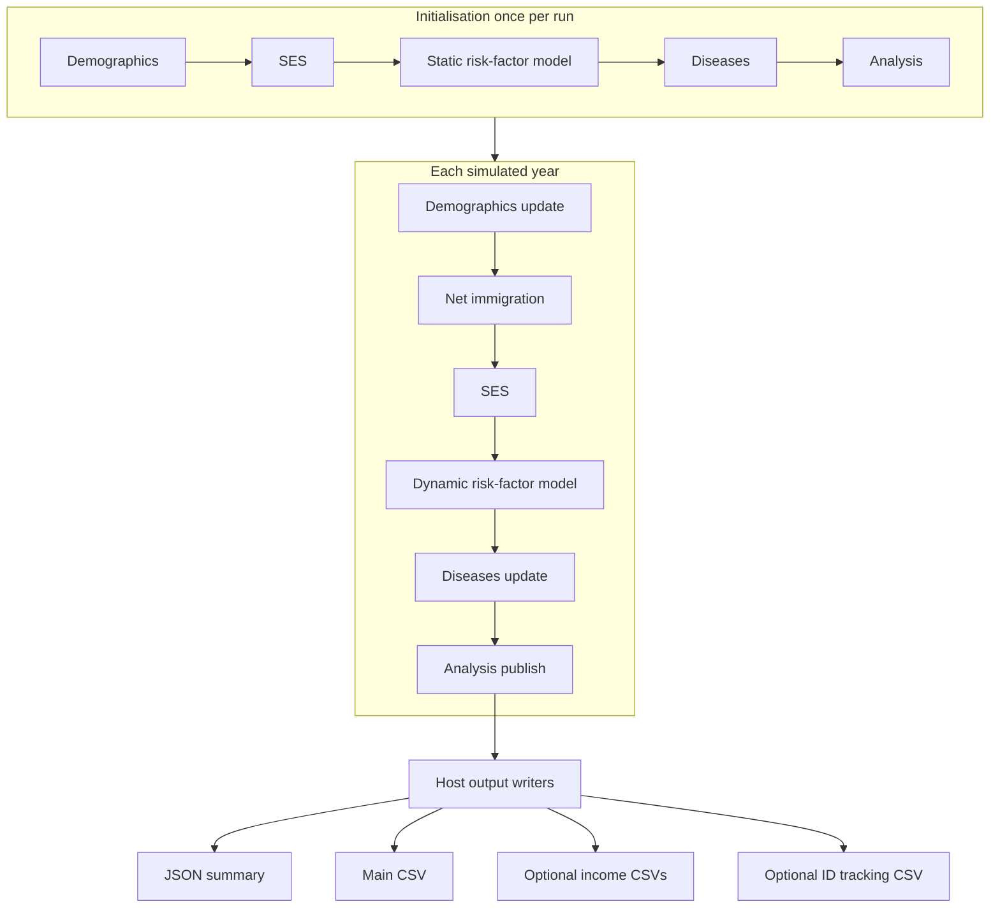
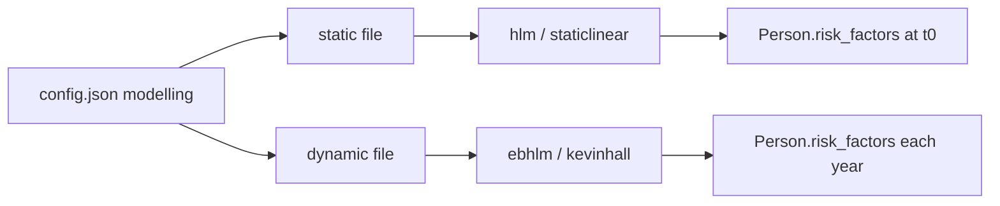

## Global Health Policy Simulation model



# Models overview

Health-GPS is built from **simulation modules** (demographics, SES, risk factors, diseases, analysis) that act on each **person** every simulated year. **Risk-factor model implementations** are separate JSON/CSV packs registered under `modelling.risk_factor_models` as **static** (initialise the population) and **dynamic** (update risk factors over time).

This page is the **website summary**: what each piece needs and what it produces. For file formats, coefficients, and FINCH-specific pipelines, see the **[Simulation models reference](../technical/guides/simulation-models-reference.md)** and the [User Guide](userguide.md).

---

## Simulation pipeline

Modules run in a fixed order each year. Policy **scenarios** (baseline vs intervention) change parameters and interventions but use the same module stack.

| Stage | Primary inputs | Primary outputs |
| ----- | ---------------- | ---------------- |
| **Demographics** | Country datastore (population, births, deaths), `inputs.settings` | Ages, births, deaths, immigration; alive / emigrated flags |
| **SES** | `modelling.ses_model`, RNG | `Person.ses` (continuous noise; separate from income categories) |
| **Risk factors** | Static + dynamic model files, optional factors-mean CSVs, `project_requirements` | `Person.risk_factors` map; optional PA, height, weight, nutrients |
| **Diseases** | Disease definitions from datastore + selection in config | `Person.diseases`; incidence/prevalence drivers |
| **Analysis** | Population state, scenario label | `ResultEventMessage` aggregates (and optional individual tracking events) |
| **Host output** | Analysis messages | Files under `output.folder` (see [Results](userguide.md#results)) |

Architecture diagrams (SVG): [modules](../images/modules_diagram.svg), [simulation engine](../images/simulation_engine.svg). Code-oriented detail: [Software Architecture](../developer/architecture.md).

---

## Risk-factor model implementations

Configured in `config.json` → `modelling.risk_factor_models`, for example `"static": "static_model.json"` and `"dynamic": "dynamic_model.json"`. The JSON **`ModelName`** field selects the implementation (validated against [`schemas/v1/config/models/static.json`](https://github.com/imperialCHEPI/healthgps/blob/main/schemas/v1/config/models/static.json) or `dynamic.json`).

| Model name | Role | Typical projects | One-line inputs → outputs |
| ---------- | ---- | ---------------- | ------------------------- |
| **`hlm`** | Static hierarchical linear model | STOP / HLM France | Fitted regressions + ICA levels → initial risk-factor draws on each person |
| **`staticlinear`** | Static linear (CSV/matrix) | FINCH, India-style packs | Coefficient CSVs, optional region/ethnicity files → initial RF (+ demographics helpers) |
| **`ebhlm`** | Dynamic hierarchical linear model | Legacy dynamic HLM | Lite dynamic JSON (deltas, hierarchy) → yearly RF updates |
| **`kevinhall`** | Dynamic energy-balance (Kevin Hall) | FINCH, Kevin Hall India | Energy/PA equations, height/weight curves, boxcox/policy CSVs → BMI, intake, PA trajectories |
| **`dummy`** | Placeholder / tests | Development | Minimal JSON → no-op or test values |

---

## Other configured “models”

These are not `ModelName` types but belong in the same mental model:

| Area | Config / data | Role |
| ---- | ------------- | ---- |
| **Income & demographics** | `project_requirements`, CSVs under `modelling` | Region, ethnicity, income category, quintile adjustment |
| **Baseline adjustments** | `modelling.baseline_adjustments` | Factors-mean calibration to stratum tables (FINCH) |
| **Interventions** | `running` scenarios + policy CSVs | Changes RF or policy levers in intervention run only |
| **PIF** | `population_impact_fraction` | Optional population impact fraction on incidence |
| **Datastore diseases** | Backend `data_index` + `running` disease list | Country-specific rates and relative risks |

---

## Where to go next

| Need | Document |
| ---- | -------- |
| Full inputs/outputs per model | [Simulation models reference](../technical/guides/simulation-models-reference.md) |
| FINCH linear models & income | [FINCH guide](../technical/guides/finch-linear-models-and-income-adjustment.md) |
| Static/dynamic JSON examples | [User Guide — Risk factor models](userguide.md#risk-factor-models) |
| Config layout | [Configuration schemas](schemas.md) |
| Example packs | [HealthGPS-examples](https://github.com/imperialCHEPI/healthgps-examples) |

---

**Author:** Mahima Ghosh
