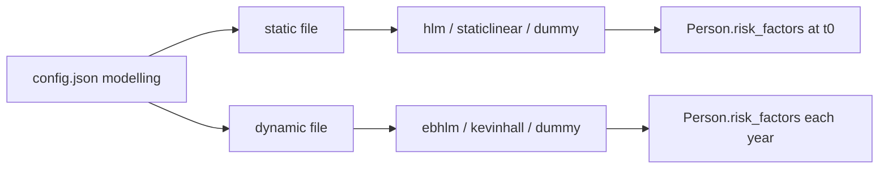
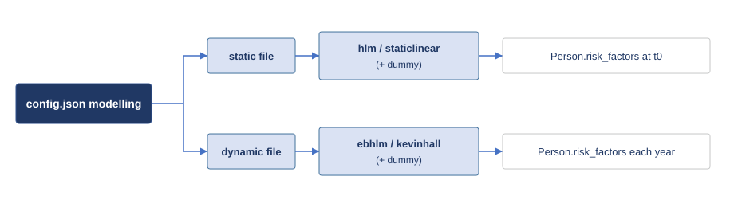

## Global Health Policy Simulation model

| [Home](../index.md) | [Quick Start](getstarted.md) | [User Guide](userguide.md) | [Schemas](schemas.md) | [Models](models-overview.md) | [Architecture](../developer/architecture.md) | [Data Model](../developer/datamodel.md) | [Developer Guide](../developer/development.md) | [Technical docs](../technical/README.md) | [API](https://imperialchepi.github.io/healthgps/api/) |

# Models in Health-GPS

Health-GPS is built from **top-level simulation modules** that act on each **person** every simulated year. Inside the risk-factor host module, JSON/CSV packs registered under `modelling.risk_factor_models` select a **static** implementation (initialise the population) and a **dynamic** implementation (update risk factors over time).

This page summarises modules, model names, inputs, behaviour, and outputs. For file formats, coefficients, and FINCH-specific pipelines, see the **[Simulation models reference](../technical/guides/simulation-models-reference.md)** and the [User Guide](userguide.md).

---

## Top-level simulation modules

Modules run in a fixed order. Policy **scenarios** (baseline vs intervention) change parameters and interventions but use the same module stack.

|  |
|:----------------------------------------------------------------:|
| *Health-GPS top-level modules: demographics → SES → risk factors → diseases → outputs* |

| Stage | Primary inputs | Primary outputs |
| ----- | -------------- | --------------- |
| **Demographics** | Country datastore (population, births, deaths), `inputs.settings` | Ages, births, deaths, immigration; alive / emigrated flags |
| **SES** | `modelling.ses_model`, RNG | `Person.ses` (continuous noise; separate from income categories) |
| **Risk factors** | Static + dynamic model files, optional factors-mean CSVs, `project_requirements` | `Person.risk_factors` map; optional PA, height, weight, nutrients |
| **Diseases** | Disease definitions from datastore + selection in config | `Person.diseases`; incidence/prevalence drivers |
| **Analysis** | Population state, scenario label | `ResultEventMessage` aggregates (and optional individual tracking events) |
| **Host output** | Analysis messages | Files under `output.folder` (see [Results](userguide.md#results)) |

Architecture diagrams (SVG): [modules](../images/modules_diagram.svg), [simulation engine](../images/simulation_engine.svg). Code-oriented detail: [Software Architecture](../developer/architecture.md).

---

## Risk-factor modules

Configured in `config.json` under `modelling.risk_factor_models`, for example `"static": "static_model.json"` and `"dynamic": "dynamic_model.json"`. The JSON **`ModelName`** field selects the implementation (validated against [`schemas/v1/config/models/static.json`](https://github.com/imperialCHEPI/healthgps/blob/main/schemas/v1/config/models/static.json) or [`dynamic.json`](https://github.com/imperialCHEPI/healthgps/blob/main/schemas/v1/config/models/dynamic.json)).

### Static risk-factor models

Used at **initialisation** (and for newborn baseline factors where applicable). Typical `ModelName` values: **`hlm`**, **`staticlinear`**, **`dummy`**.

### Dynamic risk-factor models

Used on **each simulated year** for active non-newborns (and model-specific newborn handling). Typical `ModelName` values: **`ebhlm`**, **`kevinhall`**, **`dummy`**.

|  |
|:--------------------------------------------------------:|
| *Health-GPS config.json modelling — static vs dynamic risk-factor models* |

---

## Inputs, model descriptions and outputs

### Static models

| Model JSON name | Stage | Required inputs (high level) | What the code does | Outputs / side-effects |
| --------------- | ----- | ---------------------------- | ------------------ | ---------------------- |
| **`hlm`** (`StaticHierarchicalLinearModel`) | Static | `models`, `levels` (hierarchical level definitions with transition / inverse / correlation / residual-distribution matrices) | Initialises baseline risk factors level-by-level using deterministic regression + stochastic residual sampling from hierarchical matrices. Also used for newborn initialisation in updates. | Writes factor values into `person.risk_factors[<factor>]` for mapped factors. |
| **`staticlinear`** (`StaticLinearModel`) | Static | Factors-mean tables by sex/age; risk-factor correlation + policy covariance; BoxCox params (`lambda`, `stddev`, coefficients); ranges; policy models; income/PA settings; optional logistic coeffs (2-stage); optional trend / income-trend inputs; optional stratum expected tables | Core baseline initialiser used in India/FINCH flows. Computes residual-correlated factors, optional two-stage zero/non-zero generation, income initialisation (categorical or continuous), PA initialisation, policy initialisation, trend initialisation, and mean-adjustment passes (including income-stratum adjustment when enabled). | Writes many fields: risk factors (food/nutrients/etc.), residual terms, income (`person.income` + `risk_factors["income"]`), PA, policy/trend terms, and related initialised state. |
| **`dummy`** (`DummyModel`) | Static or dynamic (same model, chosen by type) | `ModelParameters` with per-factor `Value`, `Policy`, `PolicyStart` | Sets configured factors to constant values; in intervention scenario applies simple additive policy after policy start year. | Writes configured factor constants into `person.risk_factors`; deterministic behaviour for tests / smoke runs. |

### Dynamic models

| Model JSON name | Stage | Required inputs (high level) | What the code does | Outputs / side-effects |
| --------------- | ----- | ---------------------------- | ------------------ | ---------------------- |
| **`ebhlm`** (`DynamicHierarchicalLinearModel`) | Dynamic | Expected mean table, `BoundaryPercentage`, `Equations` (by age-group and sex with coefficients + residual stddev), `Variables` mapping | Yearly update model: for active non-newborns computes delta from regression equations, applies scenario intervention effect on deltas, adds bounded noise, updates factors, then performs factors-mean adjustment to keep simulated means aligned to expected values. | Updates existing `person.risk_factors[<factor>]` over time; keeps population means aligned via adjustment step. |
| **`kevinhall`** (`KevinHallModel`) | Dynamic | Expected table; nutrient specs (`Nutrients` with ranges/energy); food nutrient equations (`Foods`); food prices; weight quantiles (M/F); energy-PA quantiles; height params (`HeightStdDev`, `HeightSlope`); optional trends (`ExpectedTrend`, `TrendSteps`) | Energy-balance dynamic model (FINCH-style): initialises/updates nutrient intake, energy intake, weight dynamics, height updates where applicable, newborn handling, baseline/intervention adjustment sync, and BMI recomputation. | Updates `Weight`, nutrient/energy-related factors, height-related state, BMI, and Kevin Hall internal state in `person.risk_factors`. |
| **`dummy`** (`DummyModel`) | Dynamic alternative | Same as static dummy | Same constant/policy logic but executed in the dynamic update phase. | Same: controlled deterministic updates to selected risk factors. |

---

## Other configured “models”

These are not `ModelName` types but belong in the same mental model:

| Area | Config / data | Role |
| ---- | ------------- | ---- |
| **Income & demographics** | `project_requirements`, CSVs under `modelling` | Region, ethnicity, income category, quintile adjustment |
| **Baseline adjustments** | `modelling.baseline_adjustments` | Factors-mean calibration to stratum tables (FINCH) |
| **Interventions** | `running` scenarios + policy CSVs | Changes RF or policy levers in intervention run only |
| **PIF** | `population_impact_fraction` | Optional population impact fraction on incidence |
| **Datastore diseases** | Backend `data_index` + `running` disease list | Country-specific rates and relative risks |

---

## Where to go next

| Need | Document |
| ---- | -------- |
| How a person is built and updated | [How Health-GPS models a person](../technical/guides/how-healthgps-models-a-person.md) |
| Full inputs/outputs per model | [Simulation models reference](../technical/guides/simulation-models-reference.md) |
| FINCH linear models & income | [FINCH guide](../technical/guides/finch-linear-models-and-income-adjustment.md) |
| Static/dynamic JSON examples | [User Guide — Risk factor models](userguide.md#risk-factor-models) |
| Config layout | [Configuration schemas](schemas.md) |
| Example packs | [HealthGPS-examples](https://github.com/imperialCHEPI/healthgps-examples) |

---

**Author:** Mahima Ghosh
