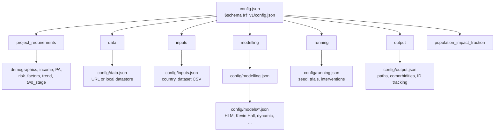
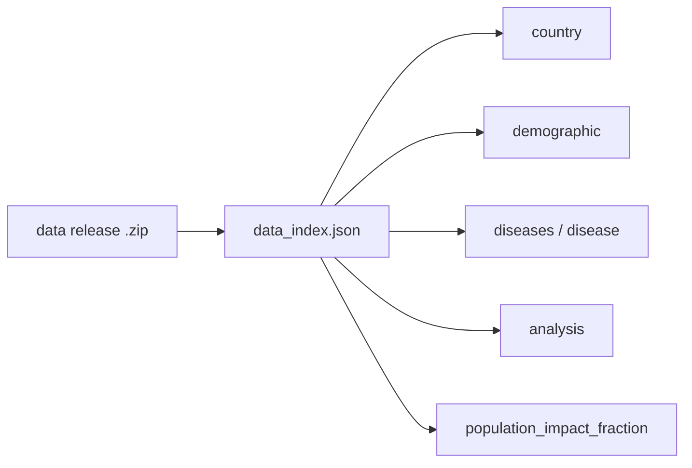
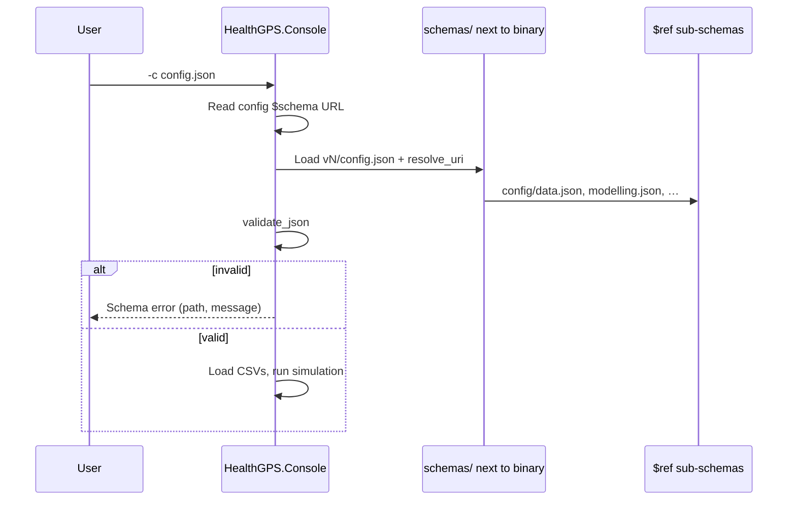

## Global Health Policy Simulation model

| [Home](../index.md) | [Quick Start](getstarted.md) | [User Guide](userguide.md) | [Schemas](schemas.md) | [Models](models-overview.md) | [Architecture](../developer/architecture.md) | [Data Model](../developer/datamodel.md) | [Developer Guide](../developer/development.md) | [Technical docs](../technical/README.md) | [API](https://imperialchepi.github.io/healthgps/api/) |

# Configuration and JSON schemas

Health-GPS validates experiment inputs with [JSON Schema](https://json-schema.org/). Schemas live in the repository under [`schemas/`](https://github.com/imperialCHEPI/healthgps/tree/main/schemas); the Console loads them from the copy next to the built binary. Your `config.json` should declare which root schema it follows via the **`$schema`** URL.

This page explains **how schemas fit together** and where to look when validation fails. For field-by-field config guidance and examples, use the [User Guide — Configuration](userguide.md#configuration). For machine-readable definitions, open the JSON files on GitHub or in your clone.

---

## What gets validated

| Input | Typical file | Root schema (v1 path) |
| ----- | ------------ | --------------------- |
| Experiment configuration | `config.json` | [`schemas/v1/config.json`](https://github.com/imperialCHEPI/healthgps/blob/main/schemas/v1/config.json) |
| Backend data catalogue | `data_index.json` (in downloaded data) | [`schemas/v1/data_index.json`](https://github.com/imperialCHEPI/healthgps/blob/main/schemas/v1/data_index.json) |
| Risk-factor / model JSON | Paths under `modelling` | e.g. [`config/models/kevinhall.json`](https://github.com/imperialCHEPI/healthgps/blob/main/schemas/v1/config/models/kevinhall.json), `hlm.json`, `dynamic.json`, … |

At startup the CLI parses JSON, resolves **`$ref`** links to sub-schemas (data, inputs, modelling, running, output, model-specific files), and reports validation errors before a long run. Use **`--dry-run`** to validate without executing trials (see [Developer Guide](../developer/development.md)).

---

## Top-level `config.json` structure

The root schema composes several sections. Optional blocks (such as **`project_requirements`**, **`population_impact_fraction`**, or **`output.individual_id_tracking`**) extend behaviour for FINCH, India, PIF, and per-person tracking without replacing the core layout.

| Section | Role |
| ------- | ---- |
| `version` | Config format version (see root schema `const`) |
| `project_requirements` | Per-project switches: demographics dimensions, income categories, PA, trends ([schema](https://github.com/imperialCHEPI/healthgps/blob/main/schemas/v1/config/project_requirements.json)) |
| `data` | Where to fetch or find the backend datastore |
| `inputs` | Country code, population fraction, age range, validation CSV |
| `modelling` | SES, risk-factor hierarchy, model file references, baseline adjustments |
| `running` | Random seeds, trial count, baseline/intervention scenarios |
| `output` | Result folder, filenames, optional individual ID tracking |
| `population_impact_fraction` | Optional PIF analysis block |

Worked JSON skeleton: [`examples/config_skeleton.json`](https://github.com/imperialCHEPI/healthgps/blob/main/examples/config_skeleton.json). Project packs: [HealthGPS-examples](https://github.com/imperialCHEPI/healthgps-examples).

---

## Backend `data_index.json`

Downloaded or local datastore bundles describe countries, demographics, diseases, and analysis metadata in a separate index file. It uses its own root schema and is validated when the Console loads data.

See [User Guide — Backend storage](userguide.md#backend-storage) for how this connects to `config.json` → `data`.

---

## Schema versions (v1, v2, unified)

The repository may contain more than one schema tree while projects migrate:

| Tree | Typical use | Notes |
| ---- | ----------- | ----- |
| **`schemas/v1/`** | STOP / HLM France, India, many current examples | Root `$schema` URLs often point at `.../main/schemas/v1/config.json` |
| **`schemas/v2/`** | Extended FINCH-style model definitions | Extra properties on some model schemas |
| **`schemas/config/`** | Target unified layout | Described in the [schema migration plan](../technical/plans/schema-migration-plan.md) |

Your **`$schema`** URL must match the tree the Console expects for that release. If validation fails after upgrading Health-GPS, compare your config’s `$schema` with the example pack for your project and read the [update report](../technical/guides/healthgps-update-report-2026-02-20.md) (config/schema section).

Legacy fields (for example top-level `income_categories` or `trend_type`) may still parse when **`project_requirements`** is omitted; the root schema marks many of these as **deprecated** in favour of `project_requirements`.

---

## How validation works at run time

Schema URLs use the prefix `https://raw.githubusercontent.com/imperialCHEPI/healthgps/main/schemas/`; the Console maps that prefix to **`{program_dir}/schemas/`** (see `src/HealthGPS.Input/schema.cpp`). Editing `$schema` in config without updating the matching files under `schemas/` in your build causes “Unable to load URL” or validation mismatches.

---

## When validation fails

1. Read the **first** schema error (JSON pointer + message).
2. Open the cited sub-schema on GitHub (table above) or in `schemas/v1/config/...` in your clone.
3. Compare with a known-good config ([FINCH](https://github.com/imperialCHEPI/healthgps-examples/tree/main/KevinHall_FINCH), [France](https://github.com/imperialCHEPI/healthgps-examples/tree/main/HLM_France), [India](https://github.com/imperialCHEPI/healthgps-examples/tree/main/KevinHall_India)).
4. Run with **`--dry-run`** after fixes.
5. For new optional features (`project_requirements`, income strata, ID tracking), see the matching [technical plans](../technical/README.md) and [FINCH guide](../technical/guides/finch-linear-models-and-income-adjustment.md).

---

## Related documentation

| Topic | Document |
| ----- | -------- |
| Config sections and examples | [User Guide — Configuration](userguide.md#configuration) |
| `project_requirements` | [User Guide — Project requirements](userguide.md#project-requirements) |
| Output / ID tracking schema | [User Guide — Output](userguide.md#output) |
| v1 → unified migration | [Schema migration plan](../technical/plans/schema-migration-plan.md) |
| Architecture / inputs | [Software Architecture](../developer/architecture.md) |

---

**Author:** Mahima Ghosh
