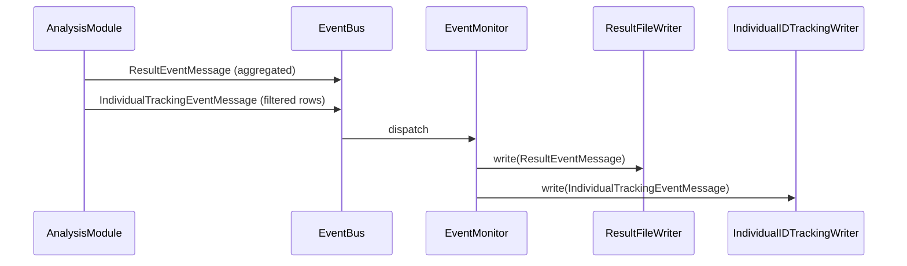

# Individual ID tracking CSV (user-configured filters)

## Goal

Allow users to request a **second CSV output** that contains **per-person rows** for the same run, with columns: run, time, scenario, id, age, gender, region, ethnicity, and selected risk factors. Rows are **filtered** by user-specified constraints (age range, gender, region, ethnicity, which years, which scenario). The file is named like the main result file but with a distinguishable suffix (e.g. `HealthGPS_result_<timestamp>_IndividualIDTracking.csv`). All new code will include **MAHIMA** in comments where appropriate.

## Architecture (high level)

- **Config**: New optional section (e.g. under `output`) for individual ID tracking: enabled, filters (age, gender, region, ethnicity, risk factors to include, years, scenario).
- **Producer**: When analysis publishes the usual aggregated result, it also (if tracking enabled) builds a list of filtered person-rows from the current population and publishes a **new event** carrying those rows.
- **Consumer**: A new writer subscribes to that event and appends rows to a dedicated CSV file (same base path as main result, suffix `_IndividualIDTracking.csv`).
- **Event**: New message type so the existing result writer is unchanged and the new writer only sees tracking data.




## 1. Config schema and POCO

- **Schema**: Extend [schemas/v1/config/output.json](schemas/v1/config/output.json) with an optional `individual_id_tracking` object (all properties optional for backward compatibility):
  - `enabled`: boolean (default false)
  - `age_min`, `age_max`: integer or null (omit = no age filter)
  - `gender`: string enum "male" | "female" | "all" (default "all")
  - `regions`: array of strings (empty = all)
  - `ethnicities`: array of strings (empty = all)
  - `risk_factors`: array of strings – which risk factors to output as columns (empty = all from mapping)
  - `years`: array of integers – which simulation years to include (empty = all)
  - `scenarios`: "baseline" | "intervention" | "both" (default "both")
- **POCO**: Add struct `IndividualIdTrackingConfig` in [src/HealthGPS.Input/poco.h](src/HealthGPS.Input/poco.h) with the same fields (sensible defaults: enabled false, age_min/max optional, gender "all", empty vectors, scenarios "both"). Add optional `std::optional<IndividualIdTrackingConfig> individual_id_tracking` to `OutputInfo` in the same header.
- **Parsing**: In [src/HealthGPS.Input/configuration_parsing.cpp](src/HealthGPS.Input/configuration_parsing.cpp) (or wherever output is loaded), when `output` object contains `individual_id_tracking`, parse it into `config.output.individual_id_tracking`. If the key is absent, leave it as `std::nullopt`.
- **Top-level schema**: In [schemas/v1/config.json](schemas/v1/config.json), ensure `output` can have additional properties or add `individual_id_tracking` to the output schema reference if needed.

## 2. Passing config into the simulation

- **ModelInput**: Add optional tracking config to [src/HealthGPS/modelinput.h](src/HealthGPS/modelinput.h) and [src/HealthGPS/modelinput.cpp](src/HealthGPS/modelinput.cpp): e.g. `std::optional<hgps::input::IndividualIdTrackingConfig> individual_id_tracking_config`_ and accessor `individual_id_tracking_config() const`.
- **create_model_input**: In [src/HealthGPS.Input/configuration.cpp](src/HealthGPS.Input/configuration.cpp), when building `ModelInput`, pass `config.output.individual_id_tracking` into the new ModelInput field (signature of `create_model_input` and `ModelInput` ctor need an extra optional parameter).

## 3. New event and payload

- **Event type**: In [src/HealthGPS/event_message.h](src/HealthGPS/event_message.h), add to the enum: `individual_tracking` (or similar).
- **Payload**: Define a small struct for one row, e.g. `IndividualTrackingRow`: id, age, gender, region, ethnicity, plus a map or vector of risk factor name -> value. Then define `IndividualTrackingEventMessage` (extends `EventMessage`) with: sender, run_number, time, scenario name, and `std::vector<IndividualTrackingRow> rows`. Implement in new files (e.g. `individual_tracking_message.h/cpp`) with `id()` returning the new `EventType`, `to_string()`, and `accept(EventMessageVisitor&)`.
- **Visitor**: In [src/HealthGPS/event_visitor.h](src/HealthGPS/event_visitor.h), add `virtual void visit(const IndividualTrackingEventMessage &message) = 0;` (and forward declare the new type). Existing visitor implementations (e.g. EventMonitor) will need a default implementation that does nothing, and the new writer’s visitor will implement it.

## 4. Producing the event (Analysis module)

- **AnalysisModule** already has access to `context.population()`, `context.identifier()` (scenario), `context.time_now()`, `context.current_run()`, and `context.mapping()` (risk factor names). It does **not** currently hold a reference to `ModelInput` or tracking config; it only gets config at build time in `build_analysis_module`.
- **Option A (recommended)**: Add to `AnalysisModule` an optional `IndividualIdTrackingConfig` (set in `build_analysis_module` from `config.individual_id_tracking_config()`). In `publish_result_message`, after publishing `ResultEventMessage`, if tracking is enabled, iterate `context.population()`, apply filters (age, gender, region, ethnicity, year, scenario), build `IndividualTrackingRow` for each (id, age, gender, region, ethnicity, selected risk factor values), collect into a vector, then `context.publish(std::make_unique<IndividualTrackingEventMessage>(...))`. Add MAHIMA comments explaining that this enables same-person tracking across baseline/intervention by ID.
- **Option B**: Separate small “tracking” module that subscribes to result events and has access to population; more invasive (population would need to be exposed or re-read). Option A keeps logic in one place and reuses existing population iteration.

**Filtering logic (MAHIMA comments)**:

- Include only **active** persons (`is_active()`).
- If `age_min`/`age_max` set, keep only persons with `age` in [age_min, age_max].
- If `gender` is "male"/"female", keep only that gender; "all" = no filter.
- If `regions` non-empty, keep only persons whose `region` is in the list.
- If `ethnicities` non-empty, keep only persons whose `ethnicity` is in the list.
- If `years` non-empty, keep only when `context.time_now()` is in `years`.
- If `scenarios` is "baseline"/"intervention", keep only when `context.identifier()` matches.
- Risk factor columns: if `risk_factors` is non-empty, output only those; else use all keys from `context.mapping()` (or equivalent). Each row includes id, age, gender, region, ethnicity, then one column per selected risk factor.

## 5. Writing the CSV

- **Filename**: Same convention as income CSVs in [src/HealthGPS.Console/result_file_writer.cpp](src/HealthGPS.Console/result_file_writer.cpp): from the main result path (e.g. `HealthGPS_result_<timestamp>.json`), take the path and replace extension / stem to get `..._IndividualIDTracking.csv` (e.g. `base_path.substr(0, dot_pos) + "_IndividualIDTracking.csv"`). Reuse the same base path that `create_output_file_name` returns (the JSON path); the new writer receives this base path.
- **New writer class**: e.g. `IndividualIDTrackingWriter` in the Console project: implements an interface that has `write(const IndividualTrackingEventMessage &)` (or extend a small writer interface). Opens one CSV file (same base + `_IndividualIDTracking.csv`), writes header once (run, time, scenario, id, age, gender, region, ethnicity, risk_f1, risk_f2, ...), then on each `write()` appends one row per item in `message.rows`. Thread-safe (e.g. mutex) if the event is dispatched from the same result queue. MAHIMA comments: explain that this file supports tracking the same person (by id) across baseline and intervention.
- **EventMonitor**: [src/HealthGPS.Console/event_monitor.cpp](src/HealthGPS.Console/event_monitor.cpp) and [event_monitor.h](src/HealthGPS.Console/event_monitor.h): Subscribe to the new event type (`EventType::individual_tracking`). When the handler receives the message, push it to the same `results_queue`_ (or a dedicated queue). In the visitor, add `visit(const IndividualTrackingEventMessage &message)` which calls the new writer’s `write(message)`. The monitor must hold an optional second writer: e.g. `std::optional<IndividualIDTrackingWriter> individual_tracking_writer_` or a pointer, created only when `config.output.individual_id_tracking` is present and enabled.
- **program.cpp**: When creating the event monitor, if `config.output.individual_id_tracking` has value and `enabled`, create the `IndividualIDTrackingWriter` with the same base path used for the main result file, and pass it to the monitor (e.g. two writers: main + optional tracking). If not enabled, pass a no-op or null and the visitor’s `visit(IndividualTrackingEventMessage)` does nothing or is not called.
- file structure- columns similar to existing HealthGPS_result_<timestamp>.csv with the user specific constarints. Example- if user says 50 year old males from year 2022-2025 for both baseline and intervention for BMI, FoodFat, FoodProtein, FoodRedMeat and FoodLegume in all income categories and ethnicity white- the columns of the output file must include all of that along with the person ID (now that both baseline and intervention use the same ID)

## 6. Event aggregator subscription

- **EventAggregator / EventBus**: Ensure the new event type can be subscribed to. In [src/HealthGPS/event_aggregator.h](src/HealthGPS/event_aggregator.h) (or equivalent), handlers are typically keyed by `EventType`. Add subscription for `EventType::individual_tracking` in EventMonitor and dispatch to the same result queue so the visitor is invoked with the new message type.

## 7. File naming summary

- Main result: `create_output_file_name(config.output, config.job_id)` → e.g. `"C:/out/HealthGPS_result_2026-02-19_10-34-52.json"`.
- Individual tracking CSV: same path with extension replaced and suffix before extension: e.g. `"C:/out/HealthGPS_result_2026-02-19_10-34-52_IndividualIDTracking.csv"` (mirror [generate_income_filename](src/HealthGPS.Console/result_file_writer.cpp) pattern: `base_stem + "_IndividualIDTracking.csv"`).

## 8. Example config (for users)

```json
"output": {
  "folder": "results",
  "file_name": "HealthGPS_result_{TIMESTAMP}.json",
  "comorbidities": 5,
  "individual_id_tracking": {
    "enabled": true,
    "age_min": 25,
    "age_max": 60,
    "gender": "all",
    "regions": [],
    "ethnicities": [],
    "risk_factors": ["bmi", "smoking"],
    "years": [2030, 2040],
    "scenarios": "both"
  }
}
```

Empty arrays / "all" mean no filter for that dimension.

## 9. MAHIMA comment placement

- [src/HealthGPS.Input/poco.h](src/HealthGPS.Input/poco.h): Comment on `IndividualIdTrackingConfig` that it drives per-person CSV output for same-person tracking (MAHIMA).
- [src/HealthGPS/analysis_module.cpp](src/HealthGPS/analysis_module.cpp): Where filtering and publishing of `IndividualTrackingEventMessage` is implemented (MAHIMA: same-person ID tracking output).
- New message type file: Brief comment that this event carries filtered individual rows for the IndividualIDTracking CSV (MAHIMA).
- [src/HealthGPS.Console](src/HealthGPS.Console) writer: Comment that the CSV allows users to verify same person (by id) across baseline and intervention (MAHIMA).

## 10. Testing (optional in plan)

- Unit test: Filtering logic (age, gender, region, ethnicity, year, scenario) with a small population and config.
- Integration: Run with a small config that has `individual_id_tracking.enabled: true` and assert the `_IndividualIDTracking.csv` file exists and contains expected columns and filtered rows for both scenarios when applicable.

## Implementation order

1. POCO + schema + parsing for `individual_id_tracking` under output.
2. ModelInput + create_model_input: pass optional tracking config.
3. New event type and payload; add to EventType enum and EventMessageVisitor.
4. IndividualIDTrackingWriter class + filename helper; wire into program.cpp and EventMonitor.
5. AnalysisModule: store optional config in build_analysis_module; in publish_result_message, add filter loop and publish IndividualTrackingEventMessage.
6. Event aggregator subscription and EventMonitor visit(IndividualTrackingEventMessage) calling the new writer.
7. Add MAHIMA comments in the above files.

No changes to the existing `ResultEventMessage` or main JSON/CSV writing logic; the new feature is additive and gated by config.